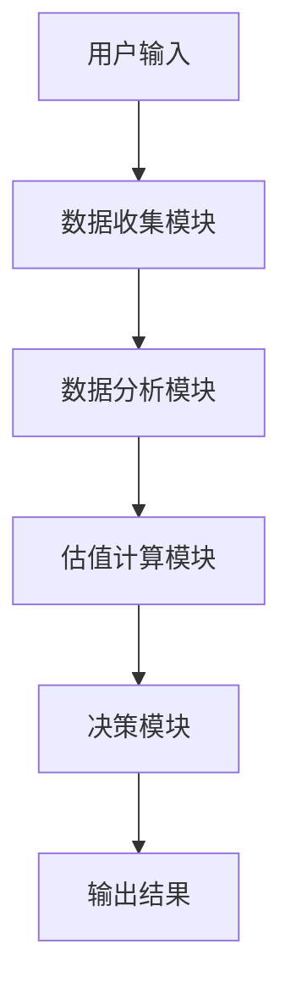

                 


# 价值投资原则：在估值差异中寻找机会

## 关键词：价值投资，估值差异，安全边际，内在价值，投资策略，风险管理，DCF模型，市场低估

## 摘要：  
价值投资是一种以基本面分析为基础的投资策略，通过识别市场估值与内在价值的差异，寻找具有长期增长潜力的优质企业进行投资。本文将详细探讨价值投资的核心原则、估值方法、投资策略以及风险管理，结合实际案例分析，帮助读者在复杂多变的市场中找到投资机会。

---

# 第1章：价值投资的背景与发展

## 1.1 价值投资的起源
### 1.1.1 投资学的基本概念
- 投资是指将资金投入到资产中，以期获得未来收益的行为。
- 资产可以分为实物资产（如房地产）和金融资产（如股票、债券）。

### 1.1.2 价值投资的定义与核心理念
- 价值投资是由本杰明·格雷厄姆和戴维·多德提出的一种投资方法。
- 核心理念：市场价格与内在价值的差异是投资机会的来源。

### 1.1.3 价值投资与传统投资的区别
| 方面         | 价值投资                | 传统投资                |
|--------------|-------------------------|-------------------------|
| 投资目标     | 寻找低估资产             | 追求短期收益             |
| 分析方法     | 基于基本面分析           | 基于技术分析或市场趋势    |
| 持股期限     | 长期持有                | 短期交易                |

## 1.2 价值投资的主要流派
### 1.2.1 格雷厄姆的价值投资理论
- 格雷厄姆是价值投资之父，强调安全边际和内在价值。
- 安全边际 = 内在价值 - 市场价格。

### 1.2.2 巴菲特的投资理念
- 延续了格雷厄姆的理论，强调寻找具有持续竞争优势的企业。
- 坚持长期投资，注重企业的护城河。

### 1.2.3 现代价值投资的演变
- 现代价值投资者结合量化分析和基本面研究，进一步细化投资策略。

---

# 第2章：价值投资的核心原则

## 2.1 投资的三个关键要素
### 2.1.1 资产的内在价值
- 内在价值是资产在未来现金流的现值。
- 例如，股票的内在价值可以通过DCF模型计算。

### 2.1.2 市场价格的波动性
- 市场价格受情绪和市场参与者的短期行为影响。
- 市场波动为价值投资者提供了买入低估资产的机会。

### 2.1.3 安全边际的概念
- 安全边际是内在价值与市场价格的差额。
- 越大的安全边际意味着投资风险越小。

## 2.2 价值投资的三大支柱
### 2.2.1 理解企业基本面
- 企业基本面分析包括收入、利润、资产负债表和现金流。
- 例如，ROE（净资产收益率）是衡量企业盈利能力的重要指标。

### 2.2.2 评估企业的内在价值
- 内在价值计算需要考虑企业的未来现金流和贴现率。
- DCF模型是评估内在价值的常用工具。

### 2.2.3 寻找市场的低估机会
- 通过比较市场价格与内在价值，寻找低估的资产。
- 例如，市盈率（P/E）低于行业平均水平的股票可能被低估。

---

# 第3章：价值投资的哲学与心态

## 3.1 投资者的心理与行为
### 3.1.1 投资者常见的心理偏差
- 过度自信：认为自己能准确预测市场。
- �惊惧情绪：在市场下跌时恐慌卖出。

### 3.1.2 理性与感性在投资中的作用
- 理性分析帮助企业基本面研究。
- 情绪化决策可能导致错误投资。

### 3.1.3 如何克服情绪化决策
- 建立严格的投资纪律，避免情绪干扰。

## 3.2 价值投资的长期视角
### 3.2.1 长期投资的重要性
- 长期投资可以平滑短期市场波动带来的影响。
- 时间是价值投资的好朋友。

### 3.2.2 时间在价值投资中的作用
- 复利效应：长期投资能最大化收益。
- 股票价格终将回归其内在价值。

### 3.2.3 如何构建长期投资组合
- 选择具有持续增长潜力的企业。
- 定期审视和调整投资组合。

---

# 第4章：基本面分析与估值模型

## 4.1 基本面分析的核心要素
### 4.1.1 收入与利润分析
- 收入是企业盈利的基础。
- 利润是企业盈利能力的直接体现。

### 4.1.2 资产负债表分析
- 资产负债表反映企业的财务状况。
- 重点关注流动资产、固定资产和负债。

### 4.1.3 现金流分析
- 现金流是企业健康的重要指标。
- 自由现金流是企业创造价值的能力体现。

## 4.2 常用估值模型介绍
### 4.2.1 市盈率（P/E）模型
- P/E = 市场价格 / 每股收益。
- 适用于利润稳定的公司。

### 4.2.2 市净率（P/B）模型
- P/B = 市场价格 / 每股净资产。
- 适用于银行等资产密集型行业。

### 4.2.3 现金流折现模型（DCF）
- DCF模型通过折现未来现金流计算内在价值。
- 公式：$$ \text{内在价值} = \sum_{t=1}^{n} \frac{\text{现金流}_t}{(1 + r)^t} + \frac{\text{残值}}{(1 + r)^n} $$

---

# 第5章：如何识别市场低估的机会

## 5.1 估值差异的来源
### 5.1.1 市场情绪的影响
- 市场情绪波动导致价格偏离内在价值。
- 例如，市场恐慌时股票价格可能大幅下跌。

### 5.1.2 信息不对称的影响
- 信息不对称导致部分投资者无法准确评估资产价值。

### 5.1.3 行业周期的影响
- 行业周期波动影响企业的盈利能力和股票价格。

## 5.2 寻找低估股票的策略
### 5.2.1 筛选低市盈率股票
- 低P/E股票可能具有低估潜力。

### 5.2.2 筛选低市净率股票
- 低P/B股票可能具有低估潜力。

---

# 第6章：价值投资的风险管理

## 6.1 价值投资的风险来源
### 6.1.1 市场风险
- 整体市场波动影响股票价格。

### 6.1.2 企业特定风险
- 企业基本面变化导致股价下跌。

### 6.1.3 估值错误风险
- 估值模型的假设可能与实际情况不符。

## 6.2 如何管理投资风险
### 6.2.1 分散投资
- 将资金分配到不同行业和资产类别中。

### 6.2.2 设置止损点
- 当股价跌破内在价值一定比例时卖出。

### 6.2.3 定期审视投资组合
- 根据市场变化和企业基本面调整投资组合。

---

# 第7章：系统分析与架构设计

## 7.1 价值投资决策系统的构建
### 7.1.1 系统目标
- 自动化分析企业基本面。
- 计算内在价值。
- 寻找低估股票。

### 7.1.2 系统架构设计


### 7.1.3 数据流分析
```mermaid
flowchart TD
    A[用户输入] -> B[数据收集模块];
    B -> C[数据分析模块];
    C -> D[估值计算模块];
    D -> E[决策模块];
    E -> F[输出结果];
```

---

# 第8章：项目实战

## 8.1 项目背景
- 某公司的基本面分析。
- 计算其内在价值。

## 8.2 核心实现
### 8.2.1 环境安装
- Python 3.8以上版本。
- 安装numpy和pandas库。

### 8.2.2 核心代码
```python
import numpy as np
import pandas as pd

def calculate_intrinsic_value(free_cash_flow, growth_rate, discount_rate):
    # 计算DCF模型的内在价值
    year1 = free_cash_flow * (1 + growth_rate)
    year2 = year1 * (1 + growth_rate)
    year3 = year2 * (1 + growth_rate)
    # 假设永续增长率为3%
    terminal_value = year3 * (1 + 0.03) / (discount_rate - 0.03)
    # 现金流折现
    iv = year1 / (1 + discount_rate) + year2 / (1 + discount_rate)**2 + year3 / (1 + discount_rate)**3 + terminal_value / (1 + discount_rate)**3
    return iv
```

## 8.3 实例分析
- 计算某公司的内在价值。
- 对比市场价格，判断是否低估。

---

# 第9章：最佳实践与小结

## 9.1 最佳实践
### 9.1.1 长期思维
- 长期投资，避免频繁交易。

### 9.1.2 独立思考
- 不随波逐流，坚持自己的分析。

### 9.1.3 持续学习
- 不断更新知识，提升分析能力。

## 9.2 小结
- 价值投资是一种科学且艺术的投资方法。
- 寻找估值差异是发现投资机会的关键。
- 需要结合理论与实践，才能实现长期稳健收益。

## 9.3 注意事项
- 估值模型的假设可能影响结果。
- 市场波动可能导致短期亏损。

## 9.4 拓展阅读
- 《投资最重要的事》——巴菲特
- 《证券分析》——格雷厄姆

---

# 作者：AI天才研究院/AI Genius Institute & 禅与计算机程序设计艺术 /Zen And The Art of Computer Programming

---

通过以上结构，我们逐步分析了价值投资的核心原则、估值方法、投资策略以及风险管理，结合实际案例和系统设计，帮助读者在复杂多变的市场中寻找投资机会。

