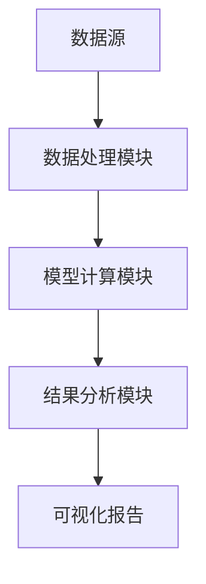

                 


# 价值投资在新兴市场的应用

## 关键词：价值投资，新兴市场，内在价值，安全边际，投资策略，风险控制

## 摘要：  
价值投资是一种以基本面分析为核心的投资策略，其核心在于寻找被市场低估的优质资产。随着全球化的推进，新兴市场逐渐成为投资者关注的焦点。本文将深入探讨价值投资在新兴市场的应用，分析其核心概念、数学模型、系统架构以及实战案例，为投资者提供理论支持和实践指导。

---

## 第一部分：价值投资的背景与核心概念

### 第1章：价值投资的定义与核心要素

#### 1.1 价值投资的定义与内涵  
- **价值投资**：一种以基本面分析为核心的投资策略，强调以低于资产内在价值的价格买入优质资产并长期持有。  
- **核心概念**：  
  - **内在价值**：资产在未来现金流的现值，是其真实价值的衡量标准。  
  - **市场价值**：市场参与者对资产的定价，可能与内在价值不符。  
  - **安全边际**：买入价格与内在价值之间的差距，是投资的安全垫。  

#### 1.2 价值投资的核心原理  
- **市场有效性分析**：市场并非总是有效，价格波动为价值投资者提供了套利机会。  
- **内在价值与市场价值的关系**：内在价值是投资决策的基础，市场价值是波动的结果。  
- **安全边际的应用**：通过安全边际的设置，降低市场波动对投资组合的影响。  

#### 1.3 价值投资的适用场景  
- **成熟市场**：市场有效性较高，价值投资表现稳定。  
- **新兴市场**：市场波动大，但存在价值洼地，适合价值投资。  

---

### 第2章：新兴市场的特点与投资机遇

#### 2.1 新兴市场的定义与分类  
- **新兴市场**：指经济快速发展但尚未完全成熟的国家或地区的金融市场，如中国、印度、东南亚国家等。  
- **分类**：根据市场规模、流动性、经济发展阶段等指标进行分类。  

#### 2.2 新兴市场的投资机遇  
- **高增长潜力**：新兴市场的企业往往处于快速扩张期，具有较高的增长潜力。  
- **结构性机会**：新兴市场中某些行业或公司可能被市场低估，存在价值投资的机会。  

#### 2.3 新兴市场的投资风险  
- **波动性风险**：新兴市场价格波动较大，容易受到外部环境的影响。  
- **政策风险**：新兴市场政策变化较快，可能对投资产生重大影响。  
- **流动性风险**：部分新兴市场的流动性较低，可能导致买卖价差较大。  

---

### 第3章：价值投资在新兴市场的核心策略

#### 3.1 价值投资的核心策略  
- **低估值策略**：寻找市盈率、市净率等估值指标低于行业平均水平的公司。  
- **高质量企业策略**：选择具有强大竞争优势、良好财务状况和管理团队的企业。  
- **长期持有策略**：避免频繁交易，降低交易成本并享受复利效应。  

#### 3.2 新兴市场中的价值投资策略调整  
- **行业选择**：优先选择具有增长潜力且竞争格局稳定的行业。  
- **个股筛选**：结合财务指标、管理团队和行业地位进行综合评估。  
- **风险控制**：通过分散投资、设置止损等方式降低风险。  

#### 3.3 价值投资在新兴市场的成功案例  
- **国外经典案例**：如巴菲特在拉丁美洲市场的投资经验。  
- **国内新兴市场案例**：如某新兴市场的优质企业被低估的案例分析。  

---

## 第二部分：价值投资的数学模型与算法原理

### 第4章：价值投资的数学模型

#### 4.1 内在价值的计算模型  
- **现金流折现模型（DCF）**：  
  $$ \text{内在价值} = \sum_{t=1}^{n} \frac{\text{现金流}_t}{(1 + r)^t} + \frac{\text{残值}}{(1 + r)^n} $$  
  其中，$r$ 为折现率，$n$ 为永续期数。  

- **市盈率与市净率模型**：  
  $$ \text{合理股价} = \text{市盈率} \times \text{每股收益} $$  
  $$ \text{合理股价} = \text{市净率} \times \text{每股净资产} $$  

#### 4.2 安全边际的计算方法  
- **安全边际计算公式**：  
  $$ \text{安全边际} = \text{买入价} - \text{内在价值} $$  
- **动态调整**：根据市场变化和企业基本面调整安全边际的宽度。  

#### 4.3 投资组合优化模型  
- **马科维茨投资组合理论**：  
  $$ \text{风险最小化} = \min_w w^T \Sigma w $$  
  $$ \text{收益最大化} = \max_w w^T \mu $$  
  其中，$w$ 是权重向量，$\Sigma$ 是协方差矩阵，$\mu$ 是收益向量。  

---

### 第5章：价值投资算法的实现

#### 5.1 算法实现的基本步骤  
- **数据收集与处理**：获取目标市场的历史数据、财务数据等。  
- **模型构建与参数设置**：选择合适的数学模型并设定参数。  
- **算法优化与测试**：通过回测和风险分析优化投资策略。  

#### 5.2 算法实现的代码示例  

##### 数据处理代码：  
```python
import pandas as pd
import numpy as np

# 假设data为包含股票数据的DataFrame
data = pd.read_csv('emerging_markets_data.csv')
data['return'] = data['收盘价'].pct_change()
data = data.dropna()
```

##### 模型计算代码：  
```python
def calculate_intrinsic_value(company_data, discount_rate):
    cash_flows = company_data['现金流'].values
    n = len(cash_flows)
    intrinsic_value = 0
    for t in range(n):
        intrinsic_value += cash_flows[t] / (1 + discount_rate)**t
    return intrinsic_value

# 示例计算
iv = calculate_intrinsic_value(data, 0.1)
print(f'内 在 价 值：{iv:.2f}')
```

##### 结果分析代码：  
```python
from matplotlib import pyplot as plt

plt.plot(data['日期'], data['收盘价'], label='市场价')
plt.plot(data['日期'], data['内在价值'], label='内在价值')
plt.xlabel('时间')
plt.ylabel('价格')
plt.legend()
plt.show()
```

---

## 第三部分：系统分析与架构设计

### 第6章：系统功能设计

#### 6.1 系统功能模块  
- **数据处理模块**：收集并清洗新兴市场的历史数据和财务数据。  
- **模型计算模块**：基于现金流折现模型计算内在价值。  
- **结果分析模块**：生成可视化报告，评估投资策略的表现。  

#### 6.2 系统架构设计  


---

## 第四部分：项目实战

### 第7章：项目实战与案例分析

#### 7.1 环境安装  
- **工具安装**：安装Python、Pandas、Matplotlib等工具。  
- **数据获取**：通过API或CSV文件获取新兴市场的股票数据。  

#### 7.2 核心代码实现  
```python
# 示例代码：新兴市场价值投资策略
def backtest_strategy(data, start_date, end_date):
    data = data[start_date:end_date]
    data['signal'] = 0
    data.loc[data['内在价值'] < data['收盘价'], 'signal'] = 1
    returns = data['return'].values
    strategy_returns = []
    current_position = 0
    for i in range(len(returns)):
        if i == 0:
            strategy_returns.append(0)
            continue
        if data['signal'].iloc[i] == 1:
            strategy_returns.append(returns[i-1])
        else:
            strategy_returns.append(0)
    return np.mean(strategy_returns)

# 示例运行
start_date = '2020-01-01'
end_date = '2023-12-31'
backtest_strategy(data, start_date, end_date)
```

#### 7.3 案例分析  
- **案例选择**：分析某新兴市场中的低估企业。  
- **结果解读**：通过回测分析策略的有效性和风险控制。  

---

## 第五部分：总结与展望

### 第8章：总结与展望

#### 8.1 最佳实践 tips  
- **长期视角**：价值投资需要耐心，避免短期波动干扰。  
- **风险控制**：合理设置安全边际，分散投资以降低风险。  

#### 8.2 小结  
价值投资在新兴市场中具有广阔的应用前景，但需要投资者具备扎实的基本面分析能力和风险控制能力。通过数学模型和系统架构的设计，可以有效提升投资决策的科学性和效率。

#### 8.3 注意事项  
- **数据质量**：确保数据的准确性和完整性。  
- **模型优化**：根据市场变化动态调整模型参数。  

#### 8.4 拓展阅读  
- 建议阅读《The Intelligent Investor》和《新兴市场的经济与投资》等书籍，深入了解价值投资的理论与实践。

---

## 作者：AI天才研究院 & 禅与计算机程序设计艺术

