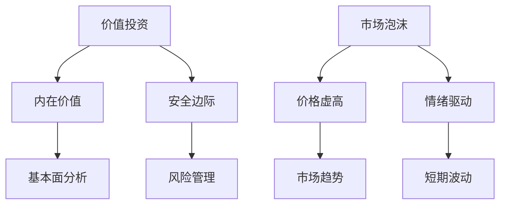

                 


```markdown
# 价值投资者如何应对市场泡沫

> 关键词：价值投资, 市场泡沫, 投资策略, 风险管理, 股票分析

> 摘要：本文深入探讨了价值投资者在面对市场泡沫时的核心策略和方法。通过分析市场泡沫的本质、价值投资的基本原理以及两者之间的相互作用，本文为投资者提供了在泡沫环境中做出明智投资决策的实用指南。内容涵盖价值投资的核心概念、市场泡沫的识别方法、数学模型的应用、系统架构的设计以及实际案例分析，帮助投资者在市场波动中保持理性，实现长期稳定的收益。

---

## 第1章: 价值投资的基本概念

### 1.1 价值投资的定义与核心理念
#### 1.1.1 价值投资的定义
价值投资是一种以内在价值为导向的投资策略，强调通过深入分析企业的基本面，寻找市场价格低于其内在价值的股票进行投资。这种方法由本杰明·格雷厄姆和戴维·多德共同提出，强调安全边际和长期持有的理念。

#### 1.1.2 价值投资的核心理念
- **安全边际**：买入价格低于企业内在价值的股票，以降低投资风险。
- **长期视角**：关注企业的长期盈利能力，而非短期市场波动。
- **逆向思维**：在市场恐慌时寻找机会，在市场狂热时保持冷静。

#### 1.1.3 价值投资与市场周期的关系
价值投资在市场周期的不同阶段表现各异。在牛市中，价值投资者可能暂时落后，但在熊市或市场调整期，其投资策略往往能带来超额收益。

---

### 1.2 市场泡沫的定义与特征
#### 1.2.1 市场泡沫的定义
市场泡沫是指资产价格脱离其内在价值，由非理性乐观情绪推动的上涨现象。这种现象通常发生在市场参与者对未来的高预期和低风险感知下。

#### 1.2.2 市场泡沫的特征
- **价格虚高**：资产价格远超其基本面价值。
- **交易量激增**：市场参与者疯狂买入，推动价格进一步上涨。
- **情绪驱动**：投资者被乐观情绪主导，忽视基本面因素。

#### 1.2.3 市场泡沫与经济周期的关系
市场泡沫通常出现在经济周期的繁荣阶段，是周期性波动的一部分。泡沫的破裂往往引发市场调整或衰退。

---

### 1.3 价值投资与市场泡沫的关系
#### 1.3.1 价值投资在市场泡沫中的作用
价值投资者在市场泡沫中扮演着“逆向投资者”的角色，他们通过分析内在价值，寻找被高估资产中的潜在机会。

#### 1.3.2 市场泡沫对价值投资者的挑战
- **短期压力**：泡沫期间，价值投资的表现可能不佳，容易引发投资者的短期亏损压力。
- **情绪干扰**：市场狂热情绪可能动摇投资者的耐心和纪律。

#### 1.3.3 价值投资者应对市场泡沫的核心策略
- **坚守基本面分析**：专注于企业的内在价值，避免被市场情绪左右。
- **保持耐心**：在市场泡沫期间，价值投资者需要耐心等待市场回归理性。
- **分散投资**：通过分散投资降低单一资产的风险。

---

### 1.4 历史案例分析
#### 1.4.1 互联网泡沫与价值投资策略
2000年互联网泡沫破裂前，许多科技股的价格远超其基本面价值。价值投资者通过分析企业盈利能力，避免了盲目跟风。

#### 1.4.2 2008年金融危机中的价值投资实践
金融危机期间，价值投资者通过寻找低估的资产，逐步建仓，最终在市场复苏中获得超额收益。

#### 1.4.3 其他市场泡沫案例分析
例如，2015年中国股市泡沫期间，价值投资者通过分析企业的真实价值，避免了短期大幅波动带来的损失。

---

## 第2章: 价值投资的核心概念与联系

### 2.1 核心概念与联系
#### 2.1.1 价值投资的核心概念
- **内在价值**：企业未来现金流的现值，是投资决策的基础。
- **安全边际**：买入价格与内在价值的差距，提供风险缓冲。

#### 2.1.2 市场泡沫的核心概念
- **价格虚高**：资产价格与内在价值的脱节。
- **情绪驱动**：投资者非理性行为推动价格波动。

#### 2.1.3 价值投资与市场泡沫的联系
- **相互影响**：市场泡沫可能暂时推高资产价格，但价值投资者关注的是长期基本面。
- **周期性机会**：泡沫破裂后，价值投资者能够以更低的价格买入优质资产。

---

### 2.2 核心概念对比
#### 2.2.1 价值投资与市场泡沫的特征对比
| 特征         | 价值投资                     | 市场泡沫                     |
|--------------|------------------------------|------------------------------|
| 投资目标     | 寻找低估资产                 | 追求短期价格波动             |
| 分析方法     | 基本面分析                   | 市场情绪与趋势分析           |
| 风险管理     | 强调安全边际                 | 依赖市场时机捕捉利润         |

#### 2.2.2 价值投资与市场泡沫的关系图


---

## 第3章: 市场泡沫识别与价值评估的算法原理

### 3.1 市场泡沫识别的算法
#### 3.1.1 算法原理
- **市盈率分析**：通过比较市盈率与行业平均水平，识别高估资产。
- **回归分析**：利用统计方法预测市场趋势，识别异常波动。

#### 3.1.2 Python实现
```python
import pandas as pd
import numpy as np

def detect_bubble(price_data, industry_avg):
    # 计算市盈率
    pe = price_data / industry_avg
    # 使用回归分析预测趋势
    slope, intercept = np.polyfit(range(len(pe)), pe, 1)
    predicted_pe = slope * range(len(pe)) + intercept
    # 判断是否偏离正常范围
    deviation = (pe - predicted_pe).abs().mean()
    return deviation > 0.2  # 示例阈值
```

#### 3.1.3 数学模型
市盈率模型：
$$ \text{市盈率} = \frac{\text{股价}}{\text{每股收益}} $$

回归分析模型：
$$ y = a + bx $$

---

## 第4章: 价值评估的数学模型

### 4.1 内在价值计算
#### 4.1.1 股权自由现金流模型
$$ \text{内在价值} = \sum_{t=1}^{n} \frac{FCF_t}{(1 + r)^t} + \frac{TV}{(1 + r)^n} $$

#### 4.1.2 股息贴现模型
$$ \text{内在价值} = \sum_{t=1}^{\infty} \frac{D_t}{(1 + r)^t} $$

---

## 第5章: 系统分析与架构设计

### 5.1 价值投资系统架构
#### 5.1.1 系统功能需求
- 数据采集：获取企业财务数据和市场数据。
- 模型计算：计算内在价值和市场估值。
- 风险评估：识别投资组合中的潜在风险。

#### 5.1.2 系统架构设计


---

## 第6章: 项目实战与案例分析

### 6.1 环境安装
#### 6.1.1 安装Python环境
```bash
pip install numpy pandas scikit-learn
```

#### 6.1.2 数据获取
使用Yahoo Finance API获取股票数据。

---

## 第7章: 最佳实践与总结

### 7.1 小结
价值投资者在市场泡沫中应保持冷静，专注于基本面分析，寻找低估资产。

### 7.2 注意事项
- 避免追涨杀跌。
- 保持长期视角，耐心持有优质资产。
- 定期复盘，调整投资组合。

### 7.3 拓展阅读
- 《The Intelligent Investor》 by Benjamin Graham
- 《泡沫与暴风雨》 by John R. Nance

---

作者：AI天才研究院 & 禅与计算机程序设计艺术
```

