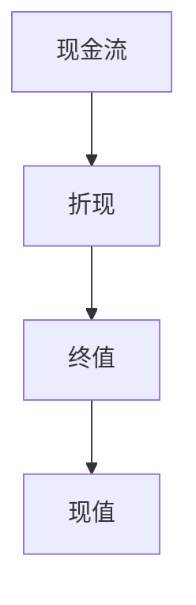

                 

# 价值投资者必备：企业估值技巧

> 关键词：企业估值，价值投资，财务分析，DCF模型，投资策略

> 摘要：企业估值是价值投资的核心技巧，本文从基础概念到高级模型，系统讲解如何对企业进行准确估值，帮助投资者做出明智决策。

---

## 第1章 企业估值的核心概念与背景

### 1.1 价值投资与企业估值的定义

#### 1.1.1 价值投资的基本概念
价值投资是一种投资策略，强调以低于企业内在价值的价格买入股票。其核心在于寻找市场低估的企业，长期持有，等待价值回归。

#### 1.1.2 企业估值的定义与重要性
企业估值是对企业未来现金流的现值估算，帮助投资者确定其内在价值。准确的估值是价值投资的基础，能指导投资者在市场波动中做出理性决策。

#### 1.1.3 价值投资与企业估值的关系
价值投资依赖于企业估值，后者提供定价依据，帮助投资者识别安全边际和投资机会。

### 1.2 价值投资的核心理念

#### 1.2.1 购买便宜货的原则
买入价格低于内在价值，确保安全边际，降低投资风险。

#### 1.2.2 安全边际的概念
安全边际是内在价值与市场价格之间的差额，提供缓冲空间，减少市场波动带来的影响。

#### 1.2.3 长期投资与复利效应
长期持有优质股票，利用复利效应，实现财富稳步增长。

### 1.3 企业估值的基本方法

#### 1.3.1 市盈率法
公式：市盈率 = 股价 / 每股收益
优点：简单易用，适用于盈利稳定的公司。
缺点：不适用于亏损企业。

#### 1.3.2 市净率法
公式：市净率 = 股价 / 每股净资产
适用于净资产较多的行业，如银行、地产。

#### 1.3.3 股息率法
公式：股息率 = 每股股息 / 股价
适用于成熟企业，关注稳定收益。

---

## 第2章 企业基本面分析

### 2.1 财务报表分析

#### 2.1.1 利润表的核心指标
- 营业收入：企业主要收入来源。
- 净利润：扣除所有费用后的利润。

#### 2.1.2 资产负债表的关键数据
- 总资产：企业所有资源的总和。
- 负债总额：企业债务的总和。

#### 2.1.3 现金流量表的重要性
- 经营活动现金流：企业日常运营产生的现金流。
- 投资活动现金流：投资活动产生的现金流。

### 2.2 财务指标分析

#### 2.2.1 收益能力指标
- ROE（净资产收益率）：净利润 / 平均股东权益。
- ROA（资产回报率）：净利润 / 平均资产。

#### 2.2.2 负债能力指标
- 资产负债率：总负债 / 总资产。
- 速动比率：（流动资产 - 存货） / 流动负债。

#### 2.2.3 现金流健康度
- 现金流是否稳定：现金流是否持续为正。
- 现金储备充足性：企业是否具备足够的现金应对突发事件。

### 2.3 行业分析与竞争优势

#### 2.3.1 行业生命周期分析
- 初创期：高增长，高风险。
- 成长期：增长稳定，竞争加剧。
- 成熟期：增长放缓，竞争激烈。
- 衰退期：需求减少，企业利润下降。

#### 2.3.2 企业竞争优势
- 技术壁垒：企业拥有的独特技术。
- 市场份额：企业在市场中的占有率。
- 供应链优势：企业原材料供应的稳定性。

#### 2.3.3 市场地位与前景
- 龙头企业：行业内的领导者。
- 潜力企业：未来增长空间大的企业。

---

## 第3章 企业估值模型详解

### 3.1 现金流折现模型（DCF）

#### 3.1.1 自由现金流的计算
公式：自由现金流 = 营业现金流 - 资本 expenditures

#### 3.1.2 折现率的确定
公式：WACC（加权平均成本资本）= (E/V * Re) + (D/V * Rd * (1 - Tc))

#### 3.1.3 企业整体价值的计算
公式：企业价值 = 现金流的现值 + 余值

### 3.2 市盈率与市净率模型

#### 3.2.1 市盈率法的适用场景
- 盈利稳定的公司。
- 适用于成长型企业。

#### 3.2.2 市净率法的优缺点
- 优点：适用于净资产较多的公司。
- 缺点：不适用于亏损企业。

#### 3.2.3 两种方法的对比分析
- 市盈率法关注收益能力，市净率法关注资产价值。

### 3.3 股权自由现金流模型

#### 3.3.1 模型的基本假设
- 稳定的现金流增长。
- 恰当的折现率。

#### 3.3.2 股权价值的计算公式
$$股权价值 = \sum_{t=1}^{n} \frac{FCF_e}{(1 + r)^t} + \frac{TV}{(1 + r)^n}$$

---

## 第4章 实际案例分析

### 4.1 案例一：苹果公司的估值

#### 4.1.1 公司概况与财务数据
- 苹果公司是一家科技巨头，2023年财务数据如下：
  - 营业收入：3943.8亿美元
  - 净利润：1034.4亿美元
  - 现金储备：约1000亿美元

#### 4.1.2 DCF模型的应用
- 自由现金流计算：假设自由现金流为900亿美元，折现率为8%。
- 计算现值：$$ PV = \frac{900}{(1+0.08)^1} + \frac{900}{(1+0.08)^2} + \frac{900}{(1+0.08)^3} $$
- 结果：现值约为2350亿美元。

#### 4.1.3 结果分析与投资建议
- 苹果公司合理估值约为2350亿美元，当前市值约为2.5万亿美元，存在高估风险。

### 4.2 案例二：亚马逊的估值

#### 4.2.1 业务模式与财务表现
- 亚马逊主要业务：电商、云计算、物流。
- 财务数据：2023年营业收入4698亿美元，净利润427.5亿美元。

#### 4.2.2 市盈率法的应用
- 市盈率 = 股价 / 每股收益。
- 假设每股收益为20美元，市盈率合理范围为20-25倍。
- 合理股价范围为400-500美元。

#### 4.2.3 结果
- 亚马逊股价高于合理范围，存在泡沫风险。

---

## 第5章 风险管理与估值准确性

### 5.1 估值中的常见风险
- 数据误差：财务数据不准确。
- 模型假设不合理：增长率或折现率假设偏差。
- 市场情绪影响：短期波动干扰长期估值。

### 5.2 风险管理策略
- 使用多种估值方法交叉验证。
- 定期更新估值模型。
- 设置止损点，控制风险敞口。

---

## 第6章 高级技巧与实战演练

### 6.1 情景分析法
- 不同情景下，评估企业价值变化。
- 例如，经济增长情景与衰退情景下的现金流预测。

### 6.2 行业比较法
- 将目标企业与同行业公司对比，评估其估值合理性。

---

## 作者：AI天才研究院 & 禅与计算机程序设计艺术

通过以上步骤，文章详细讲解了企业估值的核心概念、方法和案例，帮助投资者掌握关键技巧，做出明智投资决策。

