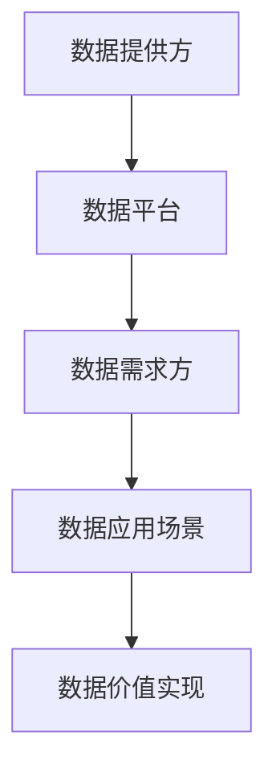
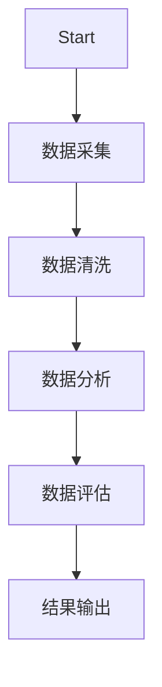
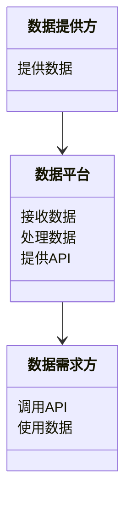
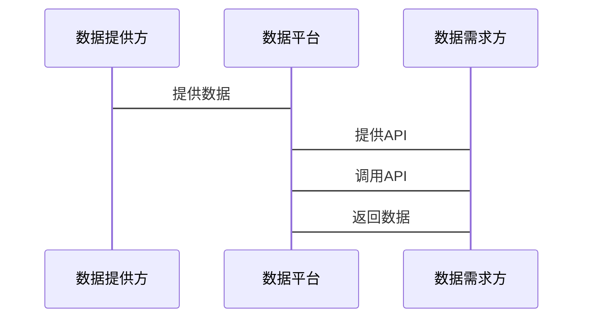

                 


# 价值投资视角下的智能城市数据市场化

> 关键词：价值投资、智能城市、数据市场化、数据估值、数据共享、数据安全

> 摘要：本文从价值投资的视角，深入分析智能城市数据市场化的现状、挑战与机遇。通过构建数据价值评估模型，探讨数据在智能城市中的经济价值，并结合实际案例，提出数据市场化的投资策略和实现路径。

---

## 正文

### 第1章 价值投资与智能城市数据市场化概述

#### 1.1 智能城市数据市场化的背景

##### 1.1.1 智能城市的发展现状
智能城市是信息技术与城市规划深度融合的产物，旨在通过数据驱动的方式优化城市资源配置、提升居民生活质量。随着物联网、大数据和人工智能技术的快速发展，智能城市已经成为全球城市化的重要方向。

##### 1.1.2 数据在智能城市中的核心地位
数据是智能城市的“血液”，贯穿于城市规划、交通管理、环境保护、公共安全等各个方面。通过数据的收集、分析和应用，城市能够实现更高效的资源配置和更精准的决策。

##### 1.1.3 数据市场化的重要性
数据的商业化应用是智能城市发展的关键驱动力。数据的市场化不仅能够实现数据的高效利用，还能为城市建设和运营带来可观的经济价值。

#### 1.2 价值投资的基本概念
价值投资是一种以基本面分析为基础的投资策略，通过评估资产的内在价值，寻找被市场低估的投资机会。其核心在于识别具有长期稳定收益的优质资产。

#### 1.3 价值投资与智能城市数据市场化的结合
##### 1.3.1 数据市场化的价值评估框架
数据的市场价值取决于其质量、数量和应用场景。高质量的数据能够为投资者带来更高的收益，因此在数据市场化过程中，建立科学的价值评估体系至关重要。

##### 1.3.2 数据的稀缺性与可交易性
数据作为一种新型资产，具有稀缺性和可交易性。通过数据市场的建立，数据的价值得以充分体现，从而推动智能城市的可持续发展。

##### 1.3.3 数据市场化对智能城市发展的推动作用
数据的市场化不仅能够促进技术创新，还能为城市建设和运营提供新的经济增长点。通过数据的共享与交易，智能城市能够实现资源的最优配置。

### 第2章 智能城市数据市场化的核心概念与联系

#### 2.1 智能城市数据的特征分析
##### 2.1.1 数据的多样性与实时性
智能城市中的数据来源多样，包括传感器数据、用户行为数据、地理位置数据等。实时性是数据价值的重要体现，及时的数据处理能够提升决策的效率。

##### 2.1.2 数据的隐私性与安全性
数据的隐私性和安全性是数据市场化过程中需要重点关注的问题。如何在数据共享的同时保护个人隐私，是数据市场化面临的重要挑战。

##### 2.1.3 数据的共享性与可扩展性
数据的共享性是数据市场化的基础，而可扩展性则是数据应用的重要保障。通过数据的共享与扩展，智能城市能够实现更广泛的应用场景。

#### 2.2 数据价值的评估模型
##### 2.2.1 数据质量评估指标的权重分配
数据质量评估指标包括准确性、完整性、一致性等。通过对各指标赋予不同的权重，可以更科学地评估数据的价值。

##### 2.2.2 数据可用性的预测算法
数据的可用性预测算法基于历史数据和应用场景，通过统计分析和机器学习方法，预测数据在未来一段时间内的可用性。

##### 2.2.3 数据价值的动态变化机制
数据的价值并非固定不变，而是随着市场需求、技术进步和应用场景的变化而动态变化。建立动态价值评估模型是数据市场化的重要环节。

#### 2.3 数据市场的实体关系图


### 第3章 数据价值评估的算法原理

#### 3.1 数据价值评估模型的构建
##### 3.1.1 数据质量评估指标的权重分配
$$ Q = \sum_{i=1}^{n} w_i \cdot q_i $$
其中，$w_i$ 是第i个指标的权重，$q_i$ 是第i个指标的评分。

##### 3.1.2 数据可用性预测公式
$$ A = \prod_{i=1}^{m} (1 - \frac{d_i}{t}) $$
其中，$d_i$ 是第i个数据源的缺失率，$t$ 是时间窗口。

#### 3.2 数据价值评估的数学模型
##### 3.2.1 数据质量评估公式
$$ Q = \sum_{i=1}^{n} w_i \cdot q_i $$

##### 3.2.2 数据可用性预测公式
$$ A = \prod_{i=1}^{m} (1 - \frac{d_i}{t}) $$

##### 3.2.3 数据价值综合评估公式
$$ V = \alpha \cdot Q + \beta \cdot A $$
其中，$\alpha$ 和 $\beta$ 是质量与可用性的权重系数。

#### 3.3 数据价值评估的实现流程


### 第4章 系统分析与架构设计

#### 4.1 问题场景介绍
智能城市数据平台需要解决数据采集、存储、分析和应用的问题。通过构建一个高效的数据平台，可以实现数据的共享与交易。

#### 4.2 系统功能设计
##### 4.2.1 领域模型


##### 4.2.2 系统架构设计


#### 4.3 系统接口设计
##### 4.3.1 数据平台API接口
```python
class DataPlatform:
    def __init__(self):
        self.data = {}

    def get_data(self, provider, request):
        # 获取数据
        pass

    def process_data(self, data):
        # 处理数据
        pass

    def provide_data(self, request):
        # 提供数据
        pass
```

#### 4.4 系统交互流程


### 第5章 项目实战

#### 5.1 环境安装
安装Python、Pandas、NumPy、Scikit-learn等库。

```bash
pip install pandas numpy scikit-learn
```

#### 5.2 核心代码实现
##### 数据质量评估
```python
import pandas as pd
import numpy as np

def calculate_quality_score(data, weights):
    scores = []
    for i in range(len(weights)):
        score = data[i] * weights[i]
        scores.append(score)
    return np.mean(scores)

data = [0.8, 0.9, 0.7]
weights = [0.5, 0.3, 0.2]
print(calculate_quality_score(data, weights))
```

##### 数据可用性预测
```python
from sklearn.metrics import accuracy_score

def predict_data_availability(data):
    # 假设data为二维数组，第一列为特征，第二列为标签
    X = data[:, :-1]
    y = data[:, -1]
    model = LogisticRegression()
    model.fit(X, y)
    return model.predict(X)

data = np.array([[0.8, 1], [0.9, 1], [0.7, 0]])
print(predict_data_availability(data))
```

#### 5.3 案例分析
通过具体案例分析数据平台的搭建和数据交易的实现过程，展示数据市场化在智能城市中的实际应用。

### 第6章 最佳实践与小结

#### 6.1 投资策略建议
在智能城市数据市场化过程中，投资者应关注数据的质量、可用性和应用场景，选择具有长期价值的数据资产进行投资。

#### 6.2 注意事项
数据的安全性和隐私保护是数据市场化过程中不可忽视的问题。在数据交易中，必须确保数据的合法性和合规性。

#### 6.3 未来发展方向
随着技术的进步，数据的深度分析和智能应用将成为数据市场化的重要方向。未来，数据的价值将更加依赖于技术创新和应用场景的扩展。

#### 6.4 项目小结
通过本文的分析与实践，我们能够清晰地认识到智能城市数据市场化的重要性和实现路径。数据的价值评估和市场交易是推动智能城市发展的关键因素。

---

## 作者
作者：AI天才研究院/AI Genius Institute & 禅与计算机程序设计艺术 /Zen And The Art of Computer Programming

