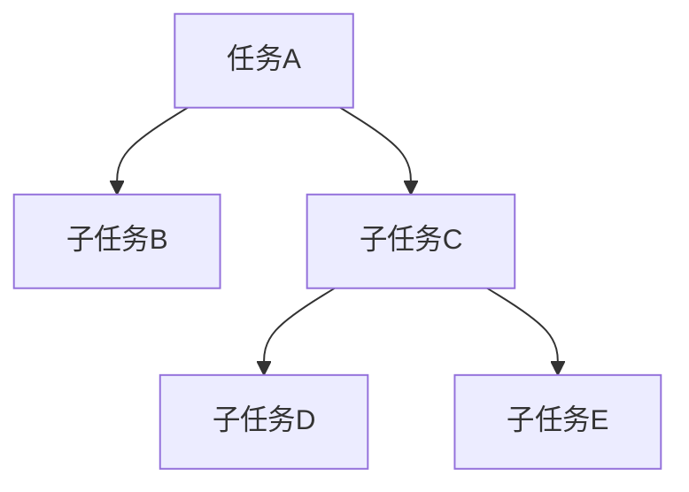
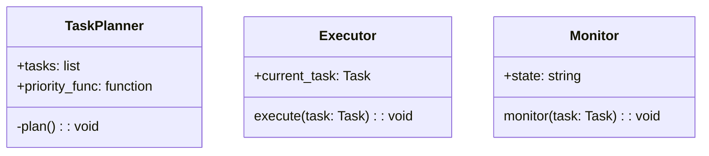

                 


# 任务规划与执行：AI Agent的行动决策机制

> 关键词：任务规划，AI Agent，行动决策，算法原理，系统架构，项目实战

> 摘要：  
本文系统地探讨了AI Agent的任务规划与执行机制，从核心概念、算法原理到系统架构和项目实战，全面解析了任务规划与执行的内在逻辑与实现方法。文章首先介绍了任务规划的基本概念与AI Agent的类型，随后深入分析了任务分解、优先级排序和常见任务规划算法的原理与实现。接着，从系统架构的角度，详细阐述了任务执行的系统设计与实现。最后，通过项目实战，结合具体案例，详细讲解了任务规划与执行的实际应用。本文旨在为AI领域的研究人员和工程师提供理论与实践相结合的深度解析。

---

## 第一部分: 任务规划与执行的背景与概念

### 第1章: 任务规划与执行的基本概念

#### 1.1 任务规划的定义与特点
任务规划是AI Agent实现智能决策和行动的核心能力，其本质是通过分析目标、环境和约束条件，制定最优或合理可行的行动方案。任务规划的关键特点包括：
- **目标导向性**：任务规划以明确的目标为导向。
- **环境适应性**：能够根据环境变化动态调整计划。
- **约束敏感性**：考虑时间、资源等多方面的约束条件。
- **可解释性**：规划过程和结果需要具备一定的可解释性。

**任务规划的分类与应用场景**：
| 分类方式 | 类型 | 应用场景 |
|----------|------|----------|
| 按目标层次 | 单目标规划 | 无人飞行器导航 |
|          | 多目标规划 | 多智能体协作 |
| 按环境类型 | 静态环境 | 工厂自动化 |
|          | 动态环境 | 自动驾驶 |
| 按约束条件 | 硬约束 | 医疗机器人手术 |
|          | 软约束 | 智能助手任务安排 |

---

#### 1.2 AI Agent的定义与类型
AI Agent是具有感知环境、做出决策并执行行动的智能体。其核心能力包括感知、推理、规划和执行。

**AI Agent的主要类型**：
| 类型 | 特性 | 应用场景 |
|------|------|----------|
| 简单反射式Agent | 基于当前感知做出反应 | 智能音箱 |
| 目标驱动式Agent | 以目标为导向，主动规划行动 | 无人车路径规划 |
| 计划驱动式Agent | 基于详细计划执行任务 | 工业机器人 |
| 学习驱动式Agent | 通过学习优化任务规划 | AlphaGo |

---

#### 1.3 任务规划与执行的关联性
任务规划是AI Agent行动决策的基础，而执行则是规划的落脚点。两者的协同机制如下：
- **规划**：明确目标、分解任务、制定行动方案。
- **执行**：根据规划结果，调用具体动作，完成任务。
- **反馈**：执行过程中感知环境变化，动态调整规划。

**任务规划与执行的协同机制**：
- 规划提供“做什么”和“如何做”的决策。
- 执行负责具体动作的实现。
- 反馈机制确保规划与执行的动态一致。

---

## 第二部分: 任务规划与执行的核心机制

### 第2章: 任务分解与优先级排序

#### 2.1 任务分解的基本原理
任务分解是将复杂任务拆解为简单子任务的过程，常见方法包括：
- **层次分解**：将任务按层次结构分解，如树状结构。
- **功能分解**：根据功能需求拆解任务。
- **约束分解**：考虑环境和资源约束。

**任务分解的层次结构**：


---

#### 2.2 任务优先级的确定方法
优先级排序是任务分解后的关键步骤，方法包括：
- **基于目标的排序**：优先完成与主要目标相关的任务。
- **基于时间的排序**：优先处理时间紧迫的任务。
- **综合排序**：结合目标、时间、资源等多因素。

**优先级排序的对比表格**：
| 方法 | 优点 | 缺点 |
|------|------|------|
| 基于目标 | 精准实现目标 | 忽视时间约束 |
| 基于时间 | 确保时间效率 | 可能偏离目标 |
| 综合排序 | 全面考虑因素 | 实现复杂度高 |

---

#### 2.3 任务优先级排序的算法实现
常见的优先级排序算法包括：
- **贪心算法**：局部最优选择全局最优。
- **动态规划**：分阶段决策，逐步优化。

**贪心算法实现示例**：
```python
def greedy_task_selector(tasks, priority_func):
    selected_tasks = []
    remaining_resources = 1  # 假设资源为1
    for task in sorted(tasks, key=priority_func, reverse=True):
        if remaining_resources >= task.resources:
            selected_tasks.append(task)
            remaining_resources -= task.resources
    return selected_tasks
```

---

## 第三部分: 任务规划的算法原理

### 第3章: 常见任务规划算法介绍

#### 3.1 A*算法
A*算法是一种经典的路径规划算法，结合了贪心和最优性原则。

**A*算法流程图**：


**A*算法数学模型**：
$$f(n) = g(n) + h(n)$$
其中：
- \(g(n)\)：从起点到节点n的实际成本。
- \(h(n)\)：从节点n到目标的估计成本。

---

#### 3.2 Dijkstra算法
Dijkstra算法用于解决单源最短路径问题，适合任务规划中的路径优化。

**Dijkstra算法实现示例**：
```python
import heapq

def dijkstra(graph, start):
    distances = {node: float('infinity') for node in graph}
    distances[start] = 0
    heap = []
    heapq.heappush(heap, (0, start))
    
    while heap:
        current_dist, current_node = heapq.heappop(heap)
        if current_dist > distances[current_node]:
            continue
        for neighbor, weight in graph[current_node].items():
            if distances[neighbor] > current_dist + weight:
                distances[neighbor] = current_dist + weight
                heapq.heappush(heap, (distances[neighbor], neighbor))
    return distances
```

---

#### 3.3 遗传算法
遗传算法是一种基于生物进化原理的优化算法，适用于复杂的任务规划问题。

**遗传算法流程图**：


---

## 第四部分: 任务执行的系统架构

### 第4章: 任务执行的系统架构设计

#### 4.1 系统功能设计
任务执行系统的核心功能包括：
- **任务接收**：接收外部任务请求。
- **任务分解**：将任务拆解为子任务。
- **优先级排序**：确定任务执行顺序。
- **执行调度**：调用具体动作执行任务。

**系统功能设计的类图**：


---

## 第五部分: 项目实战

### 第5章: 项目实战与案例分析

#### 5.1 智能助手任务规划系统
**项目背景**：
开发一个智能助手任务规划系统，实现用户的任务接收、分解、优先级排序和执行。

**核心代码实现**：
```python
class Task:
    def __init__(self, name, priority, duration):
        self.name = name
        self.priority = priority
        self.duration = duration

class TaskPlanner:
    def __init__(self):
        self.tasks = []
    
    def add_task(self, task):
        self.tasks.append(task)
    
    def sort_tasks(self):
        self.tasks.sort(key=lambda x: -x.priority)
    
    def execute(self):
        for task in self.tasks:
            print(f"Executing task: {task.name}")
            print(f"Task completed in {task.duration} seconds.")
```

**代码解释与分析**：
- `Task`类表示一个任务，包含名称、优先级和持续时间。
- `TaskPlanner`类管理任务列表，提供任务添加、排序和执行功能。
- `execute`方法按优先级顺序执行任务。

---

## 第六部分: 总结与展望

### 第6章: 总结与展望

#### 6.1 最佳实践 tips
- **明确目标**：任务规划的前提是清晰的目标定义。
- **动态调整**：实时反馈机制是任务执行的关键。
- **算法优化**：根据场景选择合适的算法。

#### 6.2 小结
任务规划与执行是AI Agent实现智能决策的核心机制。通过任务分解、优先级排序和算法实现，AI Agent能够高效地完成复杂任务。

#### 6.3 注意事项
- 任务规划需要考虑多因素的约束。
- 算法实现需要结合具体场景进行优化。
- 系统设计需要注重可扩展性和可维护性。

#### 6.4 拓展阅读
- 推荐阅读《AI Agent设计与实现》。
- 关注最新的任务规划算法研究。

---

作者：AI天才研究院/AI Genius Institute  
禅与计算机程序设计艺术/Zen And The Art of Computer Programming

