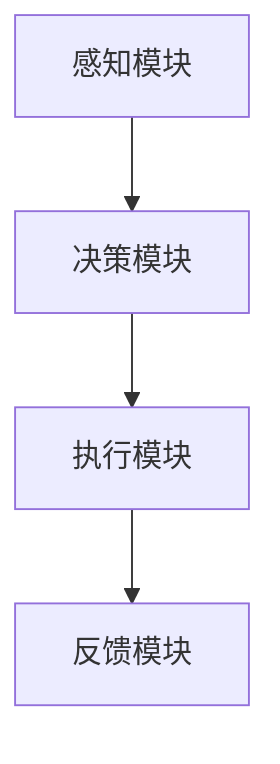
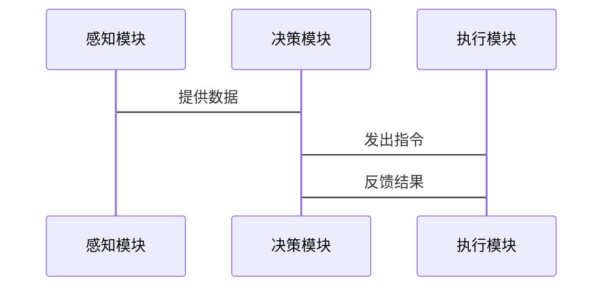

                 


# 企业AI Agent的5G网络应用策略

> **关键词**: 5G网络, AI Agent, 企业应用, 技术策略, 算法原理, 系统架构, 项目实战

> **摘要**: 本文深入探讨了AI Agent在5G网络中的应用策略，涵盖背景概述、技术原理、系统架构、项目实战、应用案例及总结展望。通过详细的技术分析和实际案例，为读者提供全面的指导，帮助企业在5G环境下有效应用AI Agent，提升竞争力。

---

# 第一部分: 企业AI Agent的5G网络应用概述

## 第1章: 5G网络与AI Agent概述

### 1.1 5G网络的特点与优势

#### 1.1.1 5G网络的定义与特点
5G网络作为新一代移动通信技术，具有高带宽、低延迟、大规模连接和高可靠性等特点。其峰值速率达到10Gbps，时延可降至1ms，支持海量设备的连接。

#### 1.1.2 5G网络的核心技术
- **大规模多天线技术 (Massive MIMO)**：通过多天线技术提升网络容量和覆盖范围。
- **网络切片 (Network Slicing)**：为不同应用场景提供定制化网络服务。
- **边缘计算 (Edge Computing)**：将计算能力下沉到网络边缘，减少数据传输延迟。

#### 1.1.3 5G网络对企业应用的影响
5G网络为企业AI Agent提供了低延迟、高带宽的通信环境，支持实时数据处理和大规模数据传输，显著提升了企业应用的效率和体验。

### 1.2 AI Agent的基本概念

#### 1.2.1 AI Agent的定义
AI Agent是一种智能实体，能够感知环境、自主决策并执行任务。它具备学习、推理、规划和自适应能力。

#### 1.2.2 AI Agent的核心功能
- **感知环境**：通过传感器或数据接口获取实时信息。
- **决策与规划**：基于获取的信息，进行分析、推理并制定行动计划。
- **执行任务**：通过执行动作实现目标。

#### 1.2.3 AI Agent与传统AI的区别
AI Agent具有自主性和目标导向性，能够适应动态变化的环境，而传统AI通常在静态环境中执行特定任务。

### 1.3 5G网络与AI Agent的结合

#### 1.3.1 5G网络如何赋能AI Agent
- **高速数据传输**：支持AI Agent快速获取和处理大量数据。
- **低延迟通信**：确保实时决策和响应。
- **边缘计算支持**：将AI Agent部署在边缘节点，减少云依赖。

#### 1.3.2 AI Agent在5G网络中的应用场景
- **智能制造**：优化生产流程，实时监控设备状态。
- **智慧城市**：管理交通、环境监测等城市资源。
- **远程医疗**：支持实时诊疗和数据传输。

#### 1.3.3 5G网络对AI Agent性能的提升
5G网络的高带宽和低延迟显著提升了AI Agent的响应速度和处理能力，使其在复杂场景中表现更优异。

---

## 第2章: 企业AI Agent的5G网络应用背景

### 2.1 企业AI Agent的发展现状

#### 2.1.1 企业AI Agent的起源
AI Agent概念起源于20世纪80年代，早期应用于专家系统和智能体系统。

#### 2.1.2 企业AI Agent的现状分析
当前，AI Agent已在金融、医疗、制造等领域得到广泛应用，但其性能和适应性仍有提升空间。

#### 2.1.3 企业AI Agent面临的挑战
- **数据隐私**：数据安全和隐私保护问题。
- **计算资源**：对计算资源的依赖较高。
- **环境适应性**：复杂动态环境中的适应能力不足。

### 2.2 5G网络对企业AI Agent的推动作用

#### 2.2.1 5G网络对企业AI Agent的促进
- **技术赋能**：5G网络提供了强大的通信和计算能力。
- **场景拓展**：支持更多复杂应用场景。

#### 2.2.2 5G网络与企业AI Agent的结合案例
- **智慧工厂**：利用AI Agent优化生产流程。
- **智能客服**：通过AI Agent提供个性化服务。

#### 2.2.3 5G网络对企业AI Agent未来发展的展望
随着5G网络的普及，AI Agent将在更多领域发挥重要作用，推动企业智能化转型。

---

## 第3章: 企业AI Agent的5G网络应用策略

### 3.1 确定目标与需求

#### 3.1.1 明确企业的目标
根据企业需求，明确AI Agent的目标，如优化流程、提升效率等。

#### 3.1.2 分析企业的需求
评估企业的技术基础、资源和应用场景，确定AI Agent的具体需求。

#### 3.1.3 确定5G网络的应用场景
选择适合AI Agent的5G应用场景，如实时监控、远程控制等。

### 3.2 制定技术实现方案

#### 3.2.1 设计AI Agent的架构
设计AI Agent的模块划分，如感知层、决策层、执行层。

#### 3.2.2 选择合适的5G网络技术
根据需求选择Massive MIMO、网络切片等5G技术。

#### 3.2.3 制定数据处理策略
设计数据采集、传输、存储和处理流程，确保数据高效利用。

### 3.3 实施与优化

#### 3.3.1 系统的部署与测试
在企业环境中部署AI Agent，进行功能测试和性能调优。

#### 3.3.2 系统的优化与调整
根据测试结果优化算法和系统架构，提升性能和稳定性。

#### 3.3.3 系统的维护与升级
定期维护系统，更新算法和适应新的应用场景。

---

# 第二部分: 企业AI Agent的5G网络技术原理

## 第4章: AI Agent的核心算法

### 4.1 强化学习算法

#### 4.1.1 强化学习的基本原理
强化学习通过智能体与环境的交互，学习策略以最大化累积奖励。

#### 4.1.2 强化学习在AI Agent中的应用
用于动态环境中的决策问题，如资源分配和路径规划。

#### 4.1.3 强化学习算法的优缺点
优点：适应复杂动态环境；缺点：训练时间长，计算资源需求高。

### 4.2 监督学习算法

#### 4.2.1 监督学习的基本原理
通过标注数据训练模型，预测新数据的标签。

#### 4.2.2 监督学习在AI Agent中的应用
用于分类、回归等任务，如客户行为预测。

#### 4.2.3 监督学习算法的优缺点
优点：简单易用；缺点：依赖高质量标注数据。

### 4.3 算法实现与优化

#### 4.3.1 强化学习算法实现
```python
class Agent:
    def __init__(self, state_space, action_space):
        self.state_space = state_space
        self.action_space = action_space
        self.model = self.build_model()

    def build_model(self):
        # 构建神经网络模型
        pass

    def act(self, state):
        # 根据状态选择动作
        pass

    def remember(self, state, action, reward, next_state):
        # 存储经验
        pass

    def replay(self, batch_size):
        # 回放记忆
        pass
```

#### 4.3.2 监督学习算法实现
```python
import numpy as np
from sklearn.linear_model import LinearRegression

class Agent:
    def __init__(self, input_dim):
        self.model = LinearRegression()

    def train(self, X, y):
        self.model.fit(X, y)

    def predict(self, X):
        return self.model.predict(X)
```

---

## 第5章: 5G网络与AI Agent的系统架构设计

### 5.1 系统功能设计

#### 5.1.1 系统功能模块
- **感知模块**：数据采集和预处理。
- **决策模块**：基于数据进行决策。
- **执行模块**：执行决策动作。

### 5.2 系统架构设计

#### 5.2.1 系统架构图


### 5.3 系统接口设计

#### 5.3.1 接口描述
- **输入接口**：接收传感器数据。
- **输出接口**：发送控制指令。

### 5.4 系统交互流程

#### 5.4.1 交互流程图


---

## 第6章: 项目实战与案例分析

### 6.1 环境配置

#### 6.1.1 环境需求
- **硬件**：高性能服务器、5G网络设备。
- **软件**：操作系统、AI框架（如TensorFlow、PyTorch）。

### 6.2 核心实现

#### 6.2.1 强化学习实现
```python
import numpy as np
import gym

env = gym.make('CartPole-v1')
agent = Agent(env.observation_space.shape[0], env.action_space.n)

for episode in range(1000):
    state = env.reset()
    total_reward = 0
    done = False
    while not done:
        action = agent.act(state)
        next_state, reward, done, _ = env.step(action)
        agent.remember(state, action, reward, next_state)
        agent.replay(32)
        total_reward += reward
        state = next_state
    print(f'Episode {episode}, Total Reward: {total_reward}')
```

#### 6.2.2 监督学习实现
```python
import numpy as np
from sklearn.ensemble import RandomForestClassifier

# 假设X_train和y_train是训练数据
model = RandomForestClassifier()
model.fit(X_train, y_train)
```

### 6.3 案例分析

#### 6.3.1 智能制造案例
在智能制造中，AI Agent通过5G网络实时监控生产线，优化生产流程。

#### 6.3.2 智慧交通案例
AI Agent在智慧交通中实现车辆调度和路径优化，提升交通效率。

### 6.4 项目总结

#### 6.4.1 成果总结
项目成功实现了AI Agent在5G网络中的应用，提升了企业的运营效率。

#### 6.4.2 经验总结
- **技术选型**：选择合适的算法和框架。
- **系统设计**：注重模块化和可扩展性。

---

# 第三部分: 总结与展望

## 第7章: 总结与展望

### 7.1 全文总结
本文详细探讨了AI Agent在5G网络中的应用策略，从技术原理到实际案例，为企业提供了全面的指导。

### 7.2 未来展望
随着5G网络的进一步发展，AI Agent将在更多领域发挥重要作用，推动企业智能化转型。

---

# 作者

**作者：AI天才研究院/AI Genius Institute & 禅与计算机程序设计艺术 /Zen And The Art of Computer Programming**

---

通过以上结构，文章全面覆盖了企业AI Agent在5G网络中的应用策略，从背景到技术，再到实战，为读者提供了深入的指导和丰富的案例分析。

