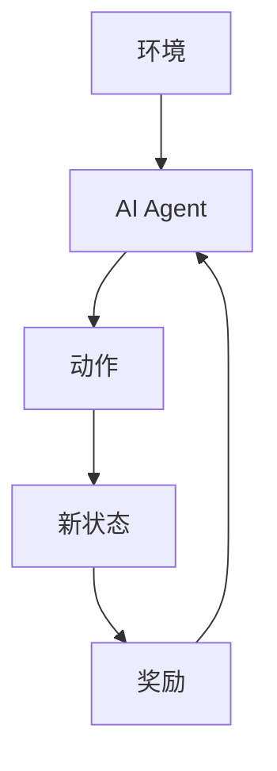
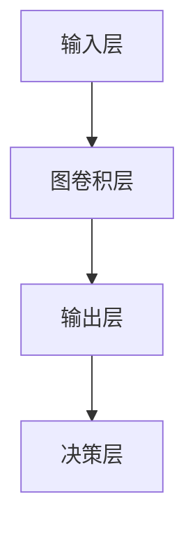
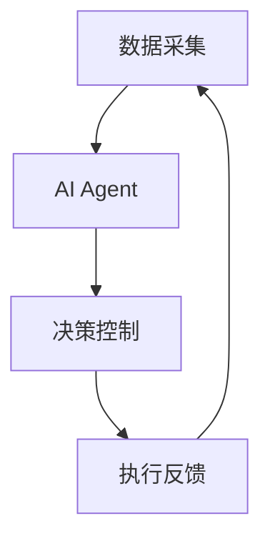

                 


# 企业AI Agent的5G网络智能切片技术

> 关键词：AI Agent，5G网络切片，智能资源分配，动态优化，网络虚拟化

> 摘要：本文系统地探讨了企业AI Agent与5G网络智能切片技术的结合，从理论基础、技术原理到系统设计与项目实战，深入分析了如何通过AI Agent优化5G网络切片的资源分配和动态管理。文章详细讲解了AI Agent的核心算法、数学模型，并结合实际案例展示了如何在5G网络中实现智能切片技术。

---

# 第一部分：AI Agent与5G网络切片的背景与概念

## 第1章：AI Agent的基本概念

### 1.1 AI Agent的定义与特征

AI Agent（人工智能代理）是一种能够感知环境、自主决策并执行任务的智能实体。其核心特征包括：

- **自主性**：能够在没有外部干预的情况下独立运作。
- **反应性**：能够实时感知环境变化并做出反应。
- **目标导向**：基于预设目标或学习目标进行决策。
- **学习能力**：通过数据和经验不断优化自身行为。

#### AI Agent的核心属性对比表

| 属性 | 描述 |
|------|------|
| 自主性 | 独立决策，无需外部控制 |
| 反应性 | 实时感知环境变化并响应 |
| 目标导向 | 基于目标驱动行为 |
| 学习能力 | 通过数据优化决策 |

### 1.2 5G网络切片技术概述

5G网络切片是指将物理网络分割成多个虚拟网络，每个切片独立运行，互不干扰。其关键特征包括：

- **网络虚拟化**：通过虚拟化技术将物理网络资源抽象为多个虚拟切片。
- **动态配置**：根据需求实时调整切片资源。
- **多应用场景支持**：不同切片可以为不同业务提供定制化服务。

#### 5G网络切片的优势

- **资源隔离**：确保不同业务的网络资源互不影响。
- **弹性扩展**：根据需求动态调整资源分配。
- **高效利用**：按需分配资源，避免浪费。

## 第2章：AI Agent与5G切片技术的结合

### 2.1 问题背景与目标

在5G网络中，切片资源的分配和管理需要考虑实时性、资源利用率和业务需求的动态变化。传统的静态资源分配方式难以应对复杂多变的业务场景，因此引入AI Agent进行智能管理成为必然趋势。

### 2.2 技术协同的必要性

AI Agent能够通过智能学习和决策优化5G切片的资源分配，从而提高网络效率和用户体验。具体表现为：

- **动态优化**：实时调整切片资源，确保资源利用率最大化。
- **智能决策**：基于历史数据和实时信息，预测未来需求并做出最优决策。
- **故障恢复**：在网络异常时快速响应，确保服务不中断。

### 2.3 应用场景与边界

#### 典型应用场景

- **工业物联网（IIoT）**：需要实时、低延迟的网络切片。
- **虚拟现实（VR）/增强现实（AR）**：对带宽和时延要求极高的业务场景。
- **智能交通系统**：需要高可靠性和低时延的网络支持。

#### 边界与限制

- **计算能力限制**：AI Agent的决策能力受限于设备的计算能力。
- **数据隐私**：需要确保数据在传输和处理过程中的安全性。
- **网络复杂性**：复杂的网络环境可能增加AI Agent的决策难度。

---

# 第二部分：AI Agent与5G切片技术的算法原理

## 第3章：AI Agent的核心算法

### 3.1 强化学习算法

强化学习是一种通过试错方式优化决策的算法。AI Agent通过与环境的交互获得奖励，从而优化自己的行为策略。

#### 强化学习流程图（Mermaid）



#### 数学模型与公式

强化学习的目标是通过最大化累计奖励来优化策略。数学模型如下：

$$ Q(s, a) = Q(s, a) + \alpha (r + \max_{a'} Q(s', a') - Q(s, a)) $$

其中：
- \( Q(s, a) \) 表示状态 \( s \) 下动作 \( a \) 的价值函数。
- \( \alpha \) 表示学习率。
- \( r \) 表示奖励。

### 3.2 图神经网络（GNN）

图神经网络适用于处理网络拓扑结构中的关系数据。AI Agent可以通过GNN分析网络切片之间的依赖关系，优化资源分配。

#### 图神经网络架构（Mermaid）



---

# 第三部分：系统分析与架构设计

## 第4章：系统功能设计

### 4.1 领域模型设计

领域模型描述了系统中的核心实体及其关系。以下是领域模型的类图（Mermaid）：

```mermaid
classDiagram
    class AI-Agent {
        +目标：Target
        +状态：State
        +动作：Action
    }
    class 网络切片 {
        +资源：Resource
        +状态：State
        +需求：Demand
    }
    AI-Agent --> 网络切片：管理
```

### 4.2 系统架构设计

系统架构包括数据采集、决策控制和执行反馈三个模块。以下是系统架构图（Mermaid）：



### 4.3 接口设计

系统接口设计如下：

- **输入接口**：接收网络切片的实时数据和用户需求。
- **输出接口**：发送资源分配指令和优化结果。
- **反馈接口**：接收执行结果并更新系统状态。

---

# 第四部分：项目实战与案例分析

## 第5章：项目实战

### 5.1 环境安装

需要安装以下工具和库：

- **Python 3.8+**
- **TensorFlow或PyTorch**
- **Mermaid图生成工具**
- **5G网络模拟环境**

### 5.2 核心实现代码

以下是一个基于强化学习的AI Agent实现代码示例：

```python
import numpy as np

class AI-Agent:
    def __init__(self, state_space, action_space):
        self.state_space = state_space
        self.action_space = action_space
        self.Q = np.zeros((state_space, action_space))

    def take_action(self, state):
        return np.argmax(self.Q[state, :])

    def update_Q(self, state, action, reward, next_state):
        self.Q[state, action] += self.alpha * (reward + np.max(self.Q[next_state, :]) - self.Q[state, action])

    def get Reward(self, state, action, next_state):
        # 根据实际场景定义奖励函数
        pass
```

### 5.3 实际案例分析

以工业物联网场景为例，AI Agent通过强化学习优化切片资源分配，提升网络性能。

---

# 第五部分：总结与展望

## 第6章：总结与展望

### 6.1 项目总结

本文详细探讨了企业AI Agent与5G网络切片技术的结合，通过理论分析和项目实战展示了如何利用AI Agent优化5G切片的资源分配和动态管理。

### 6.2 未来展望

未来的研究方向包括：

- 更高效的AI算法优化。
- 更复杂的网络切片场景。
- 更强的跨领域应用集成。

---

# 作者

作者：AI天才研究院/AI Genius Institute & 禅与计算机程序设计艺术 /Zen And The Art of Computer Programming

---

以上是文章的详细大纲和内容。希望对您有所帮助！

