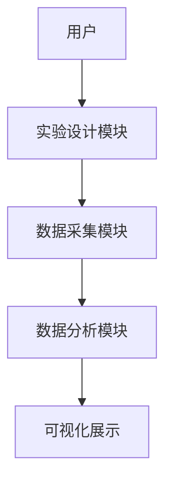
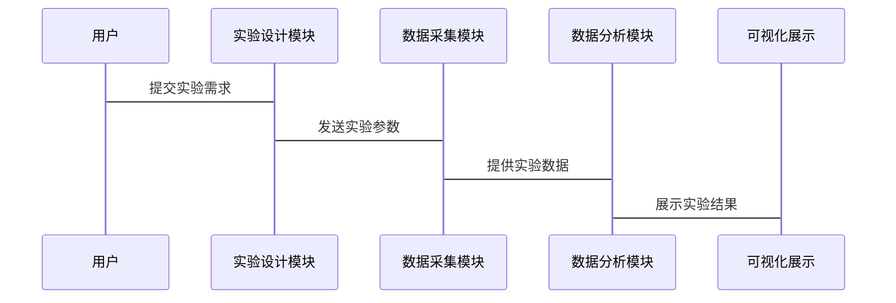

                 


# 企业AI Agent的A/B测试功能：持续优化用户体验

---

## 关键词：
企业AI Agent，A/B测试，用户体验优化，算法原理，系统架构，用户行为分析

---

## 摘要：
企业AI Agent的A/B测试功能是通过对比不同策略、算法或交互方式，找到最优方案以提升用户体验和业务目标的关键技术。本文从A/B测试的基本概念出发，深入探讨其在企业AI Agent中的应用场景、算法原理、系统架构设计、项目实战以及最佳实践。通过详细分析，帮助读者理解如何通过A/B测试持续优化AI Agent的用户体验，并在实际项目中高效落地。

---

## 目录大纲

### 第一部分: 企业AI Agent与A/B测试基础

### 第1章: 企业AI Agent与A/B测试概述

#### 1.1 企业AI Agent的基本概念
- AI Agent的定义与特点
- 企业级AI Agent的应用场景
- 企业AI Agent的核心功能与价值

#### 1.2 A/B测试的基本概念
- A/B测试的定义与原理
- A/B测试在企业AI Agent中的应用
- A/B测试的优势与局限性

#### 1.3 企业AI Agent的A/B测试场景
- 用户交互优化场景
- 系统功能优化场景
- 业务流程优化场景

#### 1.4 本章小结

### 第2章: A/B测试的核心概念与原理

#### 2.1 A/B测试的核心要素
- 实验组与对照组的定义
- 样本量的计算与分配
- 统计显著性与置信区间

#### 2.2 A/B测试的流程与步骤
- 实验设计与目标设定
- 数据收集与分析方法
- 结果解读与决策优化

#### 2.3 A/B测试的关键指标
- 转化率与留存率
- 用户满意度与参与度
- 业务目标与成本效益分析

#### 2.4 本章小结

### 第3章: 企业AI Agent的A/B测试框架

#### 3.1 A/B测试框架的设计原则
- 可扩展性与可维护性
- 数据采集与处理的高效性
- 实验结果的可解释性

#### 3.2 企业AI Agent的A/B测试框架组成
- 实验设计模块
- 数据采集模块
- 数据分析模块

#### 3.3 企业AI Agent的A/B测试框架实现
- 框架实现的关键技术
- 框架实现的代码示例
- 框架实现的优缺点分析

#### 3.4 本章小结

### 第二部分: A/B测试的算法原理与实现

### 第4章: A/B测试的算法原理

#### 4.1 A/B测试的核心算法
- 4.1.1 基于统计学的A/B测试方法
  - t检验与卡方检验的原理
  - 实验结果的显著性检验
- 4.1.2 基于机器学习的A/B测试方法
  - 预测模型的构建与评估
  - 在线学习与实时更新机制

#### 4.2 A/B测试的数学模型与公式
- 4.2.1 基于t检验的A/B测试公式
  $$ t = \frac{\bar{x}_1 - \bar{x}_2}{\sqrt{\frac{s_1^2}{n_1} + \frac{s_2^2}{n_2}}} $$
- 4.2.2 基于卡方检验的公式
  $$ \chi^2 = \sum \frac{(O_i - E_i)^2}{E_i} $$

#### 4.3 算法实现的Python代码示例
```python
import numpy as np
from scipy import stats

def ab_test_t_statistic(control_group, treatment_group):
    # 计算样本均值
    x1 = np.mean(control_group)
    x2 = np.mean(treatment_group)
    # 计算样本标准差
    s1 = np.std(control_group)
    s2 = np.std(treatment_group)
    # 计算样本量
    n1 = len(control_group)
    n2 = len(treatment_group)
    # 计算t统计量
    t_statistic = (x1 - x2) / np.sqrt((s1**2 / n1) + (s2**2 / n2))
    p_value = stats.ttest_ind(control_group, treatment_group).pvalue
    return t_statistic, p_value

# 示例数据
control = np.random.normal(0, 1, 100)
treatment = np.random.normal(0.1, 1, 100)
t_stat, p_val = ab_test_t_statistic(control, treatment)
print(f"t统计量: {t_stat}, p值: {p_val}")
```

#### 4.4 本章小结

### 第5章: A/B测试的系统架构设计

#### 5.1 系统架构设计概述
- 系统功能模块划分
- 系统架构的可扩展性设计

#### 5.2 系统功能模块设计
- 实验设计模块
  - 用户输入实验参数
  - 自动生成实验方案
- 数据采集模块
  - 数据采集接口设计
  - 数据存储与处理
- 数据分析模块
  - 实验结果的统计分析
  - 可视化展示

#### 5.3 系统架构图


#### 5.4 系统接口设计
- 数据接口定义
- API调用流程

#### 5.5 系统交互流程图


#### 5.6 本章小结

### 第三部分: 项目实战与最佳实践

### 第6章: 企业AI Agent的A/B测试项目实战

#### 6.1 项目背景与目标
- 项目背景介绍
- 项目目标设定

#### 6.2 项目环境安装与配置
- 系统环境要求
- 依赖库的安装与配置
- 开发工具的安装与配置

#### 6.3 项目核心代码实现
- 实验设计模块代码
- 数据采集模块代码
- 数据分析模块代码
- 可视化展示代码

#### 6.4 项目代码实现与解读
- 核心代码示例
```python
import pandas as pd
from sklearn.metrics import accuracy_score

# 示例数据集
data = pd.DataFrame({
    'group': ['control'] * 50 + ['treatment'] * 50,
    'response': np.random.randint(0, 2, 100)
})

# 计算不同组的准确率
accuracy_control = accuracy_score(data[data['group'] == 'control']['response'], [0] * 50)
accuracy_treatment = accuracy_score(data[data['group'] == 'treatment']['response'], [0] * 50)

print(f"对照组准确率: {accuracy_control}")
print(f"实验组准确率: {accuracy_treatment}")
```

#### 6.5 项目案例分析与结果解读
- 实验结果分析
- 数据可视化展示
- 优化方案的制定与实施

#### 6.6 项目总结与经验分享
- 项目成功的关键因素
- 实施过程中遇到的挑战与解决方案
- 项目成果与后续优化方向

#### 6.7 本章小结

### 第7章: A/B测试的最佳实践与注意事项

#### 7.1 最佳实践
- 实验设计的注意事项
- 数据采集的常见问题与解决方案
- 数据分析的常见问题与解决方案
- 结果解读的常见问题与解决方案

#### 7.2 实施中的注意事项
- 样本量的合理控制
- 统计方法的选择与优化
- 实验结果的可解释性

#### 7.3 拓展阅读与学习资源
- 推荐书籍与论文
- 在线课程与培训资源
- 社区与论坛资源

#### 7.4 本章小结

### 第四部分: 总结与展望

### 第8章: 总结与展望

#### 8.1 全文总结
- 核心内容回顾
- 关键知识点总结

#### 8.2 未来展望
- A/B测试技术的发展趋势
- 企业AI Agent的未来发展方向
- A/B测试在更多领域的潜在应用

#### 8.3 本章小结

---

## 作者：AI天才研究院/AI Genius Institute & 禅与计算机程序设计艺术 /Zen And The Art of Computer Programming

