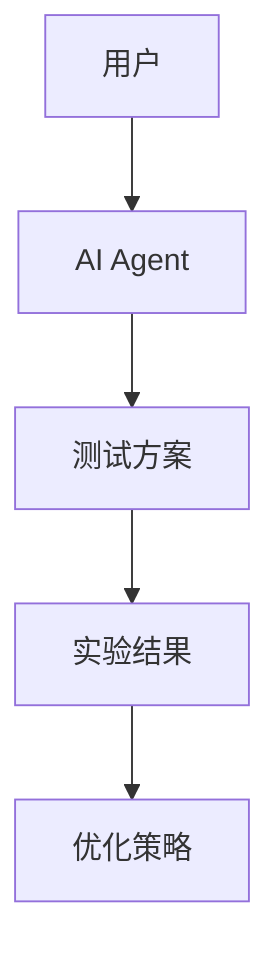
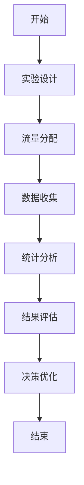
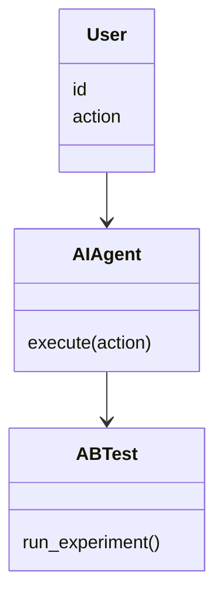
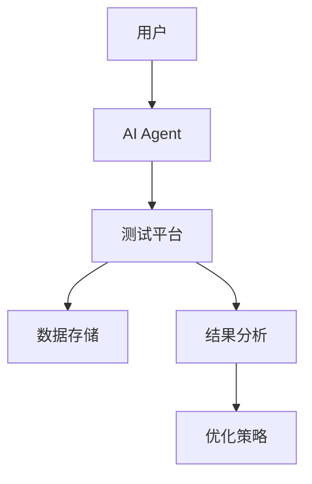
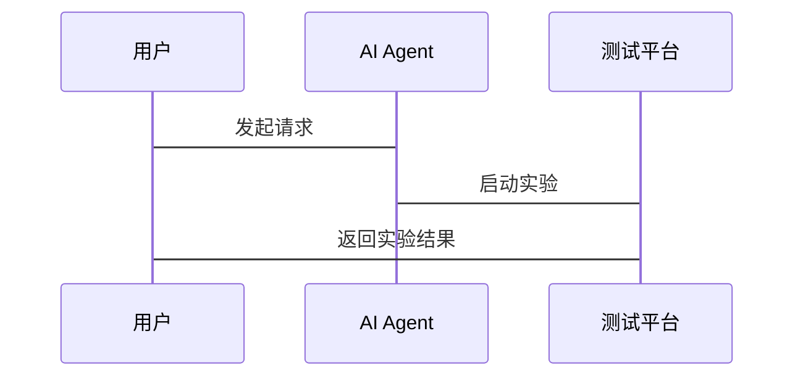

                 


# 企业AI Agent的A/B测试功能：持续优化用户体验

> 关键词：企业AI Agent，A/B测试，用户体验优化，算法原理，系统架构设计

> 摘要：本文详细探讨了企业AI Agent中的A/B测试功能，分析其在持续优化用户体验中的重要作用。通过背景介绍、核心概念、算法原理、系统架构设计、项目实战和最佳实践等多个方面，深入阐述了A/B测试在企业AI Agent中的应用及其优化策略，为技术人员和企业决策者提供了理论支持和实践指导。

---

# 第一部分: 企业AI Agent的A/B测试功能概述

## 第1章: 问题背景与概念解析

### 1.1 问题背景

#### 1.1.1 企业AI Agent的发展现状
随着人工智能技术的快速发展，企业AI Agent（智能代理）正在成为企业数字化转型的重要工具。通过AI Agent，企业能够自动化处理日常任务、优化业务流程并提升用户体验。然而，在实际应用中，AI Agent的功能复杂性和用户需求的多样性使得用户体验优化成为一个持续性的挑战。

#### 1.1.2 当前用户痛点与问题描述
用户在使用AI Agent时，常常面临以下痛点：
1. **功能迭代缓慢**：AI Agent的功能改进需要经过漫长的测试周期，难以快速响应用户反馈。
2. **用户体验不稳定**：不同用户群体的需求差异导致AI Agent的功能在某些场景下表现不佳。
3. **数据驱动决策不足**：缺乏系统化的数据收集和分析方法，导致优化决策缺乏科学依据。

#### 1.1.3 A/B测试在AI Agent中的作用
A/B测试是一种通过对比不同版本的功能或策略，找出最优解决方案的方法。在AI Agent中，A/B测试能够帮助企业在不中断服务的情况下，快速验证新功能的有效性，优化用户体验。

#### 1.1.4 问题解决的边界与外延
A/B测试的应用范围限于功能优化和用户体验提升，而不涉及技术架构的根本性改变。其外延则包括从用户行为分析到数据驱动的决策支持。

#### 1.1.5 核心概念结构与要素组成
- **核心概念**：AI Agent、A/B测试、用户体验优化。
- **要素组成**：实验设计、流量分配、数据收集、统计分析、结果评估。

---

## 第2章: 核心概念与联系

### 2.1 AI Agent的基本原理

#### 2.1.1 AI Agent的定义与特征
AI Agent是一种能够感知环境、自主决策并执行任务的智能系统。其核心特征包括：
- **自主性**：能够独立执行任务。
- **反应性**：能够实时响应环境变化。
- **目标导向**：以实现特定目标为导向。

#### 2.1.2 A/B测试的基本原理与流程
A/B测试是一种实验方法，通过将用户分为对照组和实验组，分别使用不同的版本，比较效果差异。其流程包括：
1. **实验设计**：明确目标和测试方案。
2. **流量分配**：将用户随机分配到不同组别。
3. **数据收集**：记录各组用户的行为数据。
4. **统计分析**：通过数据分析判断实验结果。
5. **结果评估**：根据结果决定是否推广实验组方案。

#### 2.1.3 AI Agent与A/B测试的关系
AI Agent通过A/B测试能够实现以下目标：
- **动态优化**：实时调整策略以提升用户体验。
- **数据驱动决策**：基于实验结果优化功能。

#### 2.1.4 核心概念属性特征对比表
| 核心概念 | 定义 | 特征 | 应用场景 |
|----------|------|------|----------|
| AI Agent | 智能代理 | 自主性、反应性、目标导向 | 企业自动化任务、优化业务流程 |
| A/B测试 | 实验方法 | 数据驱动、用户分组、结果对比 | 用户体验优化、功能迭代 |

#### 2.1.5 ER实体关系图


---

## 第3章: A/B测试的算法原理

### 3.1 算法流程

#### 3.1.1 实验设计与流量分配
- **实验设计**：明确实验目标，如提升用户点击率。
- **流量分配**：将用户随机分配到对照组和实验组，通常采用50:50的比例。

#### 3.1.2 统计分析与结果评估
- **统计分析**：使用t检验或卡方检验，计算实验组和对照组的差异是否显著。
- **结果评估**：根据p值判断实验结果是否具有统计显著性。

#### 3.1.3 决策机制与优化策略
- **决策机制**：根据实验结果决定是否推广实验组方案。
- **优化策略**：动态调整流量分配，逐步扩大最优方案的覆盖范围。

### 3.2 算法流程图



### 3.3 算法实现

#### 3.3.1 Python代码示例
```python
import random
from scipy.stats import ttest_ind

# 生成实验数据
control_group = [random.uniform(0.2, 0.8) for _ in range(100)]
experiment_group = [random.uniform(0.3, 0.9) for _ in range(100)]

# 统计分析
t_stat, p_val = ttest_ind(control_group, experiment_group)

print(f"t统计量: {t_stat}, p值: {p_val}")
```

#### 3.3.2 数学公式
- **t检验公式**：
  $$ t = \frac{\bar{X}_1 - \bar{X}_2}{\sqrt{s_1^2 / n_1 + s_2^2 / n_2}} $$
  其中，$\bar{X}_1$ 和 $\bar{X}_2$ 是两组的平均值，$s_1$ 和 $s_2$ 是标准差，$n_1$ 和 $n_2$ 是样本数量。

---

## 第4章: 系统分析与架构设计

### 4.1 问题场景介绍

#### 4.1.1 问题场景
- **用户行为分析**：分析用户的交互行为，识别优化点。
- **功能迭代优化**：通过A/B测试优化AI Agent的功能。

### 4.2 系统功能设计

#### 4.2.1 领域模型类图


#### 4.2.2 系统架构设计



#### 4.2.3 系统接口设计
- **API接口**：
  - `/start_experiment`：启动实验。
  - `/stop_experiment`：停止实验。
  - `/get_results`：获取实验结果。

#### 4.2.4 系统交互图


---

## 第5章: 项目实战

### 5.1 环境安装

```bash
pip install numpy scipy matplotlib
```

### 5.2 核心代码实现

#### 5.2.1 AI Agent实现
```python
import random
import numpy as np

class AI_Agent:
    def __init__(self):
        self.user_id = None
        self.action = None

    def execute(self):
        # 根据当前用户和上下文执行动作
        pass
```

#### 5.2.2 A/B测试平台实现
```python
import random

class AB_Test:
    def __init__(self):
        self.groups = ['control', 'experiment']

    def assign_group(self, user_id):
        return random.choice(self.groups)
```

### 5.3 案例分析

#### 5.3.1 实验设计
- **目标**：提升用户点击率。
- **分组**：对照组使用旧功能，实验组使用新功能。

#### 5.3.2 数据分析
- 对比两组的点击率，计算统计显著性。

### 5.4 项目小结
通过A/B测试，企业能够快速验证新功能的效果，优化用户体验，提升业务指标。

---

## 第6章: 最佳实践

### 6.1 小结
- A/B测试是企业AI Agent优化的重要工具。
- 通过科学的实验设计和数据分析，能够有效提升用户体验。

### 6.2 注意事项
- 确保样本量足够大，避免结果偏差。
- 定期回顾实验结果，持续优化功能。

### 6.3 拓展阅读
- 推荐阅读《实验驱动的产品优化》和《数据驱动的决策》。

---

# 小结
企业AI Agent的A/B测试功能是持续优化用户体验的关键工具。通过科学的实验设计、算法实现和系统架构优化，企业能够快速响应用户需求，提升产品竞争力。

---

# 作者
作者：AI天才研究院 & 禅与计算机程序设计艺术

