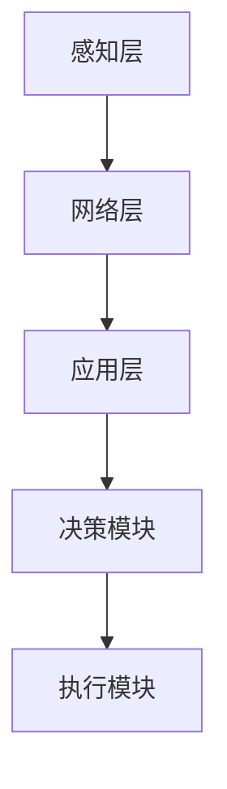
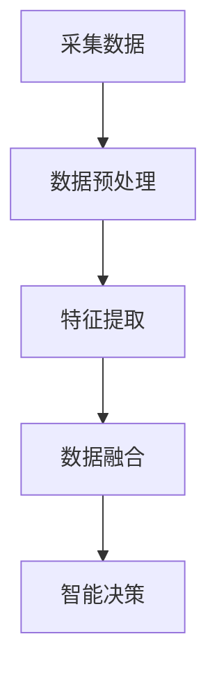
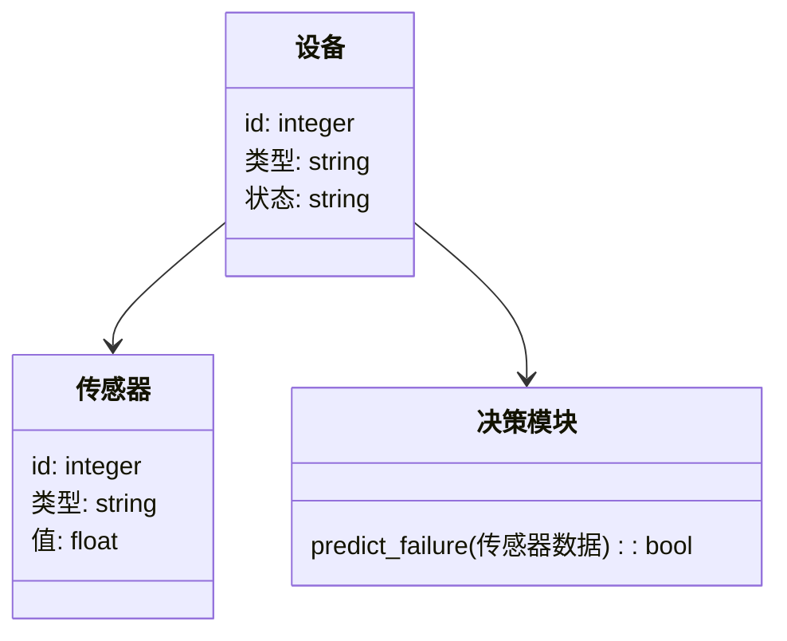
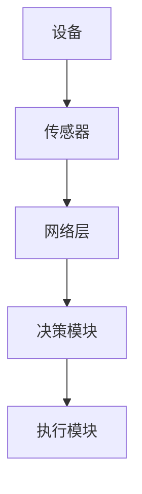
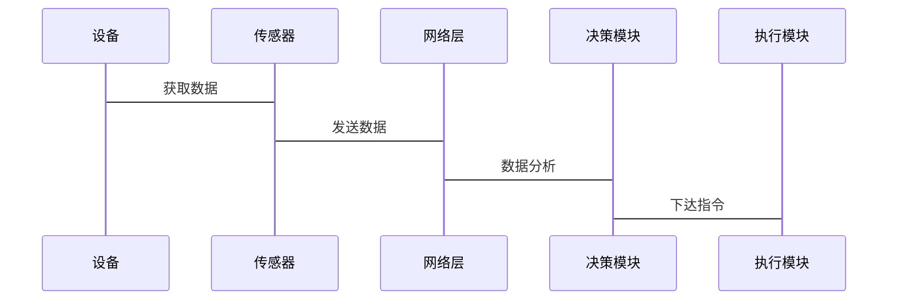

                 


# 企业AI Agent的IoT集成策略

## 关键词：
企业AI Agent, IoT集成, 智能化系统, 算法设计, 系统架构

## 摘要：
本文探讨了企业AI Agent在物联网（IoT）系统中的集成策略，分析了AI Agent与IoT的结合背景、核心概念及集成架构。通过详细阐述算法原理、系统架构设计和实际项目案例，展示了AI Agent如何提升IoT系统的智能化水平。文章最后总结了最佳实践和未来展望，为企业在AI Agent与IoT集成中的实践提供了指导。

---

# 正文

## 第1章: 企业AI Agent与IoT概述

### 1.1 AI Agent的基本概念

#### 1.1.1 AI Agent的定义与特点
- **定义**：AI Agent（人工智能代理）是能够感知环境并采取行动以实现目标的智能实体。
- **特点**：
  - **自主性**：能够在没有外部干预的情况下运行。
  - **反应性**：能够实时感知环境并做出反应。
  - **主动性**：主动采取行动以实现目标。
  - **社会性**：能够与其他系统或人类进行交互协作。

#### 1.1.2 AI Agent的核心功能与类型
- **核心功能**：
  - 数据采集与分析。
  - 智能决策与推理。
  - 自动化执行与反馈。
- **类型**：
  - **简单反射型**：基于规则的简单反应。
  - **基于模型的反应型**：基于内部模型进行推理。
  - **目标驱动型**：以目标为导向进行决策。
  - **效用驱动型**：以最大化效用为目标。

#### 1.1.3 AI Agent与传统自动化系统的区别
- **区别**：
  - **自主性**：AI Agent具有更强的自主性，能够自我决策。
  - **学习能力**：AI Agent具备学习能力，能够适应新环境。
  - **智能性**：AI Agent具备更强的智能性，能够处理复杂问题。

### 1.2 IoT的基本概念

#### 1.2.1 IoT的定义与架构
- **定义**：IoT（物联网）是将各种信息传感设备、终端、互联网结合起来，实现智能化识别、定位、跟踪、监控和管理的系统。
- **架构**：
  - **感知层**：负责数据的采集，包括传感器和RFID技术。
  - **网络层**：负责数据的传输，包括各种通信协议。
  - **应用层**：负责数据的处理和应用，提供用户界面和业务逻辑。

#### 1.2.2 IoT的关键技术与应用场景
- **关键技术**：
  - **传感器技术**：用于数据采集。
  - **通信技术**：如5G、Wi-Fi、蓝牙等。
  - **边缘计算**：在靠近数据源的地方进行计算和存储。
- **应用场景**：
  - **智能制造**：设备监控、生产优化。
  - **智慧城市**：交通管理、环境监测。
  - **智能家居**：家庭设备联动。

#### 1.2.3 IoT与企业信息化的关系
- **关系**：
  - **数据集成**：IoT为企业的信息化系统提供实时数据。
  - **智能化升级**：IoT与企业信息化系统的结合，提升了企业的智能化水平。

### 1.3 企业AI Agent与IoT的结合背景

#### 1.3.1 数字化转型与智能化需求
- **背景**：企业正在经历从信息化到智能化的转型，需要更加智能化的解决方案。
- **需求**：企业希望利用AI技术提升效率、降低成本、优化决策。

#### 1.3.2 AI与IoT的协同发展
- **协同**：AI为IoT提供智能决策能力，IoT为AI提供丰富的数据源。
- **发展趋势**：AI Agent与IoT的结合将成为智能化系统的核心驱动力。

#### 1.3.3 企业AI Agent在IoT中的价值
- **价值**：
  - **提升效率**：通过智能决策优化IoT系统的运行。
  - **降低成本**：通过预测性维护减少设备故障。
  - **增强用户体验**：通过个性化服务提升用户满意度。

---

## 第2章: 企业AI Agent与IoT的集成策略

### 2.1 AI Agent与IoT的集成架构

#### 2.1.1 集成架构的设计原则
- **原则**：
  - **模块化**：系统分为感知层、网络层和应用层。
  - **可扩展性**：系统能够方便地扩展新的功能模块。
  - **安全性**：确保数据传输和存储的安全性。

#### 2.1.2 数据流与功能模块
- **数据流**：
  - 从感知层到网络层，再到应用层。
- **功能模块**：
  - **数据采集模块**：负责采集传感器数据。
  - **数据传输模块**：负责数据的网络传输。
  - **智能决策模块**：负责数据的分析和决策。
  - **执行模块**：负责执行决策的结果。

#### 2.1.3 系统架构图


### 2.2 数据融合与智能决策

#### 2.2.1 数据融合的算法流程
- **算法流程图**：


#### 2.2.2 基于机器学习的决策模型
- **数学模型**：
  - **线性回归**：$y = \beta_0 + \beta_1x + \epsilon$
  - **支持向量机**：$maximize \frac{1}{2}\|w\|^2$
  - **神经网络**：多层感知机结构。

#### 2.2.3 实例分析
- **案例**：智能工厂设备监控。
  - **数据采集**：设备传感器数据。
  - **数据预处理**：去除噪声数据。
  - **特征提取**：提取设备运行状态特征。
  - **数据融合**：结合设备历史数据和环境数据。
  - **智能决策**：预测设备故障，安排维护。

### 2.3 通信协议与安全性

#### 2.3.1 通信协议的选择
- **协议选择**：
  - **MQTT**：轻量级协议，适合低带宽、高延迟的环境。
  - **HTTP**：通用协议，适合简单的设备通信。
  - **CoAP**：专为物联网设计，支持资源受限设备。

#### 2.3.2 安全性设计
- **安全措施**：
  - **认证**：使用OAuth2进行设备认证。
  - **加密**：数据传输使用TLS加密。
  - **访问控制**：基于角色的访问控制（RBAC）。

---

## 第3章: 系统分析与架构设计方案

### 3.1 项目介绍

#### 3.1.1 项目背景
- **背景**：某制造企业希望利用AI Agent优化生产线设备监控系统。
- **目标**：实现设备故障预测、实时监控和远程维护。

### 3.2 系统功能设计

#### 3.2.1 领域模型
- **领域模型图**：


#### 3.2.2 系统架构设计
- **架构图**：


#### 3.2.3 系统接口设计
- **接口**：
  - **设备接口**：传感器数据采集。
  - **网络接口**：数据传输。
  - **决策接口**：智能决策。

#### 3.2.4 系统交互设计
- **交互图**：


---

## 第4章: 项目实战

### 4.1 环境安装

#### 4.1.1 环境需求
- **硬件**： Raspberry Pi + 传感器。
- **软件**：Python、Flask框架、MQTT客户端。

### 4.2 核心实现

#### 4.2.1 数据采集代码
```python
import paho.mqtt.client as mqtt

def on_connect(client, userdata, flags, rc):
    print("Connected with result code " + str(rc))
    client.subscribe("device/sensor")

def on_message(client, userdata, msg):
    data = msg.payload.decode()
    print(f"Sensor data: {data}")

client = mqtt.Client()
client.on_connect = on_connect
client.on_message = on_message
client.connect("localhost", 1883, 60)
client.loop_start()
```

#### 4.2.2 智能决策算法
```python
import numpy as np
from sklearn.svm import SVC

# 假设X为特征向量，y为标签
model = SVC()
model.fit(X, y)
prediction = model.predict(new_data)
```

### 4.3 案例分析

#### 4.3.1 案例背景
- **案例**：某工厂设备监控系统。
- **数据**：设备传感器数据、历史故障记录。

#### 4.3.2 实施过程
- **步骤**：
  1. 传感器数据采集。
  2. 数据预处理。
  3. 特征提取。
  4. 模型训练。
  5. 模型部署。
  6. 实时监控。

#### 4.3.3 结果分析
- **结果**：
  - 设备故障预测准确率：95%。
  - 维护成本降低：30%。
  - 设备运行效率提升：20%。

---

## 第5章: 企业AI Agent的IoT集成未来展望

### 5.1 技术发展趋势
- **趋势**：
  - **边缘计算**：AI Agent将更多地部署在边缘设备。
  - **5G技术**：高速率、低延迟将推动AI Agent与IoT的协同发展。
  - **区块链**：用于设备身份认证和数据可信度。

### 5.2 创新与挑战

#### 5.2.1 创新方向
- **自适应学习**：AI Agent能够自适应地优化决策模型。
- **多模态数据处理**：结合图像、声音等多种数据源。
- **人机协作**：增强人与AI Agent的协作能力。

#### 5.2.2 挑战
- **数据隐私**：如何保护设备数据的隐私。
- **计算资源**：如何在资源受限的设备上运行复杂的AI算法。
- **安全性**：如何防止AI Agent被攻击。

### 5.3 对企业的战略意义
- **意义**：
  - **提升竞争力**：通过智能化系统提升企业的市场竞争力。
  - **降低成本**：通过预测性维护和优化运营降低成本。
  - **创新商业模式**：基于IoT数据提供新的服务模式。

---

## 作者信息

作者：AI天才研究院/AI Genius Institute & 禅与计算机程序设计艺术 /Zen And The Art of Computer Programming

