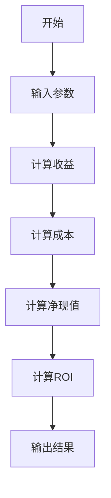
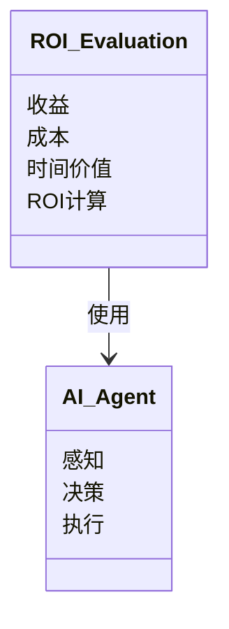
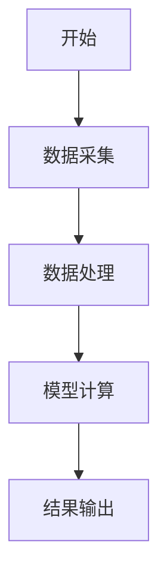
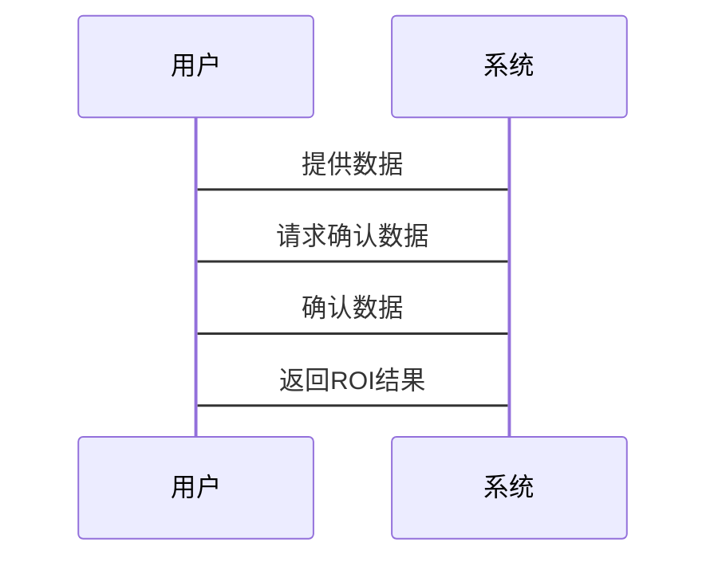

                 


# 企业AI Agent的ROI评估方法

> 关键词：企业AI Agent, ROI评估, 人工智能, 投资回报率, 技术分析

> 摘要：本文系统地介绍了企业AI Agent的ROI（投资回报率）评估方法，从基本概念、数学模型、系统架构到实际案例分析，全面阐述了如何在企业中有效评估AI Agent的投资回报。通过理论与实践的结合，本文为技术人员和企业决策者提供了实用的指导和参考。

---

## 第一部分: 企业AI Agent的背景与概念

### 第1章: AI Agent的基本概念与应用背景

#### 1.1 AI Agent的定义与核心概念
- **AI Agent的定义**: AI Agent（人工智能代理）是指能够感知环境并采取行动以实现目标的智能实体。它能够通过数据输入、决策逻辑和行动执行，为企业提供自动化和智能化的解决方案。
- **核心概念与特征**:
  - **自主性**: AI Agent能够在没有人工干预的情况下独立运行。
  - **反应性**: 能够根据环境的变化调整自己的行为。
  - **目标导向性**: 通过目标驱动进行决策和行动。
  - **学习能力**: 通过数据和经验不断优化自身的性能。
- **应用场景**: AI Agent广泛应用于企业中的客户支持、流程自动化、智能监控等领域。

#### 1.2 ROI的定义与重要性
- **ROI的定义**: ROI（Return on Investment）是投资回报率的缩写，用于衡量投资的收益与成本之间的比率。公式为：
  $$ ROI = \frac{净收益}{总成本} \times 100\% $$
- **ROI的重要性**: 在企业决策中，ROI是评估投资项目可行性的重要指标。通过ROI评估，企业可以判断AI Agent的投资是否能够带来预期的收益，从而决定是否继续投资或调整策略。

### 第2章: 企业AI Agent的核心概念与原理

#### 2.1 AI Agent的工作原理
- **感知与决策机制**: AI Agent通过传感器或数据输入接口感知环境信息，利用算法（如机器学习模型）进行分析和决策。
- **行动执行流程**: 决策完成后，AI Agent通过执行器或API接口将决策结果转化为具体的行动。
- **与人类交互的方式**: AI Agent可以通过自然语言处理（NLP）技术与人类进行对话，或者通过图形界面（GUI）展示信息。

#### 2.2 ROI评估的核心要素
- **收益的定义与计算**: 收益包括直接收益（如节省的人力成本）和间接收益（如提升的效率）。计算公式为：
  $$ 收益 = 收入增加 - 成本减少 $$
- **成本的构成与估算**: 成本包括开发成本、运行成本和维护成本。估算时需要考虑一次性成本和持续成本。
- **时间价值的评估方法**: 时间价值是指资金的时间价值，可以通过贴现率计算净现值（NPV）：
  $$ NPV = \sum_{t=0}^{n} \frac{CF_t}{(1 + r)^t} $$
  其中，\( CF_t \) 是第t年的现金流，\( r \) 是贴现率。

#### 2.3 AI Agent ROI评估的边界与外延
- **评估范围的界定**: 评估范围应包括AI Agent的直接效益和间接效益，但需明确区分核心功能和非核心功能。
- **评估方法的适用场景**: ROI评估适用于长期项目，而对于短期项目，可能更适合采用净现值（NPV）或其他指标。
- **与其他评估指标的关系**: ROI是综合考虑收益和成本的指标，但可能忽视了风险因素，因此在实际应用中，建议结合风险评估等其他指标。

### 第3章: 企业AI Agent ROI评估的数学模型与公式

#### 3.1 ROI的数学表达式
- **公式推导**: ROI的计算公式可以进一步细化为：
  $$ ROI = \frac{收入 - 成本}{成本} \times 100\% $$
  其中，收入包括直接收入和间接收入，成本包括开发、运行和维护成本。
- **收益与成本的数学关系**: 收益和成本之间的关系可以通过线性回归模型进行分析：
  $$ 收益 = a \times 成本 + b $$
  其中，\( a \) 是斜率，\( b \) 是截距。

#### 3.2 算法原理与流程图
- **算法原理**: ROI评估算法的核心是通过数据输入、成本收益分析和计算，最终得出ROI值。
- **流程图**: 下图展示了ROI评估的基本流程：


#### 3.3 案例分析与公式应用
- **案例背景**: 某企业引入了一个AI客服系统，预期每年节省100万元的人力成本，初期投入为50万元。
- **公式应用步骤**:
  1. 收益：100万元
  2. 成本：50万元
  3. ROI计算：
     $$ ROI = \frac{100 - 50}{50} \times 100\% = 100\% $$
- **结果分析**: 该AI客服系统的ROI为100%，说明投资回报率较高，值得继续投资。

### 第4章: 企业AI Agent ROI评估的系统分析与架构设计

#### 4.1 系统功能设计
- **需求分析**: 为了准确评估AI Agent的ROI，系统需要收集以下数据：
  - 收入数据：包括直接收入和间接收入。
  - 成本数据：包括开发成本、运行成本和维护成本。
  - 时间数据：包括项目的周期和贴现率。
- **功能**:
  - 数据采集：通过API接口或数据库连接获取相关数据。
  - 数据分析：利用数据分析工具（如Python的Pandas库）进行处理。
  - 模型计算：使用机器学习模型进行预测和评估。

#### 4.2 系统架构设计
- **领域模型**: 下图展示了系统的核心类图：

- **系统架构图**: 下图展示了系统的整体架构：


#### 4.3 系统接口设计
- **接口设计**: 系统需要提供以下接口：
  - 数据输入接口：用于接收收益、成本和时间价值数据。
  - 数据处理接口：用于对数据进行清洗和转换。
  - 模型计算接口：用于计算ROI并返回结果。

#### 4.4 系统交互设计
- **交互流程**: 下图展示了系统交互的流程：


## 第五章: 企业AI Agent ROI评估的项目实战

### 5.1 环境搭建
- **开发环境**: 建议使用Python 3.8及以上版本，安装必要的库（如NumPy、Pandas、Scikit-learn）。
- **运行环境**: 确保服务器有足够的计算资源（如CPU、内存）。

### 5.2 核心代码实现
- **数据处理代码**:
```python
import pandas as pd

# 读取数据
data = pd.read_csv('input.csv')
# 数据清洗
data.dropna(inplace=True)
# 数据转换
data['时间价值'] = data['时间价值'].apply(lambda x: x / (1 + 0.05)**x)
```
- **模型计算代码**:
```python
from sklearn.linear_model import LinearRegression

# 训练模型
model = LinearRegression()
model.fit(X, y)
# 预测ROI
predicted_roi = model.predict(new_X)
```

### 5.3 案例分析与结果解读
- **案例背景**: 某企业引入了一个AI客服系统，预期每年节省100万元的人力成本，初期投入为50万元，贴现率为5%。
- **数据处理**:
  - 收益：100万元
  - 成本：50万元
  - 时间价值：计算净现值时，使用贴现率5%。
- **模型计算**:
  - 净现值（NPV）：
    $$ NPV = \frac{100}{(1 + 0.05)^1} + \frac{100}{(1 + 0.05)^2} - 50 = 190.96 - 50 = 140.96 $$
  - ROI：
    $$ ROI = \frac{140.96}{50} \times 100\% = 281.92\% $$
- **结果解读**: 该AI客服系统的ROI为281.92%，说明投资回报率非常高，值得继续投入。

### 5.4 项目小结
- **项目总结**: 通过本项目，我们验证了ROI评估方法的有效性，同时也发现了一些需要改进的地方，例如数据的准确性和模型的复杂度。

## 第六章: 企业AI Agent ROI评估的最佳实践与小结

### 6.1 最佳实践
- **数据准确性**: 确保数据的准确性和完整性。
- **模型选择**: 根据实际情况选择合适的模型，避免过度复杂。
- **持续优化**: 定期评估和优化模型，以应对环境的变化。

### 6.2 小结
- **核心内容回顾**: 本文详细介绍了企业AI Agent的ROI评估方法，从基本概念到实际应用，提供了全面的指导。
- **注意事项**: 在实际应用中，需注意数据的准确性和模型的适用性。
- **未来展望**: 随着AI技术的发展，ROI评估方法也将不断优化，为企业决策提供更有力的支持。

## 作者信息

作者：AI天才研究院/AI Genius Institute & 禅与计算机程序设计艺术 /Zen And The Art of Computer Programming

---

以上是《企业AI Agent的ROI评估方法》的完整目录和内容框架，希望对您有所帮助！

