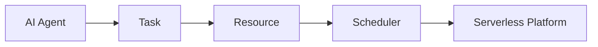
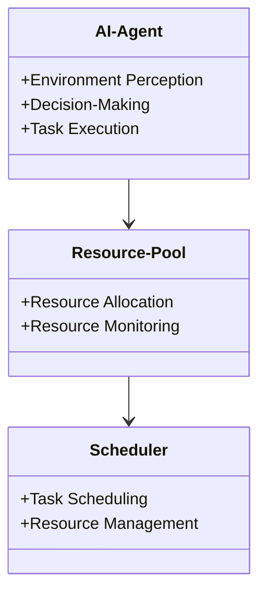

                 


# 企业AI Agent的serverless计算资源调度

> 关键词：企业AI Agent, serverless计算, 资源调度, 调度算法, 计算资源优化

> 摘要：本文探讨了在企业环境中AI Agent的serverless计算资源调度问题，分析了AI Agent的核心任务与serverless计算的特点，提出了资源调度的数学建模与算法实现，结合实际案例展示了资源调度的具体应用。

---

## 第1章: 企业AI Agent与serverless计算资源调度概述

### 1.1 问题背景与目标

#### 1.1.1 企业AI Agent的需求背景
企业AI Agent是一种能够理解、推理和执行任务的智能实体，旨在为企业提供自动化、智能化的解决方案。随着企业数字化转型的推进，AI Agent的应用场景日益广泛，如智能客服、供应链优化、数据分析等。然而，AI Agent的运行需要高效的计算资源支持，尤其是在处理复杂任务时，对计算资源的需求波动较大。

#### 1.1.2 serverless计算的优势与挑战
serverless计算是一种基于云的执行模型，允许开发者只需编写代码而无需管理底层服务器。其优势包括按需扩展、成本优化和易于部署。然而，serverless计算也面临挑战，如冷启动延迟、资源分配的不确定性以及函数执行时间限制。

#### 1.1.3 本课题的研究意义
研究企业AI Agent的serverless计算资源调度问题，旨在提高资源利用率，降低计算成本，同时确保AI Agent任务的高效执行。通过优化资源调度策略，可以更好地支持企业的智能化转型。

### 1.2 问题描述与解决思路

#### 1.2.1 AI Agent的核心任务与目标
AI Agent的任务包括信息处理、决策制定和任务执行。其目标是在动态变化的环境中，以最优的方式完成任务。

#### 1.2.2 serverless资源调度的核心问题
资源调度的核心问题是如何在serverless环境中动态分配计算资源，以满足AI Agent的任务需求，同时平衡资源利用和成本。

#### 1.2.3 资源调度问题的数学建模与解决方案
资源调度问题可以建模为一个优化问题，目标是最小化资源使用成本，同时满足任务的约束条件。通过数学建模，可以找到最优的资源分配策略。

### 1.3 核心概念与边界

#### 1.3.1 AI Agent的定义与核心要素
AI Agent是由感知层、推理层和执行层构成的智能实体，能够感知环境、推理决策并执行任务。

#### 1.3.2 serverless计算的定义与特点
serverless计算是一种基于云的执行模型，具有按需扩展、无服务器管理、成本优化等特点。

#### 1.3.3 资源调度的边界与外延
资源调度的边界包括计算资源的分配和释放，外延则涉及任务调度和资源优化。

### 1.4 概念结构与核心要素

#### 1.4.1 AI Agent与serverless的关联关系
AI Agent依赖serverless环境的资源支持，而serverless环境则通过资源调度满足AI Agent的需求。

#### 1.4.2 调度的核心要素分析
资源调度的核心要素包括任务需求、资源可用性和调度策略。

#### 1.4.3 概念结构图展示


### 1.5 本章小结
本章介绍了企业AI Agent和serverless计算的基本概念，分析了资源调度的核心问题，并提出了研究意义和目标。

---

## 第2章: 核心概念与原理分析

### 2.1 AI Agent的核心原理

#### 2.1.1 AI Agent的基本工作原理
AI Agent通过感知环境、推理决策和执行任务来实现智能化目标。

#### 2.1.2 AI Agent的决策机制
AI Agent的决策机制包括感知、推理和选择，基于环境信息做出最优决策。

#### 2.1.3 AI Agent的通信与协作
AI Agent之间可以通过消息传递实现协作，共同完成复杂任务。

### 2.2 serverless计算的核心原理

#### 2.2.1 serverless架构的特点
serverless架构具有按需扩展、无服务器管理、高可用性等特点。

#### 2.2.2 serverless资源调度的基本原理
资源调度的核心是动态分配计算资源，以满足任务需求。

#### 2.2.3 serverless计算的优缺点分析
优点包括按需扩展和成本优化，缺点包括冷启动延迟和资源限制。

### 2.3 核心概念的对比与联系

#### 2.3.1 AI Agent与传统服务的区别
AI Agent具有智能化和自适应能力，而传统服务则不具备这些特点。

#### 2.3.2 serverless计算与传统计算模式的对比
serverless计算按需扩展，而传统计算模式需要预先分配资源。

#### 2.3.3 概念对比表格
| 特性                | AI Agent                  | serverless计算             |
|---------------------|---------------------------|-----------------------------|
| 核心能力            | 智能化决策                | 按需资源分配               |
| 优势                | 高效决策                  | 成本优化                   |
| 动态性              | 强调自适应                | 强调弹性扩展               |

### 2.4 实体关系与架构图

#### 2.4.1 ER实体关系图展示
```mermaid
er
    actor(AI Agent)
    actor --> database(Resource Pool)
    actor --> function(Function)
```

#### 2.4.2 调度流程的Mermaid流程图


### 2.5 本章小结
本章分析了AI Agent和serverless计算的核心原理，对比了它们的优缺点，并通过图表展示了实体关系和调度流程。

---

## 第3章: 资源调度算法原理与数学模型

### 3.1 调度问题的数学建模

#### 3.1.1 问题的抽象与建模
资源调度问题可以抽象为一个优化问题，目标是最小化资源使用成本，同时满足任务的约束条件。

#### 3.1.2 目标函数的定义
$$\text{min} \sum_{i=1}^{n} c_i x_i$$
其中，$c_i$是资源$i$的成本，$x_i$是分配的资源数量。

#### 3.1.3 约束条件的分析
$$\sum_{i=1}^{n} a_i x_i \geq d$$
其中，$a_i$是资源$i$的可用性，$d$是任务的需求。

### 3.2 调度算法的原理与流程

#### 3.2.1 算法的基本思路
1. 评估任务需求
2. 分配计算资源
3. 调整资源分配
4. 监控资源使用

#### 3.2.2 算法的优化策略
优先分配高价值任务，动态调整资源分配，基于反馈优化调度策略。

#### 3.2.3 算法的实现步骤
1. 初始化资源池
2. 接收任务请求
3. 分配计算资源
4. 调整资源分配
5. 监控资源使用

### 3.3 调度算法的Mermaid流程图


### 3.4 本章小结
本章提出了资源调度的数学建模方法，分析了调度算法的原理和优化策略，并通过流程图展示了算法的实现步骤。

---

## 第4章: 系统分析与架构设计

### 4.1 问题场景介绍

#### 4.1.1 项目介绍
本项目旨在设计一个企业AI Agent的serverless计算资源调度系统，实现资源的动态分配和优化。

#### 4.1.2 系统功能设计
系统功能包括资源池管理、任务调度、资源监控和反馈优化。

#### 4.1.3 领域模型类图


### 4.2 系统架构设计

#### 4.2.1 系统架构图


#### 4.2.2 接口设计
系统接口包括任务请求接口、资源分配接口和反馈优化接口。

#### 4.2.3 交互流程图


### 4.3 本章小结
本章设计了系统的功能模块和架构，展示了系统的交互流程。

---

## 第5章: 项目实战

### 5.1 环境安装

#### 5.1.1 安装Python
安装Python 3.8及以上版本，确保支持serverless计算的库。

#### 5.1.2 安装serverless框架
安装AWS Lambda或其他serverless框架，配置环境。

### 5.2 系统核心实现

#### 5.2.1 调度算法的实现
实现资源分配算法，动态分配计算资源。

#### 5.2.2 资源监控的实现
监控资源使用情况，调整资源分配。

### 5.3 代码实现与解读

#### 5.3.1 调度算法代码
```python
def allocate_resources(task_demand):
    resources = []
    for task in task_demand:
        resource = select_optimal_resource(task)
        resources.append(resource)
    return resources
```

#### 5.3.2 资源监控代码
```python
def monitor_resources(resources):
    for resource in resources:
        check_usage(resource)
        adjust_allocation(resource)
```

### 5.4 案例分析与详细讲解

#### 5.4.1 案例分析
分析一个具体案例，如图像识别任务的资源调度。

#### 5.4.2 代码应用解读
解读代码实现，说明如何实现资源调度。

### 5.5 本章小结
本章通过具体案例展示了资源调度的实现过程，提供了代码示例和解读。

---

## 第6章: 最佳实践、小结与展望

### 6.1 最佳实践 tips
- 定期监控资源使用情况
- 优化调度算法
- 提高AI Agent的智能化水平

### 6.2 本章小结
总结了本文的核心内容，强调了资源调度的重要性和优化策略。

### 6.3 注意事项
- 资源调度的复杂性
- 调度算法的局限性
- 系统维护的重要性

### 6.4 拓展阅读
推荐相关领域的书籍和论文，供读者进一步学习。

---

## 作者：AI天才研究院/AI Genius Institute & 禅与计算机程序设计艺术 /Zen And The Art of Computer Programming

