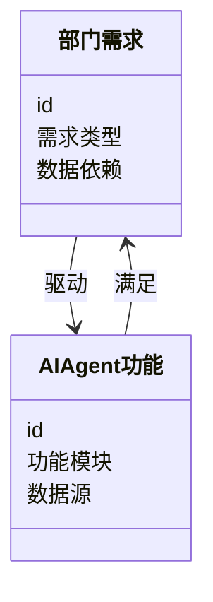
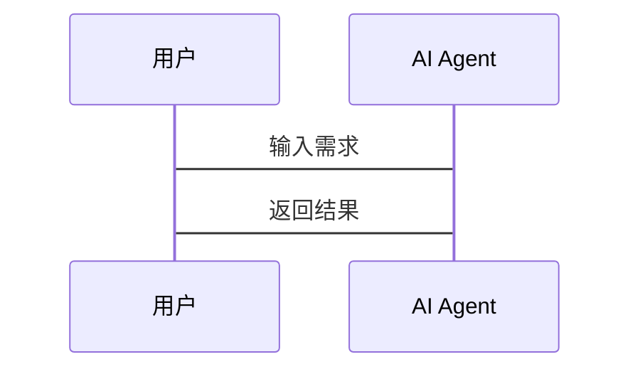

                 


# 企业AI Agent的个性化定制：适应不同部门需求

**关键词：** AI Agent, 个性化定制, 企业部门需求, 自然语言处理, 强化学习, 知识图谱, 系统架构

**摘要：**  
本文深入探讨了企业AI Agent的个性化定制方法，分析了不同部门的需求特点，并结合实际案例，详细讲解了AI Agent的核心算法、系统架构设计及项目实战。文章从背景介绍、核心概念、算法原理到系统架构、项目实现，层层递进，为企业技术人员提供了一套完整的个性化定制解决方案。

---

# 第1章: 企业AI Agent概述

## 1.1 AI Agent的基本概念
### 1.1.1 AI Agent的定义与特点
AI Agent（人工智能代理）是一种能够感知环境并采取行动以实现特定目标的智能实体。其核心特点包括自主性、反应性、目标导向和学习能力。AI Agent能够通过与用户交互或从数据中学习，动态调整行为以适应不同场景需求。

### 1.1.2 企业级AI Agent的核心功能
企业级AI Agent通常具备以下核心功能：
1. **自然语言处理（NLP）**：支持多轮对话，理解用户意图。
2. **决策与推理**：基于上下文和历史数据，做出最优决策。
3. **知识库集成**：整合企业知识库，提供准确的信息检索。
4. **自适应学习**：通过反馈机制优化自身性能。

### 1.1.3 AI Agent与传统自动化工具的区别
AI Agent的核心区别在于其具备智能性和自适应性。传统自动化工具基于预设规则执行任务，而AI Agent能够理解上下文、学习新知识并动态调整行为。

## 1.2 个性化定制的必要性
### 1.2.1 企业部门需求的多样性
不同部门在功能需求、数据处理方式和使用场景上存在显著差异。例如：
- **销售部门**：需要实时客户信息查询和销售预测。
- **技术部门**：需要代码审查和错误诊断。
- **客服部门**：需要快速响应用户问题并提供解决方案。

### 1.2.2 AI Agent通用性与个性化定制的矛盾
尽管通用AI Agent能够满足大部分需求，但在特定场景下，其效果可能不如定制化解决方案。个性化定制能够显著提升效率和用户体验。

### 1.2.3 个性化定制对企业效率的提升作用
个性化定制使AI Agent能够更好地适应特定部门的工作流程，减少误操作，提高任务处理速度和准确性。

## 1.3 企业部门需求分析
### 1.3.1 销售部门的典型需求
销售部门需要AI Agent能够：
- 提供客户信息查询。
- 自动生成销售建议。
- 分析销售数据并生成报告。

### 1.3.2 技术部门的特殊需求
技术部门需要AI Agent能够：
- 进行代码审查。
- 自动检测潜在错误。
- 提供技术文档搜索功能。

### 1.3.3 客服部门的关键需求
客服部门需要AI Agent能够：
- 快速响应用户问题。
- 提供解决方案建议。
- 自动生成常见问题解答（FAQ）。

### 1.3.4 其他部门的个性化需求
其他部门如财务、人力资源等也有各自的个性化需求，例如：
- 财务部门：自动处理财务报表和预算分析。
- 人力资源部门：自动化招聘流程和员工绩效评估。

## 1.4 本章小结
企业部门的需求多样化，AI Agent的个性化定制是实现高效能的关键。通过分析不同部门的特点，可以为每个部门量身定制专属的AI Agent解决方案，从而提升整体企业效率。

---

# 第2章: AI Agent的核心概念原理

## 2.1 AI Agent的工作原理
### 2.1.1 自然语言处理（NLP）在AI Agent中的应用
NLP技术使AI Agent能够理解用户输入的自然语言，并生成符合语境的回复。例如：
- 使用词嵌入模型（如Word2Vec）进行语义分析。
- 通过Transformer模型（如BERT）进行文本生成。

### 2.1.2 强化学习在AI Agent决策中的作用
强化学习通过奖励机制优化AI Agent的决策过程。例如：
- 在游戏AI中，通过不断试错找到最优策略。
- 在推荐系统中，根据用户反馈调整推荐策略。

### 2.1.3 知识图谱构建与AI Agent的理解能力
知识图谱帮助AI Agent构建领域知识库，使其能够理解复杂关系和上下文。例如：
- 使用知识图谱进行实体识别和关系推理。

## 2.2 核心概念属性特征对比
### 2.2.1 不同部门需求的特征对比表格
以下是不同部门需求的特征对比：

| 部门         | 需求类型   | 数据依赖性 | 响应时间 |
|--------------|------------|------------|----------|
| 销售部门     | 查询与建议 | 客户数据   | 实时     |
| 技术部门     | 代码审查   | 代码库     | 实时     |
| 客服部门     | 问题解答   | 用户反馈   | 实时     |

### 2.2.2 AI Agent功能模块的属性特征分析
AI Agent的功能模块包括：
- **自然语言处理模块**：负责理解和生成文本。
- **决策模块**：基于输入做出决策。
- **知识库模块**：存储和检索知识。

### 2.2.3 部门需求与AI Agent功能的匹配度分析
通过分析部门需求与AI Agent功能的匹配度，可以确定定制的方向和重点。例如：
- 销售部门需要AI Agent具备强大的数据检索和分析能力。
- 技术部门需要AI Agent具备代码理解和生成能力。

## 2.3 ER实体关系图架构
### 2.3.1 实体关系图的构建过程
通过构建实体关系图（ER图），可以清晰展示部门需求与AI Agent功能之间的关系。例如：
- 用户需求与AI Agent功能的关系。
- 数据源与功能模块的关系。

### 2.3.2 部门需求与AI Agent功能的实体关系
以下是部门需求与AI Agent功能的实体关系示意图：

```mermaid
er
  actor: 部门需求
  agent: AI Agent功能
  actor -[通过输入驱动]-> agent
  agent -[通过输出满足]-> actor
```

### 2.3.3 实体关系图在系统设计中的应用
实体关系图帮助我们在系统设计阶段明确各模块之间的关系，为后续的系统架构设计提供基础。

---

# 第3章: AI Agent的核心算法

## 3.1 自然语言处理算法
### 3.1.1 词嵌入模型（如Word2Vec）
词嵌入模型通过将单词映射到高维向量空间，捕捉单词的语义信息。

```mermaid
graph LR
    A[输入文本] -> B[词嵌入] -> C[上下文表示]
```

### 3.1.2 Transformer模型（如BERT）
Transformer模型通过自注意力机制，捕捉文本中的长距离依赖关系。

```python
import tensorflow as tf
from tensorflow.keras.layers import Dense, InputLayer

# 定义模型
model = tf.keras.Sequential([
    InputLayer(input_shape=(max_length,)),
    Dense(128, activation='relu'),
    Dense(num_classes, activation='softmax')
])
```

### 3.1.3 文本生成算法（如GPT）
GPT模型通过生成对抗训练，生成与上下文相符的文本。

## 3.2 强化学习算法
### 3.2.1 Q-Learning算法
Q-Learning算法通过状态-动作-奖励的循环，优化决策策略。

```mermaid
graph LR
    S[状态] -> A[动作] -> R[奖励] -> S'[下一个状态]
```

### 3.2.2 DQN算法
DQN（Deep Q-Network）算法通过深度神经网络近似Q值函数，实现端到端的强化学习。

---

# 第4章: 系统分析与架构设计方案

## 4.1 问题场景介绍
我们需要设计一个支持多部门个性化需求的AI Agent系统。

## 4.2 项目介绍
本项目旨在为不同部门定制专属的AI Agent，提升企业效率。

## 4.3 系统功能设计
### 4.3.1 领域模型设计
以下是领域模型设计的类图：



## 4.4 系统架构设计
以下是系统架构设计的架构图：


## 4.5 系统接口设计
### 4.5.1 接口定义
- **输入接口**：接收用户输入。
- **输出接口**：返回处理结果。

### 4.5.2 接口交互
以下是接口交互的序列图：



---

# 第5章: 项目实战

## 5.1 环境安装
安装必要的依赖：
```bash
pip install numpy
pip install tensorflow
pip install mermaid
```

## 5.2 系统核心实现
### 5.2.1 核心代码实现
以下是自然语言处理模块的实现：

```python
import numpy as np
import tensorflow as tf

# 定义模型
model = tf.keras.Sequential([
    tf.keras.layers.Embedding(input_dim=1000, output_dim=50),
    tf.keras.layers.LSTM(64, return_sequences=True),
    tf.keras.layers.Dense(10, activation='softmax')
])

# 编译模型
model.compile(optimizer='adam', loss='sparse_categorical_crossentropy', metrics=['accuracy'])
```

### 5.2.2 代码解读与分析
模型通过词嵌入层、LSTM层和全连接层，实现文本分类任务。

## 5.3 项目小结
通过项目实战，我们掌握了AI Agent的核心实现方法，为后续的个性化定制奠定了基础。

---

# 第6章: 最佳实践与注意事项

## 6.1 最佳实践
### 6.1.1 数据隐私保护
确保数据处理符合隐私保护法规。

### 6.1.2 模型调优
通过交叉验证和超参数优化，提升模型性能。

## 6.2 注意事项
- **数据质量**：确保数据准确性和完整性。
- **模型可解释性**：提高模型的透明度，便于调试和优化。

---

# 作者：AI天才研究院 & 禅与计算机程序设计艺术

---

通过以上内容，我们系统地介绍了企业AI Agent的个性化定制方法，从理论到实践，为企业技术人员提供了一套完整的解决方案。

