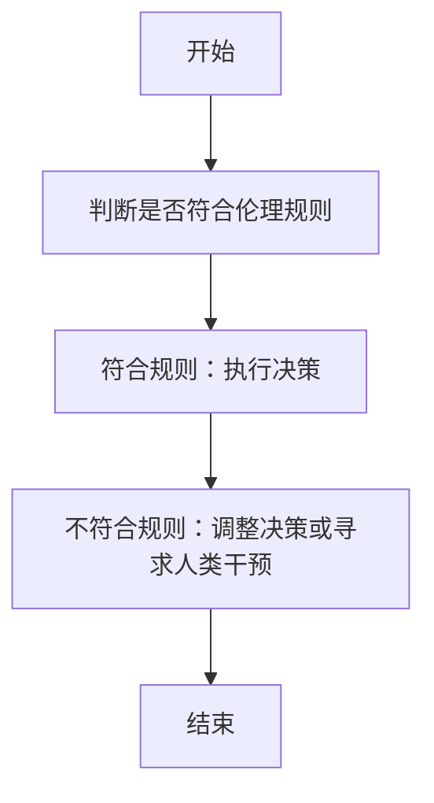
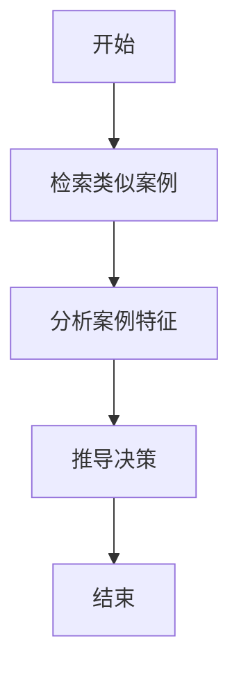
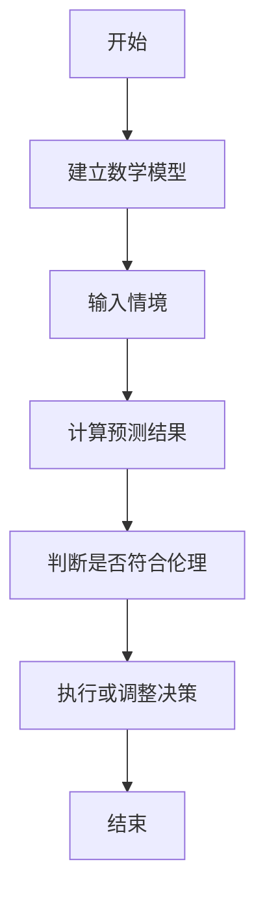
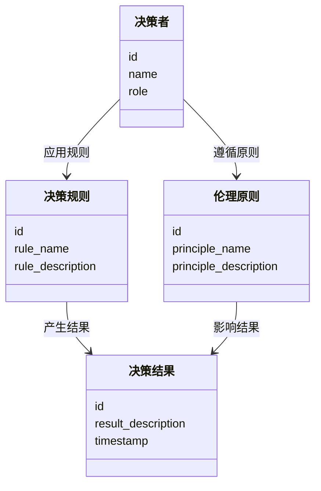
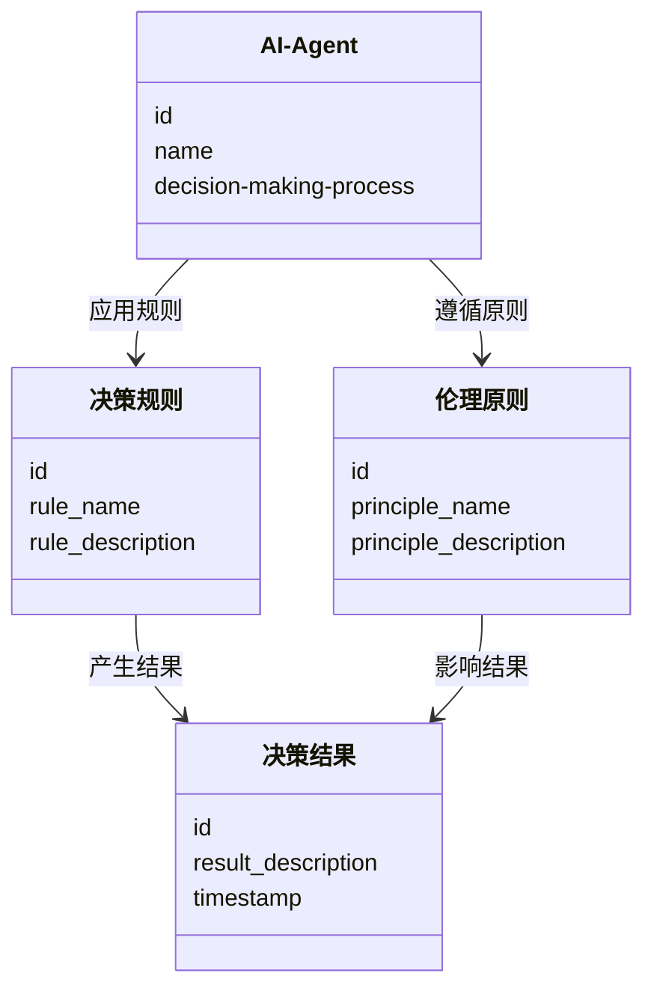
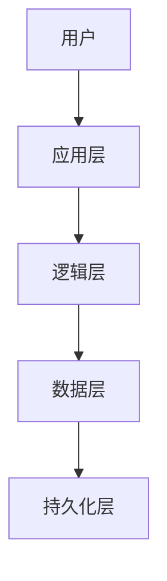
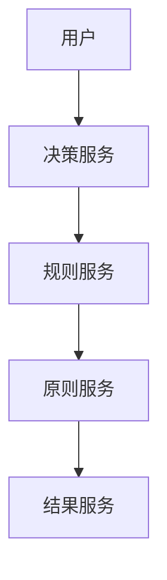

                 


# 企业AI Agent的伦理决策框架

## 关键词：企业AI Agent，伦理决策框架，AI伦理，决策系统，系统架构，技术实现，最佳实践

## 摘要：  
随着人工智能技术的快速发展，企业AI Agent（智能体）在各个领域的应用日益广泛。然而，AI Agent的决策过程可能涉及到复杂的伦理问题，如何构建一个符合伦理规范的决策框架成为企业面临的重要挑战。本文将从企业AI Agent的背景介绍、伦理决策框架的核心概念、算法原理、系统架构设计、项目实战以及最佳实践等方面展开详细探讨，为企业在AI Agent的伦理决策框架设计与实现中提供理论支持和实践指导。

---

## 第一章: 企业AI Agent与伦理决策框架的背景介绍

### 1.1 企业AI Agent的基本概念

#### 1.1.1 AI Agent的定义与特征
AI Agent（智能体）是指能够感知环境并采取行动以实现目标的智能系统。企业AI Agent是专门为企业应用场景设计的智能体，其核心特征包括：
- **自主性**：能够在没有外部干预的情况下独立运行。
- **反应性**：能够实时感知环境并做出响应。
- **目标导向性**：通过实现目标来优化决策。
- **可解释性**：决策过程需要能够被人类理解和解释。

#### 1.1.2 企业AI Agent的应用场景
企业AI Agent广泛应用于多个领域，例如：
- **企业资源管理**：优化供应链、库存管理和财务决策。
- **客户服务**：提供智能客服、个性化推荐和用户支持。
- **风险管理**：识别和规避潜在的商业风险。
- **决策支持**：辅助高层管理者制定战略决策。

#### 1.1.3 伦理决策框架的必要性
在企业AI Agent的应用中，决策可能对人类、社会或环境产生重大影响。例如，在自动驾驶汽车中，AI Agent需要在紧急情况下做出伦理决策（如自动驾驶汽车面临的“电车难题”）。因此，构建一个符合伦理规范的决策框架至关重要，以确保AI Agent的决策既合理又符合道德标准。

### 1.2 伦理决策框架的核心要素

#### 1.2.1 伦理决策的定义与属性
伦理决策是指在决策过程中考虑伦理原则和道德规范的过程。其核心属性包括：
- **可解释性**：决策过程必须能够被人类理解。
- **透明性**：决策的依据和过程必须清晰明了。
- **一致性**：在类似的情境下，决策应当保持一致。
- **可调整性**：在发现决策违反伦理规范时，能够及时调整。

#### 1.2.2 企业AI Agent决策的边界与外延
企业AI Agent的决策边界是指其决策权限和范围。例如，在供应链管理中，AI Agent可能仅限于优化库存和物流决策，而不能超越其权限做出其他重大决策。决策的外延则涉及决策对相关利益方的影响范围，例如对客户、员工、供应商等的影响。

#### 1.2.3 伦理决策框架的结构与组成
伦理决策框架通常包括以下几个部分：
- **伦理原则**：如公正、尊重、不伤害等。
- **决策规则**：用于指导AI Agent在特定情境下的决策。
- **评估机制**：用于评估决策的伦理合规性。
- **反馈机制**：用于根据反馈优化决策框架。

---

## 第二章: 企业AI Agent的伦理决策框架核心概念

### 2.1 AI Agent的决策机制

#### 2.1.1 基于规则的决策系统
基于规则的决策系统通过预定义的规则来指导决策。例如，在企业采购中，AI Agent可以根据预设的规则（如供应商信用评分、价格阈值等）做出采购决策。

#### 2.1.2 基于案例的推理系统
基于案例的推理系统通过分析历史案例来指导当前决策。例如，在医疗诊断中，AI Agent可以根据类似病例的治疗方案和结果，推导出当前患者的最佳治疗方案。

#### 2.1.3 基于模型的推理系统
基于模型的推理系统通过建立数学模型来模拟问题，并根据模型预测结果做出决策。例如，在金融投资中，AI Agent可以根据市场趋势模型预测股票价格走势。

### 2.2 伦理决策框架的原理与特征

#### 2.2.1 伦理决策的原理分析
伦理决策的核心原理是将伦理原则转化为可执行的决策规则，并通过这些规则指导AI Agent的决策过程。例如，可以将“不伤害他人”的伦理原则转化为具体的决策规则，如“避免采取可能对客户造成重大损失的行动”。

#### 2.2.2 伦理决策框架的特征对比
| 特征 | 基于规则的伦理决策 | 基于案例的伦理决策 | 基于模型的伦理决策 |
|------|---------------------|--------------------|---------------------|
| 优点 | 决策过程简单、可解释性高 | 能够处理复杂情境，具有灵活性 | 能够预测未来趋势，决策精度高 |
| 缺点 | 需要频繁更新规则 | 可能受到历史案例的限制 | 需要复杂的建模过程 |

#### 2.2.3 伦理决策框架的ER实体关系图

```mermaid
er
    %% 伦理决策框架的ER实体关系图
    entity(决策者) {
        id
        name
        role
    }
    entity(决策规则) {
        id
        rule_name
        rule_description
    }
    entity(伦理原则) {
        id
        principle_name
        principle_description
    }
    entity(决策结果) {
        id
        result_description
        timestamp
    }
    decision-maker --> decision-rule: 应用规则
    decision-maker --> ethical-principle: 遵循原则
    decision-rule --> decision-result: 产生结果
    ethical-principle --> decision-result: 影响结果
```

---

## 第三章: 企业AI Agent伦理决策框架的算法原理

### 3.1 伦理决策算法概述

#### 3.1.1 伦理决策算法的分类
- **基于规则的伦理决策算法**：通过预定义的伦理规则进行决策。
- **基于案例的伦理决策算法**：通过历史案例推导决策。
- **基于模型的伦理决策算法**：通过数学模型预测决策结果。

#### 3.1.2 伦理决策算法的优缺点
| 算法类型 | 优点 | 缺点 |
|----------|------|------|
| 基于规则 | 易实现、可解释性高 | 需要频繁更新规则 |
| 基于案例 | 处理复杂情境、灵活性高 | 受历史案例限制 |
| 基于模型 | 预测精度高 | 建模复杂、计算成本高 |

#### 3.1.3 伦理决策算法的数学模型
例如，基于条件概率的伦理决策模型可以表示为：
$$ P(决策 | 情境) = \frac{P(情境 | 决策) \cdot P(决策)}{P(情境)} $$

### 3.2 伦理决策算法的详细讲解

#### 3.2.1 基于规则的伦理决策算法


```python
def ethical_decision_rule_based(c情境):
    if 符合伦理规则:
        return "执行决策"
    else:
        return "调整决策或寻求人类干预"
```

#### 3.2.2 基于案例的伦理决策算法


```python
def ethical_decision_case_based(情境):
    类似案例 = 检索历史案例中与情境相似的案例
    决策 = 基于类似案例推导出的决策
    return 决策
```

#### 3.2.3 基于模型的伦理决策算法


```python
def ethical_decision_model_based(情境):
    预测结果 = 计算模型预测结果
    如果预测结果符合伦理规范:
        return "执行决策"
    else:
        return "调整决策或寻求人类干预"
```

---

## 第四章: 企业AI Agent伦理决策框架的系统分析与架构设计

### 4.1 企业AI Agent系统的功能设计

#### 4.1.1 系统功能模块划分
- **输入模块**：接收决策情境和相关数据。
- **决策模块**：根据伦理决策框架做出决策。
- **输出模块**：输出决策结果。
- **反馈模块**：收集反馈并优化决策框架。

#### 4.1.2 系统功能的领域模型



#### 4.1.3 系统功能的类图设计


### 4.2 企业AI Agent系统的架构设计

#### 4.2.1 系统架构的分层设计


#### 4.2.2 系统架构的微服务架构



---

## 第五章: 企业AI Agent伦理决策框架的项目实战

### 5.1 项目背景与目标
以医疗诊断中的伦理决策为例，AI Agent需要在诊断过程中考虑患者的利益和医生的职业道德。

### 5.2 环境安装与配置
- **工具安装**：安装Python、TensorFlow、Scikit-learn等工具。
- **数据准备**：收集医疗诊断相关数据，包括患者症状、诊断结果等。

### 5.3 核心代码实现

```python
def ethical_decision_framework(情境):
    # 应用决策规则
    规则结果 = apply_rules(情境)
    # 应用伦理原则
    原则结果 = apply_principles(情境)
    # 综合判断
    如果 规则结果和原则结果一致:
        return "执行决策"
    else:
        return "调整决策或寻求人类干预"
```

### 5.4 代码解读与分析
- `apply_rules`函数：根据预定义的决策规则判断决策是否符合伦理要求。
- `apply_principles`函数：根据伦理原则分析决策的伦理合规性。
- 综合判断：比较规则结果和原则结果，决定是否执行决策或进行调整。

### 5.5 实际案例分析
以医疗诊断为例，假设患者症状符合某种疾病的特征，AI Agent需要根据预设的伦理规则和伦理原则，判断是否推荐某项诊断方案。

### 5.6 项目总结与反思
通过该项目，我们可以看到伦理决策框架在实际应用中的重要性，同时也需要不断优化决策规则和伦理原则，以应对复杂的现实情况。

---

## 第六章: 企业AI Agent伦理决策框架的最佳实践

### 6.1 小结
- 企业AI Agent的伦理决策框架是实现智能决策的重要保障。
- 需要结合具体的业务场景，选择合适的决策算法和伦理框架。

### 6.2 注意事项
- **可解释性**：确保决策过程可被理解和追溯。
- **透明性**：决策依据和过程需要公开透明。
- **可调整性**：在发现决策违反伦理规范时，能够及时调整。

### 6.3 拓展阅读
- 推荐阅读《AI伦理学》（Ethics of AI）等书籍，深入了解AI伦理的核心原则。
- 关注最新的AI伦理研究成果，保持对伦理决策框架的更新与优化。

---

## 作者：AI天才研究院/AI Genius Institute & 禅与计算机程序设计艺术 /Zen And The Art of Computer Programming

---

以上是《企业AI Agent的伦理决策框架》的完整目录大纲和文章内容。文章从背景介绍、核心概念、算法原理、系统架构设计、项目实战到最佳实践，全面而深入地探讨了企业AI Agent的伦理决策框架，为企业在AI技术的应用中提供了重要的理论支持和实践指导。

