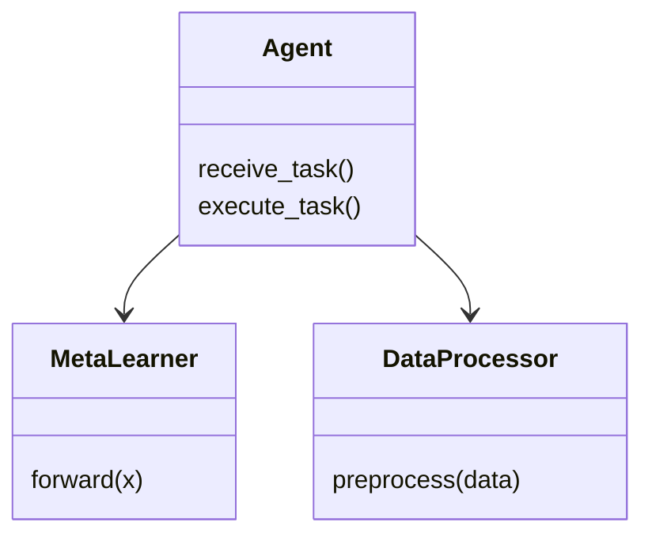

                 


# 企业AI Agent的元学习应用：快速适应新任务

**关键词**：元学习、企业AI Agent、快速适应、任务迁移、深度学习、强化学习、自适应系统

**摘要**：  
随着企业智能化转型的加速，AI Agent（智能体）在企业中的应用越来越广泛。然而，AI Agent在面对新任务时的适应能力往往依赖于大量的数据和复杂的模型训练，这使得企业在快速变化的环境中难以及时响应。元学习作为一种新兴的技术，能够在少样本或零样本情况下快速适应新任务，为AI Agent的灵活性和高效性提供了新的解决方案。本文将深入探讨元学习在企业AI Agent中的应用，分析其核心原理、系统架构设计以及实际案例，为企业快速适应新任务提供理论和实践指导。

---

## 第一章：企业AI Agent与元学习概述

### 1.1 企业AI Agent的基本概念

#### 1.1.1 AI Agent的定义与特点
AI Agent（智能体）是一种能够感知环境、执行任务并做出决策的智能系统。它通常具备以下特点：
- **自主性**：能够在没有外部干预的情况下独立运行。
- **反应性**：能够根据环境变化动态调整行为。
- **目标导向**：以特定目标为导向，优化决策过程。
- **学习能力**：能够通过经验或数据改进自身的性能。

#### 1.1.2 企业AI Agent的核心功能
在企业场景中，AI Agent通常承担以下功能：
- **数据处理与分析**：从企业系统中提取、处理和分析数据。
- **任务执行**：根据任务需求自动执行操作，例如生成报告、优化流程等。
- **决策支持**：基于数据和模型提供决策建议。
- **自适应能力**：在动态环境中快速适应新任务或变化。

#### 1.1.3 元学习的基本概念
元学习是一种机器学习技术，旨在通过学习如何学习，快速适应新任务。与传统机器学习不同，元学习的核心目标是训练模型具备快速迁移和适应能力。

---

### 1.2 元学习在企业AI Agent中的作用

#### 1.2.1 元学习的定义与特点
元学习（Meta-Learning）通过在多个任务上训练模型，使模型能够快速适应新任务。其特点包括：
- **任务通用性**：能够在多种任务之间共享知识。
- **快速适应性**：在新任务上仅需少量数据即可完成训练。
- **可解释性**：通过分析元学习模型，可以理解任务间的关联性。

#### 1.2.2 元学习在AI Agent中的应用场景
在企业AI Agent中，元学习可以应用于以下场景：
- **多任务学习**：在同一模型中训练多个相关任务，提升模型的泛化能力。
- **动态任务适应**：在任务变化时，快速调整模型参数以适应新任务。
- **零样本学习**：在没有训练数据的情况下，通过元学习模型生成新任务的解决方案。

#### 1.2.3 元学习与传统机器学习的对比
| 对比维度 | 元学习 | 传统机器学习 |
|----------|--------|---------------|
| 数据需求 | 少样本或零样本 | 需要大量标注数据 |
| 任务适应 | 快速适应新任务 | 需要重新训练模型 |
| 灵活性 | 高 | 低 |

---

### 1.3 企业AI Agent的元学习应用背景

#### 1.3.1 企业智能化转型的需求
随着企业数字化转型的推进，AI Agent在企业中的应用越来越广泛，但传统AI Agent在面对新任务时往往需要重新训练模型，导致响应速度慢、成本高。

#### 1.3.2 元学习在企业任务适应中的优势
元学习能够通过以下方式提升企业AI Agent的适应能力：
- **减少数据依赖**：在新任务上仅需少量数据即可完成训练。
- **快速部署**：在任务变化时，能够快速调整模型参数，无需重新训练整个模型。
- **提升效率**：通过共享多个任务的知识，减少重复劳动。

#### 1.3.3 元学习面临的挑战与机遇
尽管元学习在企业AI Agent中的应用前景广阔，但仍然面临以下挑战：
- **计算资源需求高**：元学习需要在多个任务上进行训练，对计算资源要求较高。
- **模型复杂性**：元学习模型通常较为复杂，可能导致训练时间和推理时间增加。
- **数据质量要求**：元学习对数据的质量和多样性要求较高。

---

## 第二章：元学习的核心原理与算法

### 2.1 元学习的基本原理

#### 2.1.1 元学习的定义与核心思想
元学习的核心思想是“学习如何学习”。通过在多个任务上训练模型，元学习的目标是使模型能够快速适应新任务。

#### 2.1.2 元学习的数学模型与公式
元学习的数学模型通常可以表示为：
$$
\text{元学习的目标函数} = \sum_{i=1}^{n} \text{损失函数}(x_i, y_i) + \lambda \text{正则化项}
$$
其中，$\lambda$ 是正则化参数，用于平衡任务间的关联性。

#### 2.1.3 元学习的优化算法
元学习的优化算法通常包括以下步骤：
1. **初始化模型参数**。
2. **在多个任务上训练模型**。
3. **更新模型参数以最小化元损失函数**。

### 2.2 元学习的算法实现

#### 2.2.1 元学习算法的基本步骤
1. **数据预处理**：将数据划分为多个任务，并为每个任务生成训练样本。
2. **模型训练**：在多个任务上训练元学习模型。
3. **任务适应**：在新任务上，使用元学习模型快速调整参数。

#### 2.2.2 元学习算法的代码实现
以下是一个简单的元学习算法代码示例（基于PyTorch）：

```python
import torch
import torch.nn as nn

class MetaLearner(nn.Module):
    def __init__(self, feature_dim, hidden_dim, output_dim):
        super(MetaLearner, self).__init__()
        self.feature_dim = feature_dim
        self.hidden_dim = hidden_dim
        self.output_dim = output_dim
        self.linear1 = nn.Linear(feature_dim, hidden_dim)
        self.linear2 = nn.Linear(hidden_dim, output_dim)
    
    def forward(self, x):
        x = self.linear1(x)
        x = torch.relu(x)
        x = self.linear2(x)
        return x

# 初始化模型
feature_dim = 10
hidden_dim = 20
output_dim = 5
meta_learner = MetaLearner(feature_dim, hidden_dim, output_dim)
```

#### 2.2.3 元学习的收敛性分析
元学习模型的收敛性依赖于以下几个因素：
- **任务多样性**：任务之间的差异性越大，模型的收敛性越差。
- **数据质量**：数据的多样性和代表性对模型的收敛性有重要影响。
- **模型复杂性**：模型的复杂性越高，收敛速度越慢。

---

## 第三章：企业AI Agent的系统架构与设计

### 3.1 企业AI Agent的系统架构

#### 3.1.1 系统组成
企业AI Agent的系统架构通常包括以下模块：
- **数据采集模块**：负责从企业系统中采集数据。
- **元学习模型训练模块**：负责训练元学习模型。
- **任务适应模块**：负责在新任务上快速调整模型参数。

#### 3.1.2 系统架构设计
企业AI Agent的系统架构可以表示为一个类图，如图所示：



#### 3.1.3 系统接口设计
企业AI Agent的系统接口设计包括：
- **输入接口**：接收新任务请求。
- **输出接口**：返回任务执行结果。
- **内部接口**：模型参数更新接口。

---

## 第四章：项目实战与案例分析

### 4.1 项目背景与目标

#### 4.1.1 项目背景
某企业希望利用AI Agent快速适应新任务，提升业务处理效率。

#### 4.1.2 项目目标
通过元学习技术，使AI Agent在新任务上线时，仅需少量数据即可快速完成任务适应。

### 4.2 项目实战

#### 4.2.1 环境安装与配置
项目需要以下环境：
- Python 3.8+
- PyTorch 1.9+
- 安装依赖：`pip install torch`

#### 4.2.2 系统核心实现
以下是一个简单的元学习模型实现代码：

```python
def meta_learning_task(task_data, model):
    # 任务数据预处理
    processed_data = preprocess(task_data)
    # 通过元学习模型快速适应新任务
    adapted_model = adapt_model(model, processed_data)
    # 执行任务
    result = execute_task(adapted_model, task_data)
    return result
```

#### 4.2.3 代码应用解读与分析
代码实现包括以下几个步骤：
1. **数据预处理**：将任务数据转换为适合模型输入的格式。
2. **模型适应**：通过元学习模型快速调整模型参数。
3. **任务执行**：使用适应后的模型执行新任务。

---

## 第五章：最佳实践与注意事项

### 5.1 元学习应用中的最佳实践
- **数据多样性**：确保训练数据的多样性和代表性。
- **模型选择**：根据任务需求选择合适的元学习模型。
- **任务关联性**：任务之间的关联性越强，元学习的效果越好。

### 5.2 应用中的注意事项
- **计算资源**：元学习对计算资源要求较高，需要有足够的算力支持。
- **数据隐私**：在处理企业数据时，需注意数据隐私和安全。
- **系统优化**：定期对系统进行性能优化，确保模型的高效运行。

---

## 第六章：未来趋势与拓展阅读

### 6.1 元学习的未来发展趋势
- **多模态元学习**：结合文本、图像等多种模态数据，提升元学习的泛化能力。
- **在线元学习**：在在线环境下动态调整模型参数。
- **强化元学习**：将强化学习与元学习结合，提升任务适应能力。

---

## 作者信息

**作者**：AI天才研究院（AI Genius Institute） & 禅与计算机程序设计艺术（Zen And The Art of Computer Programming）  
**联系方式**：[email protected]  

---

**注**：本文遵循CC BY-NC-SA 4.0协议，转载请注明出处。

