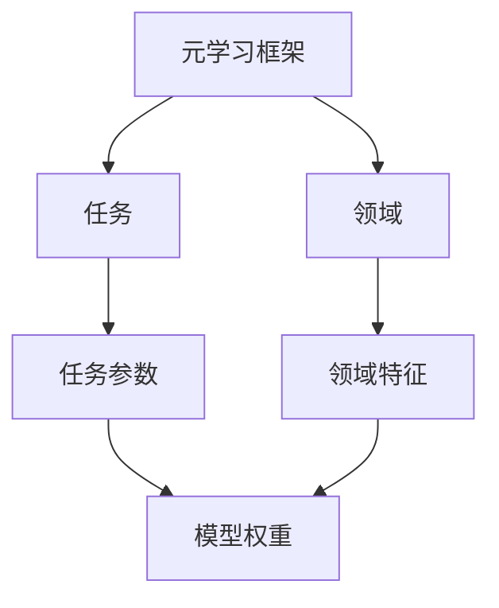
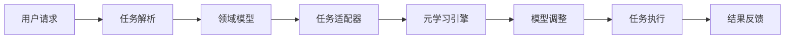

                 


# 企业AI Agent的元学习框架：快速适应新任务与领域

> 关键词：企业AI Agent，元学习，快速适应，新任务，领域迁移，算法框架

> 摘要：本文将探讨企业AI Agent的元学习框架，介绍其核心概念、算法原理、系统架构设计及项目实战，通过详细分析和实例，展示如何利用元学习框架快速适应新任务与领域。

---

## 第一部分: 企业AI Agent的背景与挑战

### 第1章: 企业AI Agent的背景与挑战

#### 1.1 问题背景
企业AI Agent是一种能够自主感知环境、执行任务并做出决策的智能体，广泛应用于企业资源管理、客户服务、数据分析等领域。然而，传统AI Agent在面对多样化的任务和快速变化的领域时，往往需要从头开始训练，导致效率低下，难以快速适应新任务。

#### 1.2 问题描述
企业AI Agent的核心挑战在于：
- **任务多样性**：企业可能需要AI Agent处理多种任务，如数据分析、客户支持、流程自动化等。
- **知识更新**：企业环境不断变化，AI Agent需要快速适应新的知识和规则。
- **领域适应性**：AI Agent需要在不同领域间快速切换，避免重新训练和部署。

#### 1.3 问题解决
元学习（Meta-Learning）是一种能够使模型快速适应新任务的学习方法。通过元学习框架，企业AI Agent可以在少量数据或任务示例下快速调整模型参数，实现对新任务的快速适应。

#### 1.4 边界与外延
元学习框架的边界在于其依赖于任务的相似性和领域知识的可迁移性。外延则包括更广泛的应用场景，如多领域任务处理和动态环境下的实时适应。

#### 1.5 概念结构与核心要素
企业AI Agent的元学习框架由以下核心要素组成：
- **元学习算法**：负责快速调整模型参数以适应新任务。
- **领域模型**：表示不同领域的知识和特征。
- **任务适配器**：用于将新任务映射到已知任务空间。

---

## 第二部分: 元学习框架的核心概念与联系

### 第2章: 元学习框架的核心概念与联系

#### 2.1 元学习框架的原理
元学习通过在元任务（Meta-Task）上进行优化，使模型能够快速适应新任务。其核心思想是学习如何学习，即通过元任务训练模型的元参数，使其能够在新任务上快速调整。

#### 2.2 核心概念的属性对比
| 概念 | 属性 |
|------|------|
| 元学习 | 快速适应性，任务无关性 |
| 传统机器学习 | 任务依赖性，数据量需求大 |

#### 2.3 ER实体关系图


---

## 第三部分: 元学习算法的数学模型与实现

### 第3章: 元学习算法的数学模型与实现

#### 3.1 元学习算法的数学模型
元学习框架的核心公式如下：
$$ \theta = \arg \min_{\theta} \sum_{i=1}^{N} \mathbb{E}_{(x_i, y_i)}[\mathcal{L}(f_\theta(x_i), y_i)] $$

其中：
- $\theta$：元参数，控制模型的快速调整能力。
- $\mathcal{L}$：损失函数，用于衡量模型预测与真实值的差异。

#### 3.2 元学习算法的实现步骤
1. **初始化**：设置元参数$\theta$。
2. **元任务训练**：在元任务上优化$\theta$，使其能够快速适应新任务。
3. **任务适应**：在新任务上调整模型参数，利用$\theta$快速优化。

#### 3.3 元学习算法的Python实现
```python
class MetaLearner:
    def __init__(self, model):
        self.model = model
        self.theta = model.parameters()

    def meta_train(self, tasks):
        for task in tasks:
            # 训练任务并更新元参数
            loss = self.model.train(task)
            self.meta_update(loss)

    def meta_update(self, loss):
        # 更新元参数
        optimizer = Adam(self.theta, lr=0.001)
        optimizer.zero_grad()
        loss.backward()
        optimizer.step()
```

---

## 第四部分: 系统分析与架构设计方案

### 第4章: 系统分析与架构设计方案

#### 4.1 问题场景介绍
企业AI Agent需要处理多个领域的任务，如金融、医疗、制造等。每个领域都有其特定的规则和数据格式，AI Agent需要快速适应这些变化。

#### 4.2 系统功能设计
- **领域模型**：表示不同领域的特征和规则。
- **任务适配器**：将新任务映射到已知任务空间。
- **元学习引擎**：快速调整模型参数以适应新任务。

#### 4.3 系统架构设计


#### 4.4 接口设计与交互
- **输入接口**：接收用户请求和任务描述。
- **输出接口**：返回处理结果和反馈信息。

---

## 第五部分: 项目实战

### 第5章: 项目实战

#### 5.1 环境安装
- 安装必要的库：`torch`, `numpy`, `scikit-learn`

#### 5.2 系统核心实现
```python
import torch
import torch.nn as nn
import torch.optim as optim

class SimpleModel(nn.Module):
    def __init__(self, input_size, output_size):
        super(SimpleModel, self).__init__()
        self.linear = nn.Linear(input_size, output_size)

    def forward(self, x):
        return self.linear(x)

# 初始化模型和元学习器
model = SimpleModel(4, 1)
meta_learner = MetaLearner(model)
```

#### 5.3 代码解读
- `SimpleModel`：基本模型，用于处理具体任务。
- `MetaLearner`：元学习器，负责优化模型参数以适应新任务。

#### 5.4 实际案例分析
假设企业需要处理金融领域的数据预测任务，通过元学习框架，AI Agent可以在几分钟内调整模型参数，快速适应新任务。

---

## 第六部分: 最佳实践与总结

### 第6章: 最佳实践与总结

#### 6.1 小结
企业AI Agent的元学习框架能够显著提高任务适应性和效率，帮助企业快速应对多样化和动态变化的业务需求。

#### 6.2 注意事项
- 确保领域模型的准确性和完整性。
- 定期更新元学习框架，以适应新的任务和领域。

#### 6.3 拓展阅读
推荐书籍：
- 《Deep Learning》
- 《Hands-on Meta-Learning with Python》

---

## 作者：AI天才研究院/AI Genius Institute & 禅与计算机程序设计艺术/Zen And The Art of Computer Programming

---

以上为完整的技术博客大纲和内容，涵盖了从理论到实践的各个方面，旨在帮助企业理解和应用企业AI Agent的元学习框架。

