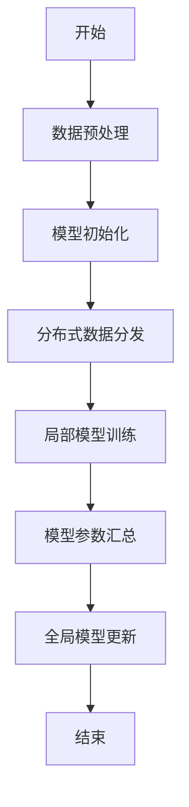
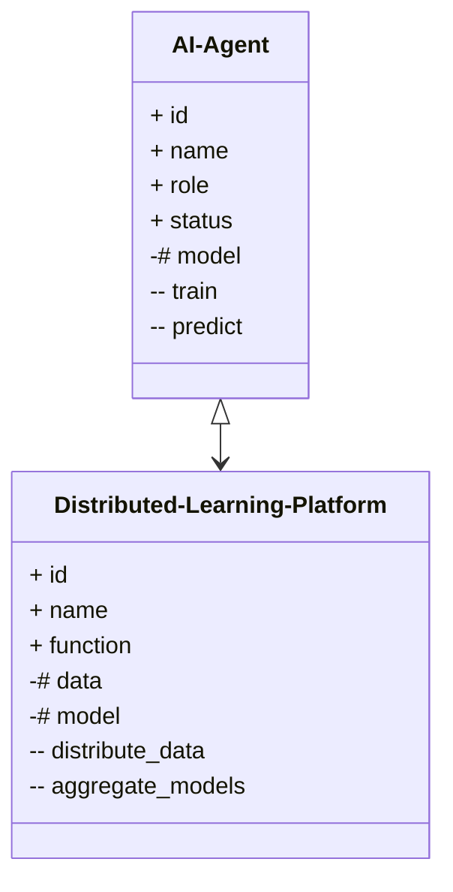

                 


# 企业AI Agent的分布式学习平台设计

## 关键词
企业AI Agent, 分布式学习, 平台设计, 算法原理, 系统架构

## 摘要
本文深入探讨了企业AI Agent的分布式学习平台设计，从概念、算法到系统架构，结合实际案例，全面分析其原理与实现。文章首先介绍了企业AI Agent的基本概念和分布式学习平台的重要性，随后详细阐述了分布式学习算法的原理和实现，包括联邦学习和参数服务器架构。接着，通过数学模型和公式，解释了分布式学习的数学基础。最后，结合系统设计和项目实战，展示了如何构建一个高效稳定的分布式学习平台，并提出了相关的最佳实践和注意事项。

---

## 第一部分: 企业AI Agent的背景与概念

## 第1章: 企业AI Agent概述

### 1.1 什么是企业AI Agent
企业AI Agent是一种能够感知环境、自主决策并执行任务的智能体，具备以下核心特征：
- **自主性**：无需外部干预，自主完成任务。
- **反应性**：能够实时感知环境变化并做出响应。
- **目标导向**：基于目标驱动行动，优化决策过程。

企业AI Agent的应用场景广泛，包括智能客服、供应链优化、金融风险控制等。

### 1.2 分布式学习平台的定义与特点
分布式学习平台通过将数据分布在多个节点上，进行去中心化的模型训练，具有以下优势：
- **数据隐私**：数据无需集中，保护隐私。
- **扩展性**：易于扩展，适应大规模数据。
- **容错性**：节点故障不影响整体训练。

企业AI Agent与分布式学习平台的关系是：分布式学习平台为AI Agent提供数据和模型支持，AI Agent则利用这些支持进行智能决策。

### 1.3 企业AI Agent的背景与需求
传统AI在处理大规模数据和复杂场景时面临挑战，分布式学习平台的出现解决了数据集中带来的隐私和计算成本问题，同时满足企业级AI应用的需求。

---

## 第2章: 企业AI Agent的核心概念与联系

### 2.1 核心概念原理
企业AI Agent通过分布式学习平台进行模型训练，采用联邦学习和参数服务器架构实现高效协作。

### 2.2 核心概念属性对比表
以下是AI Agent与传统AI的对比：

| 特性          | 传统AI                     | 企业AI Agent                |
|---------------|----------------------------|-----------------------------|
| 数据处理      | 集中式                    | 分布式                      |
| 智能性        | 单一模型                   | 多模型协作                  |
| 应用场景      | 单任务                    | 多任务协作                  |

### 2.3 ER实体关系图
```mermaid
er
    entity(AI Agent) {
        id
        name
        role
        status
    }
    entity(Distributed Learning Platform) {
        id
        name
        function
    }
    relationship(AI Agent与Distributed Learning Platform的交互)
```

---

## 第3章: 分布式学习平台的算法原理

### 3.1 分布式学习算法概述
分布式学习算法包括联邦学习和参数服务器架构。联邦学习通过数据不共享的方式进行模型训练，参数服务器架构则通过中心服务器管理模型参数。

### 3.2 分布式学习算法流程图


### 3.3 算法实现代码示例
```python
import numpy as np
from concurrent.futures import Thread

def local_training(data):
    model = initialize_model()
    for x, y in data:
        model.update(x, y)
    return model.get_weights()

def aggregate(weights_list):
    return np.mean(weights_list, axis=0)

def distributed_learning(data_shards):
    futures = []
    for shard in data_shards:
        futures.append(Thread(target=local_training, args=(shard,)))
    for f in futures:
        f.start()
    for f in futures:
        f.join()
    weights = aggregate([f.result() for f in futures])
    return weights
```

### 3.4 分布式学习的数学模型
模型更新的数学公式为：
$$ w_{new} = \frac{1}{n} \sum_{i=1}^{n} w_i $$
其中，\( w_i \) 表示每个节点的模型参数，\( n \) 表示节点数量。

---

## 第4章: 系统分析与架构设计

### 4.1 问题场景介绍
企业AI Agent需要处理大规模数据，确保数据隐私和高效计算。分布式学习平台需要支持多节点协作，具备高可用性和扩展性。

### 4.2 系统功能设计
系统功能包括数据分发、模型训练、参数同步和结果汇总。领域模型如下：


### 4.3 系统架构设计
系统架构采用微服务架构，包括数据节点、参数服务器和协调节点。架构图如下：
```mermaid
arch
    client --> data_node_1
    client --> data_node_2
    data_node_1 --> parameter_server
    data_node_2 --> parameter_server
    parameter_server --> coordinator
```

### 4.4 接口设计
系统接口包括数据分发接口、模型更新接口和结果查询接口，使用RESTful API实现。

---

## 第5章: 项目实战

### 5.1 环境安装
安装必要的库：
```bash
pip install numpy concurrent.futures
```

### 5.2 核心代码实现
```python
import numpy as np
from concurrent.futures import Thread

def local_training(data):
    model = initialize_model()
    for x, y in data:
        model.update(x, y)
    return model.get_weights()

def aggregate(weights_list):
    return np.mean(weights_list, axis=0)

def distributed_learning(data_shards):
    futures = []
    for shard in data_shards:
        futures.append(Thread(target=local_training, args=(shard,)))
    for f in futures:
        f.start()
    for f in futures:
        f.join()
    weights = aggregate([f.result() for f in futures])
    return weights
```

### 5.3 案例分析
通过一个简单的线性回归问题，展示分布式学习平台的实现。数据分布在多个节点上，通过分布式训练得到全局模型。

---

## 结论
企业AI Agent的分布式学习平台设计是一项复杂的任务，需要结合算法原理、系统架构和实际应用。通过本文的分析，读者可以深入了解分布式学习的原理和实现方法，为实际项目提供参考。

## 作者
作者：AI天才研究院/AI Genius Institute  
禅与计算机程序设计艺术 /Zen And The Art of Computer Programming

