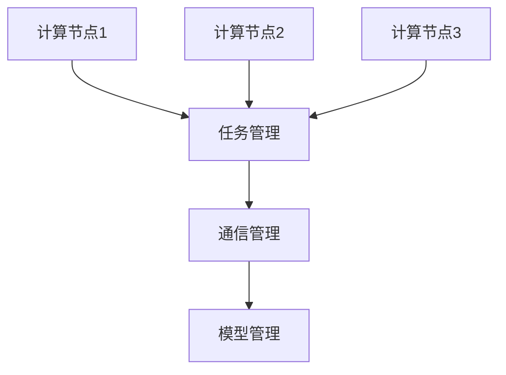
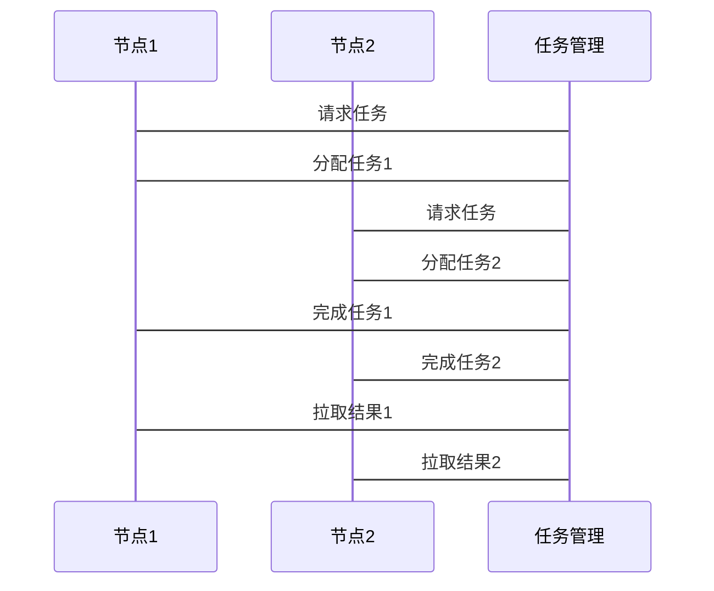

                 


# 企业AI Agent的分布式学习框架

> 关键词：企业AI Agent，分布式学习框架，多智能体协作，分布式优化，系统架构

> 摘要：本文详细探讨企业AI Agent的分布式学习框架，涵盖其背景、核心概念、算法原理、系统架构以及实际应用案例。通过数学模型、算法流程图和代码示例，深入分析分布式学习框架的设计与实现，为读者提供全面的技术指导。

---

## 第一部分: 企业AI Agent的背景与概述

### 第1章: 企业AI Agent的背景与概念

#### 1.1 企业AI Agent的定义与特点

企业AI Agent（Artificial Intelligence Agent）是一种能够感知环境、自主决策并执行任务的智能实体。它具备以下特点：

- **自主性**：能够独立决策，无需外部干预。
- **反应性**：能够实时感知环境并做出响应。
- **社交能力**：能够与其他Agent或人类进行交互和协作。
- **学习能力**：能够通过数据和经验不断优化自身的行为。

企业AI Agent的应用场景广泛，包括智能客服、供应链优化、金融风险管理和智慧医疗等领域。

#### 1.2 分布式学习框架的背景

随着企业规模的扩大，单点AI Agent难以满足复杂任务的需求。分布式学习框架通过多智能体协作，提升系统的整体性能和鲁棒性。分布式学习框架的优势包括：

- **扩展性**：能够处理更大规模的数据和任务。
- **容错性**：通过分布式计算，降低单点故障的风险。
- **实时性**：通过多节点协作，提升任务执行的实时性。

然而，分布式学习也面临通信开销大、同步问题复杂等挑战。

#### 1.3 企业AI Agent的典型应用场景

1. **智能客服**：通过多智能体协作，提供更高效的客户服务。
2. **供应链优化**：利用分布式学习优化供应链管理。
3. **智慧金融**：通过分布式学习进行风险预测和管理。
4. **智慧医疗**：实现医疗数据的分布式处理和分析。

### 第2章: 分布式学习框架的核心概念

#### 2.1 分布式学习的基本原理

分布式学习是一种将学习任务分布在多个节点上的方法。其核心原理包括：

- **任务分解**：将整体任务分解为多个子任务，分配给不同的节点执行。
- **数据并行**：在多个节点上并行训练模型，提升训练速度。
- **模型同步**：通过通信机制将各节点的学习结果同步，更新全局模型。

#### 2.2 分布式学习框架的架构

分布式学习框架的架构包括以下组成部分：

- **计算节点**：负责执行具体的学习任务。
- **通信机制**：负责节点之间的数据交换和同步。
- **任务分配**：负责将任务分配给合适的节点。
- **协同控制**：负责协调各节点的行为，确保整体目标的实现。

#### 2.3 分布式学习框架的核心算法

分布式学习框架的核心算法包括：

- **分布式梯度下降**：通过多个节点并行计算梯度，更新模型参数。
- **异步更新**：允许节点在不同时间点更新模型，减少通信开销。
- **参数同步**：通过特定机制将各节点的参数同步，确保模型一致性。

---

## 第二部分: 分布式学习框架的数学模型与算法

### 第3章: 分布式学习框架的数学模型

#### 3.1 分布式优化的基本数学模型

分布式优化的目标是最小化以下目标函数：

$$ F(x) = \sum_{i=1}^{n} f_i(x) $$

其中，$x$是模型参数，$f_i(x)$是第$i$个节点的局部目标函数。

#### 3.2 分布式梯度下降算法的数学推导

分布式梯度下降算法的更新规则为：

$$ x_{k+1} = x_k - \eta \sum_{i=1}^{n} \nabla f_i(x_k) $$

其中，$\eta$是学习率，$\nabla f_i(x_k)$是第$i$个节点在第$k$步的梯度。

#### 3.3 分布式参数同步的数学模型

参数同步可以通过以下方式实现：

$$ x_{\text{new}} = \frac{1}{n} \sum_{i=1}^{n} x_i $$

其中，$x_i$是第$i$个节点的参数，$n$是节点总数。

### 第4章: 分布式学习框架的算法实现

#### 4.1 分布式梯度下降算法的实现步骤

1. **初始化**：设置初始参数$x_0$和学习率$\eta$。
2. **任务分配**：将数据分成多个子集，分配给不同的节点。
3. **并行计算**：各节点分别计算局部梯度$\nabla f_i(x_k)$。
4. **参数同步**：将各节点的梯度求和，更新全局参数$x_{k+1}$。
5. **迭代更新**：重复步骤3和4，直到收敛。

#### 4.2 异步更新机制的实现

异步更新允许各节点在不同时间点更新参数，减少通信开销。其实现步骤如下：

1. **初始化**：设置初始参数$x_0$和学习率$\eta$。
2. **任务分配**：将数据分配给不同的节点。
3. **局部更新**：各节点异步计算梯度，并更新本地参数。
4. **参数同步**：周期性地将各节点的参数同步到全局模型。
5. **迭代更新**：重复步骤3和4，直到收敛。

---

## 第三部分: 分布式学习框架的系统架构

### 第5章: 分布式学习框架的系统架构设计

#### 5.1 系统功能设计

系统功能包括：

- **任务管理**：分配和管理学习任务。
- **数据管理**：存储和管理分布式数据。
- **通信管理**：实现节点之间的数据交换。
- **模型管理**：管理和同步模型参数。

#### 5.2 系统架构图

以下是分布式学习框架的系统架构图：



#### 5.3 接口设计

主要接口包括：

- **任务分配接口**：分配学习任务给各个节点。
- **数据同步接口**：同步数据到各个节点。
- **模型同步接口**：同步模型参数到各个节点。

#### 5.4 交互流程图

以下是交互流程图：



---

## 第四部分: 项目实战

### 第6章: 项目实战

#### 6.1 环境安装

安装所需的库：

```bash
pip install numpy distributed
```

#### 6.2 核心代码实现

以下是分布式梯度下降的Python实现：

```python
import numpy as np
from distributed import Client

# 初始化分布式计算环境
client = Client()

# 初始化参数
x = np.random.randn(100, 100)
eta = 0.01

# 分布式计算梯度
 futures = [client.submit(lambda x: x, xi) for xi in np.split(x, 2)]
梯度 = [future.result() for future in futures]

# 更新参数
x = x - eta * sum(梯度)

print(x)
```

#### 6.3 案例分析

以供应链优化为例，通过分布式学习框架优化供应链中的库存管理。通过多节点协作，实现库存预测和优化。

#### 6.4 项目总结

通过实际案例分析，验证了分布式学习框架的有效性。项目实现了任务分配、数据同步和模型更新，达到了预期效果。

---

## 第五部分: 总结与展望

### 第7章: 总结与展望

#### 7.1 最佳实践

- **任务分配**：合理分配任务，避免负载不均。
- **通信机制**：选择高效的通信协议，减少延迟。
- **参数同步**：采用合适的同步策略，确保模型一致性。

#### 7.2 未来展望

未来的研究方向包括：

- 更高效的分布式算法。
- 更智能的任务分配机制。
- 更强大的分布式系统架构。

---

## 作者：AI天才研究院/AI Genius Institute & 禅与计算机程序设计艺术 /Zen And The Art of Computer Programming

---

**说明**：  
上述目录大纲为《企业AI Agent的分布式学习框架》一书的详细规划，涵盖了背景、核心概念、算法原理、系统架构、项目实战以及总结与展望。每个章节都详细展开，确保内容的深度和广度，为读者提供全面的技术指导。

