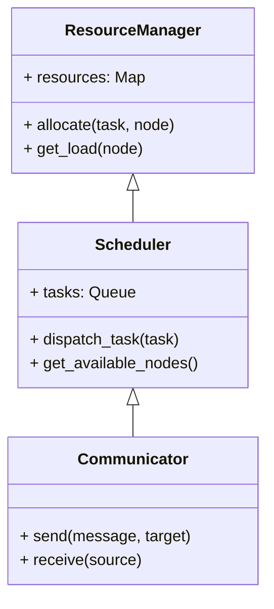

                 


# 企业AI Agent的分布式计算资源调度

> 关键词：分布式计算、AI Agent、资源调度、多智能体协作、负载均衡、通信机制

> 摘要：本文详细探讨了企业AI Agent在分布式计算环境中的资源调度问题，分析了其核心概念、算法原理、系统架构，并通过实际案例展示了资源调度系统的实现。文章从背景介绍出发，逐步深入，结合数学模型和实际代码，帮助读者全面理解分布式资源调度的原理与应用。

---

## 第1章: 企业AI Agent与分布式计算资源调度概述

### 1.1 企业AI Agent的定义与背景

#### 1.1.1 什么是企业AI Agent

企业AI Agent是一种智能代理，能够感知环境、自主决策并执行任务。它通过与外部系统的交互，利用数据和算法优化企业运营。AI Agent可部署在云、边缘或混合环境中，支持多种应用场景，如数据分析、流程自动化和决策支持。

#### 1.1.2 企业AI Agent的应用场景

- **数据分析与决策**：AI Agent通过处理大量数据，提供实时洞察和决策支持。
- **流程自动化**：优化企业流程，提高效率，降低成本。
- **客户交互**：通过智能客服、聊天机器人等提升客户体验。
- **供应链管理**：实时监控和优化供应链，确保高效运作。

#### 1.1.3 分布式计算资源调度的必要性

随着企业AI Agent数量的增加，单机处理能力有限，需通过分布式计算提高性能。分布式资源调度确保资源合理分配，避免资源争抢和浪费，提升整体效率。

---

### 1.2 分布式计算资源调度的核心概念

#### 1.2.1 分布式计算的基本原理

分布式计算将任务分解，分配到多台计算机执行，再汇总结果。资源调度需协调各节点，确保任务高效完成。资源调度的关键在于负载均衡，优化资源使用。

#### 1.2.2 资源调度的定义与目标

资源调度是分配计算资源的过程，目标是最大化资源利用率，减少延迟，保证任务按时完成。调度算法需考虑负载、延迟和资源可用性。

#### 1.2.3 企业AI Agent与资源调度的关系

AI Agent依赖资源调度获取所需计算资源，资源调度则通过AI Agent的任务需求进行优化。两者相互依存，共同确保企业高效运行。

---

### 1.3 企业AI Agent的分布式计算挑战

#### 1.3.1 资源分配的复杂性

多AI Agent的资源需求动态变化，调度算法需实时调整。资源异构性和动态变化增加了调度难度。

#### 1.3.2 多智能体协作的难点

AI Agent间需高效通信与协调，确保任务分配合理。通信机制设计需考虑延迟和带宽限制，保证协作效率。

#### 1.3.3 分布式环境下的通信与协调

AI Agent在分布式环境下需通过通信协议协作，确保任务执行顺利。通信机制设计需考虑安全性、可靠性和高效性。

---

## 第2章: 分布式计算资源调度的核心原理

### 2.1 分布式资源调度的基本原理

#### 2.1.1 资源分配的基本模型

资源分配模型描述如何将任务分配到节点。基本模型包括静态和动态两种，静态模型适用于负载均匀场景，动态模型适用于负载波动大场景。

#### 2.1.2 负载均衡的核心思想

负载均衡通过动态分配任务，平衡各节点负载。常用算法包括轮询、随机和加权轮询。动态负载均衡根据节点负载实时调整任务分配。

#### 2.1.3 多目标优化的策略

资源调度需在多个目标间权衡，如最大化资源利用率、最小化延迟和保证公平性。优化策略需综合考虑各目标，找到平衡点。

---

### 2.2 多智能体协作的通信机制

#### 2.2.1 分布式系统中的通信协议

通信协议定义AI Agent间交互规则。常见协议包括HTTP、WebSocket和自定义协议。需考虑协议的实时性、可靠性和安全性。

#### 2.2.2 智能体间的消息传递机制

消息传递机制定义如何高效传递信息。异步通信适用于低延迟场景，同步通信适用于需要即时反馈场景。需设计高效的队列管理和路由机制。

#### 2.2.3 通信延迟与带宽的优化

优化通信延迟和带宽使用，采用压缩、批处理和断点续传技术。同时，选择低延迟网络协议和优化网络拓扑结构。

---

### 2.3 分布式资源调度的数学模型

#### 2.3.1 资源分配的数学表达

资源分配可建模为优化问题，目标函数为最大化资源利用率，约束条件包括负载限制和资源可用性。数学表达如下：

$$
\text{Maximize } \sum_{i=1}^{n} u_i \\
\text{Subject to } \sum_{i=1}^{n} x_i \leq R_i, \forall i \\
$$

其中，\( u_i \) 为节点i的资源利用率，\( x_i \) 为分配的任务量，\( R_i \) 为节点i的资源限制。

#### 2.3.2 多目标优化的数学公式

多目标优化需同时优化多个目标，如资源利用率、延迟和公平性。可使用加权和方法：

$$
\text{Maximize } \sum_{j=1}^{m} w_j f_j(x)
$$

其中，\( w_j \) 为目标权重，\( f_j(x) \) 为目标函数。

---

## 第3章: 分布式资源调度算法原理

### 3.1 分布式资源分配算法

#### 3.1.1 负载均衡算法概述

负载均衡算法包括静态和动态两类。静态算法如轮询，动态算法如基于响应时间的自适应算法。动态算法能更好适应负载变化。

#### 3.1.2 基于贪心算法的资源分配

贪心算法每次选择当前最优选项。例如，在资源分配中，选择负载最低的节点分配任务。贪心算法简单高效，但可能不是全局最优。

#### 3.1.3 基于动态规划的资源分配

动态规划将问题分解为子问题，逐层解决。适用于任务依赖性强的场景，确保全局最优。

---

### 3.2 多智能体协作算法

#### 3.2.1 分布式一致性算法

一致性算法确保分布式系统中数据一致。常用算法包括Paxos和Raft。这些算法通过投票机制确保一致性，适用于关键任务。

#### 3.2.2 基于拜占庭容错的算法

拜占庭容错算法用于容错环境，确保系统正常运行。适用于网络分区或节点故障场景，保证算法鲁棒性。

#### 3.2.3 分布式共识算法

共识算法如PBFT和D拜占庭，用于达成共识。适用于区块链和分布式系统，确保节点达成一致。

---

### 3.3 资源调度的优化算法

#### 3.3.1 基于强化学习的优化

强化学习通过试错优化策略。AI Agent通过与环境互动，学习最优策略，适用于复杂动态环境。

#### 3.3.2 基于遗传算法的优化

遗传算法模拟自然选择，通过变异和交叉优化解。适用于组合优化问题，如任务调度。

#### 3.3.3 基于蚁群算法的优化

蚁群算法模拟蚂蚁觅食行为，通过信息素优化路径。适用于资源分配和任务调度，提供启发式优化。

---

## 第4章: 系统架构与实现

### 4.1 系统设计

#### 4.1.1 系统功能设计

系统功能包括资源监控、任务调度、负载均衡和日志管理。各模块协同工作，确保资源高效利用。

#### 4.1.2 领域模型设计

领域模型通过类图展示系统结构。核心类包括资源管理器、调度算法和通信模块。类图如下：



---

### 4.2 系统架构设计

系统架构采用分层设计，包括应用层、调度层和资源层。架构图如下：

```mermaid
rect
    title 系统架构图
    组件 "应用层" 前面
    组件 "调度层" 后面
    组件 "资源层" 右边
    应用层 --> 调度层
    调度层 --> 资源层
```

---

### 4.3 系统接口设计

系统接口包括任务提交、资源分配和状态查询。接口设计需考虑RESTful API，使用JSON格式传递数据。通信模块负责处理请求和响应。

---

## 第5章: 项目实战

### 5.1 环境搭建

环境搭建包括安装Python、Docker和相关库。推荐使用虚拟环境管理依赖，确保兼容性。Docker用于容器化部署，简化环境配置。

### 5.2 核心代码实现

#### 5.2.1 资源管理器实现

资源管理器负责监控节点资源，如CPU和内存使用情况。代码如下：

```python
class ResourceManager:
    def __init__(self):
        self.resources = {}

    def allocate(self, task, node):
        if node not in self.resources:
            self.resources[node] = 0
        self.resources[node] += task.size
```

#### 5.2.2 调度算法实现

调度算法实现基于负载的分配策略。代码如下：

```python
class Scheduler:
    def __init__(self, resource_manager):
        self.resource_manager = resource_manager

    def dispatch_task(self, task):
        available_nodes = self.get_available_nodes()
        selected_node = self.select_node(available_nodes)
        self.resource_manager.allocate(task, selected_node)

    def select_node(self, nodes):
        # 基于负载的策略，选择负载最低的节点
        return min(nodes, key=lambda x: self.resource_manager.get_load(x))
```

---

### 5.3 案例分析

通过实际案例展示系统设计与实现。例如，在电商系统中，多个AI Agent负责库存管理、订单处理和客户服务。资源调度确保各任务高效执行，避免瓶颈。

---

## 第6章: 总结与展望

### 6.1 总结

本文详细探讨了企业AI Agent的分布式计算资源调度问题，从背景到实现，系统介绍了相关概念、算法和系统架构。通过数学模型和实际代码，帮助读者理解资源调度的原理和应用。

### 6.2 展望

未来，随着AI技术的发展，资源调度需进一步优化，如动态调整资源分配策略，增强系统容错性和扩展性。结合边缘计算和物联网，资源调度将更高效，为企业带来更大价值。

---

## 作者

作者：AI天才研究院/AI Genius Institute  
邮箱：contact@ai-genius.com  
GitHub：https://github.com/AI-Genius-Institute  
知乎：https://www.zhihu.com/people/ai-genius-institute  

---

**感谢您的阅读！**

