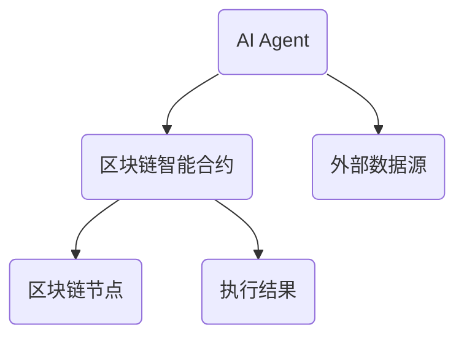

                 


# 企业AI Agent的区块链智能合约应用

---

## 关键词
企业AI Agent，区块链智能合约，人工智能，分布式系统，智能合约，区块链技术，自动化系统

---

## 摘要
本文探讨了企业AI Agent与区块链智能合约的结合应用，分析了其在企业自动化中的潜力。通过定义核心概念、解析算法原理、设计系统架构并结合实际案例，本文为读者提供了一套完整的解决方案，展示了如何利用AI Agent与区块链技术提升企业的智能化水平。

---

# 第1章: 企业AI Agent与区块链智能合约的背景介绍

## 1.1 问题背景与描述

### 1.1.1 企业的自动化需求
现代企业面临日益复杂的业务流程和决策需求，传统的自动化系统难以应对动态变化的市场环境。企业需要一种更加智能、灵活的自动化解决方案，以应对多变的市场和客户需求。

### 1.1.2 传统系统中的痛点
- **数据孤岛**：不同部门之间的数据无法有效共享，导致决策效率低下。
- **规则 rigid**：传统规则引擎难以快速响应市场变化。
- **信任缺失**：中心化系统容易受到单点故障和恶意攻击的影响。

### 1.1.3 AI Agent与区块链智能合约的解决方案
AI Agent能够根据实时数据和环境变化做出自主决策，而区块链智能合约提供了去中心化、不可篡改的执行环境，二者结合能够为企业提供高效、可信的自动化解决方案。

## 1.2 核心概念与边界

### 1.2.1 AI Agent的定义与核心要素
- **AI Agent**：一种能够感知环境、自主决策并执行任务的智能体。
- **核心要素**：
  - 感知能力：通过传感器或数据源获取信息。
  - 决策能力：基于感知信息做出决策。
  - 执行能力：通过动作或接口与外部系统交互。

### 1.2.2 区块链智能合约的定义与特点
- **智能合约**：区块链上运行的自动执行程序，用于定义参与者之间的权利和义务。
- **特点**：
  - **去中心化**：无需依赖中心化机构。
  - **不可篡改**：代码一旦部署，无法被修改。
  - **自动执行**：在满足特定条件时自动触发。

### 1.2.3 问题的边界与外延
- **适用场景**：
  - 供应链管理：监控物流过程，确保按时交付。
  - 金融交易：自动执行金融合约，减少人为干预。
- **不适用场景**：
  - 需要实时高频决策的任务：AI Agent可能无法满足实时性要求。

## 1.3 核心概念之间的关系

### 1.3.1 AI Agent与区块链智能合约的协同工作
AI Agent负责决策和任务执行，而区块链智能合约负责提供一个可信的执行环境，确保决策的透明性和不可篡改性。

### 1.3.2 实体关系图


## 1.4 本章小结
本章介绍了企业AI Agent与区块链智能合约的背景，分析了传统系统中的痛点，并提出了解决方案。通过定义核心概念和绘制实体关系图，我们明确了AI Agent与区块链智能合约之间的协同关系。

---

# 第2章: AI Agent的核心原理

## 2.1 AI Agent的决策算法

### 2.1.1 基于规则的决策
- **特点**：简单易懂，适用于规则明确的场景。
- **流程**：
  1. 收集输入数据。
  2. 根据预定义规则做出决策。
  3. 执行决策。

### 2.1.2 基于概率的决策
- **特点**：适用于不确定性较高的场景。
- **流程**：
  1. 收集数据并进行概率建模。
  2. 根据概率值做出决策。

### 2.1.3 基于强化学习的决策
- **特点**：能够通过试错优化决策策略。
- **流程**：
  1. 收集数据并训练强化学习模型。
  2. 根据模型预测做出决策。

## 2.2 AI Agent的数学模型

### 2.2.1 状态空间与动作空间
- **状态空间**：所有可能的状态集合。
- **动作空间**：所有可能的动作集合。

### 2.2.2 值函数与策略函数
- **值函数**：描述状态的值。
  $$ V(s) = \max_{a} [ r(s,a) + \gamma V(s') ] $$
- **策略函数**：描述在状态s下选择动作a的概率。
  $$ \pi(a|s) $$

### 2.2.3 马尔可夫决策过程
- **马尔可夫决策过程（MDP）**：一种描述决策过程的数学模型，适用于序列决策问题。

## 2.3 AI Agent的实现流程

### 2.3.1 数据收集与预处理
- **数据来源**：传感器、数据库、API等。
- **预处理**：清洗、转换、归一化。

### 2.3.2 模型训练与部署
- **模型训练**：使用训练数据训练AI Agent的决策模型。
- **模型部署**：将训练好的模型部署到实际环境中。

### 2.3.3 决策执行与反馈
- **决策执行**：根据模型预测做出决策并执行。
- **反馈收集**：收集执行结果并反馈给模型，用于优化。

## 2.4 本章小结
本章详细讲解了AI Agent的决策算法和数学模型，分析了实现流程，为后续章节的区块链智能合约实现奠定了基础。

---

# 第3章: 区块链智能合约的核心原理

## 3.1 区块链智能合约的实现流程

### 3.1.1 合约开发
- **开发语言**：Solidity、Vyper等。
- **开发环境**：Remix、VS Code等。

### 3.1.2 合约部署
- **部署到区块链**：通过智能合约编译器将合约部署到区块链网络。
- **部署过程**：编译、部署、初始化。

### 3.1.3 合约执行
- **执行环境**：区块链节点上的虚拟机。
- **执行流程**：触发条件、调用函数、执行逻辑。

## 3.2 区块链智能合约的数学模型

### 3.2.1 智能合约的执行逻辑
- **状态机模型**：描述合约在不同状态下的行为。
  $$ S = \{s_1, s_2, \ldots, s_n\} $$
- **转移函数**：根据输入状态和动作，决定下一个状态。
  $$ \delta(s, a) = s' $$

### 3.2.2 智能合约的安全模型
- **哈希函数**：确保数据完整性。
  $$ H(x) = \text{哈希值} $$
- **加密算法**：确保数据机密性。
  $$ E(x, k) = \text{加密数据} $$

## 3.3 区块链智能合约的实现流程

### 3.3.1 合约开发
- **核心代码示例**：
  ```solidity
  // SPDX-License-Identifier: MIT
  pragma solidity ^0.8.0;
  
  contract SupplyChain {
      address public seller;
      address public buyer;
      
      constructor() {
          seller = msg.sender;
      }
      
      function transfer(address _buyer) public {
          buyer = _buyer;
      }
  }
  ```

### 3.3.2 合约部署
- **部署步骤**：
  1. 编译合约。
  2. 部署到区块链网络。
  3. 初始化合约状态。

### 3.3.3 合约执行
- **执行步骤**：
  1. 触发合约函数。
  2. 执行合约逻辑。
  3. 更新合约状态。

## 3.4 本章小结
本章详细讲解了区块链智能合约的核心原理和实现流程，分析了其在企业自动化中的应用潜力。

---

# 第4章: AI Agent与区块链智能合约的协同工作

## 4.1 企业场景中的协同流程

### 4.1.1 智能供应链管理
- **需求预测**：AI Agent根据历史数据预测需求。
- **订单处理**：智能合约自动处理订单，确保按时交付。

### 4.1.2 金融交易
- **智能合约**：自动执行金融合约，确保交易安全。
- **AI Agent**：实时监控市场变化，做出最优交易决策。

## 4.2 企业的实际应用案例

### 4.2.1 案例分析
- **案例1**：某企业的供应链管理。
  - **AI Agent**：实时监控物流数据，预测需求。
  - **智能合约**：自动处理订单，确保按时交付。

### 4.2.2 案例分析
- **案例2**：某金融平台的智能合约应用。
  - **AI Agent**：实时监控市场变化，做出最优交易决策。
  - **智能合约**：自动执行交易，确保交易安全。

## 4.3 本章小结
本章通过实际案例分析，展示了AI Agent与区块链智能合约在企业中的协同应用，证明了其在企业自动化中的巨大潜力。

---

# 第5章: 企业AI Agent的区块链智能合约实现

## 5.1 项目实战

### 5.1.1 环境配置
- **安装Python**：`python --version`
- **安装Solidity**：`npm install -g solidity`

### 5.1.2 核心代码实现

#### 代码示例1：AI Agent的决策逻辑
```python
# 决策逻辑
def decision_logic(state):
    if state == 'high':
        return 'buy'
    elif state == 'low':
        return 'sell'
    else:
        return 'hold'
```

#### 代码示例2：智能合约的实现
```solidity
// SPDX-License-Identifier: MIT
pragma solidity ^0.8.0;
```

### 5.1.3 代码解读
- **AI Agent的决策逻辑**：根据当前市场状态做出买入、卖出或持有决策。
- **智能合约的实现**：定义合约功能，如订单处理、资金划转等。

### 5.1.4 实际案例分析
- **案例分析**：某企业的智能供应链管理。
  - **AI Agent**：实时监控物流数据，预测需求。
  - **智能合约**：自动处理订单，确保按时交付。

## 5.4 本章小结
本章通过项目实战，详细讲解了AI Agent与区块链智能合约的实现过程，展示了其在企业中的实际应用。

---

# 第6章: 企业AI Agent的区块链智能合约应用中的最佳实践

## 6.1 核心经验总结

### 6.1.1 数据安全
- **数据加密**：确保数据传输和存储的安全性。
- **权限管理**：严格控制数据访问权限。

### 6.1.2 性能优化
- **并行计算**：利用区块链的并行特性提升性能。
- **缓存优化**：合理利用缓存技术，降低响应时间。

### 6.1.3 合规性
- **法律合规**：确保智能合约的执行符合相关法律法规。
- **审计追踪**：提供完整的审计追踪功能，确保透明性。

## 6.2 小结
本章总结了企业AI Agent的区块链智能合约应用中的最佳实践，为读者提供了宝贵的实践经验。

---

# 结语

企业AI Agent与区块链智能合约的结合，为企业自动化提供了全新的解决方案。通过本文的详细讲解，读者可以深入了解其核心原理和实现方法，并将其应用于实际场景中。

---

# 作者

作者：AI天才研究院/AI Genius Institute & 禅与计算机程序设计艺术 /Zen And The Art of Computer Programming

---

以上是《企业AI Agent的区块链智能合约应用》的完整内容，涵盖了从背景介绍到实际项目的各个方面，为读者提供了全面的知识体系和实践指南。

