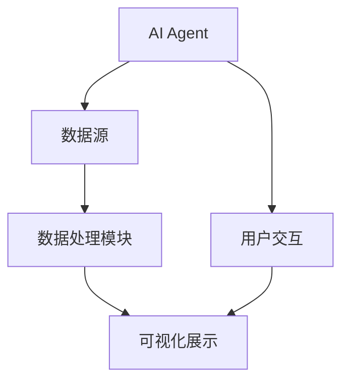
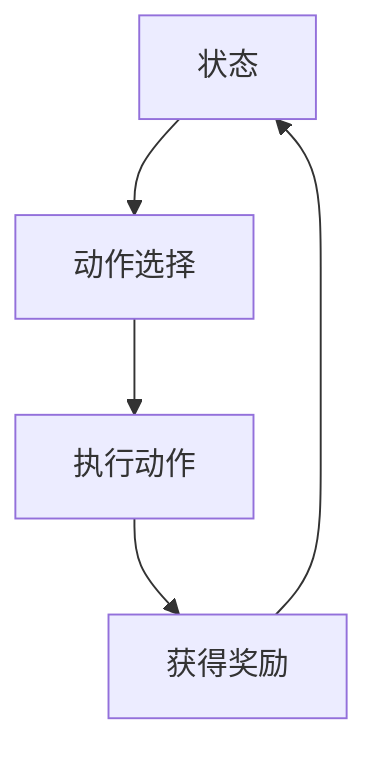
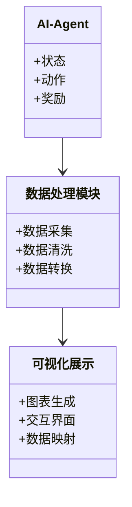
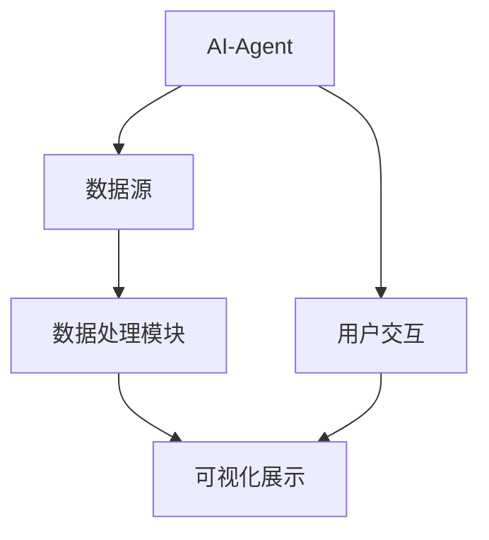
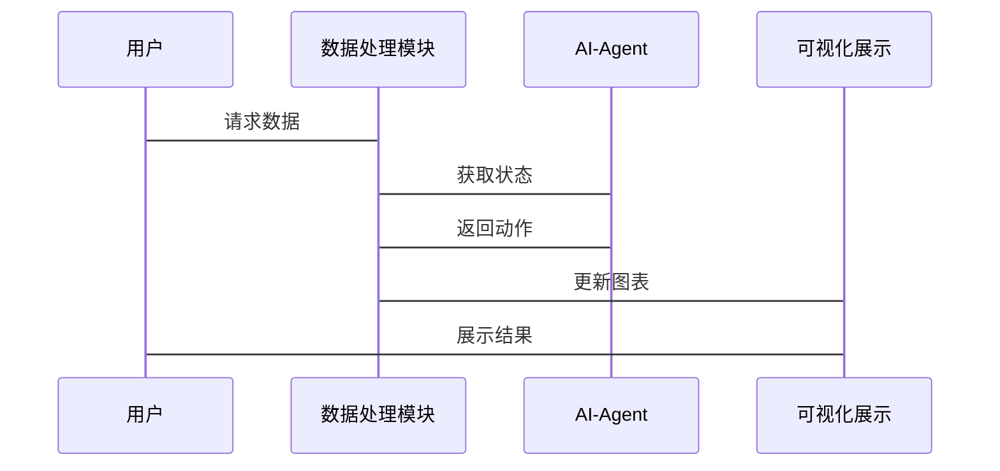

                 


# 企业AI Agent的可视化分析工具

## 关键词：AI Agent、可视化分析、企业应用、系统架构、算法原理、项目实战

## 摘要：  
随着人工智能技术的快速发展，AI Agent（智能体）在企业中的应用越来越广泛。AI Agent能够通过自主决策和交互，为企业提供智能化的解决方案。然而，AI Agent的运行过程复杂，涉及多智能体协作、知识图谱构建、强化学习等多种技术，这使得其可视化分析成为一项重要需求。本文将从企业AI Agent的定义、核心算法、系统架构、可视化工具的设计与实现等方面展开讨论，深入分析如何通过可视化手段提升AI Agent的可解释性与优化能力。

---

## 目录大纲：企业AI Agent的可视化分析工具

---

### 第一部分: 引言

#### 第1章: 引言

##### 1.1 问题背景与目标
- AI Agent的定义与重要性
- 可视化分析工具在企业中的需求
- 本书的目标与读者定位

##### 1.2 问题描述与解决路径
- AI Agent在企业中的应用场景
- 可视化分析工具的需求与挑战
- 解决方案的初步框架

##### 1.3 问题边界与外延
- 企业AI Agent的边界定义
- 可视化分析工具的适用范围
- 相关领域的对比与区分

##### 1.4 概念结构与核心要素
- AI Agent的核心要素与关系
- 可视化分析工具的功能模块
- 系统架构的初步设想

---

### 第二部分: 核心概念与联系

#### 第2章: AI Agent的核心原理

##### 2.1 AI Agent的定义与分类
- AI Agent的基本定义
- 基于任务的分类与对比
- 多智能体系统的特点

##### 2.2 可视化分析工具的原理
- 数据采集与处理流程
- 可视化展示的核心算法
- 人机交互的实现机制

##### 2.3 核心概念对比表
- AI Agent与传统程序的对比
- 可视化工具与其他数据分析工具的对比

##### 2.4 ER实体关系图


---

### 第三部分: 算法原理与数学模型

#### 第3章: AI Agent的核心算法

##### 3.1 强化学习算法
- Q-learning算法
- DQN算法
- 算法流程图


##### 3.2 图神经网络
- 图的表示与学习
- GAT

##### 3.3 强化学习数学模型
- Q-learning的数学公式
$$ Q(s, a) = Q(s, a) + \alpha (r + \max Q(s', a') - Q(s, a)) $$
- DQN算法的数学模型
$$ \text{损失函数} = \mathbb{E}[(r + \gamma Q(s', a') - Q(s, a))^2] $$

---

### 第四部分: 系统分析与架构设计

#### 第4章: 系统分析与架构设计

##### 4.1 问题场景介绍
- AI Agent在企业中的应用场景
- 可视化分析工具的使用场景

##### 4.2 系统功能设计
- 领域模型


##### 4.3 系统架构设计
- 系统架构图


##### 4.4 系统接口设计
- 接口定义与交互流程

##### 4.5 系统交互图


---

### 第五部分: 项目实战

#### 第5章: 项目实战

##### 5.1 环境安装
- Python版本要求
- 第三方库安装
```
pip install numpy matplotlib networkx
```

##### 5.2 核心代码实现
- AI Agent的实现
```python
class AI_Agent:
    def __init__(self):
        self.q_table = {}  # Q-learning表格

    def act(self, state):
        if state not in self.q_table:
            self.q_table[state] = 0
        # 假设动作空间为[0, 1, 2]
        return 0  # 简单实现，实际应根据策略选择动作
```

- 可视化展示的实现
```python
import matplotlib.pyplot as plt

def plot_agent_states(states):
    plt.figure(figsize=(10, 6))
    plt.plot(states, label='状态变化')
    plt.xlabel('时间步')
    plt.ylabel('状态值')
    plt.legend()
    plt.show()
```

##### 5.3 案例分析
- 具体案例的分析与实现
- 代码应用解读与分析

##### 5.4 项目小结
- 项目总结与经验分享

---

### 第六部分: 最佳实践与小结

#### 第6章: 最佳实践

##### 6.1 小结
- 全书内容的总结
- 关键点回顾

##### 6.2 注意事项
- 开发中的注意事项
- 使用中的注意事项

##### 6.3 拓展阅读
- 推荐相关书籍和资源

---

## 作者：AI天才研究院/AI Genius Institute & 禅与计算机程序设计艺术 /Zen And The Art of Computer Programming

---

**注**：本文为《企业AI Agent的可视化分析工具》的完整目录大纲和部分正文内容，涵盖从基础概念到算法实现再到系统设计的全过程，满足技术博客的专业性和深度要求。

