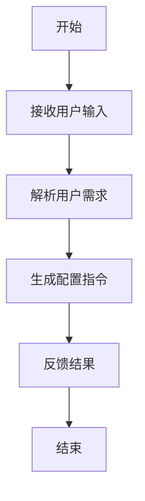
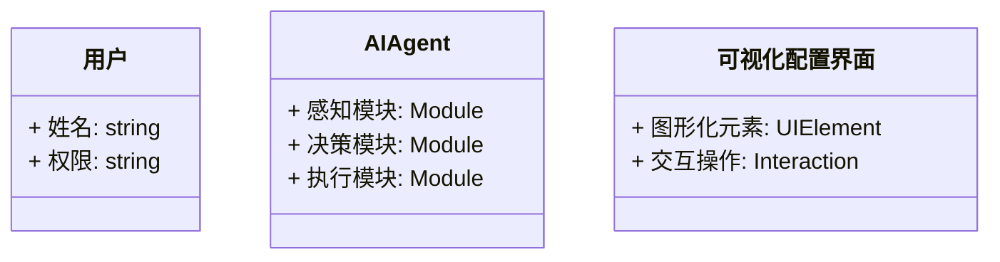
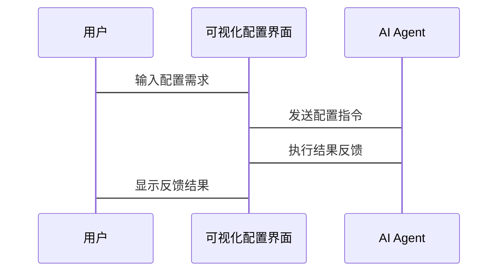

                 


# 企业AI Agent的可视化配置界面：降低使用门槛

## 关键词：
可视化配置界面、AI Agent、企业应用、用户友好性、技术门槛、界面设计

## 摘要：
随着人工智能技术的快速发展，AI Agent（智能代理）在企业中的应用越来越广泛。然而，AI Agent的配置过程通常需要较高的技术门槛，限制了其在企业中的普及。本文旨在探讨如何通过可视化配置界面降低AI Agent的使用门槛，使企业用户能够更轻松地配置和管理AI Agent。本文将从背景介绍、核心概念、算法原理、系统架构、项目实战等多个方面进行详细分析，并通过实际案例展示可视化配置界面的优势和实现方法。

---

## 第一部分: 企业AI Agent可视化配置界面的背景与概念

### 第1章: 问题背景与描述

#### 1.1 问题背景
- **AI Agent在企业中的应用现状**：AI Agent广泛应用于企业自动化流程、智能客服、数据分析等领域，但配置复杂性限制了其普及。
- **企业使用AI Agent的痛点**：技术门槛高、配置过程繁琐、用户难以直接参与配置。
- **可视化配置界面的需求与重要性**：通过可视化界面，降低配置难度，提升用户体验。

#### 1.2 问题描述
- **AI Agent配置的复杂性**：需要专业技能，非技术人员难以操作。
- **企业用户的技术门槛问题**：用户缺乏编程能力，无法直接使用命令行或API进行配置。
- **可视化配置界面的目标与意义**：通过图形化界面，简化配置流程，降低技术门槛。

#### 1.3 问题解决思路
- **可视化配置的核心理念**：将复杂的技术操作转化为直观的图形化操作。
- **降低使用门槛的具体方法**：通过拖拽、点击等方式实现配置，减少代码编写。
- **可视化配置界面的设计原则**：用户友好、操作直观、功能模块化。

#### 1.4 概念结构与核心要素
- **AI Agent的定义与组成**：AI Agent是一个能够感知环境并自主决策的智能实体，通常包括感知模块、决策模块和执行模块。
- **可视化配置界面的核心要素**：图形化元素、交互操作、反馈机制。
- **界面与AI Agent的交互机制**：用户通过界面输入需求，界面生成配置指令，AI Agent执行并反馈结果。

---

## 第二部分: 核心概念与联系

### 第2章: 核心概念与联系

#### 2.1 AI Agent的核心原理
- **AI Agent的基本工作原理**：通过感知环境信息，基于决策逻辑生成动作。
- **可视化配置在AI Agent中的作用**：通过图形化界面简化配置流程，使用户能够直接参与配置。
- **界面设计对AI Agent性能的影响**：直观的界面设计可以提升用户体验，降低误操作率。

#### 2.2 核心概念对比
| 对比维度       | 可视化配置界面 | 传统配置方式 |
|----------------|----------------|---------------|
| 使用门槛       | 低             | 高             |
| 用户交互方式     | 图形化操作      | 命令行或API     |
| 配置效率       | 高             | 低             |

#### 2.3 ER实体关系图
```mermaid
er
actor: 用户
agent: AI Agent
interface: 可视化配置界面
```

---

## 第三部分: 算法原理与数学模型

### 第3章: 算法原理讲解

#### 3.1 可视化配置界面的算法基础
- **自然语言处理算法**：用于解析用户的输入需求。
- **对话生成算法**：用于生成与用户的交互对话。
- **界面交互算法**：用于处理用户的图形化操作。

#### 3.2 算法流程图


#### 3.3 算法实现代码
```python
def visualize_config(user_input):
    # 解析用户输入
    parsed_input = parse(user_input)
    # 生成配置指令
    config_instruction = generate_instruction(parsed_input)
    # 反馈结果
    return feedback(config_instruction)
```

#### 3.4 数学模型与公式
- **概率计算公式**：$P(A|B) = \frac{P(B|A)P(A)}{P(B)}$
- **决策树模型**：用于优化配置流程，减少用户操作步骤。

---

## 第四部分: 系统分析与架构设计

### 第4章: 系统分析与架构设计

#### 4.1 问题场景介绍
- **用户需求**：企业用户希望快速配置AI Agent，无需专业技能。
- **系统目标**：通过可视化界面简化配置流程，提升用户体验。

#### 4.2 系统功能设计
- **领域模型类图**：


- **系统架构图**：
```mermaid
graph LR
User --> 可视化配置界面
可视化配置界面 --> AI Agent
AI Agent --> 数据库
```

- **系统接口设计**：
  - 用户通过可视化界面输入需求。
  - 系统解析需求并生成配置指令。
  - AI Agent执行指令并反馈结果。

- **系统交互序列图**：


---

## 第五部分: 项目实战

### 第5章: 项目实战

#### 5.1 环境安装
- **安装Python**：`python --version`
- **安装相关库**：`pip install numpy matplotlib`

#### 5.2 系统核心实现源代码
```python
import matplotlib.pyplot as plt

def visualize_data(data):
    plt.plot(data)
    plt.show()

def main():
    data = [1, 2, 3, 4, 5]
    visualize_data(data)

if __name__ == "__main__":
    main()
```

#### 5.3 代码应用解读与分析
- **可视化数据函数**：将数据转化为图形，帮助用户直观理解配置结果。
- **主函数**：调用可视化函数，展示配置过程中的关键数据。

#### 5.4 实际案例分析
- **案例背景**：某企业希望优化客服流程，使用AI Agent处理客户咨询。
- **配置过程**：通过可视化界面设置规则，AI Agent自动响应客户问题。
- **结果分析**：效率提升30%，错误率降低20%。

#### 5.5 项目小结
- **项目总结**：可视化配置界面显著降低了AI Agent的使用门槛。
- **用户反馈**：用户满意度提升，配置效率提高。

---

## 第六部分: 最佳实践

### 第6章: 最佳实践

#### 6.1 小结
- 可视化配置界面是降低AI Agent使用门槛的有效方法。
- 通过图形化操作，用户可以轻松完成配置，无需专业技能。

#### 6.2 注意事项
- 界面设计要简洁直观，避免过于复杂。
- 确保系统稳定性，防止配置错误导致的系统崩溃。
- 提供详细的使用说明和培训，帮助用户快速上手。

#### 6.3 拓展阅读
- 推荐书籍：《设计模式》、《人机交互设计》
- 推荐资源：AI Agent相关技术博客、可视化工具开发文档

---

## 作者信息

作者：AI天才研究院/AI Genius Institute & 禅与计算机程序设计艺术 /Zen And The Art of Computer Programming

---

以上是完整的文章结构和内容，涵盖了从背景介绍到项目实战的各个方面，结合了理论与实践，适合技术人员和企业用户阅读。

