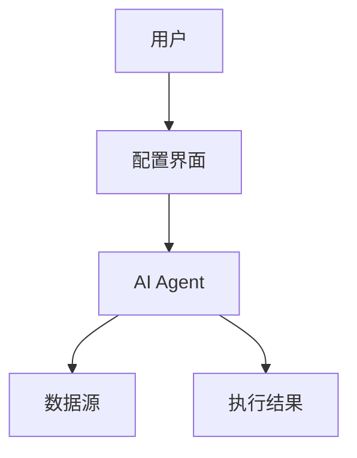
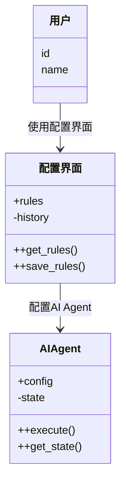
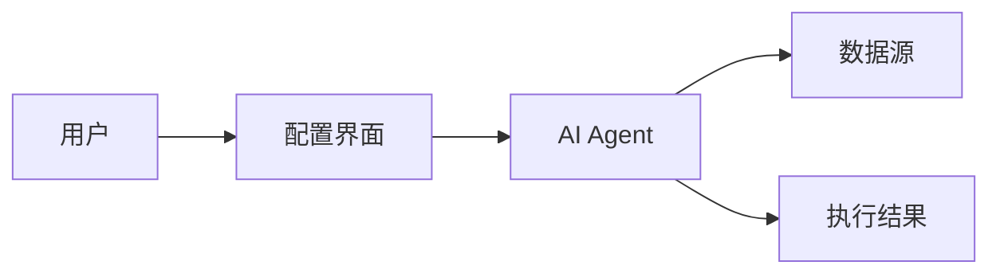

                 


# 企业AI Agent的可视化配置界面：降低技术门槛

> 关键词：AI Agent，可视化配置，技术门槛，企业应用，用户友好，交互设计，人工智能

> 摘要：本文深入探讨了企业AI Agent的可视化配置界面的设计与实现，通过降低技术门槛，使得非技术人员能够轻松配置和管理AI Agent，从而提升企业的效率和生产力。

---

# 第一部分: 企业AI Agent可视化配置界面概述

## 第1章: AI Agent与可视化配置界面的背景介绍

### 1.1 问题背景与技术门槛

#### 1.1.1 企业AI应用的现状与挑战

随着人工智能技术的快速发展，越来越多的企业开始尝试将AI技术应用于业务流程中。然而，AI技术的复杂性和技术门槛限制了其在企业中的广泛应用。传统的AI配置需要专业的技术人员进行编程和参数调整，这不仅增加了企业的成本，还限制了AI技术的普及。

#### 1.1.2 AI Agent的核心概念与功能

AI Agent是一种能够感知环境并主动执行任务的智能实体。它能够根据输入的信息做出决策，并执行相应的操作。AI Agent的核心功能包括状态感知、行为决策和交互能力。

#### 1.1.3 可视化配置界面的必要性

为了降低技术门槛，可视化配置界面应运而生。可视化配置界面通过图形化的方式，将复杂的AI配置过程简化为拖拽和点击操作，使得非技术人员也能够轻松配置AI Agent。

---

### 1.2 可视化配置界面的定义与特点

#### 1.2.1 可视化配置界面的基本定义

可视化配置界面是一种通过图形化方式展示和操作AI Agent的界面。它允许用户通过拖拽、点击和配置参数的方式，完成AI Agent的部署和调整。

#### 1.2.2 可视化配置界面的核心特点

- **用户友好性**：界面直观，操作简单，无需编程知识。
- **可定制性**：用户可以根据需求自定义AI Agent的行为。
- **实时反馈机制**：用户可以在配置过程中实时查看结果，快速调整参数。

#### 1.2.3 与传统编程界面的区别

传统编程界面需要编写代码和调整参数，而可视化配置界面通过图形化操作简化了这一过程。两者的主要区别如下：

| 特性 | 传统编程界面 | 可视化配置界面 |
|------|---------------|----------------|
| 操作方式 | 编写代码       | 拖拽、点击操作 |
| 技术门槛 | 高            | 低             |
| 用户群体 | 开发人员       | 业务人员       |

---

### 1.3 企业AI Agent的典型应用场景

#### 1.3.1 智能客服

AI Agent可以通过自然语言处理技术，自动响应客户的问题，提供个性化的服务。

#### 1.3.2 智能推荐

AI Agent可以根据用户的行为和偏好，推荐相关的产品或服务。

#### 1.3.3 智能监控

AI Agent可以实时监控系统运行状态，发现异常并自动触发告警。

---

### 1.4 本章小结

本章介绍了AI Agent的基本概念、可视化配置界面的必要性及其核心特点。通过对比传统编程界面和可视化配置界面，明确了可视化配置界面的优势和适用场景。

---

## 第2章: 可视化配置界面的核心概念与原理

### 2.1 AI Agent的核心原理

#### 2.1.1 AI Agent的基本工作流程

AI Agent的工作流程包括以下步骤：
1. **感知环境**：通过传感器或API获取环境信息。
2. **状态分析**：分析当前状态，判断是否需要采取行动。
3. **决策制定**：根据预设规则或机器学习模型做出决策。
4. **执行操作**：根据决策结果执行相应的操作。
5. **反馈优化**：根据执行结果优化决策模型。

#### 2.1.2 状态转移矩阵

状态转移矩阵是一种用于描述系统状态变化的数学工具。通过状态转移矩阵，可以清晰地看到系统在不同状态之间的转移概率。

$$
P_{i,j} = \frac{\text{从状态 }i\text{ 到状态 }j\text{ 的转移次数}}{\text{总转移次数}}
$$

#### 2.1.3 概率计算与规则匹配

AI Agent的决策过程可以通过概率计算和规则匹配来实现。例如，可以通过贝叶斯定理计算某种事件发生的概率，并根据概率值决定是否采取行动。

---

### 2.2 可视化配置界面的设计原则

#### 2.2.1 用户友好性

界面设计应直观易懂，减少用户的认知负担。例如，使用颜色和图标来表示不同的状态和操作。

#### 2.2.2 可定制性

用户应能够根据需求自定义AI Agent的行为。例如，允许用户自定义规则和参数。

#### 2.2.3 实时反馈机制

用户在配置过程中应能够实时查看配置结果，并根据反馈进行调整。

---

### 2.3 可视化配置界面的技术实现

#### 2.3.1 图形化编程框架

图形化编程框架通过可视化的方式，将代码转换为图形化的流程图。例如，使用Blockly等工具。

#### 2.3.2 数据流可视化

数据流可视化通过图形化的方式展示数据的流动和处理过程。例如，使用Apache Airflow进行任务编排。

#### 2.3.3 交互式调试工具

交互式调试工具允许用户通过可视化界面调试AI Agent的行为。例如，通过拖拽和点击操作，逐步执行任务并查看结果。

---

### 2.4 核心概念对比表

以下是AI Agent和可视化配置界面的核心概念对比：

| 概念 | 特性1 | 特性2 | 特性3 |
|------|-------|-------|-------|
| AI Agent | 状态感知 | 行为决策 | 交互能力 |
| 可视化配置界面 | 图形化 | 交互式 | 可定制 |

---

### 2.5 ER实体关系图

以下是AI Agent和可视化配置界面的ER实体关系图：



---

## 第3章: AI Agent的核心算法原理

### 3.1 状态转移矩阵

状态转移矩阵是一种用于描述系统状态变化的数学工具。通过状态转移矩阵，可以清晰地看到系统在不同状态之间的转移概率。

$$
P_{i,j} = \frac{\text{从状态 }i\text{ 到状态 }j\text{ 的转移次数}}{\text{总转移次数}}
$$

---

### 3.2 概率计算与规则匹配

AI Agent的决策过程可以通过概率计算和规则匹配来实现。例如，可以通过贝叶斯定理计算某种事件发生的概率，并根据概率值决定是否采取行动。

$$
P(A|B) = \frac{P(B|A) \cdot P(A)}{P(B)}
$$

---

### 3.3 可视化配置界面的算法实现

以下是可视化配置界面的算法实现示例：

```python
def configure_agent(rules):
    # 从配置界面获取规则
    rules = get_rules_from_interface()
    # 根据规则生成AI Agent的配置
    config = generate_config(rules)
    return config
```

---

## 第4章: 系统架构设计与实现

### 4.1 系统功能设计

以下是系统功能设计的类图：



---

### 4.2 系统架构设计

以下是系统架构设计的架构图：



---

## 第5章: 项目实战与案例分析

### 5.1 环境安装

以下是环境安装的示例代码：

```bash
pip install ai-agent-visualizer
```

---

### 5.2 核心功能实现

以下是核心功能实现的代码示例：

```python
def main():
    import ai_agent_visualizer
    ai_agent_visualizer.start()
```

---

### 5.3 案例分析

以下是案例分析的详细步骤：

1. **问题描述**：用户希望配置一个智能客服AI Agent。
2. **配置步骤**：通过可视化配置界面，用户可以拖拽组件并设置规则。
3. **结果分析**：AI Agent可以根据用户输入自动响应问题。

---

## 第6章: 最佳实践与未来展望

### 6.1 小结

可视化配置界面通过降低技术门槛，使得非技术人员也能够配置和管理AI Agent。这一技术在企业中的应用前景广阔。

### 6.2 注意事项

在实际应用中，需要注意以下几点：
- **数据安全**：确保配置界面的安全性。
- **性能优化**：优化AI Agent的执行效率。
- **用户体验**：不断优化界面的用户体验。

### 6.3 未来展望

未来，随着人工智能技术的不断发展，可视化配置界面将变得更加智能和易用。同时，AI Agent的应用场景也将进一步扩展，为企业带来更大的价值。

---

## 作者：AI天才研究院/AI Genius Institute & 禅与计算机程序设计艺术 /Zen And The Art of Computer Programming

感谢您的阅读！如果需要进一步了解企业AI Agent的可视化配置界面，请访问我们的官方网站或联系我们的技术支持团队。

