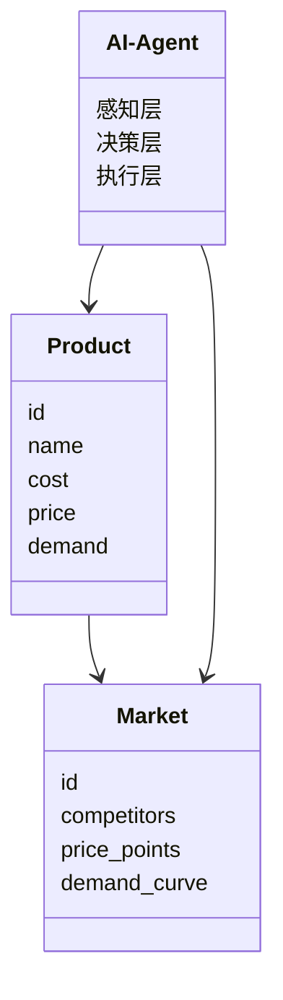
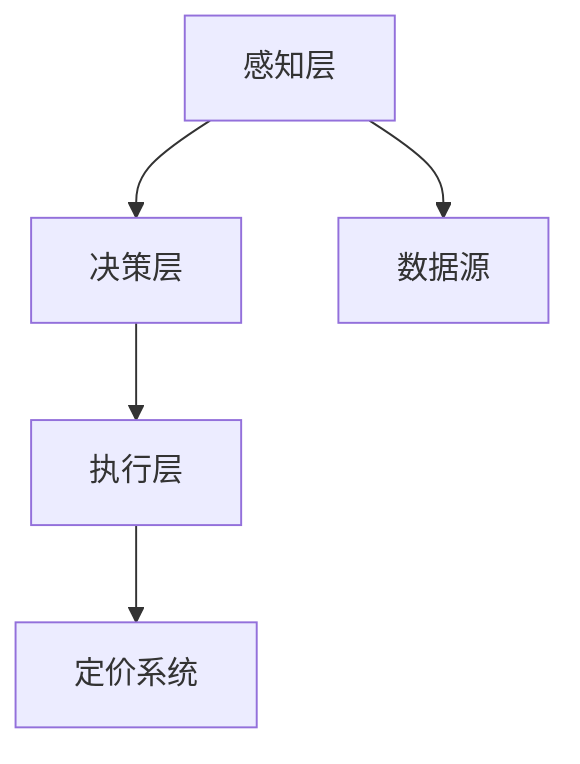
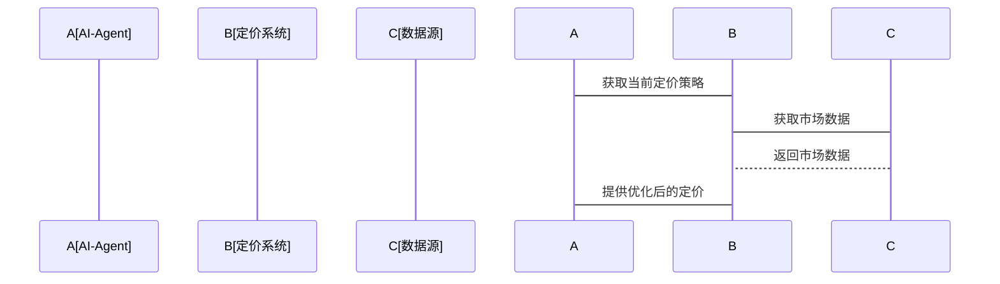

                 


# 企业AI Agent的因果推理在产品定价策略中的应用

**关键词**：AI Agent, 因果推理, 产品定价, 系统架构, 算法实现

**摘要**：本文探讨了企业AI Agent如何利用因果推理优化产品定价策略。首先，介绍了AI Agent和因果推理的基本概念及其在企业定价中的应用背景。接着，详细分析了因果推理的原理，包括因果图和潜在结果框架，并通过图表和代码示例说明其工作原理。然后，讨论了AI Agent在定价策略中的具体应用，涵盖定价策略的核心要素和因果推理的应用场景。最后，通过项目实战案例展示了系统架构设计和实现过程，总结了最佳实践和未来发展方向。

---

## 第一部分: 企业AI Agent的背景与基础

### 第1章: 企业AI Agent的概述

#### 1.1 问题背景与定义

##### 1.1.1 问题背景
企业定价策略的复杂性日益增加，传统定价方法依赖经验判断，难以适应动态市场环境。AI Agent通过自动化分析和决策，为优化定价策略提供了新的可能性。

##### 1.1.2 问题描述
定价策略涉及产品特性、市场需求和竞争环境等多个因素。传统方法难以量化因果关系，导致定价决策缺乏科学性。

##### 1.1.3 问题解决
AI Agent利用因果推理技术，能够识别变量间的因果关系，优化定价策略，提高企业竞争力。

##### 1.1.4 边界与外延
本文聚焦于AI Agent在定价策略中的应用，重点讨论因果推理的实现和应用，不涉及其他定价因素。

##### 1.1.5 核心概念与组成
- AI Agent：具备感知、决策和执行能力的智能体。
- 因果推理：分析变量间因果关系，用于决策制定。

#### 1.2 因果推理的核心概念

##### 1.2.1 因果关系的定义
因果关系是指一个变量的变化导致另一个变量变化的现象。

##### 1.2.2 潜在结果框架
潜在结果框架通过分析不同干预措施的结果，评估因果效应。

##### 1.2.3 算法原理
- 稳定性和可忽略性假设：假设因果关系在不同环境下保持稳定。
- 调节变量与中介变量：调节变量影响因果关系，中介变量传递因果效应。

### 第2章: 因果推理的原理与应用

#### 2.1 因果图与潜在结果框架

##### 2.1.1 因果图的构建
- 定义：展示变量间因果关系的有向图。
- 示例：价格 → 销量，竞争 → 价格。

##### 2.1.2 潜在结果框架
- 定义：分析每个干预措施的结果。
- 示例：价格调整后的销量变化。

#### 2.2 AI Agent的结构与功能

##### 2.2.1 AI Agent的基本结构
- 感知层：收集市场数据。
- 决策层：分析数据，制定策略。
- 执行层：执行定价调整。

##### 2.2.2 因果推理在AI Agent中的应用
- 分析变量间因果关系，优化定价策略。

### 第3章: 产品定价策略中的因果推理

#### 3.1 定价策略的核心要素

##### 3.1.1 产品特性
- 产品生命周期：影响定价策略。
- 产品成本：基础定价依据。

##### 3.1.2 市场需求
- 需求弹性：影响价格变动对销量的影响。
- 市场竞争：影响定价策略。

#### 3.2 因果推理在定价中的具体应用

##### 3.2.1 价格弹性分析
- 通过因果推理确定价格变动对销量的具体影响。

##### 3.2.2 竞争对手分析
- 分析竞争对手定价策略的影响。

##### 3.2.3 需求预测
- 利用因果推理预测不同价格下的市场需求。

---

## 第二部分: 算法原理与实现

### 第4章: 因果推理的算法实现

#### 4.1 算法原理

##### 4.1.1 因果图的构建与分析
- 使用结构因果模型（SCM）构建因果图。

##### 4.1.2 稳定性和可忽略性假设
- 假设因果关系在不同环境下的稳定性。
- 假设无未观察到的混杂变量。

#### 4.2 潜在结果框架的实现

##### 4.2.1 潜在结果的估计
- 使用反事实推理估计潜在结果。

##### 4.2.2 因果效应的计算
- 计算平均处理效应（ATE）和条件处理效应（CATE）。

#### 4.3 算法实现的代码示例

##### 4.3.1 代码实现
```python
import numpy as np
import pandas as pd
from sklearn.metrics import accuracy_score

# 示例数据
data = {
    'price': [10, 20, 30, 40, 50],
    'demand': [100, 80, 60, 40, 20]
}
df = pd.DataFrame(data)

# 计算价格对需求的因果效应
price_treatment = df[df['price'] > 30]['demand'].mean()
price_control = df[df['price'] <= 30]['demand'].mean()
ate = price_treatment - price_control
print(f'平均处理效应 (ATE): {ate}')
```

##### 4.3.2 数学公式
- 潜在结果框架：$$Y_i^{do(X=x)}$$ 表示在 $$X=x$$ 时的潜在结果。
- 平均处理效应：$$ATE = E[Y_i^{do(X=1)} - Y_i^{do(X=0)}]$$

---

## 第三部分: 系统架构与设计

### 第5章: 系统架构设计

#### 5.1 问题场景介绍

##### 5.1.1 问题描述
- 企业需要实时调整定价策略，应对市场变化。

#### 5.2 系统功能设计

##### 5.2.1 领域模型
- 用 Mermaid 绘制领域模型类图。



#### 5.3 系统架构设计

##### 5.3.1 系统架构
- 用 Mermaid 绘制系统架构图。



#### 5.4 接口设计与交互流程

##### 5.4.1 接口设计
- 使用 RESTful API 设计数据接口。

##### 5.4.2 交互流程
- 使用 Mermaid 绘制交互序列图。



---

## 第四部分: 项目实战

### 第6章: 项目实战

#### 6.1 环境安装

##### 6.1.1 环境配置
- 安装 Python 和相关库（如 pandas、numpy）。

#### 6.2 核心代码实现

##### 6.2.1 代码实现
```python
import pandas as pd
import numpy as np

# 数据生成
data = {
    'price': np.random.uniform(10, 50, 100),
    'demand': np.random.poisson(100, 100),
    'competitors': np.random.randint(0, 5, 100)
}
df = pd.DataFrame(data)

# 因果推理分析
# 假设competitors是影响price的变量
# 使用回归分析估计因果效应
model = ols('demand ~ competitors + price', data=df).fit()
print(model.summary())
```

##### 6.2.2 代码解读
- 使用线性回归模型分析价格和竞争对手数量对需求的影响。
- 通过回归系数估计因果效应。

#### 6.3 案例分析与总结

##### 6.3.1 案例分析
- 分析价格变动对需求的具体影响。
- 调整定价策略，优化收益。

##### 6.3.2 总结
- 系统实现因果推理优化定价策略。
- 通过案例验证系统有效性。

---

## 第五部分: 最佳实践与小结

### 第7章: 最佳实践与小结

#### 7.1 最佳实践

##### 7.1.1 数据质量
- 确保数据的完整性和准确性。

##### 7.1.2 模型选择
- 根据具体场景选择合适的因果推理方法。

#### 7.2 小结

##### 7.2.1 内容总结
- AI Agent通过因果推理优化企业定价策略。
- 系统架构和算法实现是关键。

##### 7.2.2 注意事项
- 数据隐私和安全问题需重视。
- 模型的可解释性和鲁棒性需考虑。

##### 7.2.3 拓展阅读
- 结构因果模型（SCM）
- 反事实推理

---

## 作者信息

作者：AI天才研究院 & 禅与计算机程序设计艺术

---

通过以上思考和撰写过程，我可以系统地完成这篇技术博客，确保内容详尽、结构清晰，并涵盖所有必要的部分。

