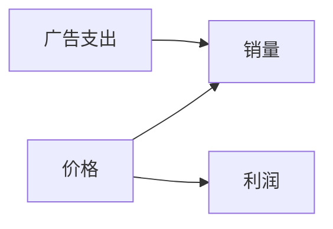
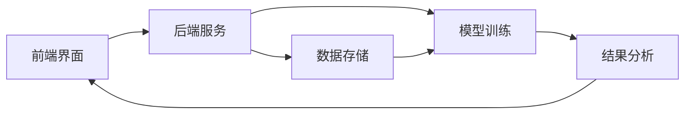

                 


# 企业AI Agent的因果推理在产品定价策略中的精准应用

---

## 关键词：
企业AI Agent，因果推理，定价策略，产品定价，AI算法，因果图

---

## 摘要：
本文深入探讨了企业AI Agent如何利用因果推理技术在产品定价策略中实现精准应用。从因果推理的基本原理到其在定价策略中的具体应用，再到系统架构设计和实际项目实战，本文系统性地阐述了如何通过因果推理优化定价策略，提升企业竞争力。文章结合理论与实践，提供了丰富的案例和详细的实现步骤，为企业的智能化定价提供了新的思路和方法。

---

## 第1章: 企业AI Agent与因果推理基础

### 1.1 AI Agent的基本概念

#### 1.1.1 AI Agent的定义与特点
AI Agent（人工智能代理）是一种能够感知环境、自主决策并执行任务的智能实体。它具有以下特点：
- **自主性**：能够自主决策，无需外部干预。
- **反应性**：能够实时感知环境并做出反应。
- **目标导向性**：以特定目标为导向，优化决策过程。

#### 1.1.2 企业级AI Agent的应用场景
企业级AI Agent广泛应用于多个领域，包括：
- **智能客服**：通过自然语言处理技术为用户提供个性化服务。
- **供应链优化**：通过预测需求和优化库存管理。
- **定价策略**：通过因果推理技术优化产品定价。

#### 1.1.3 AI Agent与传统算法的区别
AI Agent的核心区别在于其具备自主决策能力和目标导向性，而传统算法通常需要人工干预和调整。AI Agent能够通过因果推理技术，从数据中发现因果关系，从而实现更精准的决策。

---

### 1.2 因果推理的基本概念

#### 1.2.1 因果关系的定义
因果关系是指一个事件（原因）导致另一个事件（结果）发生的必然联系。例如，价格变动（原因）会导致销量变化（结果）。

#### 1.2.2 因果推理的基本原理
因果推理的核心是通过数据和模型，识别变量之间的因果关系，并预测这些关系在不同情境下的表现。常见的因果推理方法包括：
- **因果图**：通过图结构表示变量之间的因果关系。
- **干预分析**：通过模拟干预变量，评估其对结果的影响。

#### 1.2.3 因果图与因果模型
因果图是一种用于表示因果关系的图形化工具，通常由节点（变量）和边（因果关系）组成。例如：



通过因果图，我们可以清晰地看到变量之间的因果关系，从而为定价策略提供科学依据。

---

## 第2章: 因果推理在定价策略中的应用

### 2.1 定价策略的基本原理

#### 2.1.1 定价策略的分类
定价策略主要包括以下几种：
- **成本加成定价法**：基于成本加一定比例的利润。
- **价值定价法**：基于产品或服务的市场价值定价。
- **动态定价法**：根据市场变化实时调整价格。

#### 2.1.2 定价模型的构建
定价模型通常包括以下几个步骤：
1. **数据收集**：收集历史销售数据、市场数据等。
2. **数据预处理**：清洗和特征工程。
3. **模型训练**：基于因果推理或机器学习算法训练模型。
4. **模型验证**：验证模型的准确性和稳定性。

#### 2.1.3 定价策略的影响因素
影响定价策略的主要因素包括：
- **市场需求**：需求弹性大的产品价格敏感性高。
- **竞争环境**：市场竞争激烈的产品需要灵活定价。
- **成本结构**：成本是定价的重要参考。

### 2.2 因果推理在定价中的作用

#### 2.2.1 因果推理在需求预测中的应用
通过因果推理技术，我们可以预测价格变化对销量的影响。例如：


#### 2.2.2 因果推理在价格弹性分析中的应用
价格弹性是指价格变动对销量的影响程度。通过因果推理，我们可以量化价格弹性系数，并制定相应的定价策略。

#### 2.2.3 因果推理在市场细分中的应用
通过因果推理技术，我们可以识别不同市场细分中的因果关系，制定差异化定价策略。

---

## 第3章: 因果推理的算法原理与数学模型

### 3.1 因果推理的算法原理

#### 3.1.1 因果图的构建与分析
因果图的构建通常包括以下几个步骤：
1. **数据收集**：收集相关变量的观测数据。
2. **变量筛选**：去除无关变量，保留关键变量。
3. **因果关系识别**：通过统计方法或专家知识识别因果关系。
4. **因果图绘制**：使用工具（如DAGitty）绘制因果图。

#### 3.1.2 因果推理的数学模型
因果推理的数学模型通常基于概率论和图论。例如，因果图中的每个节点代表一个变量，边表示因果关系。通过概率分布和条件独立性，我们可以量化因果关系的强度。

#### 3.1.3 因果推理算法
常用的因果推理算法包括：
- **Do-Why**：通过干预分析识别因果关系。
- **因果森林**：基于随机森林的因果推断方法。
- **G-Computation**：基于潜在结果的因果推断方法。

### 3.2 需求预测的因果推理模型

#### 3.2.1 需求预测的基本原理
需求预测的核心是通过因果推理技术，预测价格、广告支出等变量对销量的影响。

#### 3.2.2 因果推理在需求预测中的应用
通过因果推理技术，我们可以量化价格对销量的因果效应，并制定相应的定价策略。

#### 3.2.3 需求预测模型的实现步骤
需求预测模型的实现通常包括以下几个步骤：
1. **数据收集**：收集历史销售数据、价格数据等。
2. **数据预处理**：清洗数据，提取特征。
3. **模型训练**：基于因果推理算法训练模型。
4. **模型验证**：验证模型的准确性和稳定性。
5. **模型应用**：将模型应用于实际定价策略中。

---

## 第4章: 企业AI Agent的系统架构与实现

### 4.1 系统功能设计

#### 4.1.1 系统功能模块划分
企业AI Agent的系统功能模块通常包括：
- **数据采集模块**：负责数据的采集和预处理。
- **因果推理模块**：负责因果图的构建和因果关系的识别。
- **定价策略模块**：负责基于因果推理结果制定定价策略。
- **结果分析模块**：负责分析定价策略的效果并优化模型。

#### 4.1.2 系统功能模块的实现
以下是系统功能模块的实现步骤：
1. **数据采集模块**：通过API接口或数据库采集相关数据。
2. **因果推理模块**：基于因果图和因果推理算法，识别变量之间的因果关系。
3. **定价策略模块**：根据因果推理结果，制定相应的定价策略。
4. **结果分析模块**：分析定价策略的效果，并优化模型。

#### 4.1.3 系统功能模块的交互设计
系统功能模块之间的交互设计如下：


### 4.2 系统架构设计

#### 4.2.1 系统架构的总体设计
企业AI Agent的系统架构通常包括以下几个部分：
- **前端界面**：用户通过前端界面提交需求和查看结果。
- **后端服务**：负责处理用户请求并调用相关模块。
- **数据存储**：存储数据和模型。
- **模型训练**：负责因果推理和定价策略的训练。

#### 4.2.2 系统架构的详细设计
以下是系统架构的详细设计：



---

## 第5章: 项目实战与最佳实践

### 5.1 项目需求分析

#### 5.1.1 项目背景
某电商平台希望通过AI Agent技术优化产品定价策略，提高销售额和利润率。

#### 5.1.2 项目目标
- 建立因果推理模型，预测价格变动对销量的影响。
- 制定动态定价策略，实时调整产品价格。

### 5.2 数据准备与特征工程

#### 5.2.1 数据来源
- 历史销售数据
- 市场数据
- 产品属性数据

#### 5.2.2 数据预处理
- 数据清洗：去除无效数据和异常值。
- 特征工程：提取关键特征，如价格、销量、时间等。

### 5.3 模型实现与优化

#### 5.3.1 模型实现
以下是基于因果推理的定价策略模型实现：

```python
import pandas as pd
import numpy as np
from causal森林 import CausalForest

# 数据加载
data = pd.read_csv('pricing_data.csv')

# 特征工程
X = data[['价格', '广告支出', '时间']]
y = data['销量']

# 模型训练
model = CausalForest(n_estimators=100)
model.fit(X, y)

# 因果效应分析
treatment_effect = model.ate('价格')
print(treatment_effect)
```

#### 5.3.2 模型优化
通过交叉验证和超参数调优，优化模型性能。例如：

```python
from sklearn.model_selection import GridSearchCV

param_grid = {
    'n_estimators': [50, 100, 150],
    'max_depth': [5, 10, 15]
}

grid_search = GridSearchCV(model, param_grid, cv=5)
grid_search.fit(X, y)
best_model = grid_search.best_estimator_
```

### 5.4 实际案例分析

#### 5.4.1 案例背景
某电商平台希望通过因果推理技术优化电子产品定价策略。

#### 5.4.2 案例分析
通过因果推理模型，我们发现价格变动对销量的影响较大，因此建议制定动态定价策略，根据市场需求实时调整价格。

### 5.5 项目小结

#### 5.5.1 项目成果
通过该项目，我们成功建立了基于因果推理的定价策略模型，并验证了其在实际中的应用效果。

#### 5.5.2 经验总结
- 数据质量对模型性能影响较大，需要加强数据清洗和特征工程。
- 模型优化需要结合业务场景，选择合适的算法和参数。

---

## 结语

企业AI Agent的因果推理在产品定价策略中的精准应用，不仅提高了定价策略的科学性和精准性，还为企业带来了显著的经济效益。通过因果推理技术，企业可以更好地理解市场规律，优化定价策略，提升竞争力。未来，随着AI技术的不断发展，因果推理在企业定价策略中的应用将更加广泛和深入。

---

## 作者

作者：AI天才研究院/AI Genius Institute & 禅与计算机程序设计艺术 /Zen And The Art of Computer Programming

