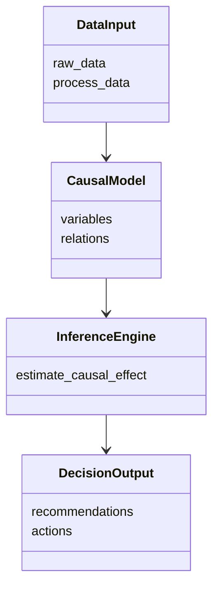
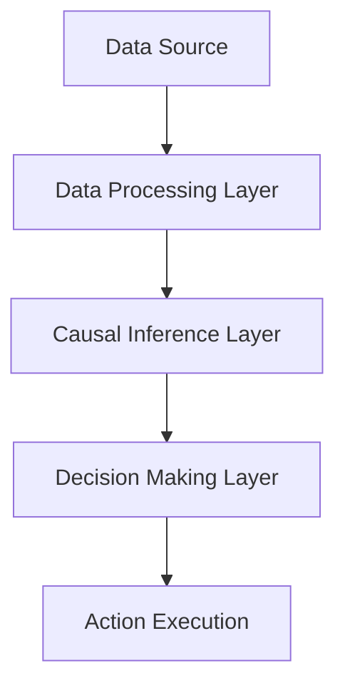
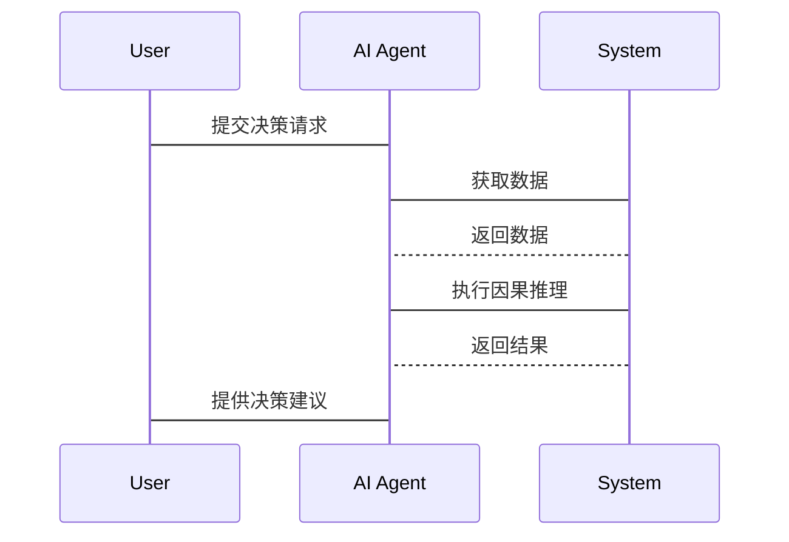

                 


# 企业AI Agent的因果推理在商业决策中的应用

> 关键词：企业AI Agent，因果推理，商业决策，算法原理，系统架构，项目实战

> 摘要：本文深入探讨了企业AI Agent在因果推理中的应用，结合商业决策的实际场景，详细讲解了因果推理的核心概念、算法原理、系统架构设计以及项目实战。文章通过具体案例分析，展示了因果推理如何帮助企业做出更明智的商业决策，并提供了系统的解决方案和最佳实践。

---

## 第1章 企业AI Agent与因果推理概述

### 1.1 问题背景与问题描述

#### 1.1.1 企业决策中的不确定性问题
在企业运营中，决策者经常面临不确定性问题，例如市场需求波动、供应链中断等。传统的统计方法只能提供相关性，无法揭示因果关系，导致决策失误。

#### 1.1.2 传统统计推断的局限性
传统统计方法（如回归分析）只能发现变量之间的相关性，无法直接推断因果关系。这使得企业在复杂决策中难以准确预测结果。

#### 1.1.3 因果推理在商业决策中的价值
因果推理能够揭示变量之间的因果关系，帮助企业更好地理解业务流程中的因果机制，从而做出更精准的商业决策。

### 1.2 问题解决与边界

#### 1.2.1 因果推理的核心问题解决方法
通过因果推理，企业可以识别因果关系，评估干预措施的效果，并进行反事实推理，从而优化决策。

#### 1.2.2 企业AI Agent的边界与外延
企业AI Agent的边界包括数据范围、决策权限和应用场景。其外延涉及数据科学、机器学习和运筹学等多个领域。

#### 1.2.3 因果推理与相关概念的对比分析
通过对比分析，明确因果推理与相关性分析、预测模型等概念的区别和联系。

### 1.3 核心概念与组成要素

#### 1.3.1 因果推理的基本概念
因果推理研究变量之间的因果关系，旨在揭示“为什么”某种现象发生。

#### 1.3.2 企业AI Agent的组成要素
企业AI Agent通常包括数据采集、因果建模、推理引擎和决策优化模块。

#### 1.3.3 因果推理在商业决策中的应用结构
因果推理在商业决策中的应用结构包括数据准备、模型构建、推理分析和结果应用四个阶段。

---

## 第2章 因果推理的核心概念与联系

### 2.1 因果推理的原理

#### 2.1.1 因果关系的定义与特征
因果关系是指一个事件（原因）导致另一个事件（结果）发生的规律。其特征包括时间顺序、相关性和必要性。

#### 2.1.2 因果推理的基本原理
因果推理基于潜在结果框架，通过比较不同干预下的结果，推断因果关系。

#### 2.1.3 因果推理与相关性的对比
相关性关注变量之间的关联程度，而因果推理关注变量之间的因果关系。

### 2.2 因果图模型

#### 2.2.1 因果图的基本结构
因果图由节点（变量）和边（因果关系）组成，用于表示变量之间的因果关系。

#### 2.2.2 贝叶斯网络与因果图的关系
贝叶斯网络是概率图模型，而因果图是其扩展，用于表示因果关系。

#### 2.2.3 因果图的构建方法
因果图的构建方法包括基于领域知识的构建和基于数据的结构学习。

### 2.3 因果推理的核心算法

#### 2.3.1 随机化实验与因果估计
随机化实验通过随机分配处理，估计因果效应。

#### 2.3.2 调整方法与匹配方法
调整方法通过控制混杂变量，匹配方法通过匹配样本，消除偏倚。

#### 2.3.3 结构学习与参数估计
结构学习用于发现因果图的结构，参数估计用于估计因果关系的强度。

### 2.4 因果推理与企业AI Agent的结合

#### 2.4.1 因果推理在商业决策中的应用场景
因果推理可用于市场预测、客户行为分析和供应链优化等场景。

#### 2.4.2 企业AI Agent的因果推理架构
企业AI Agent的因果推理架构包括数据输入、模型构建、推理分析和决策输出四个模块。

#### 2.4.3 因果推理与企业数据流的结合
因果推理与企业数据流的结合实现了数据驱动的因果分析，支持智能决策。

---

## 第3章 因果推理的算法原理

### 3.1 潜在结果框架

#### 3.1.1 潜在结果的定义
潜在结果是指在不同干预下，变量的可能结果。

#### 3.1.2 潜在结果的估计方法
潜在结果的估计方法包括匹配估计和回归估计。

#### 3.1.3 潜在结果框架的数学模型
$$ Y_i = \tau D_i + X_i\beta + \epsilon_i $$
其中，$Y_i$是结果，$D_i$是处理变量，$\tau$是因果效应，$X_i$是控制变量，$\epsilon_i$是误差项。

### 3.2 因果图模型的构建与学习

#### 3.2.1 贝叶斯网络的构建
贝叶斯网络的构建需要根据领域知识定义变量之间的关系。

#### 3.2.2 结构学习算法
结构学习算法包括基于评分的算法和基于搜索的算法。

#### 3.2.3 参数估计方法
参数估计方法包括最大似然估计和贝叶斯估计。

### 3.3 因果推理算法的实现

#### 3.3.1 随机化实验的实现
随机化实验通过随机分配处理，估计因果效应。

#### 3.3.2 调整方法的实现
调整方法通过控制混杂变量，消除偏倚。

#### 3.3.3 结构学习的实现
结构学习通过算法发现因果图的结构。

### 3.4 因果推理算法的优缺点

#### 3.4.1 各种算法的优缺点对比
- 随机化实验：优点是结果可靠，缺点是成本高。
- 调整方法：优点是适用性强，缺点是需要大量数据。
- 结构学习：优点是自动发现因果关系，缺点是计算复杂。

#### 3.4.2 算法选择的依据
算法选择的依据包括数据类型、应用场景和计算资源。

#### 3.4.3 算法优化的方向
算法优化的方向包括提高计算效率和改进模型准确性。

---

## 第4章 企业AI Agent的系统分析与架构设计

### 4.1 项目背景与目标

#### 4.1.1 项目背景介绍
项目旨在通过因果推理优化企业的商业决策。

#### 4.1.2 项目目标设定
项目目标包括构建因果推理模型、实现AI Agent的决策优化功能。

#### 4.1.3 项目范围界定
项目范围包括数据准备、模型开发和系统集成。

### 4.2 系统功能设计

#### 4.2.1 领域模型类图


#### 4.2.2 系统架构设计


#### 4.2.3 系统接口设计


### 4.3 系统实现

#### 4.3.1 环境安装
安装Python、Pandas、DoWhy等依赖库。

#### 4.3.2 核心代码实现
```python
import pandas as pd
from dowhy import CausalModel

# 加载数据
data = pd.read_csv('data.csv')

# 构建因果模型
model = CausalModel(data, treatment='treatment', outcome='outcome')

# 估计因果效应
model.do_postgres()
```

#### 4.3.3 代码功能解读
上述代码实现了因果模型的构建和因果效应的估计。

---

## 第5章 项目实战：因果推理在商业决策中的应用

### 5.1 案例背景

#### 5.1.1 案例介绍
某零售企业希望通过因果推理优化促销策略。

### 5.2 数据准备与模型构建

#### 5.2.1 数据清洗与预处理
使用Pandas进行数据清洗和预处理。

#### 5.2.2 模型构建与训练
使用DoWhy库构建因果模型。

### 5.3 案例分析

#### 5.3.1 案例分析与结果解读
通过因果推理模型，分析促销活动对销售额的影响。

#### 5.3.2 优化策略
根据因果分析结果，优化促销策略。

### 5.4 项目小结

#### 5.4.1 项目成果
项目成功构建了因果推理模型，优化了企业的促销策略。

#### 5.4.2 经验总结
因果推理在商业决策中的应用需要结合领域知识和数据科学方法。

---

## 第6章 最佳实践与未来展望

### 6.1 小结

#### 6.1.1 核心内容总结
因果推理是企业AI Agent在商业决策中的重要工具。

### 6.2 注意事项

#### 6.2.1 数据质量的重要性
数据质量直接影响因果推理的结果。

#### 6.2.2 模型选择的注意事项
模型选择需要考虑数据类型和应用场景。

### 6.3 拓展阅读

#### 6.3.1 推荐的书籍与资源
推荐学习因果推理的经典书籍和相关资源。

---

## 作者：AI天才研究院 & 禅与计算机程序设计艺术

---

这篇文章详细介绍了企业AI Agent的因果推理在商业决策中的应用，结合实际案例和系统设计，为读者提供了丰富的理论和实践指导。希望对您有所帮助！

