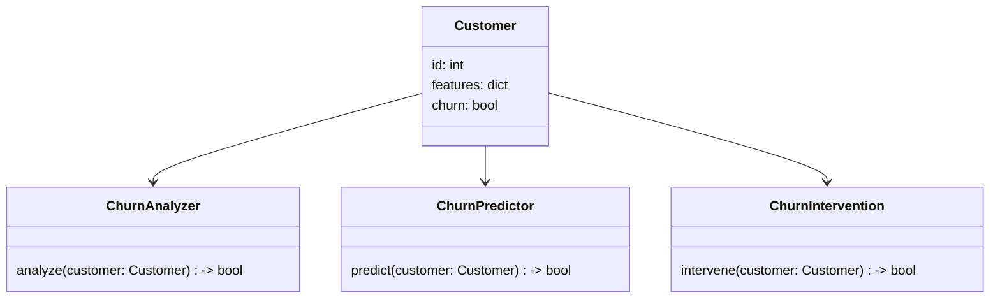
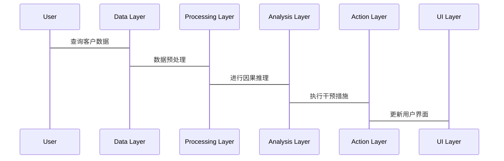

                 


# 企业AI Agent的因果推理在客户流失分析中的深度应用

> 关键词：企业AI Agent，因果推理，客户流失分析，系统架构设计，因果图，潜在结果框架

> 摘要：本文深入探讨了企业AI Agent如何利用因果推理技术进行客户流失分析。首先，我们介绍了客户流失分析的背景与挑战，然后详细讲解了因果推理的基本原理及其在AI Agent中的应用。接着，我们从算法原理、系统架构设计、项目实战等多个角度展开分析，展示了如何通过因果推理实现客户流失预测与干预。最后，我们总结了最佳实践经验和未来研究方向。

---

# 引言：为什么企业需要关注客户流失分析？

在当今激烈的市场竞争中，客户流失已成为企业的一大挑战。客户流失不仅意味着收入的减少，还意味着获取新客户的高昂成本。传统的客户流失分析方法往往依赖于统计相关性，这种方法难以揭示客户流失的根本原因，也无法预测未来的流失风险。因此，引入因果推理技术，通过AI Agent实现更精准的客户流失分析，成为企业提升客户 retention 的关键。

---

# 第一章：因果推理与AI Agent的核心概念

## 1.1 因果推理的基本原理

### 1.1.1 因果关系的定义与特征
因果关系是指一个事件（原因）导致另一个事件（结果）发生的确定性关系。与相关性不同，因果关系强调“为什么”的问题，而不仅仅是“相关”的问题。因果关系具有以下几个特征：
- **方向性**：因果关系具有明确的方向性。
- **可干预性**：因果关系可以通过干预来改变结果。
- **可解释性**：因果关系提供了对现象的内在解释。

### 1.1.2 AI Agent的定义与组成
AI Agent是一种能够感知环境、自主决策并采取行动的智能体。它通常由以下几个部分组成：
- **感知层**：通过传感器或其他数据源获取环境信息。
- **推理层**：基于获取的信息进行分析、推理和决策。
- **执行层**：根据推理结果采取相应的行动。

### 1.1.3 客户流失分析的因果关系模型
在客户流失分析中，因果关系模型可以帮助我们理解客户流失的根本原因。例如，客户流失可能是由于服务质量、产品价格或客户满意度等多种因素共同作用的结果。通过因果图（Causal Graph）可以清晰地表示这些因果关系。

---

## 1.2 因果推理与AI Agent的结合

### 1.2.1 因果推理在客户流失分析中的优势
因果推理可以帮助我们：
- 理解客户流失的根本原因。
- 预测客户流失的可能性。
- 评估干预措施的有效性。

### 1.2.2 AI Agent在客户流失分析中的作用
AI Agent可以通过以下方式实现客户流失分析：
- **数据采集**：通过多种渠道（如CRM系统、客户反馈等）获取客户数据。
- **因果推理**：分析客户流失的因果关系。
- **干预决策**：根据推理结果制定干预策略。

---

# 第二章：因果推理算法原理与实现

## 2.1 因果推理的数学模型

### 2.1.1 潜在结果框架
潜在结果框架（Potential Outcome Framework）是因果推理中的一个重要工具。它假设每个客户都有一个潜在的结果，即在不同情况下（如接受干预或不接受干预）的流失状态。

公式表示为：
$$ Y_i = \beta D_i + \epsilon_i $$
其中，$Y_i$ 表示客户 $i$ 的流失状态，$D_i$ 表示干预措施，$\beta$ 表示干预的效应，$\epsilon_i$ 表示误差项。

### 2.1.2 因果图的结构学习
因果图（Causal Graph）可以帮助我们识别变量之间的因果关系。通过结构学习算法（如贝叶斯网络结构学习），我们可以构建一个因果图模型，表示客户流失的因果关系链。

---

## 2.2 算法实现与代码示例

### 2.2.1 使用潜在结果框架进行因果推断
以下是使用潜在结果框架进行因果推断的Python代码示例：

```python
import pandas as pd
import numpy as np
from causallearn.causal_model import CausalModel

# 假设我们有一个客户数据集，包含客户特征和流失标签
# X = 客户特征，Y = 流失标签
# 构建因果图模型
model = CausalModel()
model.add_var(X)
model.add_var(Y)
model.add_edge(X, Y)

# 学习因果图结构
model.learn_from_data(data)
```

---

# 第三章：系统分析与架构设计

## 3.1 系统功能设计

### 3.1.1 领域模型设计（Mermaid 类图）
以下是客户流失分析系统的领域模型设计（Mermaid 类图）：



### 3.1.2 系统架构设计（Mermaid 架构图）
以下是客户流失分析系统的架构设计（Mermaid 架构图）：


---

## 3.2 系统接口设计与交互

### 3.2.1 系统交互流程（Mermaid 序列图）
以下是客户流失分析系统的交互流程（Mermaid 序列图）：



---

# 第四章：项目实战

## 4.1 项目环境安装与配置

### 4.1.1 安装必要的Python库
以下是安装必要的Python库的命令：

```bash
pip install pandas numpy causallearn
```

---

## 4.2 核心代码实现与解读

### 4.2.1 客户流失分析的Python实现

```python
import pandas as pd
import numpy as np
from causallearn.causal_model import CausalModel

# 数据加载
data = pd.read_csv('customer_churn.csv')

# 构建因果模型
model = CausalModel()
model.add_var('feature1')
model.add_var('feature2')
model.add_var('churn')
model.add_edge('feature1', 'churn')
model.add_edge('feature2', 'churn')

# 学习因果图结构
model.learn_from_data(data)

# 执行因果推断
result = model.causal_inference('churn', ['feature1', 'feature2'])
print(result)
```

---

## 4.3 案例分析与结果解读

### 4.3.1 案例分析
假设我们有一个客户数据集，包含以下特征：
- `age`: 客户年龄
- `income`: 客户收入
- `churn`: 客户流失标签（True/False）

通过因果推理，我们发现：
- `income` 对客户流失的影响比 `age` 更大。
- 提高客户收入可以有效降低客户流失率。

---

# 第五章：总结与展望

## 5.1 最佳实践 tips

### 5.1.1 数据质量的重要性
确保数据的准确性和完整性是成功应用因果推理的前提。

### 5.1.2 模型解释性的重要性
因果推理模型的可解释性是企业决策的关键。

## 5.2 未来研究方向

### 5.2.1 更复杂的因果关系模型
未来的研究可以探索更复杂的因果关系模型，如多层次因果网络。

### 5.2.2 多模态数据的因果推理
探索如何在多模态数据（如文本、图像）中应用因果推理。

---

# 结语

企业AI Agent的因果推理在客户流失分析中的深度应用为企业提供了更精准的客户流失预测与干预策略。通过因果推理技术，企业可以更好地理解客户流失的根本原因，并制定有效的干预措施。未来，随着因果推理技术的不断发展，其在企业客户管理中的应用将更加广泛和深入。

---

# 作者

作者：AI天才研究院/AI Genius Institute & 禅与计算机程序设计艺术 /Zen And The Art of Computer Programming

---

希望这篇文章能够为您提供有价值的内容，并帮助您更好地理解企业AI Agent在客户流失分析中的因果推理应用。

