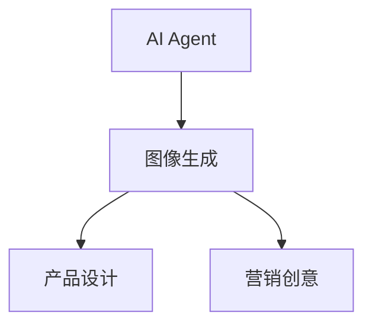
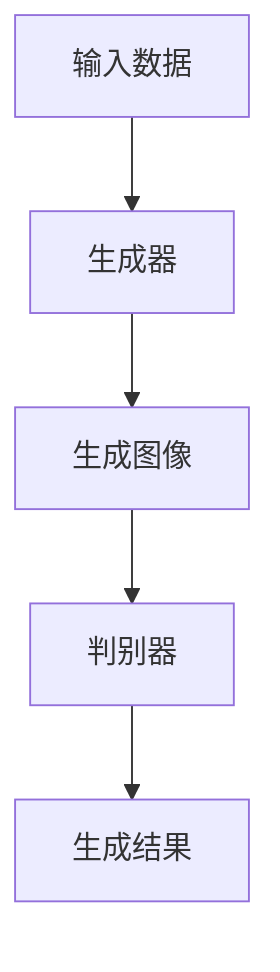
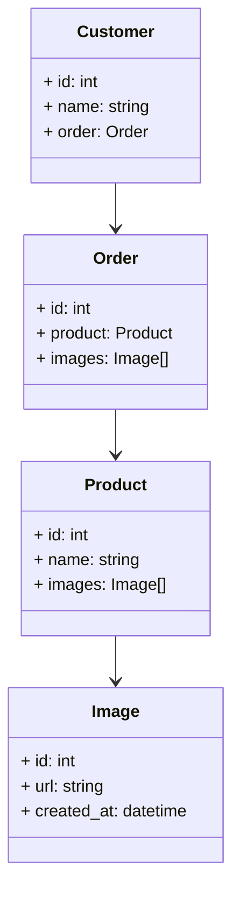
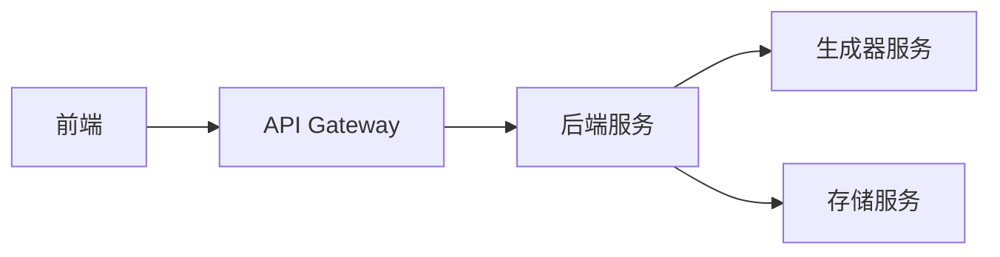
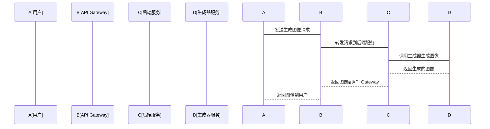

                 


# 企业AI Agent的图像生成技术：产品设计与营销创意

> 关键词：企业AI Agent，图像生成技术，产品设计，营销创意，AI图像生成，企业应用

> 摘要：本文详细探讨了企业AI Agent在图像生成技术中的应用，结合产品设计和营销创意的实际案例，分析了AI图像生成技术对企业创新和市场竞争力的影响，为企业在数字化转型中提供了新的思路和解决方案。

---

## 第一部分：企业AI Agent的图像生成技术概述

### 第1章：企业AI Agent与图像生成技术的背景介绍

#### 1.1 问题背景与描述

##### 1.1.1 企业AI Agent的定义与特点

- **定义**：企业AI Agent是指具备自主决策、学习和执行任务能力的智能系统，能够为企业提供自动化解决方案。
- **特点**：
  - 智能性：能够理解、推理和解决问题。
  - 自主性：无需人工干预，自主执行任务。
  - 适应性：能够根据环境变化调整策略。

##### 1.1.2 图像生成技术的发展历程

- **早期阶段**：基于规则的图像生成，依赖手动设定参数。
- **发展阶段**：引入机器学习算法，如支持向量机（SVM）和朴素贝叶斯。
- **现代阶段**：深度学习技术的突破，特别是生成对抗网络（GAN）和变分自编码器（VAE）的应用。

##### 1.1.3 企业AI Agent与图像生成技术的结合场景

- **产品设计**：通过AI生成设计草图和原型，加速产品开发。
- **营销创意**：生成广告图像、海报，提升营销效率。
- **用户体验优化**：根据用户行为生成个性化图像内容。

#### 1.2 问题解决与边界

##### 1.2.1 AI Agent在图像生成中的问题解决

- **问题**：传统图像生成效率低、成本高，依赖人工操作。
- **解决方案**：AI Agent通过自动化学习和生成，提高效率和降低成本。

##### 1.2.2 图像生成技术的边界与外延

- **边界**：图像生成的质量和真实性限制。
- **外延**：图像生成技术的应用范围扩展，如医疗图像生成、虚拟现实等。

##### 1.2.3 企业应用中的图像生成技术特征

- **高效性**：快速生成大量图像。
- **准确性**：生成图像符合业务需求。
- **可定制性**：支持个性化定制。

### 第2章：核心概念与联系

#### 2.1 AI Agent与图像生成技术的关系

##### 2.1.1 AI Agent的核心概念与原理

- **核心概念**：AI Agent具备感知、决策、执行能力。
- **原理**：通过传感器接收信息，利用算法处理信息，执行任务。

##### 2.1.2 图像生成技术的原理与特征

- **原理**：通过深度学习模型生成图像。
- **特征**：生成速度快、质量高、多样化。

##### 2.1.3 两者的结合场景

- **产品设计**：AI Agent生成设计草图，辅助设计师工作。
- **营销创意**：生成广告图像，提升营销效果。

#### 2.2 核心概念对比分析

##### 2.2.1 生成对抗网络（GAN）与变分自编码器（VAE）对比

| 对比维度       | GAN                          | VAE                          |
|----------------|------------------------------|------------------------------|
| 原理           | 生成器与判别器对抗            | 编码器与解码器结构            |
| 优势           | 生成高质量图像                | 易于采样，生成多样化图像        |
| 缺点           | 训练不稳定，易模式崩溃          | 生成图像质量较低              |

##### 2.2.2 图像生成模型的性能对比表格

| 模型           | 参数量 | 生成速度 | 图像质量 |
|----------------|--------|----------|----------|
| GAN            | 高     | 中       | 高       |
| VAE            | 中     | 高       | 中       |
| StyleGAN       | 高     | 中       | 高       |

##### 2.2.3 ER实体关系图架构

```mermaid
erDiagram
    customer[客户] -->{1,m} order[订单]
    order -->{1,1} product[产品]
    product -->{1,m} image[图像]
```

#### 2.3 Mermaid流程图展示

##### 2.3.1 AI Agent与图像生成技术的关系图



##### 2.3.2 图像生成模型的流程图



---

## 第二部分：算法原理讲解

### 第3章：生成对抗网络（GAN）原理

#### 3.1 GAN的基本结构

- **生成器**：负责生成图像。
- **判别器**：负责判断图像是否为真实图像。

#### 3.2 GAN的数学模型与公式

- **生成器的损失函数**：
  $$ \mathcal{L}_G = \mathbb{E}_{z \sim p(z)}[\mathcal{L}(G(z), y=1)] $$
- **判别器的损失函数**：
  $$ \mathcal{L}_D = \mathbb{E}_{x \sim p(x)}[\mathcal{L}(D(x), y=1)] + \mathbb{E}_{z \sim p(z)}[\mathcal{L}(D(G(z)), y=0)] $$

#### 3.3 GAN的优缺点

- **优点**：生成高质量图像。
- **缺点**：训练不稳定，易模式崩溃。

### 第4章：变分自编码器（VAE）原理

#### 4.1 VAE的编码与解码过程

- **编码器**：将输入图像映射到潜在空间。
- **解码器**：将潜在空间数据解码为图像。

#### 4.2 VAE的数学模型与公式

- **变分下界**：
  $$ \mathcal{L} = \mathbb{E}_{x}[ \mathcal{L}_\text{recon}(x, G(z))] + \mathbb{E}_{z}[ \text{KL}(q(z|x)||p(z))] $$

#### 4.3 VAE的优缺点

- **优点**：生成多样化图像，易于采样。
- **缺点**：生成图像质量较低。

---

## 第三部分：系统分析与架构设计方案

### 第5章：系统分析与架构设计

#### 5.1 问题场景介绍

- **场景**：企业需要快速生成高质量的产品图像用于营销。

#### 5.2 系统功能设计

##### 5.2.1 领域模型



#### 5.3 系统架构设计

##### 5.3.1 系统架构图



#### 5.4 系统接口设计

##### 5.4.1 API接口

- **生成图像接口**：`POST /api/generate-image`
- **查询图像接口**：`GET /api/images`

#### 5.5 系统交互流程图



---

## 第四部分：项目实战

### 第6章：项目实战

#### 6.1 环境安装

- **Python 3.8+**
- **TensorFlow或Keras**
- **Mermaid工具**

#### 6.2 核心代码实现

##### 6.2.1 GAN实现代码

```python
import tensorflow as tf
from tensorflow.keras import layers

def make_generator_model():
    model = tf.keras.Sequential()
    model.add(layers.Dense(256, activation='relu', input_shape=(100,)))
    model.add(layers.Dense(512, activation='relu'))
    model.add(layers.Dense(784, activation='sigmoid'))
    return model

def make_discriminator_model():
    model = tf.keras.Sequential()
    model.add(layers.Dense(784, activation='relu', input_shape=(784,)))
    model.add(layers.Dense(256, activation='relu'))
    model.add(layers.Dense(1, activation='sigmoid'))
    return model
```

##### 6.2.2 VAE实现代码

```python
import tensorflow as tf
from tensorflow.keras import layers

def make_vae_encoder(input_shape):
    encoder = tf.keras.Sequential()
    encoder.add(layers.Dense(256, activation='relu', input_shape=input_shape))
    encoder.add(layers.Dense(128, activation='relu'))
    return encoder

def make_vae_decoder(output_shape):
    decoder = tf.keras.Sequential()
    decoder.add(layers.Dense(128, activation='relu'))
    decoder.add(layers.Dense(input_shape[0] * input_shape[1], activation='sigmoid'))
    return decoder
```

#### 6.3 案例分析与解读

- **案例1**：生成产品设计草图。
- **案例2**：生成营销广告图像。

#### 6.4 项目总结

- **成功经验**：AI Agent显著提高了图像生成效率。
- **问题与优化**：训练时间长，模型优化空间大。

---

## 第五部分：最佳实践与拓展

### 第7章：最佳实践与拓展

#### 7.1 最佳实践 tips

- **选择合适的模型**：根据需求选择GAN或VAE。
- **优化训练过程**：使用合适的数据增强和优化策略。

#### 7.2 小结

- 企业AI Agent在图像生成技术中的应用为企业提供了高效、智能的解决方案。
- 需要根据具体需求选择合适的算法，并持续优化模型性能。

#### 7.3 注意事项

- **数据质量**：确保训练数据的多样性和质量。
- **模型调优**：持续监控和调优模型性能。

#### 7.4 拓展阅读

- 推荐阅读《生成对抗网络：算法与实现》和《深度学习实战》。

---

## 作者：AI天才研究院/AI Genius Institute & 禅与计算机程序设计艺术 /Zen And The Art of Computer Programming

---

以上是《企业AI Agent的图像生成技术：产品设计与营销创意》的技术博客内容，涵盖了从背景介绍到实战案例的详细分析，为企业应用AI技术提供了有价值的参考和指导。

