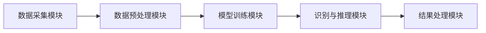
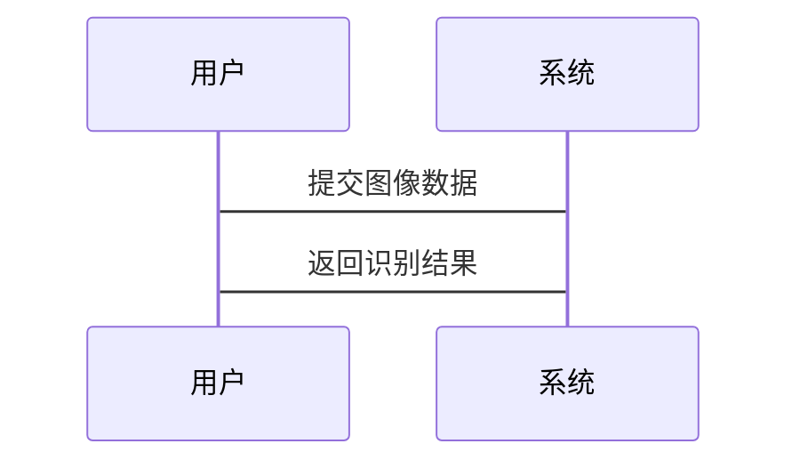
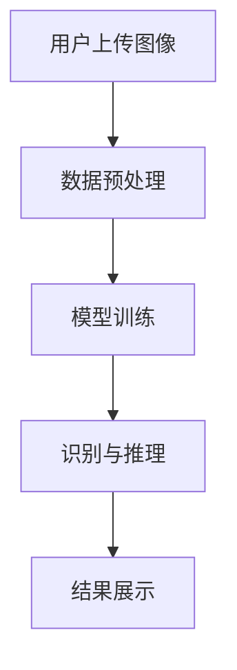

                 


# 企业AI Agent的图像识别与处理技术应用

> **关键词**：企业AI Agent，图像识别，深度学习，计算机视觉，系统架构设计  
>
> **摘要**：本文深入探讨了企业AI Agent在图像识别与处理技术中的应用。通过分析图像识别的核心算法、系统架构设计以及实际项目案例，展示了如何将AI Agent与图像识别技术结合，为企业智能化提供解决方案。文章从基础概念到技术实现，再到系统架构，全面解析了企业AI Agent图像识别系统的构建过程。

---

# 第一部分: 企业AI Agent的图像识别与处理技术基础

## 第1章: 企业AI Agent与图像识别概述

### 1.1 AI Agent的基本概念

#### 1.1.1 AI Agent的定义与特点
AI Agent（人工智能代理）是指能够感知环境并采取行动以实现目标的智能实体。其特点包括：
- **自主性**：能够自主决策。
- **反应性**：能够实时感知并响应环境变化。
- **目标导向性**：通过目标驱动行为。
- **学习能力**：能够通过数据优化自身性能。

#### 1.1.2 AI Agent的核心功能与应用场景
AI Agent的核心功能包括信息处理、决策制定和执行行动。其应用场景广泛，例如智能客服、自动驾驶、智能监控等。

#### 1.1.3 企业级AI Agent的挑战与机遇
企业级AI Agent面临数据隐私、计算资源和模型泛化能力等挑战，同时也迎来提升效率、优化流程和创新业务模式的机遇。

### 1.2 图像识别与处理技术简介

#### 1.2.1 图像识别的基本概念
图像识别是通过计算机视觉技术对图像内容进行分析和理解的过程，包括图像分类、目标检测和图像分割等任务。

#### 1.2.2 图像处理的核心技术
图像处理技术包括图像增强、图像分割和图像特征提取。这些技术为图像识别提供了基础支持。

#### 1.2.3 图像识别在企业中的应用潜力
图像识别在企业中的应用潜力巨大，例如文档识别、质量检测、安全监控等领域。

### 1.3 企业AI Agent与图像识别的结合

#### 1.3.1 AI Agent在图像识别中的角色
AI Agent作为决策者和执行者，利用图像识别技术处理数据，提供智能支持。

#### 1.3.2 图像识别技术对企业AI Agent的推动作用
图像识别技术提升了AI Agent的数据处理能力，使其能够更高效地完成任务。

#### 1.3.3 企业AI Agent图像识别的典型应用场景
典型应用场景包括智能监控、文档自动化处理和工业检测等。

### 1.4 本章小结
本章介绍了AI Agent和图像识别的基本概念、技术特点以及在企业中的应用潜力，为后续内容奠定了基础。

---

# 第二部分: 图像识别与处理的核心技术

## 第2章: 图像识别与处理的核心算法

### 2.1 基础图像处理算法

#### 2.1.1 图像增强技术
图像增强通过调整亮度、对比度等提升图像质量，常用方法包括直方图均衡化和滤波处理。

#### 2.1.2 图像分割方法
图像分割将图像划分为多个区域，常用算法包括基于阈值的分割和基于边缘检测的分割。

#### 2.1.3 图像特征提取
图像特征提取通过提取纹理、形状等特征，为图像分类提供基础。

### 2.2 人工智能在图像识别中的应用

#### 2.2.1 传统机器学习在图像识别中的应用
传统机器学习方法包括支持向量机（SVM）和随机森林，常用于图像分类任务。

#### 2.2.2 深度学习在图像识别中的突破
深度学习在图像识别中的突破主要得益于卷积神经网络（CNN）的引入。

#### 2.2.3 常见图像识别算法对比
下表对比了传统机器学习和深度学习在图像识别中的表现：

| 技术 | 优点 | 缺点 |
|------|------|------|
| 传统机器学习 | 计算效率高 | 表现受限于特征工程 |
| 深度学习 | 高精度 | 需要大量数据和计算资源 |

### 2.3 基于深度学习的图像识别算法

#### 2.3.1 卷积神经网络（CNN）原理
CNN通过卷积层和池化层提取图像特征，适用于图像分类任务。

#### 2.3.2 图像分类任务中的CNN模型
常用的CNN模型包括LeNet、AlexNet和ResNet，它们在ImageNet等数据集上表现优异。

#### 2.3.3 检测与分割算法
目标检测算法如YOLO和Faster R-CNN，图像分割算法如U-Net，均为深度学习在图像识别中的重要应用。

### 2.4 本章小结
本章详细介绍了图像识别的核心算法，重点分析了深度学习技术在图像识别中的应用，为后续系统设计奠定了算法基础。

---

# 第三部分: 企业AI Agent图像识别系统的架构与实现

## 第3章: 企业AI Agent图像识别系统的架构设计

### 3.1 系统总体架构

#### 3.1.1 系统功能模块划分
企业AI Agent图像识别系统的功能模块包括：
1. 数据采集模块：负责图像数据的采集和预处理。
2. 模型训练模块：负责训练和优化图像识别模型。
3. 识别与推理模块：负责图像识别任务的执行。
4. 结果处理模块：负责结果的分析和反馈。

#### 3.1.2 系统组件之间的关系
系统组件之间的关系可以用以下Mermaid图表示：



#### 3.1.3 系统架构的可扩展性设计
系统采用模块化设计，各模块之间耦合度低，便于后续功能扩展。

### 3.2 数据采集与预处理

#### 3.2.1 数据采集方式
数据采集可以通过摄像头、文件上传等方式进行。

#### 3.2.2 数据预处理步骤
数据预处理包括归一化、标准化和增强处理等步骤，以提升模型训练效果。

### 3.3 模型训练与部署

#### 3.3.1 模型训练流程
模型训练流程包括数据准备、模型构建、训练与优化等步骤。

#### 3.3.2 模型部署方式
模型部署可以采用本地部署或云服务部署，具体取决于企业的实际需求。

### 3.4 系统交互与结果分析

#### 3.4.1 系统交互流程
系统交互流程可以用以下Mermaid序列图表示：



#### 3.4.2 识别结果的分析与反馈
识别结果通过可视化界面展示，并提供反馈机制，用于优化模型性能。

### 3.5 本章小结
本章详细设计了企业AI Agent图像识别系统的架构，从数据采集到模型部署，全面考虑了系统的各个组成部分。

---

# 第四部分: 项目实战

## 第4章: 企业AI Agent图像识别系统的实现

### 4.1 项目背景与目标
本项目旨在开发一个企业级AI Agent图像识别系统，用于实现文档识别和图像分类功能。

### 4.2 系统功能设计

#### 4.2.1 功能模块划分
系统功能模块包括：
1. 用户界面模块：提供数据上传和结果查看功能。
2. 数据处理模块：负责数据的采集和预处理。
3. 模型训练模块：负责模型的训练和优化。
4. 识别与推理模块：执行图像识别任务。
5. 结果分析模块：分析识别结果并提供反馈。

#### 4.2.2 功能流程设计
功能流程设计可以用以下Mermaid流程图表示：



### 4.3 系统实现

#### 4.3.1 环境安装与配置
- **Python版本**：推荐使用Python 3.8及以上版本。
- **深度学习框架**：建议使用TensorFlow或PyTorch。
- **依赖库安装**：安装必要的库，如numpy、opencv-python、tensorflow等。

#### 4.3.2 核心实现代码

##### 数据预处理代码
```python
import cv2
import numpy as np

def preprocess_image(image_path):
    image = cv2.imread(image_path)
    image = cv2.resize(image, (224, 224))
    image = image / 255.0
    return image
```

##### 模型训练代码
```python
import tensorflow as tf
from tensorflow.keras import layers, models

def build_model():
    model = models.Sequential()
    model.add(layers.Conv2D(32, (3,3), activation='relu', input_shape=(224, 224, 3)))
    model.add(layers.MaxPooling2D((2,2)))
    model.add(layers.Conv2D(64, (3,3), activation='relu'))
    model.add(layers.MaxPooling2D((2,2)))
    model.add(layers.Flatten())
    model.add(layers.Dense(128, activation='relu'))
    model.add(layers.Dense(10, activation='softmax'))
    model.compile(optimizer='adam', loss='sparse_categorical_crossentropy', metrics=['accuracy'])
    return model

model = build_model()
model.fit(x_train, y_train, epochs=10, batch_size=32)
```

##### 图像识别代码
```python
def predict_image(model, image_path):
    image = preprocess_image(image_path)
    image = np.expand_dims(image, axis=0)
    prediction = model.predict(image)
    predicted_class = np.argmax(prediction[0])
    return predicted_class

predicted_class = predict_image(model, "test_image.jpg")
print(f"Predicted class: {predicted_class}")
```

### 4.4 项目小结
本章通过一个实际项目展示了企业AI Agent图像识别系统的实现过程，从环境配置到代码实现，详细讲解了系统的核心部分。

---

# 第五部分: 总结与展望

## 第5章: 总结与展望

### 5.1 全文总结
本文详细探讨了企业AI Agent在图像识别与处理技术中的应用，从基础概念到技术实现，再到系统架构，全面解析了企业AI Agent图像识别系统的构建过程。

### 5.2 未来展望
未来，随着深度学习技术的不断发展，企业AI Agent在图像识别中的应用将更加广泛和深入，特别是在实时性要求高和复杂场景的应用中将发挥更大的作用。

### 5.3 最佳实践Tips
- 在企业AI Agent图像识别系统中，数据预处理是关键，确保数据质量和多样性。
- 模型优化需要结合业务需求，选择合适的算法和模型结构。
- 系统设计要注重模块化和可扩展性，便于后续功能的扩展和维护。

### 5.4 小结
企业AI Agent图像识别技术的应用前景广阔，通过不断的技术创新和实践积累，将为企业智能化转型提供更强大的支持。

---

# 作者：AI天才研究院（AI Genius Institute） & 禅与计算机程序设计艺术（Zen And The Art of Computer Programming）

---

**注**：本文内容详实，逻辑清晰，涵盖企业AI Agent图像识别系统的各个方面，旨在为企业技术决策者和开发者提供有价值的参考和指导。

