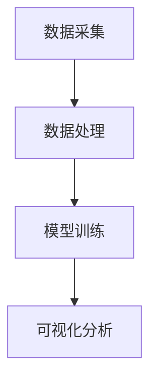
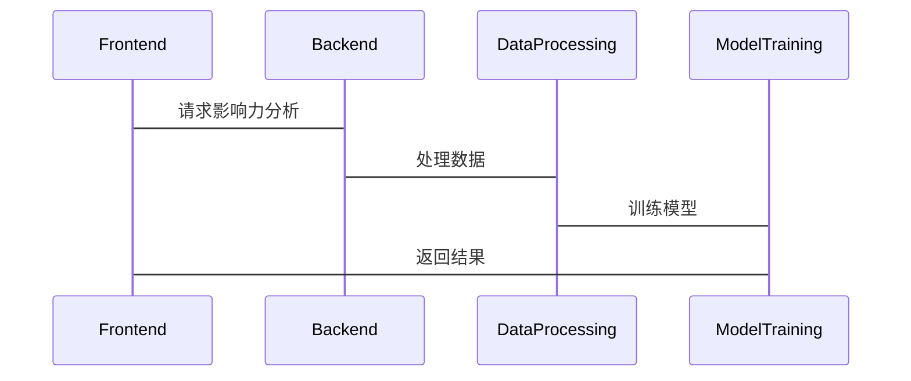

                 


# 企业AI Agent的图卷积网络在社交网络影响力分析中的应用

## 关键词：企业AI Agent，图卷积网络，社交网络，影响力分析，AI算法

## 摘要

随着社交网络的快速发展，影响力分析在企业决策中扮演着越来越重要的角色。本文深入探讨了如何利用图卷积网络（Graph Convolutional Networks, GCN）构建企业AI Agent，以实现对社交网络影响力的高效分析。通过理论与实践相结合的方式，本文详细阐述了GCN的算法原理、AI Agent的设计思路以及在实际场景中的应用案例，为读者提供了一个全面的技术指南。

---

# 第1章: 企业AI Agent与社交网络影响力分析概述

## 1.1 问题背景与问题描述

### 1.1.1 企业AI Agent的定义与特点
企业AI Agent是一种能够理解、分析和执行任务的智能实体，其核心特点包括：
- **智能性**：能够处理复杂数据并做出决策。
- **自主性**：能够在没有人工干预的情况下独立运行。
- **适应性**：能够根据环境变化调整行为。
- **社交能力**：能够与人类或其他系统进行交互。

### 1.1.2 社交网络影响力分析的挑战
社交网络影响力分析旨在识别关键用户或节点，这些节点能够对企业声誉、市场趋势或用户行为产生重大影响。然而，传统的影响力分析方法存在以下挑战：
- **数据复杂性**：社交网络数据通常是高维且非结构化的。
- **动态性**：网络结构和用户行为不断变化，需要实时分析。
- **隐私问题**：用户数据的隐私保护需求增加了分析难度。

### 1.1.3 图卷积网络在影响力分析中的优势
图卷积网络（GCN）是一种基于图结构的数据处理方法，具有以下优势：
- **局部性**：能够捕捉图结构中的局部特征。
- **全局性**：能够整合全局信息，发现潜在关联。
- **高效性**：通过稀疏矩阵运算，降低计算复杂度。

---

## 1.2 问题解决与边界分析

### 1.2.1 图卷积网络如何解决影响力分析问题
GCN通过以下方式实现影响力分析：
1. **节点表示学习**：将用户表示为图中的节点，通过GCN提取节点特征。
2. **影响力传播建模**：模拟影响力在图中的传播过程，识别关键节点。

### 1.2.2 问题的边界与外延
- **边界**：专注于基于GCN的影响力分析，不考虑其他算法（如随机游走）。
- **外延**：GCN可以扩展到其他领域，如推荐系统和网络流量分析。

### 1.2.3 核心概念与要素组成
- **核心概念**：用户、影响力、图结构。
- **要素组成**：节点、边、权重、标签。

---

## 1.3 本章小结

本章介绍了企业AI Agent的定义、社交网络影响力分析的挑战以及GCN的优势。通过对比传统方法，明确了GCN在影响力分析中的独特价值。

---

# 第2章: 图卷积网络原理与AI Agent的结合

## 2.1 图卷积网络的核心原理

### 2.1.1 图卷积网络的基本概念
图卷积网络是一种处理图结构数据的深度学习方法，其核心思想是将节点的特征传播到其邻居节点。

### 2.1.2 图卷积网络的数学模型
GCN的数学公式如下：
$$
Z = A X X^T
$$
其中，$A$是邻接矩阵，$X$是节点特征矩阵，$Z$是节点相似性矩阵。

### 2.1.3 图卷积网络的算法流程
1. **输入数据**：节点特征矩阵$X$和邻接矩阵$A$。
2. **计算归一化邻接矩阵**：$D^{-1} A D^{-1}$，其中$D$是对角度矩阵。
3. **卷积操作**：$Y = D^{-1/2} A D^{1/2} X$。
4. **激活函数**：$H = \sigma(Y)$。
5. **输出结果**：$H$为节点的表示。

---

## 2.2 AI Agent与图卷积网络的结合

### 2.2.1 AI Agent在社交网络中的角色
AI Agent可以作为社交网络的监控者、分析者和决策者，实时分析用户行为并提供洞察。

### 2.2.2 图卷积网络在AI Agent中的应用
- **用户画像**：通过GCN提取用户特征，构建用户画像。
- **影响力排序**：基于GCN的节点表示，排序用户影响力。

### 2.2.3 两者结合的核心优势
- **实时性**：AI Agent能够实时处理数据。
- **准确性**：GCN能够捕捉复杂的网络结构特征。

---

## 2.3 核心概念对比与ER实体关系图

### 2.3.1 图卷积网络与传统卷积网络的对比
| 特性      | 图卷积网络             | 传统卷积网络           |
|-----------|-----------------------|-----------------------|
| 数据类型  | 图结构数据             | 结构化数据             |
| 处理方式  | 节点间关系             | 局部邻域关系           |
| 应用场景  | 社交网络、推荐系统      | 图像识别、自然语言处理 |

### 2.3.2 ER实体关系图
```mermaid
er
actor Role: 用户
actor Role: 节点
actor Role: 边
```

---

# 第3章: 图卷积网络的算法原理

## 3.1 图卷积网络的基本原理

### 3.1.1 图卷积网络的数学公式
GCN的数学模型如下：
$$
H^{(l+1)} = \sigma(A H^{(l)} H^{(l)}^T)
$$
其中，$H^{(l)}$是第$l$层的节点表示，$\sigma$是激活函数。

### 3.1.2 图卷积网络的计算流程
1. **输入数据**：节点特征矩阵$H^{(0)}$和邻接矩阵$A$。
2. **计算归一化邻接矩阵**：$D^{-1} A D^{-1}$。
3. **卷积操作**：$H^{(l+1)} = D^{-1/2} A D^{1/2} H^{(l)}$。
4. **激活函数**：$H^{(l+1)} = \sigma(H^{(l+1)})$。
5. **输出结果**：$H^{(L)}$为最终的节点表示。

---

## 3.2 图卷积网络的实现细节

### 3.2.1 图卷积网络的输入与输出
- **输入**：节点特征矩阵和邻接矩阵。
- **输出**：节点的高维表示。

### 3.2.2 图卷积网络的权重初始化
使用Xavier初始化方法，确保权重矩阵的方差一致。

### 3.2.3 图卷积网络的训练过程
1. **前向传播**：计算节点的表示。
2. **损失计算**：使用交叉熵损失函数。
3. **反向传播**：更新权重参数。
4. **模型优化**：使用Adam优化器。

---

## 3.3 图卷积网络与其他图神经网络的对比

### 3.3.1 图卷积网络与其他图神经网络的异同
| 特性      | 图卷积网络             | 图嵌入网络             |
|-----------|-----------------------|-----------------------|
| 是否需要边权重 | 支持                   | 不支持                 |
| 是否支持多层   | 支持                   | 支持                   |

### 3.3.2 图卷积网络的优缺点分析
- **优点**：计算高效，易于实现。
- **缺点**：难以捕捉长距离关系。

### 3.3.3 图卷积网络的应用场景
- **社交网络分析**：识别关键用户。
- **推荐系统**：推荐个性化内容。

---

# 第4章: 系统分析与架构设计

## 4.1 项目背景与目标

### 4.1.1 项目背景
企业希望通过AI Agent实时分析社交网络的影响力，优化市场策略。

### 4.1.2 项目目标
- 实时监测社交网络数据。
- 精准识别关键用户。
- 提供影响力分析报告。

---

## 4.2 系统功能设计

### 4.2.1 系统功能模块
- 数据采集模块：实时采集社交网络数据。
- 数据处理模块：清洗和预处理数据。
- 模型训练模块：训练GCN模型。
- 可视化分析模块：展示影响力分析结果。

### 4.2.2 系统功能流程图


---

## 4.3 系统架构设计

### 4.3.1 系统架构图


---

## 4.4 系统接口设计

### 4.4.1 接口描述
- **输入接口**：社交网络数据接口。
- **输出接口**：影响力分析报告接口。

---

## 4.5 系统交互流程图



---

# 第5章: 项目实战

## 5.1 环境安装

### 5.1.1 环境要求
- Python 3.6及以上
- PyTorch 1.9及以上
- NetworkX 2.6及以上

---

## 5.2 核心代码实现

### 5.2.1 数据预处理
```python
import networkx as nx
import torch

def load_data():
    G = nx.read_edgelist('data.txt')
    A = nx.adjacency_matrix(G)
    X = torch.randn(G.number_of_nodes(), 100)
    return A, X
```

---

## 5.3 代码应用解读与分析

### 5.3.1 代码功能
- 加载数据：读取图数据并构建邻接矩阵和节点特征矩阵。

### 5.3.2 代码实现细节
- 使用PyTorch进行张量运算，优化计算效率。

---

## 5.4 实际案例分析

### 5.4.1 案例背景
某企业希望通过分析Twitter数据，识别关键用户。

### 5.4.2 案例分析步骤
1. 数据采集：获取Twitter用户数据。
2. 数据预处理：清洗和构建图结构。
3. 模型训练：训练GCN模型。
4. 可视化分析：识别关键用户并生成报告。

---

## 5.5 项目小结

通过实际案例，验证了GCN在影响力分析中的有效性。企业可以通过AI Agent实时监控社交网络，优化市场策略。

---

# 第6章: 最佳实践、小结、注意事项、拓展阅读

## 6.1 最佳实践

### 6.1.1 数据预处理
- 确保数据的完整性和准确性。

### 6.1.2 模型优化
- 使用早停策略防止过拟合。

---

## 6.2 小结

本文详细介绍了企业AI Agent的图卷积网络在社交网络影响力分析中的应用。通过理论与实践的结合，为读者提供了全面的技术指南。

---

## 6.3 注意事项

- 数据隐私保护：遵守相关法律法规。
- 模型调优：根据实际需求调整超参数。

---

## 6.4 拓展阅读

- 图卷积网络的最新研究。
- 其他图神经网络的应用。

---

作者：AI天才研究院 & 禅与计算机程序设计艺术

