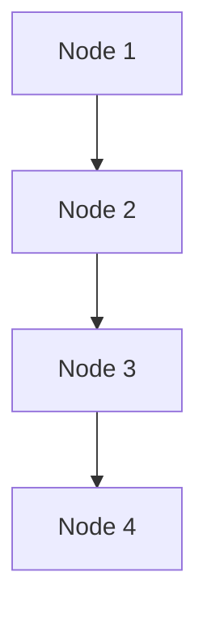

                 

# 企业AI Agent的图神经网络在欺诈检测中的应用

## 关键词：企业AI Agent，图神经网络，欺诈检测，深度学习，图卷积网络（GCN）

## 摘要：本文探讨了企业AI Agent如何利用图神经网络进行欺诈检测。从背景到实战，逐步分析了图神经网络的核心概念、算法原理、系统架构以及实际应用案例，为企业在欺诈检测中的技术选择和实现提供了全面的指导和实践参考。

---

# 第1章: 企业AI Agent与欺诈检测的背景

## 1.1 企业欺诈检测的重要性

### 1.1.1 欺诈检测的定义与问题背景

欺诈检测是企业风险管理的重要组成部分，旨在识别和预防各种欺诈行为。随着企业规模的扩大和交易的复杂化，传统的基于规则的欺诈检测方法逐渐暴露出效率低下、难以应对复杂欺诈手段的局限性。企业需要更高效、更智能的解决方案来应对日益复杂的欺诈威胁。

### 1.1.2 企业欺诈检测的核心目标

1. **实时性**：能够在交易发生时立即识别欺诈行为，避免损失。
2. **准确性**：减少误报和漏报，提高欺诈检测的可靠性和精确性。
3. **可扩展性**：能够处理大规模、高频率的交易数据。
4. **可解释性**：能够清晰地解释欺诈检测的决策过程，便于后续的分析和优化。

### 1.1.3 欺诈检测的边界与外延

- **边界**：主要关注企业的内部交易和外部交易中的欺诈行为，例如金融欺诈、数据造假等。
- **外延**：欺诈检测不仅涉及交易数据，还包括用户行为分析、设备指纹识别等多维度的信息。

---

## 1.2 图神经网络的基本概念

### 1.2.1 图神经网络的定义

图神经网络（Graph Neural Network, GNN）是一种能够处理图结构数据的深度学习模型。图结构数据由节点和边组成，能够有效地表示复杂的实体关系，例如社交网络、金融交易网络等。

### 1.2.2 图神经网络的核心特点

1. **节点表示**：通过图结构信息对每个节点进行低维表示，捕捉节点之间的语义关系。
2. **全局视角**：能够捕捉到图中所有节点的全局信息，而非仅依赖局部特征。
3. **动态更新**：能够动态更新节点表示，适应图结构的实时变化。

### 1.2.3 图神经网络与传统神经网络的区别

| 特性              | 图神经网络                   | 传统神经网络               |
|-------------------|-----------------------------|---------------------------|
| 数据结构          | 图结构（节点和边）           | 结构化数据（如表格、文本）  |
| 处理复杂性         | 处理非线性关系更高效         | 处理复杂关系能力有限       |
| 应用场景           | 社交网络、欺诈检测           | 图像识别、自然语言处理     |

---

## 1.3 AI Agent的定义与特点

### 1.3.1 AI Agent的定义

AI Agent（人工智能代理）是指具有自主决策能力的智能体，能够根据环境信息和目标函数，自主选择最优行为策略。AI Agent在企业欺诈检测中的应用，能够实时分析数据，动态调整检测策略。

### 1.3.2 AI Agent的核心特点

1. **自主性**：能够独立决策，无需人工干预。
2. **反应性**：能够实时感知环境变化并做出响应。
3. **学习能力**：能够通过机器学习技术不断优化自身的检测模型。

### 1.3.3 AI Agent与传统AI的区别

| 特性              | AI Agent                   | 传统AI                   |
|-------------------|---------------------------|-------------------------|
| 自主性             | 高                         | 中                       |
| 适应性            | 强，能够动态调整           | 较弱，依赖预设规则       |
| 应用场景           | 实时决策、动态优化         | 批量处理、静态分析       |

---

## 1.4 图神经网络在欺诈检测中的应用前景

### 1.4.1 图神经网络的潜在应用领域

1. **金融欺诈检测**：识别信用卡欺诈、交易欺诈等。
2. **社交网络欺诈检测**：识别虚假账户、欺诈性社交行为。
3. **企业内部欺诈检测**：识别员工舞弊、数据造假。

### 1.4.2 企业采用图神经网络的优势

1. **复杂关系捕捉**：能够捕捉企业内部和外部的复杂关系，发现隐藏的欺诈模式。
2. **实时性**：支持实时数据处理，能够快速响应欺诈行为。
3. **可扩展性**：适用于大规模数据和高并发场景。

### 1.4.3 图神经网络应用的挑战与机遇

- **挑战**：图数据的稀疏性、模型的可解释性、计算资源需求。
- **机遇**：技术进步带来的计算能力提升，行业对智能化检测的需求增加。

---

## 1.5 本章小结

本章从企业欺诈检测的重要性出发，介绍了图神经网络和AI Agent的基本概念，分析了它们在欺诈检测中的应用前景。图神经网络的复杂关系捕捉能力和AI Agent的自主决策能力为企业欺诈检测提供了新的解决方案。

---

# 第2章: 图神经网络的核心概念与原理

## 2.1 图神经网络的核心概念

### 2.1.1 图结构与节点表示

图由节点（顶点）和边组成，节点表示通过图神经网络进行低维嵌入，捕捉节点之间的语义关系。

**图示：**

### 2.1.2 图卷积网络（GCN）的定义

图卷积网络是一种基于图结构的深度学习模型，通过在图上进行卷积操作，提取节点特征。

### 2.1.3 图注意力机制的定义

图注意力机制是一种通过注意力机制捕捉图中重要节点的方法，能够动态调整节点的权重。

---

## 2.2 图神经网络的核心原理

### 2.2.1 图卷积网络的数学模型

图卷积网络的传播规则如下：

$$
h_i^{(l+1)} = \sum_{j \in \mathcal{N}(i)} \frac{1}{d_i} \cdot W \cdot h_j^{(l)}
$$

其中，$d_i$是节点$i$的度数，$\mathcal{N}(i)$是节点$i$的邻居节点集合。

---

### 2.2.2 图注意力机制的数学模型

图注意力机制的注意力权重计算公式如下：

$$
\alpha_{ij} = \frac{\exp(\text{sim}(h_i, h_j))}{\sum_{k \neq j} \exp(\text{sim}(h_i, h_k))}
$$

其中，$\text{sim}(h_i, h_j)$表示节点$i$和$j$的嵌入之间的相似度。

---

## 2.3 图神经网络与AI Agent的关系

### 2.3.1 图神经网络在AI Agent中的作用

图神经网络为AI Agent提供了强大的图数据处理能力，使其能够更好地理解复杂的关系网络。

### 2.3.2 AI Agent如何利用图神经网络进行欺诈检测

AI Agent通过图神经网络分析交易数据中的异常行为，识别潜在的欺诈交易。

---

## 2.4 本章小结

本章详细介绍了图神经网络的核心概念和原理，分析了其在欺诈检测中的应用。图神经网络的传播规则和注意力机制为AI Agent提供了强大的数据处理能力。

---

接下来，我将继续完成后续章节的内容。如果需要进一步的帮助，请随时告知！

