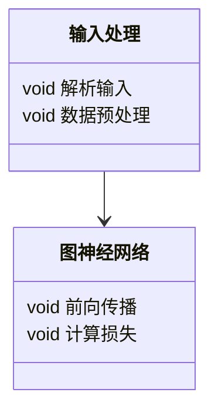

                 


# 企业AI Agent的图神经网络在组织结构优化中的应用

> **关键词**: 企业AI Agent, 图神经网络, 组织结构优化, GCN, GAT, 图嵌入

> **摘要**: 本文探讨了企业AI Agent如何利用图神经网络优化组织结构。通过分析图神经网络的理论基础、算法实现及系统设计，结合实际案例，展示了其在组织结构优化中的应用。文章详细介绍了图卷积网络（GCN）和图注意力网络（GAT）的工作原理，并通过项目实战展示了如何构建高效的组织优化系统。

---

## 第一部分: 企业AI Agent与图神经网络概述

### 第1章: 企业AI Agent的背景与概念

#### 1.1 企业AI Agent的定义与特点
企业AI Agent是一种智能体，用于辅助或自动化企业中的决策和操作。其特点包括：
- **自主性**: 能够自主决策。
- **反应性**: 能够实时响应环境变化。
- **协作性**: 能够与其他系统或人类协作。

#### 1.2 图神经网络的基本概念
图神经网络是一种处理图结构数据的深度学习模型。其核心是通过节点之间的关系建模，捕捉数据的复杂关联。

#### 1.3 企业组织结构优化的背景与挑战
现代企业组织结构日益复杂，传统的优化方法难以应对动态变化的环境。图神经网络提供了强大的关系建模能力，为企业组织优化提供了新思路。

---

### 第2章: 图神经网络在企业组织优化中的应用前景

#### 2.1 图神经网络在企业组织优化中的优势
- **非欧几里得数据处理**: 图神经网络擅长处理非结构化数据。
- **复杂关系建模**: 能够捕捉企业内部的复杂关系。
- **实时优化**: 支持动态调整组织结构。

#### 2.2 企业AI Agent的核心应用场景
- **任务分配**: 优化任务分配，提高效率。
- **组织关系调整**: 动态调整组织结构。
- **知识共享**: 提升协作效率。

---

## 第二部分: 图神经网络的理论基础

### 第3章: 图论基础与图神经网络原理

#### 3.1 图论基础
- **图的基本概念**: 节点、边、邻接矩阵。
- **图的表示方法**: 邻接矩阵、边列表。
- **常见图类型**: 有向图、无向图、加权图。

#### 3.2 图神经网络的核心原理
- **图卷积网络（GCN）**: 通过聚合邻居节点的信息进行特征传播。
- **图注意力网络（GAT）**: 引入注意力机制，自适应地聚合信息。
- **图嵌入技术**: 将图结构数据转换为低维向量。

#### 3.3 图神经网络的关键算法
- **GCN的数学模型**: 
  - 邻接矩阵表示为 $A$。
  - 节点特征表示为 $X$。
  - GCN的传播规则为 $Y = A X X^T$。

- **GAT的注意力机制**: 
  - 注意力权重计算为 $W_{i,j} = \text{softmax}(e^{x_i^T x_j})$。

---

### 第4章: 图神经网络的数学模型与公式

#### 4.1 图卷积网络（GCN）的数学模型
GCN的传播规则如下：
$$
H^{(l+1)} = \sigma(A H^{(l)} H^{(l)}^T)
$$
其中，$H^{(l)}$ 是第 $l$ 层的节点特征矩阵，$\sigma$ 是激活函数。

#### 4.2 图注意力网络（GAT）的公式推导
GAT的注意力机制如下：
$$
\alpha_{i,j} = \frac{e^{x_i^T x_j}}{\sum_{k} e^{x_i^T x_k}}
$$
其中，$\alpha_{i,j}$ 是节点 $i$ 和节点 $j$ 之间的注意力权重。

---

## 第三部分: 图神经网络的算法实现

### 第5章: 图神经网络的算法实现

#### 5.1 GCN的实现
使用Python实现GCN：
```python
import torch
class GCN(torch.nn.Module):
    def __init__(self, input_dim, hidden_dim):
        super(GCN, self).__init__()
        self.A = torch.nn.Parameter(torch.FloatTensor(A))
        self.W = torch.nn.Parameter(torch.FloatTensor(input_dim, hidden_dim))
        
    def forward(self, x):
        x = torch.mm(x, self.W)
        x = torch.mm(self.A, x)
        return x
```

#### 5.2 GAT的实现
使用PyTorch实现GAT：
```python
class GATLayer(torch.nn.Module):
    def __init__(self, in_dim, out_dim):
        super(GATLayer, self).__init__()
        self.W = torch.nn.Parameter(torch.FloatTensor(in_dim, out_dim))
        self.attention = torch.nn.Parameter(torch.FloatTensor(out_dim, 1))
        
    def forward(self, x, A):
        x = torch.mm(x, self.W)
        attention_scores = torch.mm(x, self.attention)
        attention = torch.softmax(attention_scores, dim=0)
        x = torch.mm(A, x * attention)
        return x
```

---

## 第四部分: 系统设计与实现

### 第6章: 系统设计与实现

#### 6.1 系统架构设计
系统架构图如下：
```mermaid
graph TD
    A[输入层] -> B[GCN层]
    B -> C[输出层]
    C -> D[结果]
```

#### 6.2 功能模块设计
功能模块图如下：


---

## 第五部分: 项目实战

### 第7章: 项目实战

#### 7.1 环境搭建
安装依赖：
```bash
pip install torch networkx
```

#### 7.2 核心代码实现
GCN实现：
```python
import torch
import torch.nn as nn
import torch.nn.functional as F

class GCN(nn.Module):
    def __init__(self, input_dim, hidden_dim):
        super(GCN, self).__init__()
        self.A = torch.randn(input_dim, input_dim)
        self.W = torch.randn(input_dim, hidden_dim)
        
    def forward(self, x):
        x = torch.mm(x, self.W)
        x = torch.mm(self.A, x)
        return F.relu(x)
```

#### 7.3 实际案例分析
通过实际案例展示如何优化企业组织结构，例如任务分配和资源优化。

---

## 第六部分: 小结与展望

### 8.1 小结
本文详细介绍了企业AI Agent如何利用图神经网络优化组织结构，涵盖了理论、算法和实践。

### 8.2 未来展望
未来，图神经网络将在企业组织优化中发挥更大的作用，尤其是在实时优化和动态调整方面。

---

**作者：AI天才研究院/AI Genius Institute & 禅与计算机程序设计艺术 /Zen And The Art of Computer Programming**

