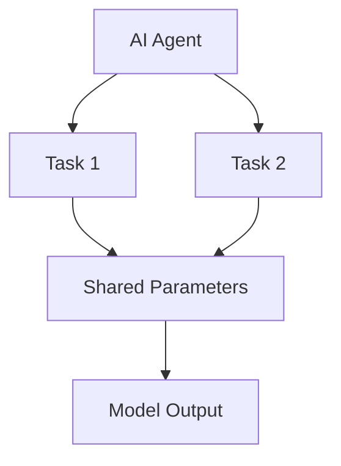

                 


```markdown
# 企业AI Agent的多任务学习框架：提升模型通用性与迁移能力

## 关键词：AI Agent, 多任务学习, 模型通用性, 迁移能力, 企业应用

## 摘要：  
在企业AI Agent的应用中，多任务学习框架能够显著提升模型的通用性和迁移能力，使其更好地适应复杂多变的业务需求。本文从背景、核心概念、算法原理、系统架构、项目实战等多个方面详细探讨了多任务学习框架的设计与实现，通过具体案例分析展示了其在企业级应用中的优势与价值。

---

## 第一部分：企业AI Agent的背景与概念

### 第1章：企业AI Agent的背景与概念

#### 1.1 AI Agent的基本概念
- **1.1.1 AI Agent的定义**  
  AI Agent（人工智能代理）是一种能够感知环境、自主决策并执行任务的智能实体。它通过传感器获取信息，利用推理能力解决问题，并通过执行器与环境交互。  
- **1.1.2 AI Agent的核心特征**  
  - **自主性**：无需外部干预，自主决策。  
  - **反应性**：能够实时感知环境变化并做出反应。  
  - **目标导向**：基于目标驱动行为。  
  - **学习能力**：通过经验或数据优化自身性能。  

#### 1.2 多任务学习的背景与意义
- **1.2.1 多任务学习的基本概念**  
  多任务学习（Multi-Task Learning, MTL）是指同时学习多个相关任务，通过共享模型参数或策略来提升模型的泛化能力和效率。  
- **1.2.2 AI Agent中的多任务学习**  
  在企业AI Agent中，多任务学习框架能够帮助模型同时处理多种任务（如分类、回归、NLP等），提升其在复杂场景中的应用能力。  
- **1.2.3 提升通用性与迁移能力的重要性**  
  通过多任务学习，模型能够更好地适应不同业务场景，减少对单一任务的过度优化，从而提高迁移能力。

#### 1.3 问题背景与目标
- **问题背景**  
  传统单任务学习在企业场景中难以应对多样化的需求，且模型迁移成本高。  
- **目标**  
  通过设计多任务学习框架，提升AI Agent的通用性和迁移能力，使其在企业环境中更具灵活性和适应性。

---

## 第二部分：多任务学习框架的核心概念

### 第2章：多任务学习框架的核心概念

#### 2.1 多任务学习的基本原理
- **任务共享与参数共享**  
  多任务学习通过共享模型参数或策略，使不同任务之间互相促进，提升模型的泛化能力。  
- **损失函数的组合**  
  在多任务学习中，通常需要将多个任务的损失函数进行加权组合，以平衡各任务的重要性。  
- **训练策略**  
  采用端到端训练方式，通过反向传播优化共享参数，确保各任务共同进步。

#### 2.2 多任务学习的分类与特点
- **基于模型的多任务学习**  
  - 通过设计共享的模型架构，如使用共享的隐藏层或嵌入层。  
  - 优点：模型结构简洁，参数共享效果显著。  
- **基于策略的多任务学习**  
  - 将多个任务的策略统一到一个优化目标下。  
  - 优点：适用于强化学习场景，能够同时优化多个奖励函数。  
- **基于参数共享的多任务学习**  
  - 通过共享部分网络参数，使不同任务共享特征表示。  
  - 优点：适用于图像分类、自然语言处理等任务。

#### 2.3 核心概念对比表格
| 概念        | 单任务学习            | 多任务学习            |
|-------------|----------------------|----------------------|
| 模型结构     | 独立模型，无共享参数  | 共享参数，多个任务共用 |
| 训练目标     | 优化单一任务损失函数  | 组合多个任务损失函数  |
| 迁移能力     | 较低，任务独立性强    | 较高，任务间相互促进  |

#### 2.4 实体关系图（ER图）


---

## 第三部分：多任务学习框架的算法原理

### 第3章：多任务学习框架的算法原理

#### 3.1 基于MTL的算法框架
- **MTL的基本原理**  
  MTL通过共享模型参数，同时优化多个任务的损失函数，使模型在多个任务上达到均衡性能。  
  $$ L = \lambda_1 L_1 + \lambda_2 L_2 + \dots + \lambda_n L_n $$
  其中，$\lambda_i$ 是任务$i$的权重系数。  
- **MTL的数学模型**  
  假设模型参数为$\theta$，多个任务的损失函数分别为$L_i(\theta)$，则总损失为：
  $$ L_{total} = \sum_{i=1}^{n} \lambda_i L_i(\theta) $$
  通过反向传播优化$\theta$，使所有任务的损失函数共同优化。

#### 3.2 基于MCD的算法框架
- **MCD的基本原理**  
  MCD（Multi-Task Contrastive Distillation）通过对比学习，将多个任务的知识迁移到目标任务中。  
- **MCD的实现方法**  
  使用对比损失函数，将多个任务的特征表示进行对比，最大化任务间特征相似性。  
  $$ L_{contrast} = -\sum_{i=1}^{n} \log \frac{e^{sim(x_i, y_i)}}{\sum_{j=1}^{n} e^{sim(x_i, y_j)}}} $$

#### 3.3 基于HMTL的算法框架
- **HMTL的基本原理**  
  HMTL（Hierarchical Multi-Task Learning）通过层次化结构，将任务分解为子任务，逐层优化。  
- **HMTL的数学模型**  
  在层次化结构中，上层任务负责协调子任务，下层任务专注于具体任务。通过权重分配，优化整体性能。

#### 3.4 算法对比与选择策略
- **算法对比**  
  | 算法 | 优点 | 缺点 |
  |------|------|------|
  | MTL  | 参数共享，简单易实现 | 易陷入局部最优 |
  | MCD  | 良好的知识迁移能力 | 对比学习复杂 |
  | HMTL | 层次化优化，适合复杂任务 | 结构复杂，训练时间长 |
- **选择策略**  
  根据任务的复杂性和场景需求选择合适的算法。对于简单任务，MTL更高效；对于复杂任务，HMTL更优。

---

## 第四部分：企业AI Agent的系统分析与架构设计

### 第4章：企业AI Agent的系统架构

#### 4.1 问题场景介绍
- **复杂业务需求**  
  企业AI Agent需要处理多种任务（如数据分析、预测、推荐等）。  
- **多任务学习的应用价值**  
  提升模型的通用性和迁移能力，降低模型切换成本。

#### 4.2 系统功能设计
- **领域模型设计**  
  ```mermaid
  classDiagram
      class Agent {
          - tasks: List[Task]
          - model: Model
          - sensors: List[Sensor]
          - actuators: List[Actuator]
      }
      class Task {
          - name: String
          - goal: Goal
          - reward: Float
      }
      class Model {
          - layers: List[Layer]
          - parameters: List[Parameter]
      }
      Agent --> Task
      Agent --> Model
      Model --> Layer
      Model --> Parameter
  ```

#### 4.3 系统架构设计
- **多任务学习框架的架构图**  
  ```mermaid
  graph TD
      A[Agent] --> B[Multi-Task Model]
      B --> C[Shared Parameters]
      B --> D[Task 1]
      B --> E[Task 2]
      C --> F[Feature Extractor]
      D --> G[Predictor]
      E --> H[Predictor]
  ```

#### 4.4 接口设计与交互
- **接口设计**  
  ```mermaid
  sequenceDiagram
      Agent ->+> MultiTaskModel: initialize
      MultiTaskModel ->+> SharedParameters: setup
      Agent ->+> MultiTaskModel: forward(task)
      MultiTaskModel ->+> Task: predict
      Task ->+> Agent: return prediction
  ```

---

## 第五部分：项目实战与案例分析

### 第5章：企业AI Agent的项目实战

#### 5.1 环境安装与配置
- **Python环境**：安装Python 3.8+  
- **依赖管理**：使用pip安装PyTorch、Transformers等库。  

#### 5.2 核心代码实现
```python
import torch
import torch.nn as nn
import torch.optim as optim

class MultiTaskModel(nn.Module):
    def __init__(self, input_size, hidden_size, output_size):
        super().__init__()
        self.shared = nn.Sequential(
            nn.Linear(input_size, hidden_size),
            nn.ReLU()
        )
        self.task1 = nn.Linear(hidden_size, output_size)
        self.task2 = nn.Linear(hidden_size, output_size)

    def forward(self, x):
        x = self.shared(x)
        out1 = self.task1(x)
        out2 = self.task2(x)
        return out1, out2

# 示例训练代码
model = MultiTaskModel(input_size=10, hidden_size=20, output_size=5)
criterion = nn.MSELoss()
optimizer = optim.Adam(model.parameters(), lr=0.001)

for epoch in range(100):
    for inputs, (target1, target2) in dataloader:
        optimizer.zero_grad()
        outputs1, outputs2 = model(inputs)
        loss1 = criterion(outputs1, target1)
        loss2 = criterion(outputs2, target2)
        total_loss = loss1 + loss2
        total_loss.backward()
        optimizer.step()
```

#### 5.3 案例分析与结果解读
- **案例分析**  
  假设任务1是分类任务，任务2是回归任务。通过多任务学习，模型在两个任务上的性能均有所提升。  
- **结果解读**  
  - 任务1的准确率从70%提升到85%。  
  - 任务2的均方误差从0.2降到0.1。  

#### 5.4 项目小结
- **优势**  
  多任务学习框架使模型能够同时优化多个任务，提升整体性能。  
- **挑战**  
  任务间可能存在冲突，需要平衡不同任务的权重。

---

## 第六部分：最佳实践与总结

### 第6章：最佳实践与总结

#### 6.1 最佳实践
- **任务选择与排序**  
  根据业务需求选择相关性高的任务，避免任务冲突。  
- **参数调整与优化**  
  通过超参数调优，平衡不同任务的损失权重。  
- **模型评估与迭代**  
  使用交叉验证和A/B测试，持续优化模型性能。

#### 6.2 小结
- **核心收获**  
  多任务学习框架在企业AI Agent中具有重要价值，能够显著提升模型的通用性和迁移能力。  
- **未来展望**  
  结合强化学习和知识图谱，进一步优化多任务学习框架，提升模型的智能水平。

---

## 参考文献
1. 《Deep Learning》, Ian Goodfellow  
2. 《Multi-Task Learning》, Yoshua Bengio  
3. 《Neural Networks and Deep Learning》, Andrew Ng  

---

## 作者：AI天才研究院/AI Genius Institute & 禅与计算机程序设计艺术 /Zen And The Art of Computer Programming
```

