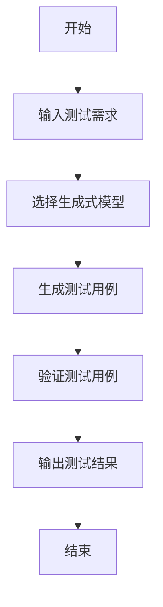
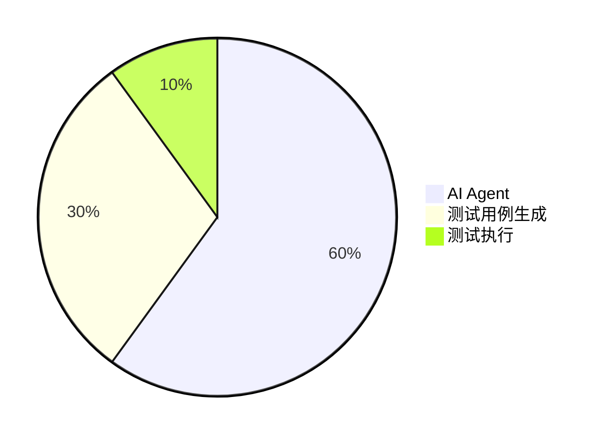
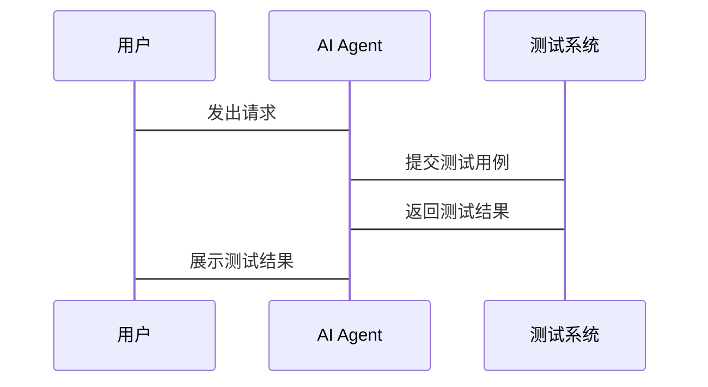

                 

# 企业AI Agent的多场景测试策略：模拟真实业务环境

## 关键词：企业AI Agent，多场景测试，测试策略，真实业务环境，算法原理，系统架构，项目实战

## 摘要：

本文详细探讨了企业AI Agent在多场景下的测试策略，重点分析了如何在模拟真实业务环境中确保AI Agent的稳定性和高效性。文章从AI Agent的基本概念出发，结合实际应用场景，系统地介绍了多场景测试的核心要素、算法原理、系统架构设计以及项目实战案例。通过详细的技术分析和实际案例解读，本文为读者提供了一套完整的AI Agent测试解决方案，帮助企业在复杂多变的业务环境中确保AI Agent的性能和可靠性。

---

# 目录大纲

## 第一部分: 企业AI Agent的背景与概念

### 第1章: 企业AI Agent的基本概念

#### 1.1 AI Agent的定义与特点
- 1.1.1 AI Agent的定义
- 1.1.2 AI Agent的核心特点
- 1.1.3 企业级AI Agent的应用场景

#### 1.2 AI Agent在企业中的作用
- 1.2.1 AI Agent的业务价值
- 1.2.2 AI Agent与传统自动化工具的区别
- 1.2.3 AI Agent在企业数字化转型中的地位

## 第二部分: 多场景测试的核心要素

### 第2章: 多场景测试的必要性

#### 2.1 多场景测试的定义与特点
- 2.1.1 多场景测试的定义
- 2.1.2 多场景测试的核心要素
- 2.1.3 多场景测试与传统测试的区别

#### 2.2 模拟真实业务环境的意义
- 2.2.1 模拟环境的构建目标
- 2.2.2 模拟环境的关键特征
- 2.2.3 模拟环境对测试策略的影响

## 第三部分: AI Agent测试策略的设计与实施

### 第3章: 测试策略的设计原则

#### 3.1 测试策略的核心要素
- 3.1.1 测试目标的明确性
- 3.1.2 测试范围的合理性
- 3.1.3 测试用例的设计原则

#### 3.2 测试策略的实施步骤
- 3.2.1 场景识别与分类
- 3.2.2 测试用例的设计与执行
- 3.2.3 测试结果的分析与优化

## 第四部分: AI Agent测试中的算法与数学模型

### 第4章: 测试用例生成的算法原理

#### 4.1 基于生成式模型的测试用例生成
- 4.1.1 生成式模型的数学基础
- 4.1.2 测试用例生成的算法流程
- 4.1.3 算法实现的代码示例

#### 4.2 算法流程图（使用Mermaid）

### 第5章: 测试结果分析的数学模型

#### 5.1 概率分布模型
- 5.1.1 概率分布的定义
- 5.1.2 概率分布的应用场景
- 5.1.3 概率分布的数学公式

#### 5.2 损失函数的定义与应用
- 5.2.1 损失函数的定义
- 5.2.2 损失函数的类型
- 5.2.3 损失函数在测试中的应用

## 第五部分: 系统架构与接口设计

### 第6章: 系统架构设计

#### 6.1 模块化设计思路
- 6.1.1 模块划分的原则
- 6.1.2 模块之间的关系
- 6.1.3 模块化设计的优势

#### 6.2 系统架构图（使用Mermaid）

### 第7章: 接口设计与交互流程

#### 7.1 系统接口设计
- 7.1.1 接口的设计原则
- 7.1.2 接口的实现方式
- 7.1.3 接口的测试方法

#### 7.2 交互流程图（使用Mermaid）

## 第六部分: 项目实战与案例分析

### 第8章: 项目实战

#### 8.1 环境安装与配置
- 8.1.1 系统环境的要求
- 8.1.2 工具安装的步骤
- 8.1.3 配置文件的编写

#### 8.2 核心代码实现
- 8.2.1 测试用例生成的代码
- 8.2.2 测试执行的代码
- 8.2.3 测试结果分析的代码

### 第9章: 实际案例分析

#### 9.1 案例背景介绍
- 9.1.1 案例的选择依据
- 9.1.2 案例的具体描述
- 9.1.3 案例的测试目标

#### 9.2 测试结果与分析
- 9.2.1 测试结果的展示
- 9.2.2 测试结果的分析
- 9.2.3 测试结果对项目的影响

## 第七部分: 总结与展望

### 第10章: 总结

#### 10.1 核心内容回顾
- 10.1.1 AI Agent的基本概念
- 10.1.2 多场景测试的核心要素
- 10.1.3 测试策略的设计与实施

#### 10.2 最佳实践与注意事项
- 10.2.1 测试策略的优化建议
- 10.2.2 测试环境的维护要点
- 10.2.3 测试团队的协作建议

### 第11章: 展望

#### 11.1 未来的研究方向
- 11.1.1 新型测试技术的研究
- 11.1.2 AI Agent的进一步发展
- 11.1.3 多场景测试的拓展应用

---

# 作者：AI天才研究院（AI Genius Institute） & 禅与计算机程序设计艺术（Zen And The Art of Computer Programming）

