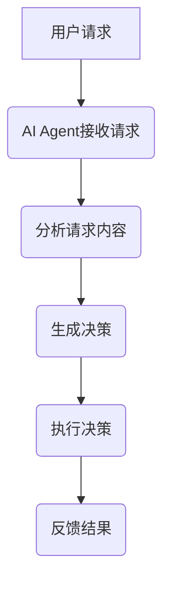
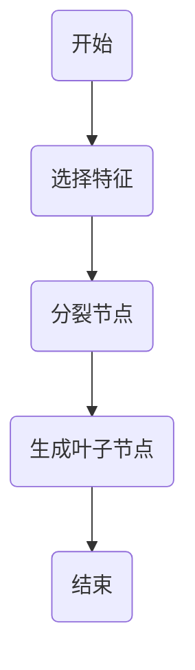
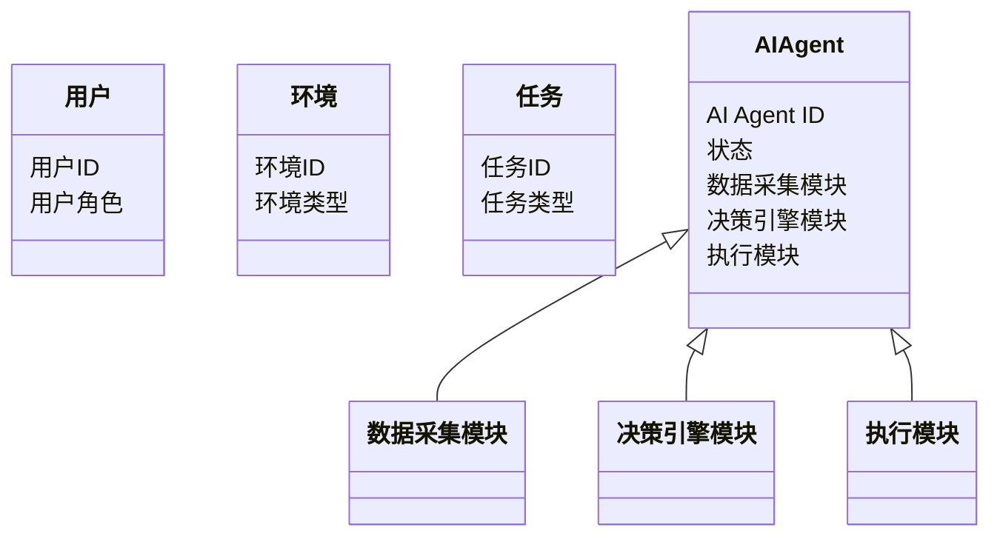
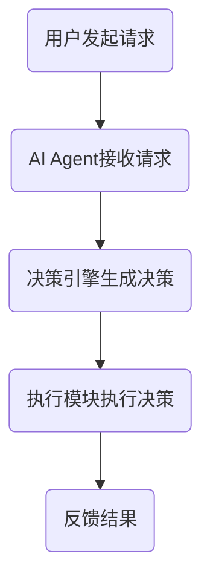

                 


# 企业AI Agent的多场景测试：模拟真实业务环境

## 关键词：企业AI Agent，多场景测试，真实业务环境，系统架构，测试方法，算法原理

## 摘要：  
本文深入探讨了企业AI Agent在多场景测试中的应用，通过模拟真实业务环境，分析其系统架构、算法原理和测试方法。文章首先介绍了AI Agent的基本概念和应用场景，然后详细讲解了其核心算法和系统架构设计，最后通过实际案例展示了如何在复杂业务环境中进行AI Agent的多场景测试。本文旨在为技术人员提供理论与实践相结合的指导，帮助他们在企业级应用中更好地部署和优化AI Agent。

---

# 第一部分: 企业AI Agent的多场景测试背景与基础

## 第1章: 企业AI Agent的概述与背景

### 1.1 什么是AI Agent
#### 1.1.1 AI Agent的定义与核心概念  
AI Agent（人工智能代理）是指能够感知环境、自主决策并执行任务的智能体。它通过传感器获取信息，利用算法进行分析和推理，并通过执行器与外部环境交互。AI Agent的核心概念包括：  
- **自主性**：无需外部干预，自主完成任务。  
- **反应性**：能够实时感知环境并做出反应。  
- **目标导向**：基于目标驱动行为。  

#### 1.1.2 AI Agent的基本特征  
AI Agent的特点包括：  
1. **可定制性**：可以根据具体业务需求进行定制。  
2. **可扩展性**：能够扩展到不同的应用场景。  
3. **高可靠性**：在复杂环境中仍能稳定运行。  

#### 1.1.3 AI Agent与传统软件的区别  
AI Agent与传统软件的区别主要体现在：  
- AI Agent具有学习和推理能力，能够适应环境变化。  
- 传统软件依赖于固定的规则和逻辑，无法自主决策。  

### 1.2 企业AI Agent的应用场景
#### 1.2.1 企业AI Agent的主要应用场景  
企业在以下场景中广泛使用AI Agent：  
1. **客户支持**：通过自然语言处理（NLP）为用户提供实时支持。  
2. **流程自动化**：自动化处理订单、审批等业务流程。  
3. **风险管理**：实时监控并预测潜在风险。  

#### 1.2.2 不同场景下的AI Agent特点  
不同场景下的AI Agent具有不同的特点：  
- **客户支持场景**：强调实时响应和语义理解能力。  
- **流程自动化场景**：注重规则引擎和任务执行效率。  

#### 1.2.3 场景化测试的重要性  
场景化测试是确保AI Agent在特定业务环境中稳定运行的关键步骤。通过模拟真实场景，可以发现潜在问题并优化性能。

### 1.3 企业AI Agent的测试挑战
#### 1.3.1 测试目标与核心问题  
AI Agent的测试目标包括：  
1. 确保AI Agent在复杂环境下的稳定性。  
2. 验证AI Agent在不同场景下的决策准确性。  

#### 1.3.2 测试中的常见挑战  
测试中的常见挑战包括：  
1. 多场景下的交互复杂性。  
2. 数据质量和实时性要求。  

#### 1.3.3 解决方案与边界条件  
解决方案包括：  
- 使用模拟数据生成器创建真实场景。  
- 设定明确的测试边界条件以减少不确定性。  

## 第2章: AI Agent的概念模型与ER实体关系

### 2.1 AI Agent的概念模型
#### 2.1.1 概念模型的构成要素  
AI Agent的概念模型包括以下要素：  
1. **用户**：与AI Agent交互的主体。  
2. **环境**：AI Agent运行的外部环境。  
3. **任务**：AI Agent需要完成的具体任务。  

#### 2.1.2 概念模型的属性特征对比表  
以下是概念模型中各要素的属性对比：  

| 要素 | 属性 | 描述 |
|------|------|------|
| 用户 | 行为 | 与AI Agent的交互行为。 |
| 环境 | 特性 | 包括数据来源、环境复杂度等。 |
| 任务 | 目标 | AI Agent需要完成的目标。 |

#### 2.1.3 概念模型的ER图设计  
以下是AI Agent概念模型的ER图：  

```mermaid
erd
    entity 用户 {
        关键属性：用户ID, 用户角色
        弱关联关系：*--1 AI Agent
    }
    entity 环境 {
        关键属性：环境ID, 环境类型
        弱关联关系：*--1 AI Agent
    }
    entity 任务 {
        关键属性：任务ID, 任务类型
        弱关联关系：*--1 AI Agent
    }
    AI Agent {
        关键属性：AI Agent ID, 状态
        关系：与用户、环境、任务的关联
    }
```

### 2.2 AI Agent的流程图与交互关系
#### 2.2.1 AI Agent的决策流程图  
以下是AI Agent的决策流程图：  



#### 2.2.2 实体间的关系与交互  
AI Agent与用户、环境、任务之间的交互关系如下：  
- **用户与AI Agent**：用户发起请求，AI Agent进行响应。  
- **环境与AI Agent**：环境提供数据，AI Agent进行分析。  

#### 2.2.3 流程图的详细说明  
AI Agent的决策流程图详细说明：  
1. 用户发起请求，AI Agent接收并解析请求内容。  
2. AI Agent分析请求内容，生成决策。  
3. AI Agent执行决策并反馈结果。  

## 第3章: AI Agent的算法原理与数学模型

### 3.1 AI Agent的算法原理
#### 3.1.1 算法原理的简要介绍  
AI Agent的核心算法包括：  
1. **决策树**：用于分类和回归。  
2. **强化学习**：通过奖励机制优化决策。  

#### 3.1.2 算法流程图的详细说明  
以下是决策树算法的流程图：  



#### 3.1.3 算法的数学模型  
决策树的数学模型如下：  

$$ Gini系数 = \sum_{i=1}^{n} p_i (1 - p_i) $$  

其中，\( p_i \) 是第i个类别的概率。

### 3.2 AI Agent的数学公式与代码实现
#### 3.2.1 数学公式  
以下是强化学习中的Q-learning算法公式：  

$$ Q(s, a) = Q(s, a) + \alpha [r + \max_{a'} Q(s', a') - Q(s, a)] $$  

其中，\( Q(s, a) \) 表示状态s下动作a的Q值，\( \alpha \) 是学习率，\( r \) 是奖励，\( s' \) 是下一个状态。

#### 3.2.2 Python代码实现  
以下是AI Agent的强化学习代码示例：  

```python
class AI_Agent:
    def __init__(self, state_space, action_space):
        self.state_space = state_space
        self.action_space = action_space
        self.Q = defaultdict(float)
    
    def get_action(self, state):
        max_action = max(self.Q[(state, action)] for action in self.action_space)
        return action if max_action == 0 else self.action_space[np.argmax([self.Q[(state, a)] for a in self.action_space])]
    
    def update_Q(self, state, action, reward, next_state):
        self.Q[(state, action)] += 0.1 * (reward + max(self.Q[(next_state, a)] for a in self.action_space) - self.Q[(state, action)])
```

### 3.3 算法优化与实际应用
#### 3.3.1 算法优化  
AI Agent的算法优化包括：  
1. **剪枝**：减少决策树的复杂度。  
2. **参数调整**：优化学习率和奖励机制。  

#### 3.3.2 实际应用案例  
以下是AI Agent在客户支持场景中的应用案例：  
1. 用户发起请求，AI Agent解析请求内容。  
2. AI Agent生成决策并执行。  
3. 用户收到反馈结果。  

---

# 第二部分: 企业AI Agent的系统架构与测试方法

## 第4章: 系统分析与架构设计

### 4.1 问题场景介绍  
本文将讨论AI Agent在企业级应用中的系统架构设计，包括：  
1. **系统架构**：分层架构。  
2. **功能模块**：包括数据采集、决策引擎、执行模块。  

### 4.2 系统功能设计  
以下是系统功能模块的类图：  



### 4.3 系统架构设计  
以下是系统的架构图：  


### 4.4 系统接口设计  
系统接口设计包括：  
1. **输入接口**：接收用户请求。  
2. **输出接口**：反馈结果。  

### 4.5 系统交互设计  
以下是系统的交互流程图：  



## 第5章: 项目实战与案例分析

### 5.1 环境配置与安装  
AI Agent的环境配置包括：  
1. **Python版本**：建议使用Python 3.8及以上。  
2. **依赖库安装**：安装numpy、pandas、scikit-learn等库。  

### 5.2 核心代码实现  
以下是AI Agent的核心代码实现：  

```python
class AI_Agent:
    def __init__(self):
        self.data = []
    
    def collect_data(self):
        # 数据采集逻辑
        pass
    
    def make_decision(self):
        # 决策逻辑
        pass
    
    def execute_action(self):
        # 执行逻辑
        pass
```

### 5.3 实际案例分析  
以下是AI Agent在订单处理中的应用案例：  
1. 用户提交订单，AI Agent接收请求。  
2. AI Agent分析订单信息并生成决策。  
3. AI Agent执行决策并反馈结果。  

## 第6章: 最佳实践与注意事项

### 6.1 最佳实践  
AI Agent的测试与部署中需要注意：  
1. **数据质量**：确保测试数据的真实性。  
2. **环境一致性**：确保测试环境与实际环境一致。  

### 6.2 小结  
本文通过理论与实践相结合的方式，详细讲解了企业AI Agent的多场景测试方法。通过模拟真实业务环境，可以更好地验证AI Agent的性能和稳定性。

### 6.3 注意事项  
在实际应用中，需要注意以下几点：  
1. **测试覆盖率**：确保覆盖所有可能的场景。  
2. **性能优化**：优化AI Agent的执行效率。  

### 6.4 拓展阅读  
推荐以下拓展阅读材料：  
1. 《机器学习实战》  
2. 《深度学习入门：基于Python》  

---

# 作者：AI天才研究院/AI Genius Institute & 禅与计算机程序设计艺术 /Zen And The Art of Computer Programming

