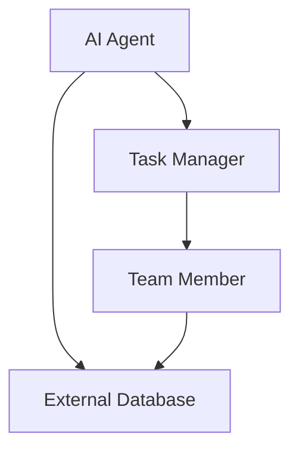
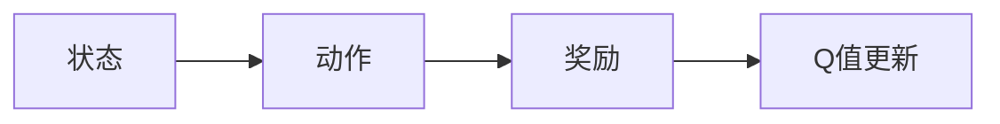
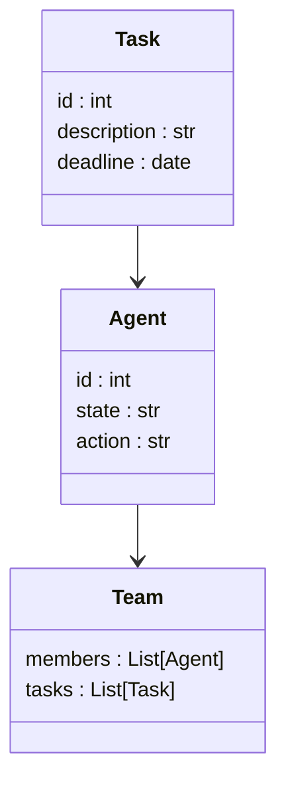
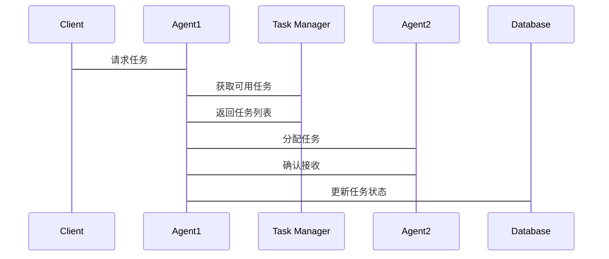

                 


# 企业AI Agent的多智能体系统在团队协作优化中的应用

> 关键词：企业AI Agent、多智能体系统、团队协作优化、强化学习、分布式系统、协作算法

> 摘要：本文探讨了企业AI Agent的多智能体系统在团队协作优化中的应用，从问题背景、核心概念、算法原理到系统架构、项目实战，全面分析了如何利用AI技术提升企业团队协作效率。通过详细讲解多智能体系统的原理、实现和优化方法，本文为读者提供了从理论到实践的全面指导。

---

# 第一部分: 企业AI Agent的多智能体系统概述

## 第1章: 企业AI Agent的背景与概念

### 1.1 问题背景与问题描述

#### 1.1.1 传统团队协作的挑战
传统的团队协作方式依赖于人工协调和沟通，存在以下问题：
- **信息孤岛**：团队成员之间信息不透明，导致效率低下。
- **任务分配不均**：无法根据成员能力和任务需求智能分配。
- **反馈延迟**：缺乏实时反馈机制，难以快速调整协作策略。

#### 1.1.2 企业协作效率低下问题
企业协作效率低下主要体现在：
- **资源浪费**：重复劳动和资源闲置。
- **决策延迟**：依赖人工判断，决策效率低。
- **协作混乱**：缺乏统一的协作机制和工具支持。

#### 1.1.3 AI Agent的引入动机
引入AI Agent旨在：
- 提高协作效率。
- 实现智能任务分配。
- 提供实时反馈和优化建议。

### 1.2 问题解决与边界定义

#### 1.2.1 AI Agent在团队协作中的作用
AI Agent能够：
- 自动化处理重复性任务。
- 智能分配任务。
- 实时监控协作进度。

#### 1.2.2 多智能体系统的核心目标
多智能体系统的核心目标包括：
- 提高协作效率。
- 实现智能体之间的高效协同。
- 提供动态调整能力。

#### 1.2.3 边界与外延
系统边界：
- 系统内部的智能体协作。
- 系统与外部环境的交互。
外延部分：
- 系统的扩展性。
- 外部数据源的集成。

### 1.3 核心概念与组成要素

#### 1.3.1 AI Agent的基本属性
AI Agent具有以下基本属性：
- **智能性**：能够感知环境并做出决策。
- **自主性**：无需外部干预即可运行。
- **协作性**：能够与其他智能体协同工作。

#### 1.3.2 多智能体系统的核心要素
多智能体系统的核心要素包括：
- 智能体。
- 通信机制。
- 协作协议。

#### 1.3.3 系统架构与协作机制
系统架构分为：
- 分层架构。
- 分布式架构。
协作机制包括：
- 协作协议。
- 通信协议。

---

## 第2章: 多智能体系统的核心概念与联系

### 2.1 多智能体系统的基本原理

#### 2.1.1 多智能体系统的特点
多智能体系统具有以下特点：
- **分布式**：智能体独立运行。
- **协作性**：智能体之间协同工作。
- **动态性**：能够适应环境变化。

#### 2.1.2 AI Agent的协作机制
协作机制包括：
- 基于规则的协作。
- 基于目标的协作。
- 基于市场的协作。

#### 2.1.3 多智能体系统的分类
多智能体系统可以分为：
- 简单反射型。
- 基于模型的反应型。
- 计划型。

### 2.2 AI Agent与多智能体系统的属性对比

#### 2.2.1 属性对比表格

| 属性               | 单智能体系统       | 多智能体系统       |
|--------------------|-------------------|-------------------|
| 独立性             | 高               | 低               |
| 协作性             | 无               | 高               |
| 通信机制           | 无               | 有               |

#### 2.2.2 系统实体关系图（Mermaid）



---

## 第3章: 多智能体协作算法

### 3.1 多智能体协作算法概述

#### 3.1.1 基于强化学习的协作算法
强化学习算法通过奖励机制，使智能体学习最优策略。

#### 3.1.2 基于博弈论的协作机制
博弈论模型帮助智能体在协作中做出最优决策。

#### 3.1.3 分布式协作算法
分布式算法允许智能体在无中心节点的情况下协作。

### 3.2 强化学习算法原理

#### 3.2.1 强化学习的基本原理（Mermaid流程图）



#### 3.2.2 多智能体强化学习的数学模型
数学模型如下：

$$ Q_i(a_i) = \sum_{j \neq i} Q_j(a_j) $$

其中，$Q_i(a_i)$表示智能体i的Q值。

#### 3.2.3 算法代码实现（Python示例）

```python
import numpy as np

class Agent:
    def __init__(self, state_space, action_space):
        self.state_space = state_space
        self.action_space = action_space
        self.Q = np.zeros((state_space, action_space))

    def act(self, state):
        return np.argmax(self.Q[state])

    def update(self, state, action, reward):
        self.Q[state, action] += reward
```

---

## 第4章: 企业AI Agent系统架构设计

### 4.1 问题场景介绍

#### 4.1.1 企业协作场景
- 项目管理。
- 任务分配。
- 资源协调。

### 4.2 系统功能设计

#### 4.2.1 领域模型（Mermaid类图）



### 4.3 系统架构设计

#### 4.3.1 系统架构图（Mermaid架构图）

```mermaid
archiitecture
    Client
    Server
    Database
    Agent1
    Agent2
    Agent3
   通信 --> Client <-> Server <-> Database
    协作 --> Agent1 <-> Agent2 <-> Agent3
```

### 4.4 系统接口设计

#### 4.4.1 接口描述
- `/api/task分配`：分配任务。
- `/api/反馈`：接收反馈。
- `/api/状态`：获取状态。

### 4.5 系统交互（Mermaid序列图）



---

## 第5章: 项目实战

### 5.1 环境安装

#### 5.1.1 安装Python和依赖
```bash
pip install numpy
pip install matplotlib
```

### 5.2 系统核心实现

#### 5.2.1 核心代码实现

```python
import numpy as np
import matplotlib.pyplot as plt

class MultiAgentSystem:
    def __init__(self, num_agents):
        self.agents = [Agent() for _ in range(num_agents)]
        self.tasks = []

    def assign_task(self, task):
        self.tasks.append(task)
        for agent in self.agents:
            agent.receive_task(task)

    def update_state(self):
        for agent in self.agents:
            agent.update_state()

    def visualize(self):
        plt.plot([agent.Q for agent in self.agents])
        plt.show()
```

### 5.3 代码应用解读与分析

#### 5.3.1 代码功能解读
- `assign_task`：分配任务。
- `update_state`：更新状态。
- `visualize`：可视化结果。

#### 5.3.2 实际案例分析
案例：任务分配与反馈。

---

## 第6章: 最佳实践

### 6.1 小结
- 系统架构设计。
- 算法实现。
- 项目实战。

### 6.2 注意事项
- 系统维护。
- 安全性。
- 可扩展性。

### 6.3 拓展阅读
- 多智能体系统的最新研究。
- 强化学习的高级应用。

---

# 结语

企业AI Agent的多智能体系统在团队协作优化中的应用是一个充满潜力的领域。通过本文的详细讲解，读者可以全面了解相关理论和实践方法，并将其应用于实际工作中。

---

作者：AI天才研究院/AI Genius Institute & 禅与计算机程序设计艺术 /Zen And The Art of Computer Programming

