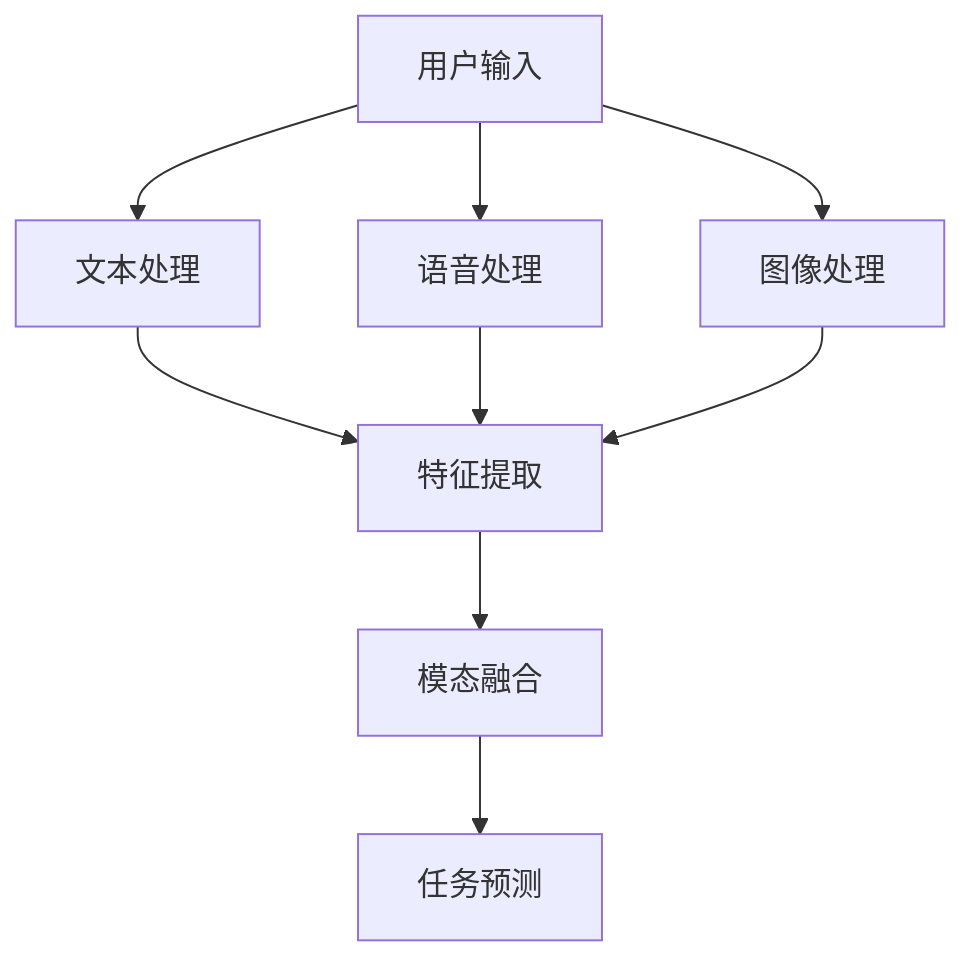

                 


# 企业AI Agent的多模态学习在用户体验优化中的应用

## 关键词：企业AI Agent、多模态学习、用户体验优化、算法原理、系统架构

## 摘要：  
本文探讨了企业AI Agent通过多模态学习优化用户体验的应用。从概念到算法，再到系统架构，全面分析多模态学习在企业AI Agent中的作用，并通过实际案例展示其在提升用户交互体验中的价值。

---

# 第1章 企业AI Agent与多模态学习概述

## 1.1 AI Agent的基本概念  
### 1.1.1 AI Agent的定义  
AI Agent（人工智能代理）是一种能够感知环境、自主决策并执行任务的智能实体，旨在通过自动化方式解决复杂问题。  

### 1.1.2 AI Agent的核心特征  
| 特征 | 描述 |  
|------|------|  
| 智能性 | 能够理解输入、推理并生成输出 |  
| 自主性 | 能够独立执行任务，无需外部干预 |  
| 适应性 | 能够根据环境变化调整行为 |  
| 可扩展性 | 能够处理不同规模和复杂度的任务 |  

### 1.1.3 企业级AI Agent的应用场景  
- **客户支持**：智能客服机器人提供24/7服务。  
- **决策支持**：基于数据分析辅助企业决策。  
- **流程自动化**：自动化处理企业内部流程。  

---

## 1.2 多模态学习的定义与特点  
### 1.2.1 多模态学习的定义  
多模态学习是指在同一任务中融合多种数据类型（如文本、语音、图像）进行学习的方法。  

### 1.2.2 多模态学习的核心特点  
- **数据多样性**：融合多种数据类型，提升模型鲁棒性。  
- **任务相关性**：不同模态的数据相互补充，提高任务性能。  
- **复杂性**：处理多模态数据需要复杂的模型架构和算法。  

### 1.2.3 多模态学习与单模态学习的区别  
| 方面 | 单模态学习 | 多模态学习 |  
|------|------------|------------|  
| 数据输入 | 单一类型（如文本或图像） | 多种类型（如文本、语音、图像） |  
| 任务性能 | 依赖单一数据类型 | 利用多种数据类型，性能更优 |  

---

## 1.3 企业AI Agent与多模态学习的结合  
### 1.3.1 企业AI Agent的演进  
从规则驱动到数据驱动，AI Agent逐步实现智能化。  

### 1.3.2 多模态学习在AI Agent中的作用  
通过融合多模态数据，AI Agent能够更好地理解用户需求，提供更精准的服务。  

### 1.3.3 企业AI Agent多模态学习的应用案例  
- **智能客服**：结合文本和语音识别，提供更精准的用户支持。  
- **智能推荐**：融合用户行为数据和产品描述，推荐个性化产品。  

---

## 1.4 本章小结  
本章介绍了AI Agent的基本概念、多模态学习的核心特点以及两者在企业中的结合应用。

---

# 第2章 多模态学习的核心概念与原理  

## 2.1 多模态学习的核心概念  
### 2.1.1 多模态数据的定义  
多模态数据是指来自不同感知渠道的数据，例如文本、语音、图像等。  

### 2.1.2 多模态学习的分类  
- **模态对齐**：将不同模态的数据对齐到同一空间。  
- **模态融合**：将不同模态的数据融合到一个统一的表示空间中。  
- **联合学习**：在同一模型中同时处理多种模态的数据。  

### 2.1.3 多模态学习与企业AI Agent的结合  
通过多模态学习，AI Agent能够更全面地理解用户需求，提供更个性化的服务。  

---

## 2.2 多模态学习的原理  
### 2.2.1 多模态数据的表示方法  
- **文本表示**：使用词嵌入（如Word2Vec）或预训练模型（如BERT）。  
- **语音表示**：通过MFCC（Mel-Frequency Cepstral Coefficients）提取特征。  
- **图像表示**：使用卷积神经网络（CNN）提取特征。  

### 2.2.2 多模态模型的构建流程  
1. 数据预处理：将不同模态的数据标准化或归一化。  
2. 特征提取：分别提取每种模态的特征。  
3. 模态融合：将特征融合到一个统一的表示空间中。  
4. 任务建模：基于融合的特征进行任务建模（如分类或回归）。  

### 2.2.3 多模态学习的数学模型  
$$ L = \sum_{i=1}^{n} \sum_{j=1}^{m} w_{i,j} x_{i,j} $$  
其中，$L$ 是损失函数，$w_{i,j}$ 是权重，$x_{i,j}$ 是输入特征。  

---

## 2.3 企业AI Agent中的多模态学习应用  
### 2.3.1 多模态学习在自然语言处理中的应用  
通过融合文本和语音数据，提升对话系统的理解能力。  

### 2.3.2 多模态学习在视觉识别中的应用  
通过融合图像和文本数据，提高图像识别的准确性。  

---

## 2.4 本章小结  
本章详细讲解了多模态学习的核心概念和原理，并探讨了其在企业AI Agent中的应用。

---

# 第3章 企业AI Agent多模态学习的算法原理  

## 3.1 多模态学习的算法框架  
### 3.1.1 多模态数据的预处理  
- 文本：分词、去除停用词。  
- 语音：提取MFCC特征。  
- 图像：归一化处理。  

### 3.1.2 多模态模型的构建  
1. 分别构建每种模态的特征提取网络。  
2. 使用模态融合层将特征融合到一个统一空间。  
3. 构建任务网络进行最终的分类或回归。  

### 3.1.3 多模态学习的优化方法  
- 使用对抗训练（GAN）优化模态融合。  
- 使用自注意力机制（Self-Attention）提升特征表达能力。  

---

## 3.2 多模态学习的数学模型  
### 3.2.1 多模态数据的表示方法  
- 文本：$x_t \in \mathbb{R}^{d_t}$，$d_t$ 是文本特征维度。  
- 语音：$x_a \in \mathbb{R}^{d_a}$，$d_a$ 是语音特征维度。  
- 图像：$x_v \in \mathbb{R}^{d_v}$，$d_v$ 是图像特征维度。  

### 3.2.2 多模态模型的融合方法  
$$ f(x) = \text{Concat}(x_t, x_a, x_v) $$  
其中，$\text{Concat}$ 表示拼接操作。  

### 3.2.3 多模态学习的损失函数  
$$ L = \sum_{i=1}^{n} (y_i - \hat{y}_i)^2 $$  
其中，$y_i$ 是真实标签，$\hat{y}_i$ 是预测标签。  

---

## 3.3 企业AI Agent中的多模态学习算法实现  
### 3.3.1 基于神经网络的多模态学习  
使用深度神经网络（DNN）构建多模态模型。  

### 3.3.2 多模态注意力机制  
通过自注意力机制（Self-Attention）实现模态间的注意力分配。  

---

## 3.4 本章小结  
本章详细讲解了多模态学习的算法框架和数学模型，并探讨了其在企业AI Agent中的实现。

---

# 第4章 企业AI Agent多模态学习的系统架构设计  

## 4.1 系统架构概述  
### 4.1.1 问题场景介绍  
企业AI Agent需要处理多模态数据，优化用户体验。  

### 4.1.2 系统功能设计  
- 数据采集：采集多模态数据（如文本、语音、图像）。  
- 数据处理：对数据进行预处理和特征提取。  
- 模态融合：将特征融合到一个统一空间。  
- 任务执行：基于融合的特征进行任务建模和预测。  

### 4.1.3 系统架构图  


---

## 4.2 项目实战  
### 4.2.1 环境安装  
- Python 3.8及以上版本。  
- 安装必要的库（如TensorFlow、Keras、OpenCV）。  

### 4.2.2 系统核心实现源代码  
```python
import numpy as np
from tensorflow.keras import layers, Model

# 文本处理
text_input = layers.Input(shape=(max_length,))
text_embedding = layers.Embedding(vocab_size, embedding_dim)(text_input)

# 语音处理
audio_input = layers.Input(shape=(n_mfcc, n_time_steps,))
audio_embedding = layers.Flatten()(audio_input)

# 图像处理
image_input = layers.Input(shape=(height, width, channels,))
image_embedding = layers.Flatten()(image_input)

# 模态融合
merged = layers.Concatenate()([text_embedding, audio_embedding, image_embedding])
dense = layers.Dense(128, activation='relu')(merged)
output = layers.Dense(num_classes, activation='softmax')(dense)

model = Model(inputs=[text_input, audio_input, image_input], outputs=output)
model.compile(optimizer='adam', loss='sparse_categorical_crossentropy', metrics=['accuracy'])
```

### 4.2.3 实际案例分析  
以智能客服为例，通过融合用户输入的文本、语音和情感分析，提供更精准的服务。  

---

## 4.3 本章小结  
本章通过系统架构设计和项目实战，详细讲解了企业AI Agent多模态学习的实现过程。

---

# 第5章 最佳实践与小结  

## 5.1 小结  
企业AI Agent通过多模态学习能够更全面地理解用户需求，优化用户体验。  

## 5.2 注意事项  
- 数据质量：确保多模态数据的准确性和完整性。  
- 模型选择：根据任务需求选择合适的多模态学习模型。  
- 性能优化：通过模型压缩和并行计算优化模型性能。  

## 5.3 拓展阅读  
- 《Deep Learning》——Ian Goodfellow  
- 《多模态学习：理论与应用》——李航  

---

# 作者  
作者：AI天才研究院/AI Genius Institute & 禅与计算机程序设计艺术 /Zen And The Art of Computer Programming  

---

希望这篇文章能够为你提供关于企业AI Agent多模态学习在用户体验优化中的应用的深入理解！

