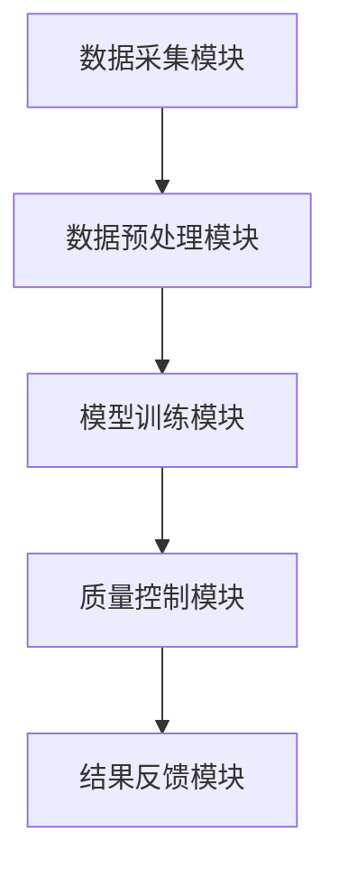

                 


# 企业AI Agent的多模态学习在质量控制中的应用

> 关键词：企业AI Agent，多模态学习，质量控制，算法原理，系统架构，项目实战

> 摘要：本文系统地探讨了企业AI Agent在质量控制中的多模态学习应用。通过分析多模态学习的核心原理、算法实现、系统架构以及实际案例，本文深入揭示了如何利用多模态学习提升企业质量控制的效率和准确性。从理论到实践，本文为读者提供了全面的技术解读和实用指导。

---

# 第1章: 企业AI Agent与多模态学习概述

## 1.1 企业AI Agent的定义与特点

### 1.1.1 企业AI Agent的定义
企业AI Agent是一种具备自主决策能力的智能体，能够根据实时数据和上下文信息，执行特定任务或提供解决方案。它结合了人工智能、机器学习和自然语言处理等多种技术。

### 1.1.2 企业AI Agent的核心特点
- **自主性**：能够独立执行任务，无需人工干预。
- **智能性**：基于数据和模型进行推理和决策。
- **适应性**：能够根据环境变化自适应调整行为。
- **可扩展性**：能够处理不同类型和规模的数据。

### 1.1.3 企业AI Agent与传统AI的区别
- 传统AI：专注于解决特定问题，通常需要人工干预。
- 企业AI Agent：具备自主性和适应性，能够处理复杂场景。

---

## 1.2 多模态学习的定义与优势

### 1.2.1 多模态学习的定义
多模态学习是指同时利用多种数据类型（如文本、图像、语音、结构化数据等）进行学习和推理的过程。通过结合不同模态的信息，模型能够更全面地理解问题。

### 1.2.2 多模态学习的核心优势
- **信息丰富性**：结合多种数据类型，提供更全面的视角。
- **鲁棒性**：单个模态数据的不足可以通过其他模态数据弥补。
- **准确性**：通过多模态数据融合，提升模型的预测精度。

### 1.2.3 多模态学习在企业中的应用前景
- 质量控制：结合图像、文本和结构化数据，提升检测精度。
- 客户服务：通过语音和文本分析，提供更智能的客服解决方案。

---

## 1.3 质量控制中的问题与挑战

### 1.3.1 质量控制的传统方法与局限性
- 传统方法依赖人工检查或单一模态数据（如图像）分析。
- 局限性：效率低、精度不足、难以处理复杂场景。

### 1.3.2 企业AI Agent在质量控制中的作用
- 提供实时监控和自动检测。
- 通过多模态数据融合，提升检测精度和效率。

### 1.3.3 多模态学习在质量控制中的必要性
- 多模态数据能够覆盖更多检测场景。
- 通过融合不同数据类型，提升模型的鲁棒性和准确性。

---

## 1.4 本章小结

本章介绍了企业AI Agent的核心概念和多模态学习的基本原理，强调了多模态学习在质量控制中的重要性。下一章将深入探讨多模态学习的算法原理和实现方法。

---

# 第2章: 多模态学习的核心原理

## 2.1 多模态数据的融合方法

### 2.1.1 数据融合的基本概念
数据融合是指将多种数据类型进行整合，以获得更全面的信息。常见的融合方法包括特征级融合和决策级融合。

### 2.1.2 多模态数据融合的常见方法
- **特征级融合**：将不同模态的特征向量进行合并。
- **决策级融合**：结合不同模态的决策结果，进行最终判断。
- **深度融合**：通过深度学习模型，直接从多模态数据中提取特征。

### 2.1.3 基于深度学习的多模态融合模型
- **多模态编码器-解码器模型**：将多种数据类型编码为共同的表示，再进行解码。
- **注意力机制**：通过注意力机制，动态调整不同模态数据的重要性。

---

## 2.2 多模态学习的算法原理

### 2.2.1 多模态表示学习
- **目标**：将不同模态的数据映射到相同的表示空间。
- **方法**：使用自监督学习或对比学习进行特征对齐。

### 2.2.2 多模态对比学习
- **目标**：通过对比不同模态的数据，学习一致的特征表示。
- **方法**：使用对比损失函数，优化特征的相似性。

### 2.2.3 多模态生成对抗网络
- **目标**：通过生成对抗网络，学习多模态数据的联合分布。
- **方法**：使用生成器和判别器，分别生成和判别数据的真实性。

---

## 2.3 多模态学习的挑战与解决方案

### 2.3.1 数据异构性问题
- **挑战**：不同模态数据的格式和分布差异较大。
- **解决方案**：通过数据预处理和特征对齐，减少异构性影响。

### 2.3.2 数据不平衡问题
- **挑战**：某些类别的数据数量较少，导致模型偏向 majority class。
- **解决方案**：使用过采样、欠采样或调整损失函数权重。

### 2.3.3 模型可解释性问题
- **挑战**：多模态模型的决策过程难以解释。
- **解决方案**：通过可视化和注意力机制，增强模型的可解释性。

---

## 2.4 本章小结

本章详细介绍了多模态学习的核心原理和算法实现，包括数据融合方法、对比学习和生成对抗网络。下一章将探讨这些算法在质量控制中的具体应用。

---

# 第3章: 企业AI Agent在质量控制中的应用

## 3.1 质量控制中的问题分析

### 3.1.1 质量控制的核心问题
- **问题**：如何高效、准确地检测产品或服务的缺陷。
- **挑战**：数据异构性、检测精度、实时性等。

### 3.1.2 质量控制的常见挑战
- 数据量大、类型多样。
- 缺乏高质量的标注数据。
- 检测模型的可解释性不足。

---

## 3.2 多模态学习在质量控制中的具体应用

### 3.2.1 图像与文本的多模态质量分析
- **应用场景**：图像缺陷检测结合产品描述文本分析。
- **优势**：通过图像和文本的联合分析，提升检测精度。

### 3.2.2 声音与视频的多模态质量检测
- **应用场景**：通过声音和视频数据，检测产品或服务的质量。
- **优势**：结合听觉和视觉信息，提供更全面的检测结果。

### 3.2.3 结构化数据与非结构化数据的融合分析
- **应用场景**：将结构化数据（如传感器数据）与非结构化数据（如文本描述）结合，进行综合分析。
- **优势**：通过数据融合，提升检测的准确性和全面性。

---

## 3.3 企业AI Agent的质量控制流程

### 3.3.1 数据采集与预处理
- **步骤**：采集多模态数据，进行清洗和标准化处理。
- **工具**：使用数据采集工具和数据预处理库（如Pandas、NumPy）。

### 3.3.2 多模态模型训练与部署
- **步骤**：基于预处理后的数据，训练多模态模型，并部署到生产环境。
- **工具**：使用深度学习框架（如TensorFlow、PyTorch）进行模型训练和部署。

### 3.3.3 质量控制的实时监控与反馈
- **步骤**：实时采集数据，通过模型进行检测，并根据结果提供反馈。
- **优势**：实现质量控制的闭环管理，提升效率。

---

## 3.4 本章小结

本章通过具体案例分析，展示了多模态学习在质量控制中的应用。下一章将深入探讨算法实现的数学模型和代码实现。

---

# 第4章: 多模态学习算法的数学模型与实现

## 4.1 多模态表示学习的数学模型

### 4.1.1 表示学习的基本概念
- **目标**：将数据映射到低维表示空间。
- **方法**：使用自编码器或变分自编码器进行特征提取。

### 4.1.2 多模态表示学习的数学公式
$$ L = \sum_{i=1}^{N} \text{loss}(x_i^{\text{模态1}}, x_i^{\text{模态2}}) $$
其中，$x_i^{\text{模态1}}$ 和 $x_i^{\text{模态2}}$ 分别表示两种模态的特征向量。

---

## 4.2 多模态对比学习的数学模型

### 4.2.1 对比学习的基本原理
- **目标**：通过对比不同模态的数据，学习一致的特征表示。
- **方法**：使用对比损失函数，优化特征的相似性。

### 4.2.2 多模态对比学习的数学公式
$$ L = -\frac{1}{N}\sum_{i=1}^{N} \log(\text{softmax}(z_i^{\text{模态1}} \cdot z_i^{\text{模态2}})) $$
其中，$z_i^{\text{模态1}}$ 和 $z_i^{\text{模态2}}$ 分别表示两种模态的特征向量。

---

## 4.3 多模态生成对抗网络的数学模型

### 4.3.1 生成对抗网络的基本原理
- **目标**：通过生成器和判别器的对抗训练，学习数据的分布。
- **方法**：使用GAN的损失函数，优化生成器和判别器的参数。

### 4.3.2 多模态生成对抗网络的数学公式
$$ \text{损失函数} = \mathbb{E}_{x \sim p_{\text{真实}}}[ \log D(x)] + \mathbb{E}_{z \sim p_{z}}[ \log(1 - D(G(z)))] $$
其中，$D$ 是判别器，$G$ 是生成器，$z$ 是输入噪声。

---

## 4.4 本章小结

本章通过数学公式和算法流程图，详细介绍了多模态学习的核心算法。下一章将探讨这些算法在系统架构中的实现。

---

# 第5章: 系统架构与项目实战

## 5.1 系统架构设计

### 5.1.1 系统功能模块
- **数据采集模块**：负责多模态数据的采集和预处理。
- **模型训练模块**：负责多模态模型的训练和优化。
- **质量控制模块**：负责实时数据检测和结果反馈。

### 5.1.2 系统架构图


---

## 5.2 项目实战

### 5.2.1 环境搭建
- **工具**：安装Python、TensorFlow、PyTorch等深度学习框架。
- **数据集**：使用公开数据集或自定义数据集。

### 5.2.2 核心代码实现

```python
import tensorflow as tf
from tensorflow.keras import layers

# 定义多模态表示学习模型
class MultiModalModel(tf.keras.Model):
    def __init__(self, input_shape1, input_shape2):
        super(MultiModalModel, self).__init__()
        self.encoder1 = layers.Dense(64, activation='relu')
        self.encoder2 = layers.Dense(64, activation='relu')
        self.decoder = layers.Dense(input_shape1, activation='sigmoid')

    def call(self, inputs):
        x1, x2 = inputs
        encoded1 = self.encoder1(x1)
        encoded2 = self.encoder2(x2)
        merged = tf.keras.layers.concatenate([encoded1, encoded2])
        decoded = self.decoder(merged)
        return decoded

# 模型训练
model = MultiModalModel(input_shape1, input_shape2)
model.compile(optimizer='adam', loss='binary_crossentropy')
model.fit([x_train1, x_train2], y_train, epochs=10, batch_size=32)
```

### 5.2.3 案例分析与总结
- **案例分析**：通过具体案例，展示模型的训练和检测过程。
- **总结**：总结项目中的关键点和经验教训。

---

## 5.3 本章小结

本章通过系统架构设计和项目实战，展示了多模态学习在质量控制中的具体实现。下一章将总结全文，并展望未来的发展方向。

---

# 第6章: 总结与展望

## 6.1 全文总结

- 企业AI Agent通过多模态学习，能够显著提升质量控制的效率和准确性。
- 多模态学习的核心算法包括表示学习、对比学习和生成对抗网络。

---

## 6.2 未来展望

- **算法优化**：进一步优化多模态学习算法，提升模型的准确性和可解释性。
- **应用场景扩展**：探索多模态学习在更多领域的应用，如医疗、金融等。
- **技术融合**：结合边缘计算和物联网技术，实现更高效的实时质量控制。

---

## 6.3 注意事项

- 数据隐私：在实际应用中，需注意数据的隐私保护。
- 模型优化：需根据实际场景，优化模型的性能和效率。

---

## 6.4 拓展阅读

- 《Deep Learning》——Ian Goodfellow
- 《Multi-modal Machine Learning》——李航

---

# 作者：AI天才研究院/AI Genius Institute & 禅与计算机程序设计艺术 /Zen And The Art of Computer Programming

---

通过以上目录大纲，文章从理论到实践，系统地探讨了企业AI Agent的多模态学习在质量控制中的应用。每一章都详细介绍了核心概念、算法原理和实际案例，为读者提供了全面的技术解读和实用指导。

