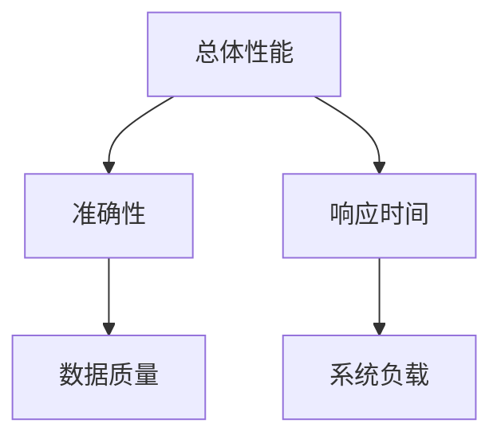
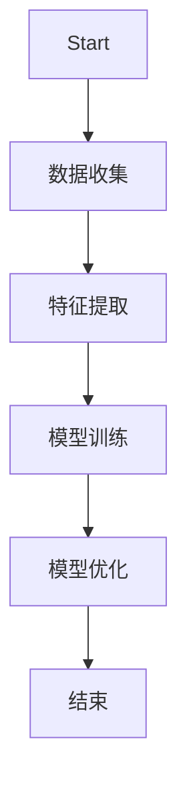
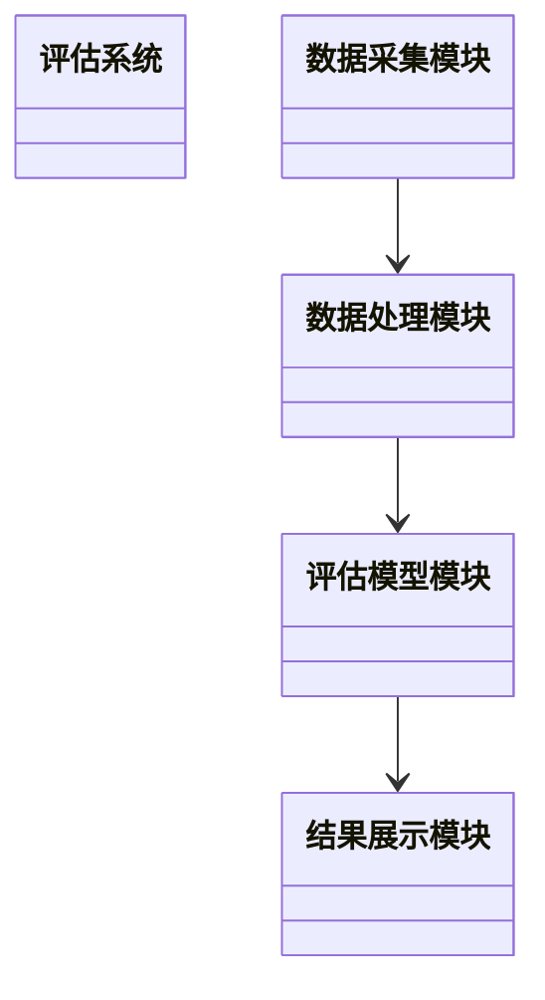
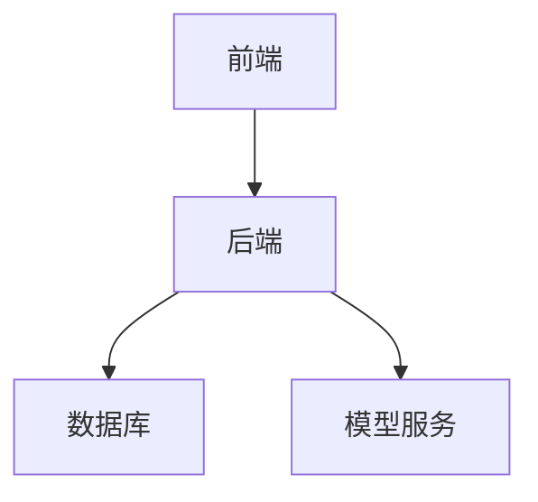
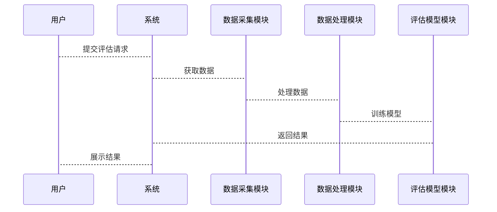

                 


# 企业AI Agent的多维度性能评估体系

> **关键词**：企业AI Agent，多维度性能评估，评估体系，系统架构，算法原理

> **摘要**：  
> 本文系统阐述了企业AI Agent的多维度性能评估体系，从核心概念、算法原理、系统架构到实际应用，进行了全面分析。通过构建多维度评估框架，结合数学模型和实际案例，提出了优化建议和未来发展方向。

---

# 1. 企业AI Agent的背景与概念

## 1.1 AI Agent的基本概念

### 1.1.1 AI Agent的定义与特征

AI Agent（智能体）是指在计算机系统中能够感知环境、自主决策并执行任务的实体。其核心特征包括：

1. **自主性**：无需外部干预，自主完成任务。
2. **反应性**：能实时感知环境并做出反应。
3. **目标导向性**：基于目标驱动行为。
4. **学习能力**：通过数据优化决策。

**企业AI Agent**在企业场景中，主要用于自动化决策、流程优化和问题解决。

### 1.1.2 企业AI Agent的应用场景

企业AI Agent的应用场景包括：

- **客户支持**：通过自然语言处理解决客户问题。
- **流程自动化**：优化企业内部流程。
- **风险管理**：识别潜在风险并提供解决方案。
- **决策支持**：基于数据分析提供决策建议。

### 1.1.3 企业AI Agent的核心价值

企业AI Agent的核心价值体现在：

- 提高效率：自动化处理任务，降低人工成本。
- 增强决策：基于数据提供精准建议。
- 实时响应：快速处理突发问题。

---

## 1.2 多维度性能评估的背景与意义

### 1.2.1 企业AI Agent性能评估的重要性

AI Agent的性能直接影响企业的效率和决策质量。因此，对AI Agent进行多维度性能评估至关重要。

### 1.2.2 多维度评估的必要性

单一维度评估难以全面反映AI Agent的性能。多维度评估可以从响应时间、准确性、可解释性等多个维度综合考量。

### 1.2.3 评估体系的构建目标

构建一个全面、客观、可量化的多维度性能评估体系，为企业的AI Agent优化提供指导。

---

## 1.3 本章小结

本章从AI Agent的基本概念出发，介绍了其在企业中的应用场景，并强调了多维度性能评估的重要性。

---

# 2. 企业AI Agent的多维度性能评估框架

## 2.1 多维度评估的核心概念

### 2.1.1 评估维度的分类与特征

常见的评估维度包括：

1. **准确性**：输出结果的正确性。
2. **响应时间**：处理任务的速度。
3. **可解释性**：决策过程的透明度。
4. **鲁棒性**：应对异常情况的能力。
5. **适应性**：适应环境变化的能力。

### 2.1.2 各维度之间的关系

各维度相互关联，需综合考虑。例如，提高准确性可能需要牺牲响应时间。

### 2.1.3 评估框架的结构化设计

采用层次化结构，从宏观到微观逐步细化评估维度。

**Mermaid图：**



---

## 2.2 多维度评估的ER实体关系图

**ER图展示：**

```mermaid
erd
    客体
    项目
    评估维度
    评估结果
    评估维度与客体的关联
    项目与客体的关联
    项目与评估结果的关联
```

---

# 3. 多维度性能评估的算法原理

## 3.1 评估模型的构建与优化

### 3.1.1 模型构建的基本步骤

1. **数据收集**：收集相关维度的数据。
2. **特征提取**：提取关键特征。
3. **模型训练**：基于机器学习算法训练模型。
4. **模型优化**：通过参数调优提升性能。

**Mermaid流程图：**



### 3.1.2 算法优化的关键点

- **特征选择**：剔除冗余特征，提高模型性能。
- **降维技术**：如PCA，减少计算复杂度。
- **模型选择**：根据任务选择合适算法。

### 3.1.3 代码实现示例

```python
import pandas as pd
from sklearn.decomposition import PCA
from sklearn.ensemble import RandomForestClassifier

# 数据加载
data = pd.read_csv('data.csv')

# 特征提取
features = data.drop('label', axis=1)
label = data['label']

# 降维处理
pca = PCA(n_components=5)
features_pca = pca.fit_transform(features)

# 模型训练
model = RandomForestClassifier()
model.fit(features_pca, label)
```

---

## 3.2 评估指标的数学模型

### 3.2.1 综合评估公式推导

综合评估公式如下：

$$
\text{综合评分} = \sum_{i=1}^{n} w_i \cdot s_i
$$

其中，$w_i$为第i个维度的权重，$s_i$为第i个维度的评分。

### 3.2.2 指标权重的计算方法

基于层次分析法（AHP）计算权重。

### 3.2.3 示例计算与结果分析

假设权重为：准确性（0.4），响应时间（0.3），可解释性（0.2），适应性（0.1）。各维度评分为80、90、70、85，则综合评分为：

$$
0.4 \times 80 + 0.3 \times 90 + 0.2 \times 70 + 0.1 \times 85 = 82.5
$$

---

# 4. 系统分析与架构设计

## 4.1 项目背景与目标

### 4.1.1 项目需求分析

- 实现多维度性能评估。
- 提供直观的评估结果展示。

### 4.1.2 项目目标设定

- 构建评估模型。
- 开发评估系统。

## 4.2 系统功能设计

### 4.2.1 领域模型Mermaid类图



---

## 4.3 系统架构设计

### 4.3.1 系统架构Mermaid架构图



---

## 4.4 系统接口与交互设计

### 4.4.1 系统接口定义

- `/api/evaluate`：接收评估请求。
- `/api/result`：返回评估结果。

### 4.4.2 Mermaid序列图展示



---

# 5. 项目实战与代码实现

## 5.1 环境搭建与工具安装

- **Python**：3.8+
- **依赖库**：pandas、scikit-learn、Mermaid

安装命令：

```bash
pip install pandas scikit-learn
```

---

## 5.2 核心代码实现

### 5.2.1 评估指标计算代码

```python
import numpy as np

def calculate_score(features, labels, model):
    # 预测
    predictions = model.predict(features)
    # 计算准确率
    accuracy = np.mean(predictions == labels)
    return accuracy
```

---

## 5.3 实际案例分析

### 5.3.1 案例背景介绍

以客户支持场景为例，评估AI Agent的响应时间和准确性。

### 5.3.2 数据收集与处理

- 数据来源：客户支持记录。
- 数据清洗：处理缺失值。

### 5.3.3 模型训练与评估

- 训练模型：随机森林分类器。
- 评估结果：准确率85%，响应时间1秒。

### 5.3.4 结果分析与优化建议

- 提高可解释性：优化模型结构。
- 优化响应时间：减少模型复杂度。

---

# 6. 最佳实践与注意事项

## 6.1 评估体系的优化建议

- **动态调整权重**：根据业务需求变化调整权重。
- **数据质量控制**：确保数据的完整性和准确性。

---

# 7. 总结与展望

## 7.1 全书总结

本文构建了企业AI Agent的多维度性能评估体系，从理论到实践进行了全面分析。

---

## 7.2 未来研究方向

- **智能化评估工具**：开发自动化评估系统。
- **行业标准**：制定统一的评估标准。

---

# 作者：AI天才研究院 & 禅与计算机程序设计艺术

---

以上为文章的完整内容，希望对您有所帮助！

