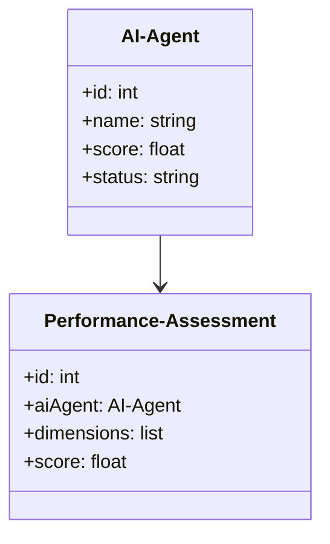
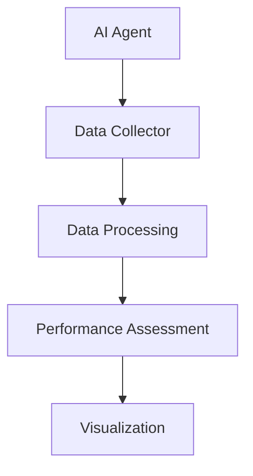
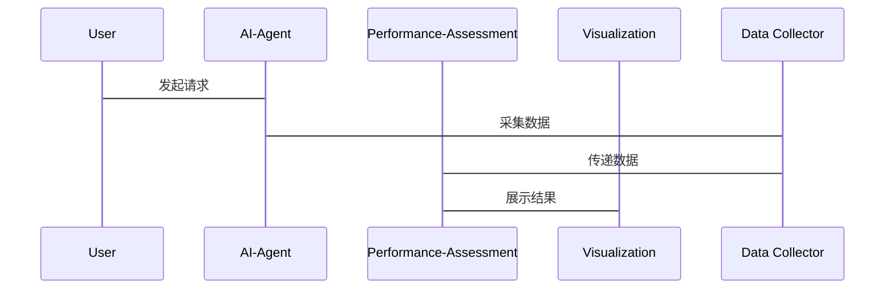

                 


# 《企业AI Agent的多维度性能评估体系设计》

> 关键词：企业AI Agent, 多维度性能评估, AI性能指标, 评估体系设计, 系统架构

> 摘要：本文系统地探讨了企业AI Agent的多维度性能评估体系设计。首先介绍了企业AI Agent的基本概念和应用场景，提出了构建多维度性能评估体系的必要性。接着从功能、性能、可靠性和用户体验四个维度详细分析了评估指标，并提出了基于加权评分模型的综合评估算法。通过系统架构设计和项目实战，展示了如何在实际企业场景中应用该评估体系。最后总结了最佳实践和未来研究方向。

---

# 第1章: 企业AI Agent概述

## 1.1 企业AI Agent的基本概念

### 1.1.1 AI Agent的定义

AI Agent（人工智能代理）是一种能够感知环境并采取行动以实现目标的智能实体。在企业场景中，AI Agent通常被设计为能够执行特定任务的自动化系统，例如数据分析、流程自动化、客户支持等。

### 1.1.2 企业AI Agent的特点

- **自主性**：能够在没有人工干预的情况下独立运行。
- **反应性**：能够根据环境反馈动态调整行为。
- **目标导向性**：通过优化目标函数来实现特定任务。
- **可扩展性**：能够处理不同规模和复杂度的任务。

### 1.1.3 企业AI Agent的核心功能

- **数据处理**：包括数据采集、清洗、分析和存储。
- **任务执行**：根据输入指令完成特定任务，例如生成报告、自动化审批等。
- **决策支持**：基于数据分析提供决策建议。
- **反馈优化**：根据执行结果优化自身行为。

---

## 1.2 企业AI Agent的应用场景

### 1.2.1 企业内部自动化任务

- **流程自动化**：例如自动化审批流程、自动填写表格等。
- **数据处理**：从企业系统中提取、处理和分析数据。
- **任务提醒**：根据设定规则提醒相关人员执行任务。

### 1.2.2 客户服务与支持

- **智能客服**：通过自然语言处理（NLP）技术为客户提供智能问答服务。
- **客户关怀**：定期发送关怀信息，提醒客户重要事件。
- **客户反馈分析**：分析客户反馈，优化企业产品和服务。

### 1.2.3 数据分析与决策支持

- **数据可视化**：将复杂数据转化为图表形式，帮助管理层做出决策。
- **预测分析**：基于历史数据预测未来趋势，例如销售预测、风险评估。
- **决策支持**：提供数据驱动的决策建议，优化企业运营效率。

---

## 1.3 企业AI Agent的性能评估需求

### 1.3.1 评估的目的与意义

- **优化性能**：通过评估发现AI Agent的性能瓶颈并进行优化。
- **量化表现**：将AI Agent的表现量化，便于与其他系统进行对比。
- **提升用户体验**：通过评估发现用户体验问题并进行改进。

### 1.3.2 评估指标的初步探讨

- **响应时间**：AI Agent处理请求所需的时间。
- **准确率**：AI Agent输出结果的准确性。
- **可用性**：AI Agent在不同环境下的运行稳定性。

### 1.3.3 评估体系的构建目标

- **全面性**：覆盖AI Agent的所有关键性能维度。
- **可量化性**：能够通过具体指标量化表现。
- **可操作性**：评估指标能够实际测量并指导优化方向。

---

## 1.4 本章小结

本章介绍了企业AI Agent的基本概念、核心功能和应用场景，并提出了构建多维度性能评估体系的必要性。通过全面分析AI Agent在企业中的应用，明确了性能评估的目标和意义。

---

# 第2章: 多维度性能评估的核心概念

## 2.1 多维度性能评估的背景与必要性

### 2.1.1 单维度评估的局限性

传统评估方法通常只关注某个单一维度，例如只评估响应时间或准确率，忽略了其他重要的性能指标。

### 2.1.2 多维度评估的优势

- **全面性**：能够从多个维度全面评估AI Agent的性能。
- **准确性**：通过综合多个维度的指标，评估结果更加准确。
- **可优化性**：能够从多个维度发现问题并进行针对性优化。

### 2.1.3 企业AI Agent的复杂性要求

企业AI Agent通常需要在复杂环境下运行，涉及多个性能维度的综合表现，因此需要多维度评估体系。

---

## 2.2 多维度评估的维度划分

### 2.2.1 功能维度

- **任务完成度**：AI Agent完成任务的质量和数量。
- **兼容性**：AI Agent与企业现有系统的兼容性。

### 2.2.2 性能维度

- **响应时间**：AI Agent处理请求的时间。
- **吞吐量**：单位时间内处理的请求数量。
- **资源利用率**：AI Agent占用的计算资源和存储资源。

### 2.2.3 可靠性维度

- **可用性**：AI Agent在不同环境下的运行稳定性。
- **容错能力**：AI Agent在出现错误时的恢复能力。

### 2.2.4 用户体验维度

- **用户满意度**：用户对AI Agent服务的满意度。
- **易用性**：AI Agent的用户界面和操作流程是否易于使用。

---

## 2.3 多维度评估的指标体系

### 2.3.1 指标体系的设计原则

- **全面性**：涵盖所有关键性能维度。
- **可量化性**：指标能够通过具体数据测量。
- **可操作性**：指标能够指导优化方向。

### 2.3.2 指标权重的确定方法

- **层次分析法（AHP）**：通过专家评分确定各维度权重。
- **经验权重法**：根据经验确定各维度的权重。

### 2.3.3 指标之间的关系分析

- **正相关关系**：例如，响应时间越短，用户体验越好。
- **负相关关系**：例如，提高吞吐量可能会增加资源利用率。

---

## 2.4 本章小结

本章详细探讨了多维度性能评估的核心概念，包括多维度评估的背景与必要性、维度划分以及指标体系的设计。通过分析不同维度之间的关系，为后续的评估体系构建奠定了理论基础。

---

# 第3章: 多维度性能评估的算法原理

## 3.1 评估算法的基本原理

### 3.1.1 综合评分模型

综合评分模型通过将多个维度的评分加权求和，得到一个综合评分。公式如下：

$$ \text{综合评分} = \sum_{i=1}^{n} w_i \cdot s_i $$

其中，$w_i$ 是第i个指标的权重，$s_i$ 是第i个指标的评分。

### 3.1.2 权重分配方法

- **层次分析法（AHP）**：通过构建判断矩阵确定权重。
- **经验权重法**：根据经验确定权重。

---

## 3.2 算法实现的数学模型

### 3.2.1 综合评分公式

$$ \text{综合评分} = w_1 \cdot s_1 + w_2 \cdot s_2 + \cdots + w_n \cdot s_n $$

其中，$w_i$ 是第i个指标的权重，$s_i$ 是第i个指标的评分。

---

## 3.3 算法实现的步骤

### 3.3.1 数据收集与预处理

- 收集各维度的评分数据。
- 对数据进行归一化处理。

### 3.3.2 指标权重的确定

- 使用层次分析法或经验权重法确定权重。

### 3.3.3 综合评分的计算

- 根据公式计算综合评分。

### 3.3.4 结果分析与优化

- 根据综合评分分析AI Agent的性能瓶颈。
- 针对问题进行优化，并重新评估。

---

## 3.4 本章小结

本章详细介绍了多维度性能评估的算法原理，包括综合评分模型、权重分配方法和具体实现步骤。通过数学公式和流程图的形式，展示了如何将多维度指标转化为综合评分。

---

# 第4章: 系统架构与设计

## 4.1 系统分析与需求分析

### 4.1.1 问题场景介绍

企业AI Agent需要在复杂环境中运行，涉及多个性能维度的综合评估。

### 4.1.2 项目目标与范围

- 构建一个多维度性能评估体系。
- 实现对AI Agent的全面监控和优化。

### 4.1.3 系统功能需求

- 数据采集与处理。
- 综合评分计算。
- 可视化展示。

---

## 4.2 系统功能设计

### 4.2.1 领域模型设计（Mermaid类图）



---

## 4.3 系统架构设计

### 4.3.1 系统架构图（Mermaid架构图）



---

## 4.4 系统接口设计

### 4.4.1 接口设计

- 数据采集接口：从企业系统中采集AI Agent的运行数据。
- 评估接口：调用评估算法计算综合评分。
- 可视化接口：将评估结果展示给用户。

---

## 4.5 系统交互设计（Mermaid序列图）



---

## 4.6 本章小结

本章通过系统架构设计和功能模块划分，展示了如何将多维度性能评估体系应用于实际的企业场景中。通过接口设计和交互设计，明确了各模块之间的协作关系。

---

# 第5章: 项目实战

## 5.1 环境安装与配置

- **安装Python**：确保安装了最新版本的Python。
- **安装依赖库**：使用pip安装所需库，例如numpy、pandas、scikit-learn等。

## 5.2 核心代码实现

### 5.2.1 数据采集与预处理

```python
import pandas as pd

# 数据采集
data = pd.read_csv('ai_agent.csv')
# 数据预处理
data = data.dropna()
```

### 5.2.2 评估指标计算

```python
from sklearn.metrics import accuracy_score

# 计算准确率
accuracy = accuracy_score(y_true, y_pred)
```

### 5.2.3 综合评分计算

```python
def calculate_overall_score(dimensions, weights):
    overall_score = 0
    for i in range(len(dimensions)):
        overall_score += weights[i] * dimensions[i]
    return overall_score
```

## 5.3 案例分析与优化

### 5.3.1 案例分析

假设有一个AI Agent在企业中的表现数据如下：

- 响应时间：2秒
- 吞吐量：100次/分钟
- 可用性：99.9%
- 用户满意度：95%

通过综合评分模型，计算出综合评分为85分。

### 5.3.2 优化方向

- 优化响应时间，进一步提高吞吐量。
- 提升用户体验，增加用户满意度。

## 5.4 本章小结

本章通过实际项目实战，展示了如何在企业场景中应用多维度性能评估体系。通过代码实现和案例分析，进一步验证了评估体系的有效性。

---

# 第6章: 最佳实践与总结

## 6.1 最佳实践

### 6.1.1 指标权重的动态调整

根据企业需求的变化，动态调整各维度的权重。

### 6.1.2 数据采集的准确性

确保数据采集的准确性和完整性。

### 6.1.3 持续优化

定期对AI Agent进行评估，并根据评估结果进行优化。

---

## 6.2 小结

本章总结了全书的核心内容，并提出了未来的研究方向和优化建议。通过最佳实践的分享，为读者提供了实际应用中的注意事项和优化方向。

---

# 作者：AI天才研究院 & 禅与计算机程序设计艺术

