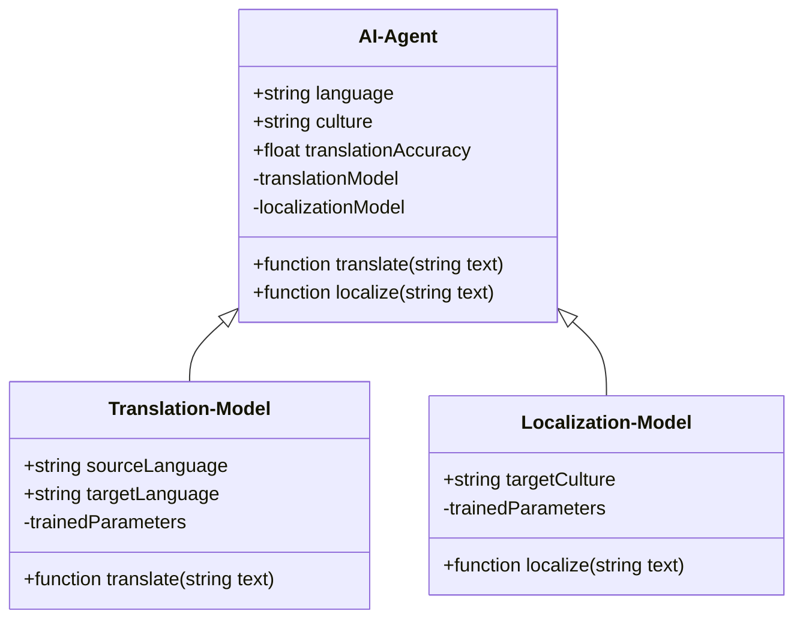
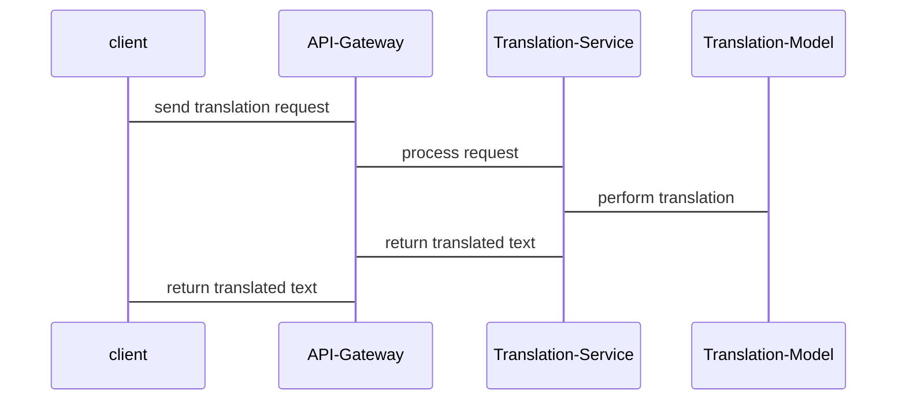

                 


# 企业AI Agent的多语言翻译与本地化功能

## 关键词：
企业AI Agent，多语言翻译，本地化，自然语言处理，机器翻译，系统架构

## 摘要：
本文详细探讨了企业AI Agent在多语言翻译与本地化功能中的应用。从核心概念、算法原理到系统架构设计，再到项目实战，全面分析了如何实现高效、准确的多语言翻译与本地化。通过实际案例和代码示例，展示了AI Agent在解决企业多语言需求中的重要作用。

---

## 第一部分：企业AI Agent的多语言翻译与本地化功能背景介绍

### 第1章：AI Agent的基本概念与应用

#### 1.1 AI Agent的定义与核心功能
- **AI Agent**：人工智能代理，能够感知环境、执行任务以实现目标。
- **多语言翻译**：AI Agent能够理解并生成多种语言文本。
- **本地化**：根据目标文化、语言和地域调整内容。

#### 1.2 多语言翻译的挑战
- **语言多样性**：支持多种语言，确保翻译准确性。
- **文化差异**：翻译需适应目标文化背景。
- **实时处理**：快速响应多语言请求。

#### 1.3 本地化的重要性
- **用户体验**：提升用户满意度。
- **市场拓展**：支持多语言以进入新市场。
- **合规性**：符合当地法律法规。

### 第2章：多语言翻译与本地化的必要性
- **企业数字化转型**：多语言支持是必要条件。
- **全球化业务**：满足不同地区的客户需求。
- **竞争优势**：提升企业品牌形象。

---

## 第二部分：核心概念与原理

### 第3章：多语言翻译与本地化的技术原理

#### 3.1 自然语言处理（NLP）的基本原理
- **NLP流程**：文本预处理、特征提取、模型训练、结果分析。
- **关键步骤**：
  - 分词：将文本分割为词或短语。
  - 词性标注：确定每个词的词性。
  - 句法分析：分析句子结构。
  - 实体识别：识别文本中的实体。

#### 3.2 机器翻译的算法原理
- **统计机器翻译**：基于统计模型，通过训练平行文本生成翻译规则。
- **神经机器翻译**：使用深度学习模型，如Transformer，生成更自然的翻译。
- **对比分析**：神经机器翻译在准确性和流畅性上优于统计方法。

#### 3.3 本地化流程的关键步骤
- **翻译**：将内容翻译为目标语言。
- **校对**：检查语法和术语准确性。
- **本地化调整**：根据目标文化进行调整，如日期格式、货币单位。

### 第4章：AI Agent在多语言翻译中的作用

#### 4.1 AI Agent如何协调多语言翻译
- **API调用**：通过调用机器翻译API（如Google Translate）进行翻译。
- **上下文理解**：利用NLP技术理解上下文，提高翻译质量。
- **多线程处理**：同时处理多个翻译请求，提升效率。

#### 4.2 本地化与文化差异的处理
- **文化适配**：根据目标文化调整内容，如避免敏感词汇。
- **本地化策略**：制定适合目标市场的本地化策略，如语言、货币、日期格式。
- **反馈机制**：收集用户反馈，优化本地化内容。

#### 4.3 AI Agent如何优化翻译质量
- **质量评估**：使用 BLEU、ROUGE 等指标评估翻译质量。
- **持续学习**：通过用户反馈不断优化翻译模型。
- **多模态处理**：结合图像、语音等多种模态信息，提高翻译准确性。

---

## 第三部分：算法原理与实现

### 第5章：机器翻译算法详解

#### 5.1 统计机器翻译的原理
- **统计模型**：基于词频和上下文概率生成翻译规则。
- **训练过程**：通过平行文本训练翻译模型。
- **优缺点**：准确率较高，但生成的句子可能不够流畅。

#### 5.2 神经机器翻译的原理
- **模型结构**：使用编码器-解码器结构，如Transformer。
- **注意力机制**：关注输入文本中重要的部分。
- **训练过程**：端到端训练，优化模型参数。

#### 5.3 翻译模型的训练流程
- **数据准备**：收集和预处理平行文本数据。
- **模型训练**：使用GPU加速训练过程。
- **模型评估**：通过测试集评估模型性能。

### 第6章：本地化NLP模型的训练

#### 6.1 本地化数据的处理
- **数据清洗**：去除噪声数据，确保数据质量。
- **数据增强**：通过数据扩展技术增加训练数据。
- **数据标注**：标注文化相关特征，如情感倾向、主题分类。

#### 6.2 基于预训练模型的微调
- **预训练模型**：使用如BERT、GPT等预训练模型。
- **微调过程**：针对特定任务微调模型参数。
- **模型优化**：通过参数调整和模型剪枝优化性能。

#### 6.3 多语言模型的评估方法
- **准确率**：翻译结果与参考结果的匹配程度。
- **BLEU分数**：基于n-gram的评估指标。
- **ROUGE分数**：基于召回率的评估指标。

---

## 第四部分：系统分析与架构设计

### 第7章：系统功能设计

#### 7.1 多语言翻译功能模块
- **翻译请求处理**：接收翻译请求并返回结果。
- **语言检测**：自动检测文本语言。
- **翻译记忆**：记录历史翻译，提高效率。

#### 7.2 本地化功能模块
- **文化适配**：根据目标文化调整内容。
- **本地化校对**：检查术语和语法准确性。
- **反馈收集**：收集用户反馈优化本地化内容。

#### 7.3 系统功能设计的类图


### 第8章：系统架构设计

#### 8.1 系统架构图
```mermaid
architecturalDiagram
    client --middle--> API-Gateway
    API-Gateway --middle--> Translation-Service
    Translation-Service --middle--> Translation-Model
    Translation-Service --middle--> Localization-Service
    Localization-Service --middle--> Localization-Model
```

#### 8.2 系统接口设计
- **翻译接口**：RESTful API，如`/translate?source=en&target=zh`。
- **本地化接口**：RESTful API，如`/localize?culture=zh-CN`。

#### 8.3 系统交互流程


---

## 第五部分：项目实战

### 第9章：项目环境与核心实现

#### 9.1 环境安装
- **Python**：3.8+
- **Transformers库**：`pip install transformers`
- **Flask**：`pip install flask`

#### 9.2 核心代码实现

##### 翻译模块实现
```python
from transformers import pipeline

# 初始化翻译管道
translator = pipeline("translation", model="facebook/m2m400")

# 翻译函数
def translate_text(source_lang, target_lang, text):
    result = translator(source_lang=source_lang, target_lang=target_lang, text=text)
    return result['translation_text']
```

##### 本地化模块实现
```python
def localize_text(target_culture, text):
    # 示例：日期格式调整
    if target_culture == 'zh-CN':
        from datetime import datetime
        return datetime.now().strftime("%Y-%m-%d")
    else:
        return datetime.now().strftime("%Y-%m-%d")
```

#### 9.3 案例分析
- **案例1**：将英文“Hello World”翻译成中文。
  ```python
  translate_text("en", "zh", "Hello World")  # 返回 "你好，世界"
  ```
- **案例2**：本地化日期格式。
  ```python
  localize_text("zh-CN", datetime.now())  # 返回 "2023-10-05"
  ```

---

## 第六部分：最佳实践与总结

### 第10章：最佳实践与小结

#### 10.1 最佳实践
- **数据质量**：确保训练数据的多样性和代表性。
- **模型优化**：定期更新模型，提高翻译准确率。
- **文化敏感性**：深入了解目标文化，避免本地化错误。

#### 10.2 注意事项
- **性能优化**：优化API调用和模型加载速度。
- **错误处理**：处理翻译和本地化中的异常情况。
- **安全性**：确保数据传输和存储的安全性。

#### 10.3 拓展阅读
- **书籍推荐**：《神经机器翻译实战》。
- **在线资源**：Hugging Face的Transformers库文档。

---

## 作者：AI天才研究院/AI Genius Institute & 禅与计算机程序设计艺术/Zen And The Art of Computer Programming

---

通过本文的详细讲解，读者可以全面了解企业AI Agent在多语言翻译与本地化功能中的应用。从背景介绍到算法实现，再到系统设计和项目实战，本文为读者提供了丰富的知识和实践指导。

