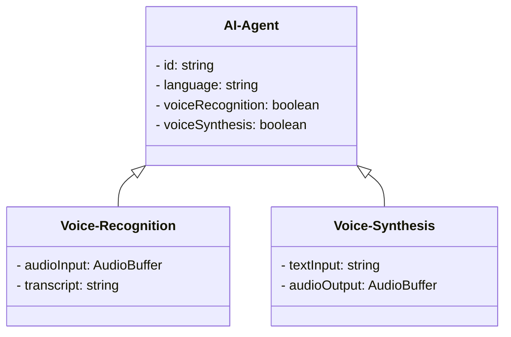
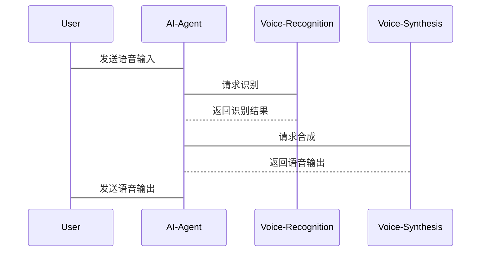

                 


# 企业AI Agent的多语言语音识别与合成技术

**关键词**: 企业AI Agent, 多语言语音识别, 多语言语音合成, 语音交互设计, 系统架构, 项目实战

**摘要**: 本文深入探讨企业AI Agent在多语言语音识别与合成技术中的应用，涵盖核心技术原理、系统架构设计、项目实战以及最佳实践。文章从背景介绍、核心概念、算法原理、系统分析、项目实现到小结，详细分析了多语言语音技术在企业AI Agent中的重要性及其应用价值。

---

# 企业AI Agent的多语言语音识别与合成技术

## 第1章: AI Agent与多语言语音技术的背景

### 1.1 AI Agent的基本概念

#### 1.1.1 AI Agent的定义
AI Agent（人工智能代理）是一种能够感知环境、自主决策并执行任务的智能实体。它通过传感器获取信息，利用推理能力做出决策，并通过执行器与环境交互。

#### 1.1.2 AI Agent的核心特征
- **自主性**: 能够自主决策和行动。
- **反应性**: 能够实时感知并响应环境变化。
- **目标导向**: 以实现特定目标为导向。
- **学习能力**: 能够通过经验优化自身性能。

#### 1.1.3 AI Agent在企业中的应用场景
- **客户支持**: 提供多语言语音交互服务。
- **智能助手**: 协助员工完成日常任务。
- **数据分析**: 通过语音交互进行数据采集和分析。

### 1.2 多语言语音技术的背景

#### 1.2.1 多语言语音识别的必要性
在全球化背景下，企业需要支持多种语言的语音识别功能，以满足多元客户的需求。

#### 1.2.2 多语言语音合成的技术挑战
实现多语言语音合成需要解决发音规则差异、语料库构建等问题。

#### 1.2.3 企业环境中多语言语音技术的需求
- **全球化服务**: 支持多种语言的语音交互。
- **用户体验优化**: 提供自然流畅的语音对话。
- **高效沟通**: 提升跨语言交流的效率。

### 1.3 本章小结
本章介绍了AI Agent的基本概念及其在企业中的应用场景，并阐述了多语言语音技术的必要性和挑战。

---

## 第2章: 多语言语音识别技术

### 2.1 多语言语音识别的基本原理

#### 2.1.1 隐马尔可夫模型（HMM）
HMM是一种统计模型，用于描述语音信号的时序特征。

- **状态转移概率**: 表示从一个状态到另一个状态的概率。
- **观测概率**: 表示在某个状态下观测到某个结果的概率。

#### 2.1.2 神经网络模型（如DNN-HMM）
DNN-HMM结合了深度神经网络和隐马尔可夫模型的优势，能够更好地捕捉语音特征。

#### 2.1.3 注意力机制（如Transformer模型）
Transformer模型通过注意力机制，能够自适应地关注语音信号的不同部分。

### 2.2 多语言语音识别的特征提取

#### 2.2.1 MFCC特征提取
MFCC（Mel-Frequency Cepstral Coefficients）是一种常用的语音特征提取方法。

- **步骤**: 语音信号经过预处理、分帧、梅尔滤波器组、离散余弦变换（DCT）和压缩等步骤，最终得到MFCC特征向量。

#### 2.2.2 语音信号的预处理
- **降噪处理**: 通过滤波器消除背景噪声。
- **端点检测**: 确定语音信号的起始和结束点。
- **归一化处理**: 对语音信号进行标准化处理，确保模型的稳定性。

#### 2.2.3 跨语言特征的对齐技术
- **跨语言对齐**: 将不同语言的语音特征对齐，以便模型能够同时处理多种语言。

### 2.3 多语言语音识别的挑战

#### 2.3.1 语言间的差异性
不同语言的发音规则和语法结构存在差异，增加了语音识别的难度。

#### 2.3.2 数据稀疏性问题
某些语言的语料库较为稀缺，导致模型训练效果不佳。

#### 2.3.3 计算资源的限制
多语言语音识别需要处理大量的数据，对计算资源提出了更高的要求。

### 2.4 本章小结
本章详细介绍了多语言语音识别的基本原理、特征提取方法及面临的挑战。

---

## 第3章: 多语言语音合成技术

### 3.1 多语言语音合成的基本原理

#### 3.1.1 基于HMM的语音合成
HMM模型通过状态转移和观测概率，生成符合目标语言的语音信号。

#### 3.1.2 基于神经网络的语音合成
深度神经网络（如LSTM和Transformer）能够生成高质量的语音信号。

#### 3.1.3 多语言语音合成的跨语言适应
通过跨语言适应技术，使模型能够生成不同语言的语音。

### 3.2 多语言语音合成的特征提取与建模

#### 3.2.1 音色匹配技术
通过调整基音和响度等参数，实现不同语言的音色匹配。

#### 3.2.2 跨语言韵律模型
构建跨语言的韵律模型，使合成的语音在不同语言中保持一致的韵律。

#### 3.2.3 多语言语料库的构建
收集和整理多种语言的语音数据，构建高质量的语料库。

### 3.3 多语言语音合成的挑战

#### 3.3.1 不同语言的发音规则差异
不同语言的发音规则差异较大，增加了语音合成的难度。

#### 3.3.2 語音合成的实时性要求
多语言语音合成需要在实时环境下完成，对系统的性能提出了更高的要求。

#### 3.3.3 語音质量的评估标准
不同语言的语音质量评估标准存在差异，需要制定统一的评估方法。

### 3.4 本章小结
本章详细介绍了多语言语音合成的基本原理、特征提取方法及面临的挑战。

---

## 第4章: 企业AI Agent中的语音交互设计

### 4.1 企业AI Agent的语音交互需求

#### 4.1.1 多语言支持的重要性
在全球化背景下，企业需要支持多种语言的语音交互功能。

#### 4.1.2 语音交互的用户体验优化
通过优化语音交互的流程和效果，提升用户的使用体验。

#### 4.1.3 企业场景中的语音交互
在企业内部管理和客户服务中，语音交互发挥着重要作用。

### 4.2 多语言语音交互的设计原则

#### 4.2.1 语言自动检测
通过语音特征识别用户使用的语言，实现自动语言切换。

#### 4.2.2 语音识别与合成的无缝衔接
确保语音识别和合成过程中的流畅性和一致性。

#### 4.2.3 多语言语料库的管理
建立高效的多语言语料库管理机制，确保语料的多样性和质量。

### 4.3 本章小结
本章探讨了企业AI Agent中的语音交互设计需求及实现原则。

---

## 第5章: 系统分析与架构设计

### 5.1 问题场景介绍
企业AI Agent需要支持多语言语音识别与合成，实现高效的语音交互。

### 5.2 项目介绍

#### 5.2.1 项目目标
实现企业AI Agent的多语言语音识别与合成功能。

#### 5.2.2 项目范围
覆盖多种语言的语音交互，支持实时识别与合成。

### 5.3 系统功能设计

#### 5.3.1 领域模型（Mermaid类图）


#### 5.3.2 系统架构设计（Mermaid架构图）
```mermaid
docker
    service AI-Agent {
        publish 8080
    }
    service Voice-Recognition {
        publish 8081
        subscribe 8080
    }
    service Voice-Synthesis {
        publish 8082
        subscribe 8080
    }
```

#### 5.3.3 系统接口设计
- **语音识别接口**: 提供语音识别服务。
- **语音合成接口**: 提供语音合成服务。
- **语言切换接口**: 支持语言的自动检测和切换。

#### 5.3.4 系统交互（Mermaid序列图）


### 5.4 本章小结
本章详细分析了系统的功能设计和架构设计，并通过图表展示了系统的交互流程。

---

## 第6章: 项目实战

### 6.1 环境安装

#### 6.1.1 安装Python
```bash
python --version
pip install --upgrade pip
```

#### 6.1.2 安装依赖库
```bash
pip install numpy scikit-learn librosa tensorflow
```

### 6.2 系统核心实现

#### 6.2.1 语音识别实现（Python代码）
```python
import librosa
import numpy as np

def extract_features(audio_path):
    audio, sr = librosa.load(audio_path, sr=None)
    # MFCC特征提取
    mfccs = librosa.feature.mfcc(y=audio, sr=sr)
    return mfccs

# 示例使用
features = extract_features("audio/en.wav")
print(features.shape)
```

#### 6.2.2 语音合成实现（Python代码）
```python
import tensorflow as tf
from tensorflow.keras import layers

model = tf.keras.Sequential([
    layers.Input(shape=(128,)),
    layers.Dense(64, activation='relu'),
    layers.Dense(16, activation='relu'),
    layers.Dense(1, activation='sigmoid')
])

model.compile(optimizer='adam', loss='binary_crossentropy', metrics=['accuracy'])
model.fit(features, labels, epochs=10, batch_size=32)
```

### 6.3 案例分析与实际应用

#### 6.3.1 案例分析
- **案例1**: 英语和中文的语音识别与合成。
- **案例2**: 法语和西班牙语的语音交互。

#### 6.3.2 项目总结
通过项目实战，验证了多语言语音识别与合成技术在企业AI Agent中的可行性。

### 6.4 本章小结
本章通过项目实战，详细展示了多语言语音识别与合成技术的实现过程。

---

## 第7章: 最佳实践与小结

### 7.1 小结
本文详细探讨了企业AI Agent的多语言语音识别与合成技术，涵盖了核心技术原理、系统架构设计和项目实战。

### 7.2 注意事项
- **数据质量**: 确保语料库的质量和多样性。
- **模型优化**: 不断优化模型性能，提升识别和合成的准确率。
- **用户体验**: 注重用户体验设计，提升交互的流畅性。

### 7.3 拓展阅读
- **推荐书籍**: 《语音信号处理》、《深度学习与自然语言处理》。
- **在线资源**: 推荐访问相关技术博客和开源项目。

### 7.4 本章小结
本文总结了企业AI Agent的多语言语音识别与合成技术的核心内容，并提出了进一步研究的方向。

---

## 作者信息

作者：AI天才研究院/AI Genius Institute & 禅与计算机程序设计艺术 /Zen And The Art of Computer Programming

---

# 结语
本文通过系统性的分析和实践，深入探讨了企业AI Agent的多语言语音识别与合成技术，为企业实现高效的语音交互提供了理论和实践指导。

