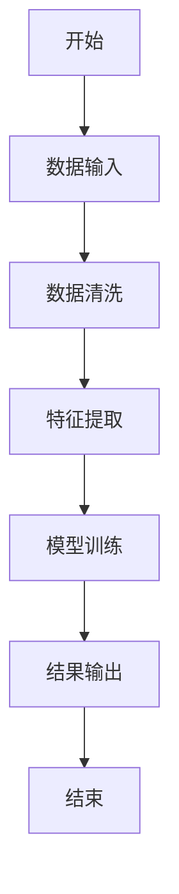
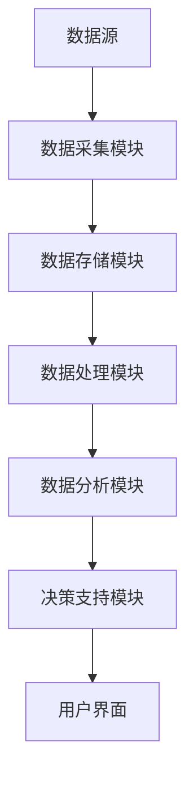

                 


# 企业AI Agent的大数据处理框架

> 关键词：企业AI Agent、大数据处理框架、分布式计算、机器学习、数据处理流程、系统架构设计

> 摘要：本文详细探讨了企业AI Agent在大数据处理框架中的应用，从核心概念到算法原理，从系统架构到项目实战，全面分析了如何构建高效的AI Agent大数据处理系统。文章通过理论与实践结合的方式，为企业技术架构师和开发人员提供了宝贵的技术参考。

---

## 第一部分: 企业AI Agent与大数据处理框架概述

### 第1章: 企业AI Agent与大数据处理框架的背景介绍

#### 1.1 问题背景与问题描述
在企业数字化转型的浪潮中，数据量的爆炸性增长和技术复杂性的提升，使得传统数据处理方式难以满足现代企业的需求。企业AI Agent作为一种智能化的数据处理工具，能够通过自动化、智能化的方式处理海量数据，从而提高数据处理效率和准确性。

#### 1.2 核心概念与边界
企业AI Agent的核心功能包括数据采集、清洗、分析和决策支持。大数据处理框架则提供了分布式计算、数据存储和处理的基础设施。两者的结合不仅提高了数据处理效率，还为企业提供了智能化的决策支持。

---

## 第2章: 企业AI Agent与大数据处理框架的核心概念与联系

### 2.1 核心概念原理
AI Agent通过分布式计算框架（如MapReduce、Spark）处理数据，利用机器学习算法（如决策树、随机森林）进行数据分析，并生成决策支持结果。大数据处理框架则提供了数据存储、计算和调度的基础设施。

### 2.2 实体关系图
```mermaid
er
    entity(AI Agent) {
        id: string,
        name: string,
        function: string
    }
    entity(大数据处理框架) {
        id: string,
        name: string,
        type: string
    }
    relation(关联关系) {
        role: "拥有"
    }
```

---

## 第3章: 企业AI Agent大数据处理框架的算法原理

### 3.1 算法原理概述
企业AI Agent通过分布式计算框架处理数据，利用机器学习算法进行数据分析，并生成决策支持结果。以下是几种关键算法的原理和实现方式：

#### 3.1.1 分布式计算框架（MapReduce、Spark）
MapReduce是一种分布式计算模型，适用于大规模数据处理。Spark则提供了更高效的计算框架，支持内存计算和流处理。

#### 3.1.2 数据清洗与预处理算法
数据清洗是数据处理的重要步骤，包括数据去重、填补缺失值和异常值处理。

#### 3.1.3 机器学习算法（决策树、随机森林）
决策树是一种基于树状结构的分类算法，随机森林则是一种集成学习算法，通过多棵决策树的投票结果进行预测。

### 3.2 算法流程图


### 3.3 算法实现代码示例
以下是决策树算法的Python实现示例：
```python
from sklearn.tree import DecisionTreeClassifier
import numpy as np

# 示例数据
X = np.array([[2, 3], [5, 6], [7, 8], [1, 2]])
y = np.array([0, 1, 1, 0])

# 模型训练
clf = DecisionTreeClassifier()
clf.fit(X, y)

# 预测
print(clf.predict([[6, 7]]))  # 输出：array([1])
```

---

## 第4章: 企业AI Agent大数据处理框架的系统分析与架构设计

### 4.1 问题场景介绍
企业需要处理海量数据，包括日志数据、用户行为数据和交易数据。这些数据需要进行清洗、分析和决策支持。

### 4.2 系统功能设计
系统功能包括数据采集、数据清洗、数据分析和决策支持。

### 4.3 系统架构设计


---

## 第5章: 企业AI Agent大数据处理框架的项目实战

### 5.1 环境安装
安装必要的开发环境，包括Python、Jupyter Notebook、Spark和Hadoop。

### 5.2 核心代码实现
以下是数据清洗和特征提取的代码示例：
```python
import pandas as pd

# 数据加载
data = pd.read_csv('data.csv')

# 数据清洗
data.dropna(inplace=True)
data.drop_duplicates(inplace=True)

# 特征提取
features = data[['age', 'gender', 'income']]
label = data['target']
```

### 5.3 项目小结
通过项目实战，读者可以掌握企业AI Agent大数据处理框架的核心技术，并能够将其应用到实际项目中。

---

## 第6章: 企业AI Agent大数据处理框架的最佳实践

### 6.1 小结
企业AI Agent大数据处理框架为企业提供了高效、智能的数据处理能力，是企业数字化转型的重要工具。

### 6.2 注意事项
在实际应用中，需要注意数据隐私保护、算法可解释性和系统可扩展性。

### 6.3 拓展阅读
推荐读者阅读《大数据处理与机器学习实战》和《分布式系统设计与实现》。

---

## 作者：AI天才研究院 & 禅与计算机程序设计艺术

感谢您的阅读！希望本文对企业AI Agent的大数据处理框架的理解有所帮助！

