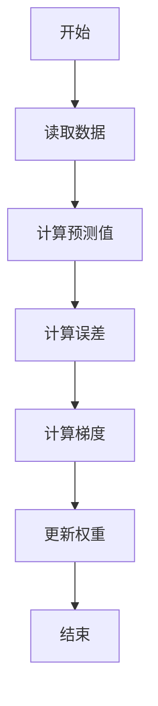
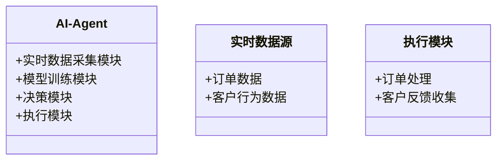
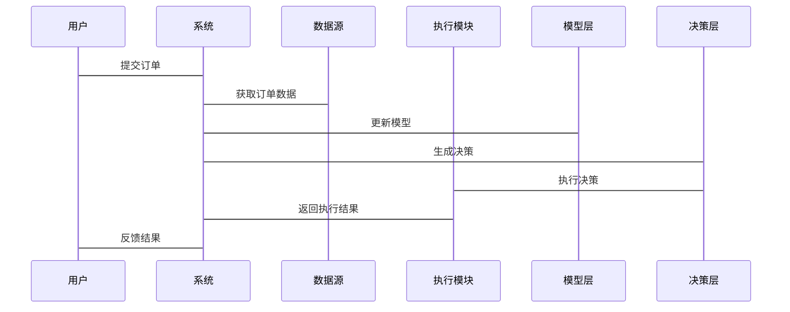

                 


# 企业AI Agent的实时学习能力：持续优化业务流程

> 关键词：企业AI Agent，实时学习能力，业务流程优化，人工智能，系统架构设计

> 摘要：本文详细探讨了企业AI Agent的实时学习能力如何通过持续优化业务流程来提升企业竞争力。文章从AI Agent的基本概念出发，分析了实时学习的机制和算法原理，详细讲解了系统架构设计，并通过项目实战展示了如何在实际场景中应用这些技术。最后，文章总结了最佳实践和未来发展趋势，为企业技术决策者提供了宝贵的参考。

---

## 第一部分: 企业AI Agent的实时学习能力概述

### 第1章: 企业AI Agent与实时学习能力概述

#### 1.1 AI Agent的基本概念

##### 1.1.1 什么是AI Agent

AI Agent（人工智能代理）是指能够感知环境并采取行动以实现目标的智能实体。它通过传感器接收输入数据，利用算法进行分析和决策，然后通过执行器输出动作。AI Agent可以是软件程序、机器人或其他智能设备，其核心在于具备自主决策和问题解决能力。

##### 1.1.2 AI Agent的核心特征

- **自主性**：AI Agent能够在没有外部干预的情况下自主决策。
- **反应性**：能够实时感知环境变化并做出响应。
- **目标导向**：所有行动都围绕实现特定目标展开。
- **学习能力**：通过经验或数据不断优化自身行为。

##### 1.1.3 企业AI Agent的定义与分类

企业AI Agent是指在企业环境中应用的智能代理，用于优化业务流程、提高效率和决策能力。根据应用场景的不同，可以分为：

- **任务型AI Agent**：专注于完成特定任务，如订单处理、客户支持。
- **决策型AI Agent**：用于复杂决策，如供应链优化、风险管理。
- **协作型AI Agent**：与其他系统或人员协作，如跨部门流程协调。

#### 1.2 实时学习能力的背景与意义

##### 1.2.1 企业业务流程优化的痛点

传统业务流程优化依赖于人工分析和调整，存在以下问题：

- **滞后性**：无法实时响应环境变化。
- **低效性**：依赖经验，缺乏数据驱动的优化。
- **局限性**：难以处理复杂和动态的业务场景。

##### 1.2.2 AI Agent在实时学习中的作用

AI Agent通过实时学习能力，能够：

- **动态调整**：根据实时数据优化流程。
- **快速响应**：及时适应市场变化和客户需求。
- **持续改进**：通过反馈不断优化决策。

##### 1.2.3 实时学习能力对企业竞争力的影响

- **提升效率**：优化流程减少资源浪费。
- **增强灵活性**：快速适应市场变化。
- **提高准确性**：基于数据的决策更可靠。

#### 1.3 问题背景与问题描述

##### 1.3.1 传统业务流程优化的局限性

传统优化方法依赖人工分析和静态规则，难以应对动态变化的环境。

##### 1.3.2 引入AI Agent的必要性

AI Agent能够实时感知和学习，提供动态优化能力，解决传统方法的局限性。

##### 1.3.3 实时学习能力的核心问题

如何构建一个能够实时学习、动态调整的AI Agent系统，以优化企业业务流程。

#### 1.4 问题解决与边界外延

##### 1.4.1 AI Agent如何解决实时学习问题

通过实时数据采集、模型更新和反馈机制，AI Agent能够持续优化业务流程。

##### 1.4.2 实时学习能力的边界与限制

- **数据质量**：依赖高质量的数据输入。
- **计算资源**：需要强大的计算能力支持。
- **模型泛化能力**：模型的泛化能力影响优化效果。

##### 1.4.3 与其他技术的结合与区别

实时学习能力与其他AI技术（如NLP、计算机视觉）的区别在于其实时性和动态优化能力。

---

## 第二部分: 实时学习能力的核心机制

### 第2章: 实时学习能力的核心机制

#### 2.1 数据流与模型更新

##### 2.1.1 数据实时采集与处理

AI Agent通过传感器或API实时采集业务数据，如订单、客户行为、系统日志等。

##### 2.1.2 模型在线更新的原理

基于在线学习算法，AI Agent在实时数据流的基础上更新模型参数。

##### 2.1.3 数据驱动的实时反馈机制

通过实时反馈机制，AI Agent能够根据执行效果调整模型参数，优化后续决策。

#### 2.2 反馈机制与自适应优化

##### 2.2.1 反馈机制的实现方式

AI Agent通过执行器输出动作，并通过反馈机制接收执行结果，用于模型优化。

##### 2.2.2 自适应优化算法的选择

常用的在线学习算法包括随机梯度下降（SGD）和Ftrl等，适用于实时数据流的处理。

##### 2.2.3 模型优化的实时性保障

通过分布式计算和流数据处理技术，确保模型更新的实时性和高效性。

#### 2.3 实时学习能力的系统架构

##### 2.3.1 系统架构的分层设计

系统架构通常分为数据采集层、模型层、决策层和执行层，每一层负责不同的功能模块。

##### 2.3.2 各组件的功能与交互

- **数据采集层**：负责实时数据的采集和预处理。
- **模型层**：负责模型的训练和更新。
- **决策层**：基于模型输出决策。
- **执行层**：将决策转化为具体行动。

##### 2.3.3 架构的可扩展性与灵活性

通过模块化设计和微服务架构，确保系统的可扩展性和灵活性。

#### 2.4 与其他AI能力的协同

##### 2.4.1 与NLP的协同

AI Agent可以与自然语言处理技术结合，处理文本数据，优化客户服务流程。

##### 2.4.2 与计算机视觉的协同

通过图像识别等技术，AI Agent能够处理视觉数据，优化生产流程。

##### 2.4.3 与知识图谱的协同

结合知识图谱技术，AI Agent能够更好地理解和处理复杂业务场景。

---

## 第三部分: 算法原理讲解

### 第3章: 算法原理与实现

#### 3.1 在线学习算法

##### 3.1.1 随机梯度下降（SGD）

随机梯度下降是一种常用的在线学习算法，适用于大规模数据集的优化。

##### 3.1.2 Ftrl算法

Ftrl是一种高效的在线优化算法，适用于稀疏数据和大特征空间。

##### 3.1.3 算法实现的Python代码

```python
import numpy as np

class SGDRegressor:
    def __init__(self, learning_rate=0.01):
        self.lr = learning_rate
        self.weights = None

    def fit(self, X, y):
        m, n = X.shape
        self.weights = np.zeros(n)
        for i in range(m):
            prediction = np.dot(X[i], self.weights)
            error = y[i] - prediction
            gradient = X[i] * error
            self.weights += self.lr * gradient
        return self

    def predict(self, X):
        return np.dot(X, self.weights)
```

##### 3.1.4 算法流程图



#### 3.2 模型更新机制

##### 3.2.1 模型更新的周期性

模型可以在每个时间步更新，或者按固定周期批量更新。

##### 3.2.2 模型版本控制

通过版本控制技术，确保模型更新的稳定性和可追溯性。

##### 3.2.3 模型评估与验证

使用交叉验证等方法评估模型性能，确保模型的有效性。

---

## 第四部分: 系统分析与架构设计方案

### 第4章: 系统架构设计

#### 4.1 问题场景介绍

以一个典型的电子商务平台为例，展示AI Agent如何优化订单处理流程。

#### 4.2 项目介绍

构建一个基于AI Agent的订单处理优化系统，通过实时学习能力减少订单处理时间。

#### 4.3 系统功能设计

##### 4.3.1 领域模型设计



##### 4.3.2 系统架构设计

```mermaid
container 企业AI Agent系统 {
    component 数据采集层 {
        数据采集模块
        数据预处理模块
    }
    component 模型层 {
        在线学习模型
        模型更新模块
    }
    component 决策层 {
        决策逻辑模块
        反馈机制模块
    }
    component 执行层 {
        执行模块
        监控模块
    }
}
```

##### 4.3.3 系统接口设计

- **数据接口**：API用于实时数据的输入和输出。
- **模型接口**：API用于模型的训练和更新。
- **决策接口**：API用于输出决策结果。

##### 4.3.4 系统交互设计



---

## 第五部分: 项目实战

### 第5章: 项目实战

#### 5.1 环境安装

安装必要的Python库，如numpy、pandas、scikit-learn等。

#### 5.2 核心代码实现

##### 5.2.1 数据采集模块

```python
import requests

def get_realtime_data(api_url):
    response = requests.get(api_url)
    return response.json()
```

##### 5.2.2 模型训练模块

```python
from sklearn.linear_model import SGDRegressor

def train_model(X, y):
    model = SGDRegressor()
    model.fit(X, y)
    return model
```

##### 5.2.3 决策模块

```python
def make_decision(model, X):
    prediction = model.predict(X)
    return prediction
```

##### 5.2.4 执行模块

```python
def execute_decision(action):
    # 实际执行操作，如调用API或触发流程
    pass
```

#### 5.3 案例分析

通过具体案例展示AI Agent如何优化订单处理流程，减少处理时间。

---

## 第六部分: 最佳实践与总结

### 第6章: 最佳实践与总结

#### 6.1 最佳实践

- **数据质量**：确保实时数据的准确性和完整性。
- **模型选择**：根据具体场景选择合适的在线学习算法。
- **系统监控**：实时监控系统性能，及时发现和解决问题。

#### 6.2 小结

通过实时学习能力，企业AI Agent能够持续优化业务流程，提升效率和竞争力。

#### 6.3 注意事项

- **数据隐私**：确保数据处理符合隐私保护法规。
- **系统稳定性**：保证系统的稳定运行，避免因故障导致业务中断。

#### 6.4 未来趋势

实时学习能力将更加智能化和自动化，AI Agent将在更多领域发挥重要作用。

---

## 作者信息

作者：AI天才研究院/AI Genius Institute & 禅与计算机程序设计艺术 /Zen And The Art of Computer Programming

---

本文详细探讨了企业AI Agent的实时学习能力如何通过持续优化业务流程来提升企业竞争力。文章从AI Agent的基本概念出发，分析了实时学习的机制和算法原理，详细讲解了系统架构设计，并通过项目实战展示了如何在实际场景中应用这些技术。最后，文章总结了最佳实践和未来发展趋势，为企业技术决策者提供了宝贵的参考。

