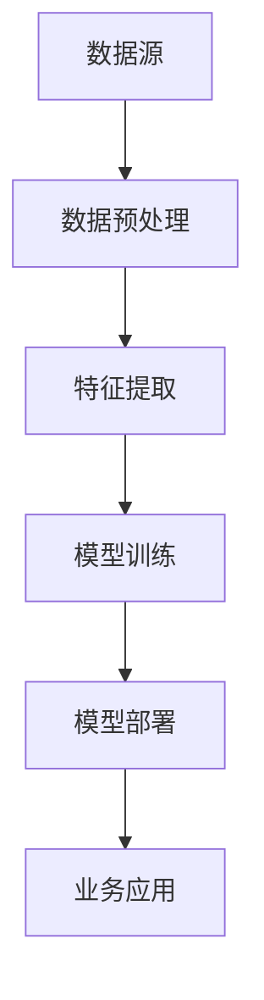

                 


# 企业AI Agent的实时学习能力：持续优化业务流程

## 关键词：企业AI Agent，实时学习，业务流程优化，机器学习，自动化

## 摘要：本文探讨了企业AI Agent的实时学习能力在持续优化业务流程中的应用。通过分析实时学习的核心原理、算法实现和系统架构设计，结合实际案例，展示了AI Agent如何通过实时学习不断优化业务流程，提升企业效率和竞争力。

---

# 第1章: 企业AI Agent的背景与概念

## 1.1 AI Agent的基本概念

### 1.1.1 AI Agent的定义与特点

AI Agent（人工智能代理）是指能够感知环境、自主决策并执行任务的智能实体。与传统的自动化系统不同，AI Agent具备以下特点：

- **智能性**：能够理解环境信息并做出决策。
- **自主性**：无需外部干预，自主完成任务。
- **适应性**：能够根据环境变化调整行为。
- **学习能力**：通过数据和经验不断优化自身的性能。

### 1.1.2 企业级AI Agent的应用场景

在企业环境中，AI Agent可以应用于多个场景，如：

- **流程自动化**：优化订单处理、客户支持等流程。
- **智能决策支持**：辅助管理层做出更明智的决策。
- **风险管理**：实时监控并预测潜在风险。
- **客户交互**：通过聊天机器人与客户进行自然对话。

### 1.1.3 AI Agent与传统自动化系统的区别

| 属性 | AI Agent | 传统自动化系统 |
|------|----------|----------------|
| 智能性 | 高       | 低             |
| 学习能力 | 高      | 无             |
| 灵活性 | 高       | 低             |
| 决策能力 | 高      | 无             |

---

## 1.2 实时学习能力的核心概念

### 1.2.1 实时学习的定义

实时学习（Online Learning）是一种机器学习方法，数据是按流的形式到达的，模型在接收到每一条新数据后立即进行更新。与批量学习不同，实时学习能够快速适应数据流的变化。

### 1.2.2 实时学习的关键特性

实时学习的关键特性包括：

- **数据流处理**：能够处理连续不断的数据流。
- **模型更新**：在接收到新数据后，立即更新模型。
- **延迟优化**：能够在较短时间内做出预测或决策。

### 1.2.3 实时学习在企业中的价值

实时学习能够帮助企业：

- **快速响应市场变化**：及时调整业务策略。
- **提升决策精度**：通过实时数据优化决策质量。
- **降低运营成本**：通过自动化优化减少人工干预。

---

## 1.3 企业业务流程优化的挑战与机遇

### 1.3.1 传统业务流程的痛点

传统业务流程的痛点包括：

- **效率低下**：流程复杂，人工干预过多。
- **响应速度慢**：无法及时应对市场变化。
- **资源浪费**：资源分配不合理，导致浪费。

### 1.3.2 AI Agent如何解决业务流程优化问题

AI Agent通过实时学习能力，能够：

- **自动化处理**：自动执行重复性任务。
- **智能决策**：基于实时数据做出最优决策。
- **动态调整**：根据环境变化快速调整流程。

### 1.3.3 未来业务流程优化的趋势

未来业务流程优化的趋势包括：

- **智能化**：更多依赖AI技术。
- **实时化**：业务流程实时调整。
- **个性化**：根据客户需求定制流程。

---

## 1.4 本章小结

本章介绍了AI Agent的基本概念、实时学习的核心概念以及企业业务流程优化的挑战与机遇。通过对比分析，明确了实时学习在企业中的重要价值。

---

# 第2章: 企业AI Agent的实时学习机制

## 2.1 实时学习的核心原理

### 2.1.1 监督学习与强化学习的结合

实时学习通常结合了监督学习和强化学习的优点：

- **监督学习**：基于标记数据进行模型训练。
- **强化学习**：通过奖励机制优化决策。

### 2.1.2 在线学习算法的基本原理

在线学习算法的基本原理包括：

1. 初始化模型参数。
2. 接收一条新数据。
3. 更新模型参数。
4. 输出预测结果。

### 2.1.3 实时反馈机制的作用

实时反馈机制能够：

- **快速调整模型**：根据反馈结果立即更新模型。
- **提高预测精度**：通过反馈不断优化模型性能。

---

## 2.2 实时学习的算法实现

### 2.2.1 基于梯度下降的实时优化算法

梯度下降是一种常用的优化算法，公式为：

$$ \theta = \theta - \eta \cdot \nabla J(\theta) $$

其中，$\theta$ 是模型参数，$\eta$ 是学习率，$\nabla J(\theta)$ 是目标函数的梯度。

### 2.2.2 增量学习算法的实现

增量学习算法的实现步骤如下：

1. 加载数据流。
2. 对每条数据进行预处理。
3. 更新模型参数。
4. 输出预测结果。

### 2.2.3 实时学习中的模型更新策略

模型更新策略包括：

- **全量更新**：每次更新所有参数。
- **部分更新**：只更新部分参数。
- **自适应更新**：根据数据分布动态调整更新步长。

---

## 2.3 实时学习的数学模型

### 2.3.1 损失函数的定义与优化

损失函数通常定义为：

$$ L(y, y_{\text{pred}}) = \frac{1}{n}\sum_{i=1}^{n}(y_i - y_{\text{pred}}i)^2 $$

其中，$y$ 是真实值，$y_{\text{pred}}$ 是预测值。

### 2.3.2 梯度下降的数学推导

梯度下降的数学推导如下：

$$ \frac{dL}{d\theta} = 2\sum_{i=1}^{n}(y_i - y_{\text{pred}}i)(-\theta x_i) $$

其中，$\theta$ 是模型参数，$x_i$ 是输入特征。

### 2.3.3 在线学习的收敛性分析

在线学习的收敛性分析表明，随着数据量的增加，模型参数会逐渐收敛到最优解。

---

## 2.4 本章小结

本章详细介绍了实时学习的核心原理、算法实现和数学模型。通过数学推导和公式分析，明确了实时学习的实现机制。

---

# 第3章: 企业AI Agent的系统架构设计

## 3.1 系统架构的整体设计

### 3.1.1 系统功能模块划分

系统功能模块包括：

- 数据采集模块
- 数据预处理模块
- 模型训练模块
- 模型部署模块
- 业务应用模块

### 3.1.2 系统组件的交互关系

系统组件的交互关系如下：

1. 数据采集模块接收实时数据。
2. 数据预处理模块对数据进行清洗和特征提取。
3. 模型训练模块基于预处理后的数据训练模型。
4. 模型部署模块将训练好的模型部署到生产环境。
5. 业务应用模块调用模型进行实时预测和决策。

### 3.1.3 系统的可扩展性设计

系统的可扩展性设计包括：

- 模块化设计：每个模块独立开发，便于扩展。
- 分布式架构：支持横向扩展。
- 异构计算：支持多种计算框架。

---

## 3.2 系统功能设计

### 3.2.1 数据采集模块的设计

数据采集模块负责从多个数据源（如数据库、API、日志等）获取实时数据。

### 3.2.2 模型训练模块的实现

模型训练模块基于实时数据进行在线学习，更新模型参数。

### 3.2.3 模型部署与应用模块的实现

模型部署模块将训练好的模型部署到生产环境，业务应用模块调用模型进行实时预测和决策。

---

## 3.3 系统架构的Mermaid图



---

## 3.4 本章小结

本章详细介绍了企业AI Agent的系统架构设计，包括功能模块划分、系统组件交互关系和系统架构图。

---

# 第4章: 企业AI Agent的实时学习算法实现

## 4.1 算法实现的步骤

### 4.1.1 数据预处理与特征提取

数据预处理包括数据清洗、归一化和特征提取等步骤。

### 4.1.2 模型训练与优化

模型训练采用在线学习算法，实时更新模型参数。

### 4.1.3 模型评估与调优

模型评估包括准确率、召回率和F1值等指标。

---

## 4.2 算法实现的代码示例

### 4.2.1 数据加载与预处理

```python
import numpy as np
from sklearn.datasets import make_classification
X, y = make_classification(n_samples=1000, n_features=20, n_classes=2)
```

### 4.2.2 模型训练

```python
from sklearn.linear_model import SGDClassifier
model = SGDClassifier(max_iter=1000, random_state=42)
model.fit(X, y)
```

### 4.2.3 模型评估

```python
from sklearn.metrics import accuracy_score
print(accuracy_score(y, model.predict(X)))
```

---

## 4.3 本章小结

本章通过代码示例和算法实现，详细讲解了企业AI Agent的实时学习算法实现步骤。

---

# 第5章: 企业AI Agent的实时学习应用案例

## 5.1 案例背景介绍

以某电商平台为例，介绍实时学习在订单处理中的应用。

## 5.2 项目实现

### 5.2.1 环境配置

```bash
pip install numpy scikit-learn
```

### 5.2.2 核心代码实现

```python
import numpy as np
from sklearn.linear_model import SGDClassifier
# 加载数据
X, y = make_classification(n_samples=1000, n_features=20, n_classes=2)
# 训练模型
model = SGDClassifier(max_iter=1000, random_state=42)
model.fit(X, y)
# 预测结果
print(model.predict(X))
```

### 5.2.3 案例分析

通过实时学习，电商平台能够实时调整订单处理策略，提升客户满意度和订单处理效率。

---

## 5.3 本章小结

本章通过实际案例，展示了企业AI Agent的实时学习能力在业务流程优化中的应用价值。

---

# 第6章: 总结与展望

## 6.1 本章总结

本文详细探讨了企业AI Agent的实时学习能力在业务流程优化中的应用，通过理论分析和案例实践，明确了实时学习的重要价值。

## 6.2 未来展望

未来，随着AI技术的不断发展，企业AI Agent的实时学习能力将更加智能化和高效化，为企业带来更大的竞争优势。

---

# 作者：AI天才研究院/AI Genius Institute & 禅与计算机程序设计艺术 /Zen And The Art of Computer Programming

---

感谢您的阅读！如需进一步了解企业AI Agent的实时学习能力，请关注我们的后续文章或联系我们。

