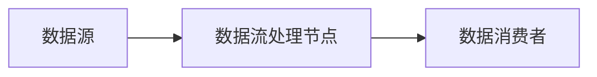
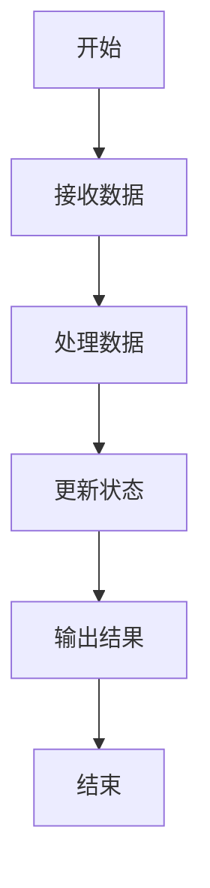
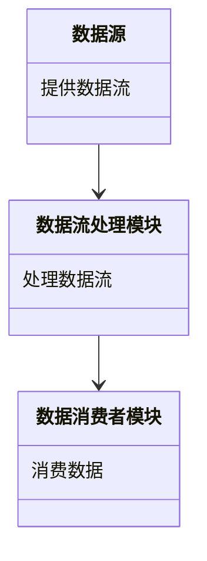

                 


# 企业AI Agent的实时数据流处理架构

> 关键词：企业AI Agent、实时数据流处理、流处理算法、系统架构设计、数据流处理

> 摘要：本文详细探讨了企业AI Agent在实时数据流处理中的架构设计、核心概念、算法原理及实现方法。从背景介绍到系统架构设计，从算法实现到项目实战，全面解析了企业AI Agent实时数据流处理的各个方面。文章通过详细的理论分析和实际案例，帮助读者深入理解如何设计和实现高效可靠的实时数据流处理系统。

---

# 第一部分: 企业AI Agent的实时数据流处理概述

## 第1章: 企业AI Agent与实时数据流处理概述

### 1.1 企业AI Agent的背景与概念

#### 1.1.1 企业AI Agent的定义与特点
企业AI Agent（Artificial Intelligence Agent）是一种能够感知环境、自主决策并执行任务的智能体。与传统程序不同，AI Agent具备以下特点：
- **自主性**：能够独立决策，无需人工干预。
- **反应性**：能够实时感知环境变化并做出反应。
- **学习能力**：能够通过数据和经验不断优化自身行为。
- **协作性**：能够与其他系统或Agent协同工作。

#### 1.1.2 实时数据流处理的必要性
在现代企业中，数据的实时性要求越来越高。企业AI Agent需要能够实时处理来自各种数据源的流数据，以便快速响应业务需求。实时数据流处理的主要优势包括：
- **快速响应**：能够及时处理数据并做出决策。
- **实时反馈**：能够实时提供反馈，优化业务流程。
- **高效性**：能够通过并行处理提高数据处理效率。

#### 1.1.3 企业AI Agent的核心价值
企业AI Agent通过实时数据流处理，为企业提供了以下核心价值：
- **提升效率**：通过自动化处理数据，减少人工干预，提高业务效率。
- **增强决策能力**：通过实时数据分析，提供精准的决策支持。
- **优化用户体验**：通过实时响应用户需求，提升用户体验。

### 1.2 企业AI Agent的架构与功能

#### 1.2.1 企业AI Agent的基本架构
企业AI Agent的架构通常包括以下几个核心组件：
- **感知层**：负责感知环境数据，包括数据采集和预处理。
- **决策层**：负责对数据进行分析和决策，生成相应的操作指令。
- **执行层**：负责执行决策层生成的操作指令，输出结果。

#### 1.2.2 数据流处理的核心功能
数据流处理是企业AI Agent的核心功能，主要包括以下步骤：
- **数据采集**：从各种数据源采集实时数据。
- **数据处理**：对采集到的数据进行清洗、转换和计算。
- **数据存储**：将处理后的数据存储到数据库或其他存储系统中。
- **数据输出**：将结果输出给消费者或触发相应的操作。

#### 1.2.3 企业AI Agent与传统系统的区别
与传统系统相比，企业AI Agent的主要区别在于其自主性和智能性。传统系统通常基于规则进行处理，而企业AI Agent能够通过学习和推理，动态调整其行为，以适应环境的变化。

### 1.3 实时数据流处理的挑战与机遇

#### 1.3.1 实时数据流处理的挑战
实时数据流处理面临以下主要挑战：
- **数据量大**：实时数据流通常具有很高的数据吞吐量。
- **数据实时性要求高**：需要在极短的时间内完成数据处理。
- **系统可靠性要求高**：需要保证系统的高可用性和容错性。

#### 1.3.2 企业AI Agent的优势
企业AI Agent通过其智能性和自主性，能够有效应对实时数据流处理的挑战。其优势包括：
- **高效性**：能够快速处理大量数据。
- **自适应性**：能够根据环境变化动态调整其行为。
- **智能性**：能够通过学习和推理优化数据处理流程。

#### 1.3.3 未来发展趋势与机遇
随着人工智能和大数据技术的不断发展，企业AI Agent在实时数据流处理领域的应用前景广阔。未来的发展趋势包括：
- **智能化**：通过强化学习和深度学习提升AI Agent的智能性。
- **分布式化**：通过分布式架构提高系统的扩展性和可靠性。
- **边缘计算**：通过边缘计算实现数据的实时处理和分析。

### 1.4 本章小结
本章介绍了企业AI Agent的基本概念、架构和功能，并分析了实时数据流处理的挑战与机遇。通过对企业AI Agent与传统系统的对比，强调了其在实时数据流处理中的独特优势。

---

# 第二部分: 企业AI Agent的核心概念与原理

## 第2章: 实时数据流处理的核心概念

### 2.1 数据流处理的基本原理

#### 2.1.1 数据流的定义与分类
数据流是指在系统中流动的数据，通常分为以下几类：
- **实时数据流**：数据源实时生成的数据，需要立即处理。
- **批量数据流**：周期性生成的大批量数据，通常需要离线处理。

#### 2.1.2 流处理与批量处理的对比
流处理与批量处理的主要区别如下：

| 对比维度 | 流处理 | 批量处理 |
|----------|--------|----------|
| 数据来源 | 实时数据源 | 批量数据源 |
| 处理时间 | 实时处理 | 离线处理 |
| 处理特点 | 高实时性、低延迟 | 高吞吐量、低成本 |

#### 2.1.3 实时数据流处理的关键特征
实时数据流处理的关键特征包括：
- **低延迟**：处理时间尽可能短。
- **高吞吐量**：能够处理大量数据。
- **容错性**：能够容忍数据源或处理节点的故障。

### 2.2 企业AI Agent的实时数据流处理架构

#### 2.2.1 数据源与数据消费者的实体关系
数据源和数据消费者之间的关系可以用以下Mermaid图表示：



#### 2.2.2 数据流处理的流程图
数据流处理的流程图如下：



#### 2.2.3 数据流处理的数学模型与公式
数据流处理的数学模型通常涉及以下公式：
- **状态更新公式**：
  $$\text{新状态} = f(\text{旧状态}, \text{新数据})$$
- **窗口操作公式**：
  $$\text{窗口大小} = n$$
- **事件时间公式**：
  $$\text{事件时间} = \text{数据生成时间}$$

### 2.3 本章小结
本章详细介绍了实时数据流处理的核心概念，包括数据流的定义与分类、流处理与批量处理的对比，以及数据流处理的数学模型与公式。

---

## 第3章: 企业AI Agent的算法原理与实现

### 3.1 流处理算法的基本原理

#### 3.1.1 流处理的核心算法
流处理的核心算法包括：
- **滑动窗口算法**：用于处理时间窗口内的数据。
- **事件驱动算法**：根据事件的发生顺序进行数据处理。

#### 3.1.2 窗口操作与事件时间
窗口操作是流处理中的一个重要概念，通常涉及以下公式：
$$\text{窗口大小} = n$$
$$\text{窗口滑动步长} = m$$

#### 3.1.3 状态管理与检查点
状态管理是流处理中的关键部分，通常涉及以下步骤：
1. 初始化状态。
2. 接收数据并更新状态。
3. 定期进行检查点，确保状态的持久化。

### 3.2 企业AI Agent的流处理算法实现

#### 3.2.1 算法流程图
流处理算法的流程图如下：


#### 3.2.2 算法实现的数学模型与公式
流处理算法的数学模型通常涉及以下公式：
- **状态更新公式**：
  $$\text{新状态} = f(\text{旧状态}, \text{新数据})$$
- **窗口操作公式**：
  $$\text{窗口大小} = n$$
- **事件时间公式**：
  $$\text{事件时间} = \text{数据生成时间}$$

### 3.3 本章小结
本章详细介绍了流处理算法的基本原理，包括流处理的核心算法、窗口操作与事件时间，以及状态管理与检查点。

---

## 第4章: 企业AI Agent的系统架构与设计

### 4.1 系统功能设计

#### 4.1.1 数据源模块
数据源模块负责从各种数据源采集实时数据，包括以下功能：
1. 数据采集。
2. 数据预处理。

#### 4.1.2 数据流处理模块
数据流处理模块负责对数据进行处理，包括以下功能：
1. 数据清洗。
2. 数据转换。
3. 数据计算。

#### 4.1.3 数据消费者模块
数据消费者模块负责消费处理后的数据，包括以下功能：
1. 数据存储。
2. 数据输出。

### 4.2 系统架构图
系统架构图如下：



### 4.3 系统接口设计

#### 4.3.1 数据源接口
数据源接口通常包括以下方法：
- `getData()`: 获取实时数据。
- `subscribe()`: 订阅数据源。

#### 4.3.2 数据流处理接口
数据流处理接口通常包括以下方法：
- `processData()`: 处理数据。
- `updateState()`: 更新状态。

#### 4.3.3 数据消费者接口
数据消费者接口通常包括以下方法：
- `consumeData()`: 消费数据。
- `storeData()`: 存储数据。

### 4.4 本章小结
本章详细介绍了企业AI Agent的系统架构与设计，包括系统功能设计、系统架构图，以及系统接口设计。

---

## 第5章: 企业AI Agent的项目实战

### 5.1 环境安装

#### 5.1.1 数据流处理框架的选择
数据流处理框架可以选择以下几种：
- Apache Flink。
- Apache Kafka。

#### 5.1.2 环境配置
环境配置通常包括以下步骤：
1. 安装JDK。
2. 安装数据流处理框架。
3. 配置环境变量。

### 5.2 核心代码实现

#### 5.2.1 数据源代码实现
数据源代码实现通常包括以下内容：
```python
class DataSource:
    def __init__(self):
        self.data = []

    def get_data(self):
        # 模拟数据生成
        self.data.append(time.time())
        return self.data
```

#### 5.2.2 数据流处理代码实现
数据流处理代码实现通常包括以下内容：
```python
class DataProcessor:
    def __init__(self):
        self.state = 0

    def process_data(self, data):
        # 模拟数据处理
        self.state += data
        return self.state
```

#### 5.2.3 数据消费者代码实现
数据消费者代码实现通常包括以下内容：
```python
class DataConsumer:
    def __init__(self):
        self.data = []

    def consume_data(self, data):
        self.data.append(data)
        print("接收到数据:", data)
```

### 5.3 案例分析与代码解读
案例分析通常包括以下步骤：
1. 数据源生成数据。
2. 数据流处理模块处理数据。
3. 数据消费者模块消费数据。

### 5.4 本章小结
本章通过实际项目实战，详细介绍了企业AI Agent的环境安装、核心代码实现，以及案例分析与代码解读。

---

## 第6章: 最佳实践与总结

### 6.1 最佳实践

#### 6.1.1 系统设计建议
- 确保系统的高可用性。
- 采用分布式架构提高扩展性。
- 定期进行性能优化。

#### 6.1.2 代码实现建议
- 使用高效的数据结构。
- 采用并行处理提高处理速度。
- 定期进行代码审查。

### 6.2 小结
本文详细探讨了企业AI Agent在实时数据流处理中的架构设计、核心概念、算法原理及实现方法。通过实际案例分析，帮助读者深入理解如何设计和实现高效可靠的实时数据流处理系统。

### 6.3 注意事项
- 确保系统的安全性。
- 定期进行系统维护。
- 注意数据隐私保护。

### 6.4 拓展阅读
- 推荐阅读《Stream Processing: The New SQL》。
- 推荐阅读《Apache Flink: The Definitive Guide》。

---

# 作者：AI天才研究院/AI Genius Institute & 禅与计算机程序设计艺术 /Zen And The Art of Computer Programming

