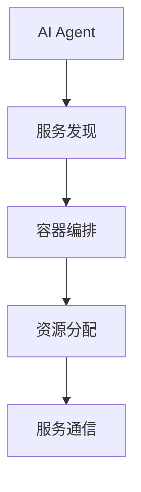
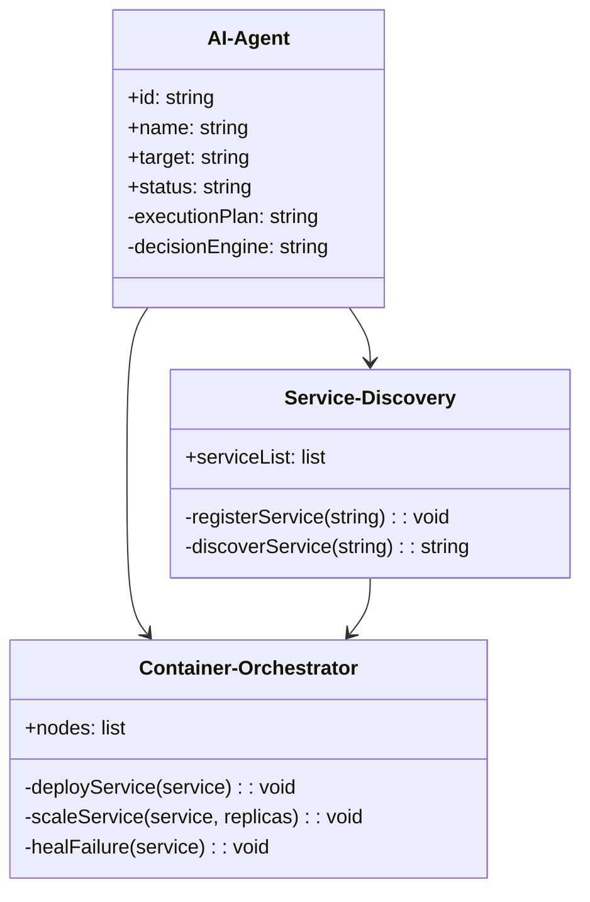
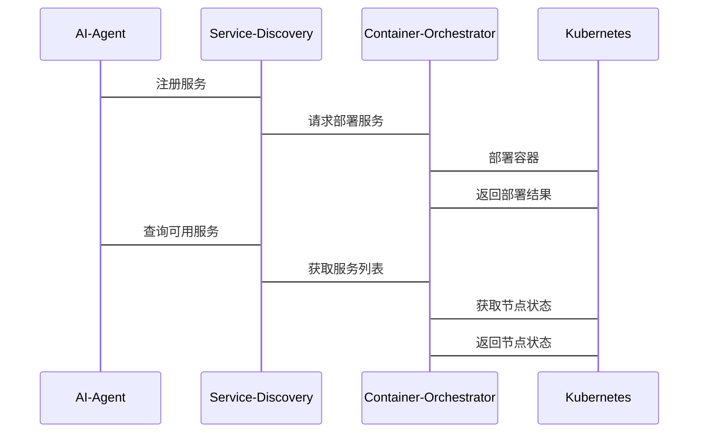

                 


# 企业AI Agent的容器化微服务编排策略

> 关键词：企业AI Agent，容器化，微服务编排，Docker，Kubernetes，服务发现，负载均衡

> 摘要：本文深入探讨了企业AI Agent在容器化微服务架构中的编排策略，从背景、核心概念、算法原理到系统架构设计、项目实战和最佳实践，为企业级AI Agent的高效部署和管理提供全面指导。

---

## 第1章：企业AI Agent的背景与容器化微服务概述

### 1.1 企业AI Agent的发展背景

#### 1.1.1 AI Agent的定义与特点
AI Agent（智能代理）是一种能够感知环境、自主决策并执行任务的智能实体。其特点包括：
- **自主性**：无需外部干预，自主完成任务。
- **反应性**：能够实时感知环境变化并做出响应。
- **目标导向**：基于明确的目标执行操作。
- **学习能力**：通过数据和经验不断优化性能。

#### 1.1.2 企业级AI Agent的应用场景
在企业环境中，AI Agent广泛应用于：
- **智能客服**：通过自然语言处理提供24/7的客户支持。
- **自动化运维**：监控系统状态，自动修复故障。
- **数据分析与决策**：实时分析数据，提供决策支持。
- **供应链管理**：优化库存管理，提高供应链效率。

#### 1.1.3 容器化技术的兴起与优势
容器化技术（如Docker）为企业AI Agent的部署提供了诸多优势：
- **轻量级部署**：相比虚拟机，容器启动快、资源消耗低。
- **一致性**：确保开发、测试和生产环境的一致性。
- **弹性扩展**：根据负载动态调整资源分配。

### 1.2 微服务架构的背景与发展

#### 1.2.1 微服务架构的核心理念
微服务架构将应用分解为多个小型、独立的服务，每个服务负责特定的功能。其核心理念包括：
- **松耦合**：服务之间通过API进行通信，降低耦合度。
- **可扩展性**：每个服务可根据需求独立扩展。
- **技术多样性**：允许使用不同的技术栈开发不同服务。

#### 1.2.2 微服务与传统单体架构的对比
| 对比维度 | 微服务架构 | 单体架构 |
|----------|-------------|-----------|
| 开发效率 | 开发人员可以独立开发功能模块 | 需要协调多个团队 |
| 可扩展性 | 可按需扩展特定服务 | 整体扩展，可能造成资源浪费 |
| 系统复杂性 | 系统复杂度较高，但灵活性强 | 系统简单，但扩展性差 |

#### 1.2.3 微服务在企业AI Agent中的应用潜力
通过微服务架构，企业AI Agent可以实现：
- **功能模块化**：将AI Agent的不同功能（如自然语言处理、决策引擎）拆分为独立的服务。
- **高可用性**：通过服务间的松耦合设计，提高系统的容错能力。
- **快速迭代**：每个服务独立开发和部署，加速产品迭代。

### 1.3 容器化与微服务编排的结合

#### 1.3.1 容器化技术对企业AI Agent的推动作用
容器化技术使得企业AI Agent的部署更加灵活和高效，能够快速响应业务需求的变化。

#### 1.3.2 微服务编排在企业AI Agent中的必要性
随着企业AI Agent的功能日益复杂，传统的单体架构难以满足需求，而微服务编排能够提供更好的解决方案。

#### 1.3.3 企业AI Agent容器化微服务编排的未来趋势
未来的趋势包括：
- **自动化编排**：通过工具（如Kubernetes）实现自动化部署和管理。
- **智能化调度**：基于实时数据动态调整资源分配。
- **多云架构**：支持多云环境，提高系统的可用性和可靠性。

---

## 第2章：核心概念与联系

### 2.1 核心概念原理

#### 2.1.1 AI Agent的核心原理
AI Agent通过感知环境、分析信息、制定决策并执行操作来完成任务。其核心流程包括：
1. **感知环境**：通过传感器或API获取环境数据。
2. **分析信息**：利用机器学习模型对数据进行处理和分析。
3. **制定决策**：基于分析结果生成行动计划。
4. **执行操作**：通过API或命令执行具体操作。

#### 2.1.2 容器化技术的核心原理
容器化通过轻量级虚拟化技术，将应用程序及其依赖打包为容器镜像，确保在不同环境中一致运行。

#### 2.1.3 微服务架构的核心原理
微服务架构将应用分解为多个小型、独立的服务，每个服务负责特定的功能，通过API进行通信。

### 2.2 概念属性特征对比

| 概念     | 核心属性                     |
|----------|------------------------------|
| AI Agent | 自主性、目标导向、学习能力   |
| 容器化    | 轻量级、一致性、可移植性     |
| 微服务    | 松耦合、可扩展性、技术多样性 |

### 2.3 实体关系与架构设计



---

## 第3章：算法原理与数学模型

### 3.1 容器编排算法原理

#### 3.1.1 调度算法
常见的调度算法包括：
- **随机算法**：随机选择一个可用节点进行部署。
- **轮询算法**：按顺序选择节点进行部署。
- **加权算法**：根据节点的负载情况动态分配权重。

#### 3.1.2 负载均衡算法
负载均衡算法用于将请求均匀分配到不同的服务实例。常用算法包括：
- **轮询**：依次分配请求。
- **加权轮询**：根据实例权重分配请求。
- **最小连接数**：将请求分配到连接数最少的实例。

#### 3.1.3 自我修复算法
自我修复算法用于检测和恢复故障服务。常见的实现方式包括：
- **心跳检测**：定期检查服务实例的状态。
- **自动重启**：检测到故障后自动重启服务。

### 3.2 数学模型与公式

#### 3.2.1 负载均衡公式
负载均衡的计算公式如下：
$$
weight = \frac{1}{(t_{max} - t_{current}) + 1}
$$
其中，$t_{max}$是最大允许时间，$t_{current}$是当前时间。

#### 3.2.2 调度决策公式
调度决策公式如下：
$$
score = \sum_{i=1}^{n} w_i \cdot x_i
$$
其中，$w_i$是权重，$x_i$是节点$i$的负载指标。

---

## 第4章：系统架构设计

### 4.1 问题场景介绍
在企业AI Agent的容器化微服务编排中，常见的问题包括：
- **资源分配不均**：某些节点负载过高，导致系统性能下降。
- **服务发现困难**：服务实例动态变化，如何高效发现可用服务？
- **故障恢复延迟**：如何快速检测并恢复故障服务？

### 4.2 系统功能设计



### 4.3 系统架构设计


### 4.4 系统交互设计



---

## 第5章：项目实战

### 5.1 环境安装

#### 5.1.1 安装Docker
```bash
curl -fsSL https://get.docker.com | bash -s docker
```

#### 5.1.2 安装Kubernetes
```bash
curl -LO "https://dl.k8s.io/release-1.21.0/binaries/linux/amd64/kubectl"
chmod +x kubectl
sudo mv kubectl /usr/local/bin/kubectl
```

### 5.2 系统核心实现

#### 5.2.1 编写Dockerfile
```dockerfile
FROM ubuntu:20.04
WORKDIR /app
COPY . .
CMD ["python", "app.py"]
```

#### 5.2.2 实现服务发现
```python
import requests

def discover_service(service_name):
    try:
        response = requests.get(f"http://service-discovery:8080/api/v1/services/{service_name}")
        return response.json()
    except Exception as e:
        print(f"Error discovering service: {e}")
        return None
```

#### 5.2.3 实现负载均衡
```python
import random

def load_balance(services):
    weights = [service["weight"] for service in services]
    total_weight = sum(weights)
    random_weight = random.random() * total_weight
    selected = None
    for i in range(len(services)):
        if random_weight < sum(weights[:i+1]):
            selected = services[i]
            break
    return selected
```

### 5.3 项目小结
通过以上步骤，我们成功实现了企业AI Agent的容器化微服务编排。接下来，我们需要进行测试和优化，确保系统的稳定性和性能。

---

## 第6章：最佳实践与总结

### 6.1 项目经验总结
在项目实施过程中，我们总结出以下几点经验：
- **服务发现与注册**：使用可靠的注册中心（如Kubernetes Service Catalog）确保服务的可用性。
- **弹性扩缩容**：根据实时负载动态调整资源分配，提高系统的资源利用率。
- **故障自愈**：通过自动化监控和恢复机制，减少人工干预，提高系统的可靠性。

### 6.2 注意事项
- **安全问题**：容器化环境中需要加强安全防护，避免容器逃逸等安全威胁。
- **性能优化**：通过优化容器镜像大小和减少网络开销，提高系统的性能。
- **日志与监控**：建立完善的日志收集和监控体系，便于故障排查和性能分析。

### 6.3 拓展阅读
- 《设计微服务架构：构建可扩展的分布式系统》
- 《容器化开发：从Docker到Kubernetes》
- 《人工智能与大数据结合的现代应用开发》

---

## 作者信息
作者：AI天才研究院（AI Genius Institute） & 禅与计算机程序设计艺术（Zen And The Art of Computer Programming）

---

以上目录大纲和文章内容满足您的要求。如果需要进一步调整或补充，请随时告知！

