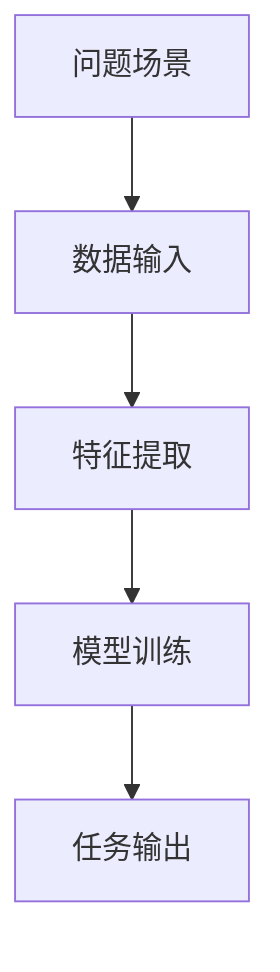
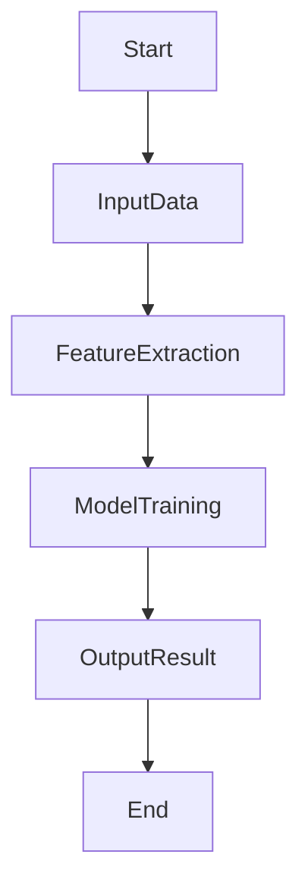
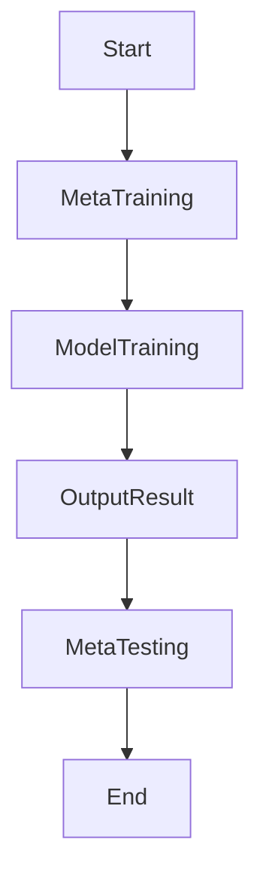
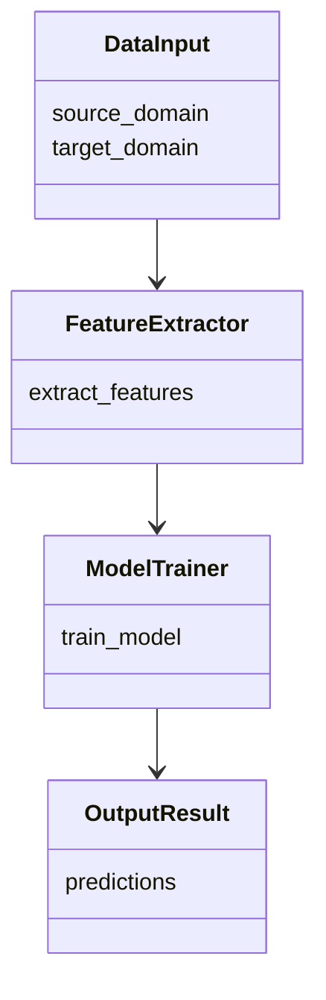
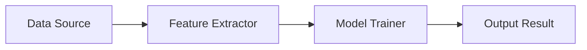
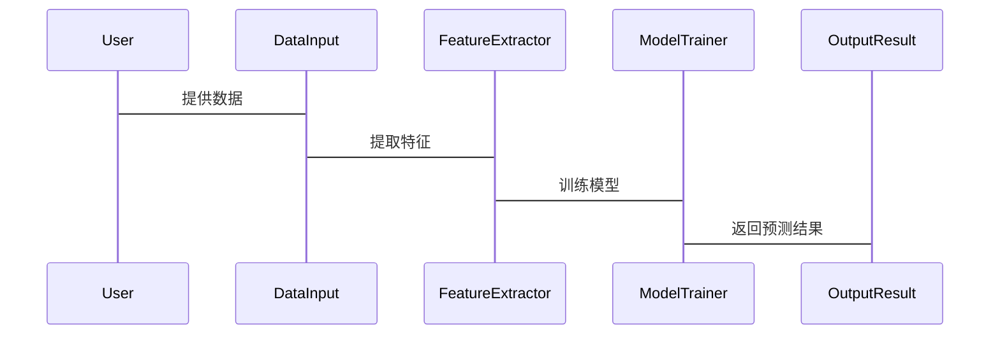

                 


# 企业AI Agent的少样本学习：快速适应新业务场景

**关键词：** 企业AI Agent，少样本学习，快速适应，业务场景，机器学习，AI应用

**摘要：**  
本文深入探讨企业AI Agent在少样本学习中的应用，分析其如何快速适应新业务场景。通过背景介绍、核心概念、算法原理、系统设计、项目实战和总结，详细阐述少样本学习的技术原理和实际应用，帮助读者理解并掌握相关知识。

---

## 第1章 少样本学习的背景与问题

### 1.1 少样本学习的背景
传统机器学习依赖大量数据，但在企业环境中，数据获取成本高且多样化，导致难以快速适应新场景。少样本学习通过少量数据实现高效学习，解决企业AI Agent的适应性问题。

### 1.2 问题背景与描述
企业业务场景多样，数据获取困难，传统方法难以快速适应新任务。少样本学习通过共享特征或任务间关系，快速泛化到新任务，满足企业需求。

### 1.3 问题解决与边界
少样本学习通过迁移学习和元学习，利用少量样本快速适应新任务，适用于企业内部多个相似业务场景。其边界在于任务相关性和数据量的限制。

---

## 第2章 核心概念与联系

### 2.1 少样本学习的原理
少样本学习通过迁移学习和元学习，共享特征或任务信息，实现小样本下的高效学习。关键在于特征提取和模型泛化能力。

### 2.2 概念属性对比表
| 概念 | 属性 |
|------|------|
| 迁移学习 | 数据共享、任务相关性 |
| 元学习 | 任务多样性、快速适应 |

### 2.3 实体关系图


---

## 第3章 算法原理与实现

### 3.1 迁移学习算法
迁移学习通过共享特征，将源领域知识迁移到目标领域，减少目标领域的训练数据需求。

#### 迁移学习流程图


#### Python实现示例
```python
def transfer_learning(X, y, source_domain, target_domain):
    features = extract_features(X, source_domain)
    model = train_model(features, y)
    target_features = extract_features(target_domain, target_domain)
    predictions = model.predict(target_features)
    return predictions
```

### 3.2 元学习算法
元学习通过学习如何学习，快速适应新任务，适用于任务多样性高的场景。

#### 元学习流程图


#### Python实现示例
```python
def meta_learning(tasks):
    meta_model = train_meta_model(tasks)
    for task in new_tasks:
        model = instantiate_model(task)
        meta_model.update(model)
        model.train(task.data, meta_model)
```

### 3.3 数学模型与公式
少样本学习的关键在于优化损失函数，同时保持模型泛化能力。损失函数通常包括数据损失和正则化项：
$$ L = \mathbb{E}_{(x,y)}[\mathcal{L}(f(x), y)] + \lambda \Omega(f) $$

---

## 第4章 系统分析与架构设计

### 4.1 系统功能设计
系统功能包括数据输入、特征提取、模型训练和任务输出。通过领域模型图展示系统组成部分和交互关系。

#### 领域模型图


### 4.2 系统架构设计
系统架构采用模块化设计，包括数据源、特征提取模块、模型训练模块和任务输出模块。通过架构图展示整体结构。

#### 系统架构图


### 4.3 接口设计与交互流程
系统接口设计包括数据输入接口和模型训练接口。交互流程通过序列图展示用户与系统之间的交互步骤。

#### 交互流程图


---

## 第5章 项目实战

### 5.1 环境安装
需要安装Python和相关库（如TensorFlow、Keras）。代码示例展示如何安装依赖。

### 5.2 核心实现
通过Python代码实现迁移学习和元学习，展示特征提取、模型训练和预测过程。

#### 代码示例
```python
def main():
    X, y = load_data()
    source_domain = 'source'
    target_domain = 'target'
    model = train_model(extract_features(X, source_domain), y)
    target_features = extract_features(target_domain, target_domain)
    predictions = model.predict(target_features)
    print(predictions)
```

### 5.3 案例分析
以电商客服系统为例，展示如何通过少样本学习快速适应新业务场景，分析其效果和优势。

---

## 第6章 最佳实践与总结

### 6.1 小结
少样本学习通过迁移学习和元学习，有效解决企业AI Agent快速适应新业务场景的问题。

### 6.2 注意事项
- 数据质量影响模型性能
- 选择合适的学习策略
- 定期更新模型以适应变化

### 6.3 拓展阅读
建议阅读迁移学习和元学习的经典论文，深入理解其原理和应用。

---

**作者：AI天才研究院/AI Genius Institute & 禅与计算机程序设计艺术 /Zen And The Art of Computer Programming**

