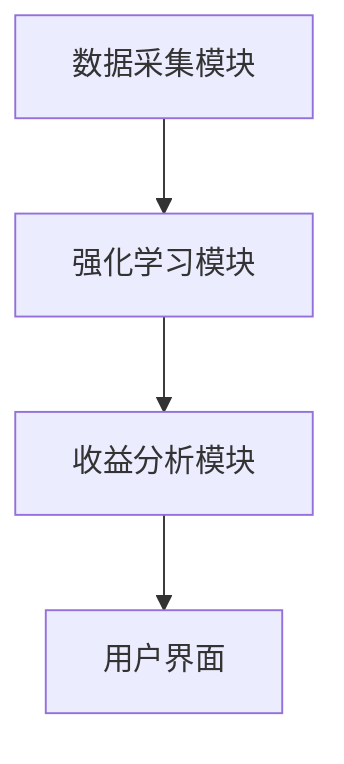
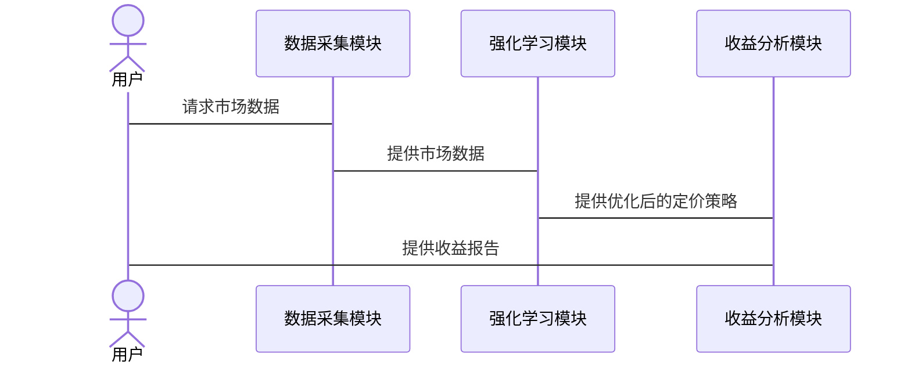

                 

# 企业AI Agent的强化学习在定价策略中的应用

> 关键词：企业AI Agent，强化学习，定价策略，动态定价，收益管理

> 摘要：本文深入探讨了企业AI Agent在定价策略中的应用，结合强化学习的原理和算法，详细分析了如何通过强化学习优化定价策略。文章从强化学习的基本概念出发，逐步深入，结合实际案例，展示了强化学习在定价策略中的优势和应用价值。

---

## 第一部分: 企业AI Agent的强化学习基础

### 第1章: 强化学习与AI Agent概述

#### 1.1 强化学习的基本概念

##### 1.1.1 强化学习的定义与特点
强化学习是一种机器学习范式，通过智能体与环境的交互，学习如何采取一系列行动以最大化累积奖励。其特点是：
- **延迟奖励**：奖励可能在多个动作后才获得。
- **探索与利用**：在未知环境中需要平衡探索新策略和利用已知好策略。
- **策略优化**：通过优化策略函数来最大化期望奖励。

##### 1.1.2 AI Agent的定义与分类
AI Agent是能够感知环境并采取行动以实现目标的智能体。分类包括：
- **反应式Agent**：基于当前感知做出反应。
- **认知式Agent**：具备推理、规划等高级认知能力。
- **强化学习Agent**：通过与环境交互学习最优策略。

##### 1.1.3 强化学习在AI Agent中的应用
强化学习广泛应用于游戏AI、机器人控制、资源分配等领域。在定价策略中，AI Agent通过与市场环境交互，学习最优定价策略。

#### 1.2 强化学习的核心原理

##### 1.2.1 状态、动作与奖励的定义
- **状态（State）**：环境中的当前情况，如商品价格、市场需求。
- **动作（Action）**：智能体采取的行动，如调整价格。
- **奖励（Reward）**：智能体采取动作后获得的反馈，如利润增加。

##### 1.2.2 马尔可夫决策过程（MDP）模型
MDP模型描述强化学习环境，包括状态、动作、转移概率和奖励函数。公式表示为：
$$ P(s'|s, a) $$
其中，$s'$是下一个状态，$s$是当前状态，$a$是动作。

##### 1.2.3 价值函数与策略函数
- **价值函数（Value Function）**：状态s或策略π下的期望累积奖励。
- **策略函数（Policy Function）**：描述智能体在状态s下选择动作a的概率。

#### 1.3 强化学习的算法框架

##### 1.3.1 Q-learning算法
Q-learning通过更新Q值函数学习最优策略：
$$ Q(s, a) = Q(s, a) + \alpha [r + \gamma \max Q(s', a') - Q(s, a)] $$
其中，$\alpha$是学习率，$\gamma$是折扣因子。

##### 1.3.2 深度强化学习（DRL）简介
DRL将神经网络作为函数逼近器，用于近似Q值或策略。DQN算法结合了经验回放和目标网络。

##### 1.3.3 策略梯度方法（PG）概述
策略梯度法通过优化策略的梯度来更新参数。公式为：
$$ \theta = \theta + \alpha \nabla_\theta J(\theta) $$
其中，$J(\theta)$是目标函数，$\nabla_\theta$是梯度。

---

### 第2章: 强化学习在定价策略中的应用背景

#### 2.1 定价策略的基本概念

##### 2.1.1 定价策略的定义与分类
定价策略是企业制定价格的规则，包括成本加成定价、价值定价、竞争定价等。

##### 2.1.2 动态定价与收益管理
动态定价根据市场变化实时调整价格，收益管理通过优化价格和库存提高收益。

##### 2.1.3 传统定价方法的局限性
传统定价方法依赖人工经验，难以应对复杂多变的市场环境，可能错失最佳定价机会。

#### 2.2 企业AI Agent的强化学习需求

##### 2.2.1 企业定价策略的复杂性
市场波动、竞争对手行为、消费者需求多样化等因素增加了定价策略的复杂性。

##### 2.2.2 强化学习在定价优化中的优势
强化学习能够实时适应市场变化，通过不断试错找到最优定价策略。

##### 2.2.3 AI Agent在定价决策中的角色
AI Agent作为决策者，通过强化学习算法优化定价策略，提高企业收益。

---

### 第3章: 强化学习算法在定价策略中的应用

#### 3.1 基于Q-learning的定价优化

##### 3.1.1 Q-learning算法在定价中的应用
将价格调整视为动作，市场需求变化视为状态，利润作为奖励。通过Q-learning算法更新Q值函数，找到最优定价策略。

##### 3.1.2 状态空间与动作空间的定义
- **状态空间**：市场环境，如需求、成本。
- **动作空间**：价格调整幅度，如+1%、-1%。

##### 3.1.3 奖励函数的设计与实现
$$ r = \text{利润增加量} $$
当利润增加时，奖励为正；否则为负。

#### 3.2 基于深度强化学习的定价优化

##### 3.2.1 DQN算法在定价中的应用
DQN通过神经网络近似Q值函数，实现复杂环境下的定价优化。

##### 3.2.2 神经网络在状态表示中的应用
使用卷积神经网络（CNN）或长短期记忆网络（LSTM）处理市场数据，提取特征。

##### 3.2.3 经验回放机制的实现
通过经验回放减少样本偏差，加速收敛，提高学习效率。

#### 3.3 基于策略梯度的定价优化

##### 3.3.1 策略梯度方法的基本原理
通过优化策略函数，直接调整动作的概率分布，找到最优策略。

##### 3.3.2 策略网络的构建与训练
使用神经网络作为策略函数，通过梯度下降优化参数。

##### 3.3.3 奖励函数的梯度计算与优化
计算策略梯度，更新参数：
$$ \nabla_\theta J(\theta) = \mathbb{E}_{s,a} [ \nabla_\theta \log \pi_\theta(a|s) \cdot Q(s,a) ] $$

#### 3.4 本章小结

---

### 第4章: 企业AI Agent的强化学习系统设计

#### 4.1 系统需求分析

##### 4.1.1 问题场景描述
企业需要在动态市场环境中优化定价策略，实时调整价格以最大化收益。

##### 4.1.2 系统目标与功能需求
- **目标**：实现基于强化学习的定价优化。
- **功能需求**：实时数据采集、策略优化、收益分析。

##### 4.1.3 系统边界与接口设计
系统与市场环境、数据源、用户交互等模块接口。

#### 4.2 系统架构设计

##### 4.2.1 系统模块划分
- **数据采集模块**：收集市场数据。
- **强化学习模块**：执行定价策略优化。
- **收益分析模块**：评估定价效果。

##### 4.2.2 系统组件的交互关系
数据采集模块提供市场数据，强化学习模块进行策略优化，收益分析模块评估结果。

##### 4.2.3 系统架构的Mermaid图

#### 4.3 系统实现方案

##### 4.3.1 环境配置与安装
安装Python、TensorFlow、Keras等依赖库，配置开发环境。

##### 4.3.2 系统核心代码实现
实现强化学习算法，如DQN或PG，训练模型。

##### 4.3.3 系统功能的测试与验证
通过模拟数据测试系统性能，验证定价策略的有效性。

#### 4.4 本章小结

---

### 第5章: 项目实战与案例分析

#### 5.1 项目背景与目标

##### 5.1.1 项目介绍
通过强化学习优化某电商平台的商品定价策略。

##### 5.1.2 项目目标与预期成果
实现动态定价系统，提高收益10%以上。

##### 5.1.3 项目实施计划
数据采集、算法实现、系统集成、测试优化。

#### 5.2 系统功能设计

##### 5.2.1 领域模型设计
使用Mermaid图描述系统功能模块。

##### 5.2.2 系统功能模块实现
实现数据采集、强化学习、收益分析等功能。

##### 5.2.3 系统交互流程设计

#### 5.3 系统架构实现

##### 5.3.1 系统架构的Mermaid图

#### 5.4 项目小结

---

### 第6章: 结论与展望

#### 6.1 结论
强化学习在企业AI Agent的定价策略优化中具有显著优势，能够实时适应市场变化，提高收益。

#### 6.2 未来展望
未来可以进一步研究多智能体强化学习，应对多产品、多市场环境下的定价策略优化。

---

### 作者信息

作者：AI天才研究院（AI Genius Institute） & 禅与计算机程序设计艺术（Zen And The Art of Computer Programming）

---

本文通过详细分析强化学习在企业AI Agent定价策略中的应用，展示了如何利用强化学习优化定价策略，为企业创造更大的价值。

